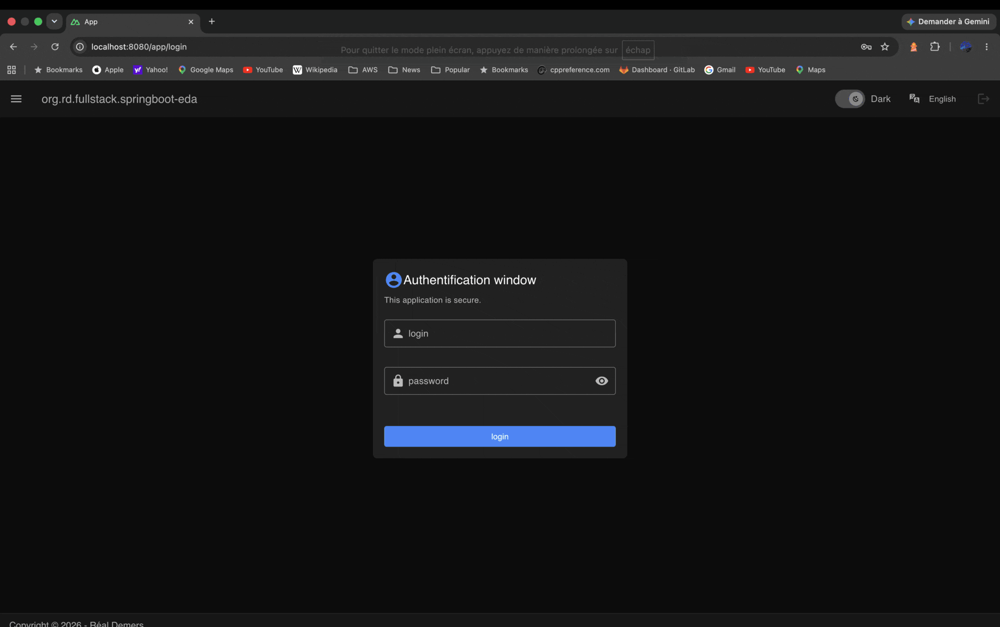

# org-rd-fullstack-springboot-eda

[&#127760; Version française](./doc/fr/LISEZ_MOI.md)

## Fullstack application with a Kafka/Flink/Hazelcast sandbox built on Spring Boot and Nuxt

This project provides a comprehensive sandbox environment for exploring the principles, patterns, and concepts involved in building resilient event-driven software systems. It highlights the full range of constraints, trade-offs, and challenges encountered when designing and implementing Event-Driven Architecture (EDA) components.

The platform leverages Spring Boot, Nuxt, Apache Maven, Kafka, Flink, Hazelcast, and Docker to produce OCI-compliant application containers. It consists of a collection of microservices designed for deployment on AWS/EKS and includes a web application implemented using Static Site Generation (SSG) principles.

**Note:** In this architecture, Spring Boot bundles the backend services and the Nuxt frontend into a single deployable artifact. While exposing backend services, it also serves the frontend's static assets, acting as a lightweight content delivery layer (CDN).



* Sources: [login.png](./doc/asserts/login.png), [welcome.png](./doc/asserts/welcome.png), [persons.png](./doc/asserts/persons.png), [products.png](./doc/asserts/products.png), [inventories.png](./doc/asserts/inventories.png), [report.png](./doc/asserts/report.png), [requests.png](./doc/asserts/requests.png), [jrn-events.png](./doc/asserts/jrn-events.png), [hazelcast_dashboard.png](./doc/asserts/hazelcast_dashboard.png), [kafka_dashboard.png](./doc/asserts/kafka_dashboard.png), [flink_dashboard.png](./doc/asserts/flink_dashboard.png), [operations_dashboard.png](./doc/asserts/operations_dashboard.png), [about.png](./doc/asserts/about.png).

---

## Important

Building a web application that packages multiple SOA services (limited to Backend-for-Frontend services) into a single deployable artifact is neither inherently recommended nor discouraged; the decision depends on your specific architectural requirements and trade-offs. When adopting this approach, SOA services should be strictly confined to Backend-for-Frontend (BFF) responsibilities.

To facilitate easy setup, this project embeds Kafka, Flink, Hazelcast, and an HSQLDB database directly into the application environment for demonstration purposes. In production-grade architectures, these components should typically be deployed and managed as independent external services.

This project is intended exclusively for educational, experimentation, and demonstration purposes.

---

## Prerequisites

The following software must be installed on your workstation to build and run this project:

* [Node.js](https://nodejs.org/en)
* [Java SDK](https://www.oracle.com/java/technologies/downloads/)
* [Apache Maven](https://maven.apache.org/download.cgi)
* [Optional – Git or ZIP download](https://git-scm.com/downloads)
* [Optional – IDE (e.g., VS Code)](https://code.visualstudio.com/download)
* [Optional – VS Code Plugin (Volar)](https://marketplace.visualstudio.com/items?itemName=Vue.volar)
* [Optional – Docker (for image build)](https://www.docker.com/products/docker-desktop/)

---

## Kafka Engineering Guide: Stream Processing and EDA Resilience

This guide compiles best practices for designing, developing, and operating robust Kafka consumers, particularly in containerized environments (EKS).


**Note:** The sharks are named Bronze, Silver, and Gold — The Medallion Architecture implementation team. 😄

### Thematic Index

* [Architecture & Topic Design](./doc/architecture_and_topic_design.md)
* [Lifecycle & Operations](./doc/lifecycle_and_operations.md)
* [Reliability & Delivery Semantics](./doc/reliability_and_delivery_semantics.md)
* [Consumer Acknowledgement & Idempotency](./doc/consumer_acknowledgement_and_idempotency.md)
* [Persistence & Transaction Patterns](./doc/persistence_and_transaction_patterns.md)
* [Governance & Observability](./doc/governance_and_observability.md)
* [Scale and shutdown in distributed environments](./doc/dist_scale_and_shutdown.md)
* [Horizontal elasticity on EKS (KEDA + Karpenter)](./doc/horizontal_elasticity_keda_karpenter.md)
* [Data Corroboration](./doc/data_corroboration.md)
* [Conclusion — Integration complexity: ETL, SOA & EDA (TCO vs ROI)](./doc/conclusion_etl_soa_eda_tco_roi.md)

Supporting references:

* [Inbox and Outbox Design Patterns](./doc/inbox_outbox_patterns.md)
* [Relational Database Schema](./doc/database.md)
* [Sandbox Guides (Kafka / Flink / Hazelcast)](./doc/sandbox_guides.md)
* [Flink Guide (processing / checkpointing / DLT / pause&resume)](./doc/flink_guides.md)
* [Datamesh/DataFabric](./doc/datamesh_datafabric.md)
* [Example inventory reports](./doc/reports.md)
* [Docker guides](./doc/docker_guides.md)
* [PowerPoint presentation in PDF format](./doc/org-rd-fullstack-springboot-eda-en.pdf)

---

## Spring Boot – Getting Started

```bash
mvn clean                                        # Remove compiled files and artifacts.
mvn test                                         # Compile and run all tests (Java side only).
mvn install -DskipTests                          # Build and package the application (Java and Nuxt).
mvn spring-boot:run                              # Start the Spring Boot application.

mvn wrapper:wrapper                              # Regenerate Maven wrapper files.
mvn dependency:sources                           # Download dependency sources.
mvn dependency:resolve -Dclassifier=javadoc      # Download dependency Javadocs.

mvn spring-boot:build-image                      # Build an OCI image using Paketo Buildpacks.
                                                 # Alternatively, use the Dockerfile for custom builds.
java -jar target/springboot-eda-unspecified.jar  # Run the packaged JAR directly.

java -Djarmode=layertools \
  -jar target/springboot-eda-unspecified.jar list
                                                 # Spring Boot layer tools. List JAR layers.

java -Djarmode=layertools \
  -jar target/springboot-eda-unspecified.jar extract \
  --destination target/tmp
                                                 # Spring Boot layer tools. Extract JAR layers to a directory.
```

---

## Nuxt4 – Getting Started

```bash
cd src/frontend                                  # Navigate to the web application root.

npm install --save-dev typescript vue-tsc        # Typescript check.

npm i -D vuetify vite-plugin-vuetify             # Install Vuetify plugins for Nuxt.
npm i @mdi/font                                  # Install Material Design Icons.

npm cache clean --force                          # Clear the npm cache.
npm install                                      # Install project dependencies.
npm run dev                                      # Start the app with hot reloading.
npm run preview                                  # Preview a production build locally.
npm run build && npm run start                   # Build and start the production version.
npm run generate                                 # Generate the static site.

npx nuxi@latest upgrade                          # Upgrade Nuxt to the latest version.
npx nuxi cleanup                                 # Remove temporary files and directories.
npm outdated                                     # List outdated packages.

npm set registry=https://registry.npmjs.org/     # Set npm registry (useful behind a proxy).
npm config set strict-ssl false --global         # Disable strict SSL checks (not for production).

npm i nuxi                                       # Install the nuxi module (optional).
npx nuxi init frontend                           # Create a new Nuxt app in the "frontend" directory.
```

---

When the application is running, the following endpoints are available:

* [Nuxt4 Web Application](http://localhost:8080/app)
* [Swagger UI (API testing)](http://localhost:8080/swagger-ui)
* [OpenAPI Specification](http://localhost:8080/v3/api-docs)
* [Actuator Endpoints](http://localhost:8081/actuator)
* [Info Probe](http://localhost:8081/actuator/info)
* [Health Probe](http://localhost:8081/actuator/health)
* [Liveness Probe](http://localhost:8081/actuator/health/liveness)
* [Readiness Probe](http://localhost:8081/actuator/health/readiness)
* [Prometheus Metrics](http://localhost:8081/actuator/prometheus)
* [Apache/Flink Overview](http://localhost:{port}/overview)
* [Apache/Flink Jobs Overview](http://localhost:{port}/jobs/overview)
* [Apache/Flink Job Details](http://localhost:{port}/jobs/{jobId})
* [Apache/Flink Job Exceptions](http://localhost:{port}/jobs/{jobId}/exceptions)
* [Apache/Flink Job Checkpoints](http://localhost:{port}/jobs/{jobId}/checkpoints)

---

## Docker – Getting Started

```bash

# Docker project : org-rd-fullstack/springboot-eda 

docker build --no-cache .                        # Build an OCI image from the current directory.
docker build --no-cache \
 -t org-rd-fullstack/springboot-eda:your-tag-name . 
                                                 # Build and tag the Docker image.
docker build --platform linux/arm64 \
 -t org-rd-fullstack/springboot-eda:arm64 .      
                                                 # Build a ARM64 (MacOS) image and tag the Docker image.

docker tag org-rd-fullstack/springboot-eda:arm64 \
 your-username/org-rd-fullstack-springboot-eda:arm64
                                                 # Tag the Docker image for a publication.

docker push your-username/org-rd-fullstack-springboot-eda:arm64   
                                                 # Push the Docker image to the repository.

docker build --platform linux/amd64 \
 -t org-rd-fullstack/springboot-eda:amd64 .
                                                 # Build a AMD64 (Windows) image and tag the Docker image.

docker tag org-rd-fullstack/springboot-eda:amd64 \
 your-username/org-rd-fullstack-springboot-eda:amd64
                                                 # Tag the Docker image for a publication.

docker push username/org-rd-fullstack-springboot-eda:amd64
                                                 # Push the Docker image to the repository.

docker run -it -p8080:8080 -p8081:8081 org-rd-fullstack/springboot-eda:your-tag-name   
                                                 # Run the Docker image with port mappings.

# Docker middleware : org-rd-fullstack/eda-middleware

docker buildx build --platform linux/arm64 \
 -f Dockerfile.eda-middleware -t org-rd-fullstack/eda-middleware:arm64
                                                 # Build a ARM64 (MacOS) image and tag the Docker image.

docker tag org-rd-fullstack/eda-middleware:arm64 \ 
 your-username/org-rd-fullstack-eda-middleware:arm64
                                                 # Tag the Docker image for a publication.

docker push username/org-rd-fullstack-eda-middleware:arm64
                                                 # Push the Docker image to the repository.    

docker buildx build --platform linux/amd64 \
 -f Dockerfile.eda-middleware -t org-rd-fullstack/eda-middleware:amd64

docker tag org-rd-fullstack/eda-middleware:amd64 \
 your-username/org-rd-fullstack-eda-middleware:amd64
                                                 # Tag the Docker image for a publication.

docker push username/org-rd-fullstack-eda-middleware:amd64
                                                 # Push the Docker image to the repository.

docker run -it --rm --name eda-middleware \
 -p 5432:5432 -p 9092:9092 -p 5701:5701 \
 -p 6123:6123 -p 8081:8081 \
 -e POSTGRES_PASSWORD=postgres \
 org-rd-fullstack/eda-middleware:your-tag-name
                                                 # Run the Docker image with port mappings.

docker system prune -a                           # Remove unused Docker data (use with caution).
docker image ls                                  # List local Docker images.
docker rmi -f <imageID>                          # Force remove an image by ID.

dive org-rd-fullstack/springboot-eda:unspecified # Inspect image layers.
                                                 # See: https://github.com/wagoodman/dive.
```

---

## Docker Hub – Getting Started

* [Docker Hub](https://hub.docker.com/repositories/rdemers)
* [More information - Dockerfile](Dockerfile)
* [More information - Dockerfile.eda-middleware](Dockerfile.eda-middleware)

Docker images are available for ARM64(MacOS) and AMD64(Windows). However, if you wish to use this image for development (accessing services such as Kafka, Flink, and Hazelcast), you could also "enable host networking" option, as shown here.


---

## Note

Tests may execute in parallel on certain environments, even if parallel execution is explicitly disabled. To prevent interference between test executions, ensure each unit test uses unique topic names. For this reason, some sections of the current unit tests are disabled by default. See [T8700_PipelineController_UT_Tests](./src/test/java/org/rd/fullstack/springbooteda/T8700_PipelineController_UT_Tests.java) and [T2450_FlinkPipeline_UT_Tests](./src/test/java/org/rd/fullstack/springbooteda/T2450_FlinkPipeline_UT_Tests.java), which may conflict due to sharing parts of the execution context.

## Conclusion

The login window will recognize these users:

```java
@Bean
    UserUtils userUtils() {
        UserUtils userUtils = new UserUtils();
        PasswordEncoder passwordEncoder = passwordEncoder();

        userUtils.add("root", passwordEncoder.encode("root"),
                Arrays.asList(Role.ROLE_SELECT, Role.ROLE_INSERT, Role.ROLE_UPDATE, Role.ROLE_DELETE));

        userUtils.add("support", passwordEncoder.encode("support"),
                Arrays.asList(Role.ROLE_SELECT, Role.ROLE_UPDATE));

        userUtils.add("guest", passwordEncoder.encode("guest"),
                Arrays.asList(Role.ROLE_SELECT));

        return userUtils;
    }
```

Source: [`SecurityConfig`](./src/main/java/org/rd/fullstack/springbooteda/config/SecurityConfig.java)

Enjoy experimenting!
