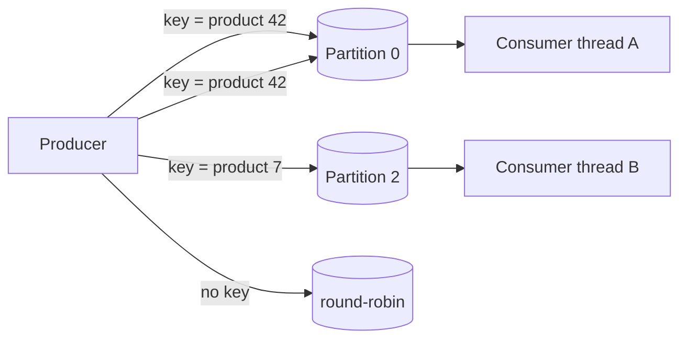
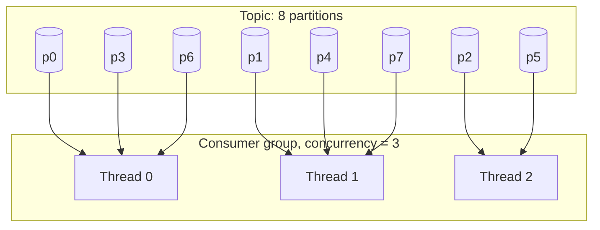
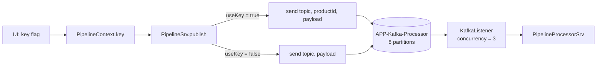

# Architecture & Topic Design

> Part of the **Kafka Engineering Guide** of `org-rd-fullstack-springboot-eda`. See the [project README](../README.md).

**Scope:** how Kafka partitioning, message keying, ordering guarantees and consumer parallelism interact, and how topic typology (thin pipe vs fat pipe) shapes a maintainable event-driven architecture. The guide ties these concepts to the choices made in this sandbox, where the pipeline context `key` flag decides whether records are keyed by product id.

## Table of contents

- [Overview](#overview)
- [Partitions as the unit of parallelism](#partitions-as-the-unit-of-parallelism)
- [Keying and partition assignment](#keying-and-partition-assignment)
- [Ordering guarantees and business semantics](#ordering-guarantees-and-business-semantics)
- [Partition count vs consumer concurrency](#partition-count-vs-consumer-concurrency)
- [Pipe typology: thin pipe vs fat pipe](#pipe-typology-thin-pipe-vs-fat-pipe)
- [Finding the middle ground](#finding-the-middle-ground)
- [How this project applies it](#how-this-project-applies-it)
- [Pitfalls & best practices](#pitfalls--best-practices)
- [Sources & further reading](#sources--further-reading)

## Overview

Kafka is a distributed, scalable, fault-tolerant event streaming platform. Those properties come from one core idea: a topic is divided into **partitions**, and each partition is an ordered, immutable log of records. Partitioning is therefore not an implementation detail tucked behind a producer call — it is an architectural decision that determines how the system scales, how consumers are deployed, and whether business-critical ordering can be upheld.

Two design questions dominate this space:

1. **Within a topic** — how are records distributed across partitions (keyed vs unkeyed), and how does that distribution interact with consumer parallelism and ordering?
2. **Across topics** — should one topic carry many event types (a *fat pipe*) or should each event type get its own topic (*thin pipes*)?

In a containerised deployment such as EKS, where pods are rescheduled, restarted and scaled dynamically, getting these decisions wrong is amplified: increased parallelism can silently break invariants that held on a single instance. This guide works through both questions and shows how this sandbox lets you experiment with them live.

## Partitions as the unit of parallelism

A topic's partitions are the fundamental unit of parallelism and scalability:

- Records are spread across partitions, which can live on different brokers.
- Consumers in the same group divide the partitions among themselves, processing them in parallel.
- Ordering is guaranteed **only within a single partition**, never across partitions.

The partition a record lands in is decided by its **partition key**. Records sharing a key always route to the same partition, which is exactly what preserves per-key ordering. Records with no key are distributed by the producer across the available partitions (round-robin / sticky batching).



## Keying and partition assignment

The producer chooses a partition using this precedence:

| Producer call | Partition selection | Ordering result |
| --- | --- | --- |
| Explicit partition number | That partition, verbatim | Per-partition only |
| Record with a **key** | `hash(key) % partitionCount` | All records for a key stay ordered |
| Record with **no key** | Round-robin / sticky across partitions | No per-entity ordering |

Key-hash partitioning is the standard way to bind an entity's whole event stream to a single partition. The trade-off: the key must distribute evenly. A low-cardinality or skewed key (for example, a constant or a `country` field with one dominant value) concentrates traffic on a few partitions — **hot partitions** — which caps throughput regardless of how many partitions or consumers you provision.

```java
// Keyed publish: hash(key) % partitionCount decides the partition.
ops.send(topic, key, payload);   // same key  -> same partition -> ordered

// Unkeyed publish: producer spreads records across partitions.
ops.send(topic, payload);        // no key     -> round-robin   -> no ordering
```

## Ordering guarantees and business semantics

Ordering is usually a *business* requirement, not merely a technical one. Consider an inventory item whose lifecycle is a sequence of events:

- `ProductCreated`
- `ProductStockIncreased`
- `ProductStockDecreased`
- `ProductDiscontinued`

These must be processed in order **per product**. If `ProductStockDecreased` is applied before `ProductCreated`, or after `ProductDiscontinued`, the materialised state no longer reflects reality. Kafka upholds this *only* when every event for a given product carries the same key (e.g. `product_id`) and therefore lands in the same partition.

When events are spread across partitions — through inconsistent keys or by splitting across topics — ordering is lost, and consumers must compensate with buffering, sequence numbers, or reconciliation logic. That complexity is the price of poor partitioning:

- Records for the same entity may be processed concurrently by different consumer threads or pods.
- Race conditions and state corruption become possible.
- Horizontal scaling becomes risky rather than safe, because more parallelism breaks more invariants.

The rule of thumb: **enforce ordering where it matters (per business entity), and deliberately avoid it where it does not** (unrelated entities need no shared ordering).

## Partition count vs consumer concurrency

Partition count is the ceiling on useful consumer parallelism within a group. Each partition is consumed by at most one consumer in the group at a time, so:

```
effective parallelism = min(partition count, number of consumers/threads in the group)
```

- More consumer threads than partitions → the surplus threads sit **idle**.
- More partitions than consumers → some consumers handle multiple partitions (fine, but each still processes its partitions serially).



Provision partitions for the *peak* parallelism you expect, with headroom: increasing partitions later changes the key→partition mapping (`hash % N`), which reshuffles where existing keys land and can disturb in-flight ordering. Choosing the right count up front is cheaper than repartitioning a live topic.

## Pipe typology: thin pipe vs fat pipe

Beyond a single topic's layout sits the broader question: *should one topic carry more than one event type?* The honest answer is "it depends", and the way to reason about it is to study the two extremes.

### The single topic (fat pipe)

*One topic to rule them all.* Every event, regardless of type or domain, is published to one topic. It looks simple but rarely survives production:

- **Focus.** Each consumer (a service) should do one thing well. A fat pipe forces every service to see every event, tempting scope creep and eroding domain boundaries.
- **Resource waste.** Services wake up for events they discard. Even ignored messages cost network bandwidth, broker I/O and storage throughput.
- **Schema validation.** Many unrelated schemas on one topic weaken its contract and make governance and evolution harder.
- **Understandability.** With everything in one pipe it is hard to see which events exist, who produces them, and who depends on them — decommissioning a producer becomes risky.
- **Partition-key complexity.** This is the strongest argument against fat pipes. With heterogeneous events there is rarely one meaningful key. Teams then pick a generic key (hot partitions), leave it unset (no ordering), or reuse a key valid for only some events (false coupling). Parallelism and ordering both degrade.

### Discrete topics (thin pipes)

*Divide and conquer.* Each event type gets its own topic. Consumers subscribe to exactly what they need — but there are trade-offs too:

- **Ordering across topics.** Ordering holds only within a partition; events split across topics cannot be globally ordered without buffering/correlation/sequence numbers. If a use case needs no cross-event ordering, this is a non-issue.
- **Performance and scale.** Kafka does not cap topic count, but topics, partitions and brokers are linked. Operational guidance is to stay well under roughly **4,000 partitions per broker**; excessive counts inflate metadata overhead, recovery time and operational complexity.

| Dimension | Fat pipe (one topic) | Thin pipes (one topic per event) |
| --- | --- | --- |
| Service focus | Poor — sees everything | Strong — opt-in subscription |
| Resource efficiency | Wasteful broadcast | Targeted delivery |
| Schema/contract clarity | Mixed, weak contract | One schema per topic |
| Partition-key choice | Often unsolvable | Natural per-entity key |
| Per-entity ordering | Hard to isolate | Clean within a topic |
| Topic/partition sprawl | Minimal | Can hit broker limits |

## Finding the middle ground

Most real systems are hybrids. Useful qualities — focus, understandability, testability, maintainability, efficiency — tend to push toward *more than one* topic but *not* one topic per event type. Two characteristics drive the decision more than any other:

- **Ordering.** Group events by **aggregate / business entity** so ordering is enforced where it matters (an order is created before it is cancelled) and avoided where it does not (an order cancellation has no relationship to an email-address change). This is the single most effective topic-grouping heuristic.
- **Data security.** Sensitive or regulated data can warrant isolation. Address it through service and event design — publish only what consumers need (e.g. a payment *state change* rather than full payment details), enforce topic-level ACLs, and resist using topics as broad data-sharing channels.

Treat topics as **intentional contracts**, not just technical pipes, and design them for both current needs and future evolution.

## How this project applies it

This sandbox is built to let you *see* these effects rather than just read about them. The pipeline publishes inventory `Request` records to a single processing topic and consumes them back, with a UI toggle controlling whether records are keyed.

- **Keyed vs unkeyed is a runtime toggle.** [`PipelineContext`](../src/main/java/org/rd/fullstack/springbooteda/dto/PipelineContext.java) carries a `key` boolean flag (default `false`). [`PipelineSrv.publish()`](../src/main/java/org/rd/fullstack/springbooteda/srv/PipelineSrv.java) reads it and chooses the publish path accordingly:

  ```java
  final boolean useKey = Boolean.TRUE.equals(getPipelineContext().getKey());
  // ...
  if (useKey)
      ops.send(KafkaConstants.CST_TOPIC_PROCESSOR, message.getKey(), message.getValue());
  else
      ops.send(KafkaConstants.CST_TOPIC_PROCESSOR, message.getValue());
  ```

  The key is the **product id** (`String.valueOf(request.getProductId())`). With the flag on, all requests for one product hash to the same partition → ordered, key-hash partitioning. With it off, the producer spreads records across partitions (round-robin/sticky) → no per-product ordering. All sends occur in a single Kafka transaction (`executeInTransaction`), and the listener reads `read_committed`.

- **A single, focused processing topic.** The pipeline uses one topic, `APP-Kafka-Processor` (`CST_TOPIC_PROCESSOR` in [`KafkaConstants`](../src/main/java/org/rd/fullstack/springbooteda/util/kafka/KafkaConstants.java)), with a matching `-dlt` dead-letter topic. Separate topics exist for the Flink leg (`APP-Flink-Input`, `APP-Flink-Output`). This is a thin-pipe-leaning layout: each topic has a clear purpose and contract rather than multiplexing unrelated event types.

- **Partition count vs concurrency is explicit and capped.** In [`KafkaConfig`](../src/main/java/org/rd/fullstack/springbooteda/config/KafkaConfig.java) the processor topic is created with **8 partitions**, and the listener factory sets container `concurrency` from the sandbox config:

  ```java
  factory.setConcurrency(kafkaSandbox().getCfg().concurrency());
  ```

  [`KafkaSandbox`](../src/main/java/org/rd/fullstack/springbooteda/util/kafka/KafkaSandbox.java) warns when requested concurrency exceeds the partition count, because the surplus threads would never receive a partition — the `min(partitions, concurrency)` ceiling in action. The default concurrency is 3 (`CST_NBR_CONCURRENCY`), comfortably below the 8 partitions.

- **Consumer-side context shows ordering effects.** [`PipelineSrv.listen(...)`](../src/main/java/org/rd/fullstack/springbooteda/srv/PipelineSrv.java) logs the topic, partition and offset for every record, so you can watch how keyed vs unkeyed publishing changes which partition a given product's records land on, and how that interacts with the configured concurrency. Processing is delegated to [`PipelineProcessorSrv`](../src/main/java/org/rd/fullstack/springbooteda/srv/PipelineProcessorSrv.java) inside its own transaction.



For how partitioning interacts with elastic scaling and pod shutdown on EKS, see the related note [dist_scale_and_shutdown.md](./source/dist_scale_and_shutdown.md).

## Pitfalls & best practices

**Do**

- Key by the **business entity** whose events must stay ordered (here, product id) when ordering matters.
- Size partitions for peak parallelism plus headroom; decide the count before the topic carries production traffic.
- Keep `concurrency <= partitionCount`; heed the sandbox warning when it is exceeded.
- Group events by aggregate / business entity — one topic per closely related event family, not per stray event type.
- Treat each topic as a contract: clear ownership, one schema intent, ACLs for sensitive data.

**Don't**

- Don't assume a key gives you global ordering — it gives ordering only within one partition.
- Don't pick a low-cardinality or skewed key; it creates hot partitions and caps throughput.
- Don't expect more consumer threads than partitions to add throughput — the extras idle.
- Don't increase partition count casually on a live keyed topic; `hash % N` changes and reshuffles key placement, disturbing in-flight ordering.
- Don't build a fat pipe carrying unrelated event types; the partition-key problem becomes unsolvable and consumers fill with discard logic.
- Don't rely on a topic as a broad data-sharing channel for sensitive data; publish only what consumers need.
