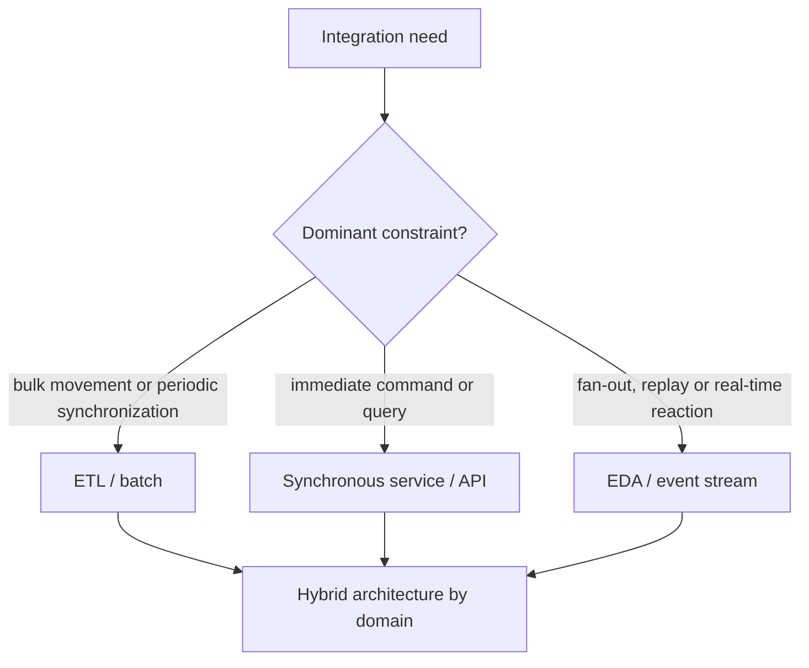
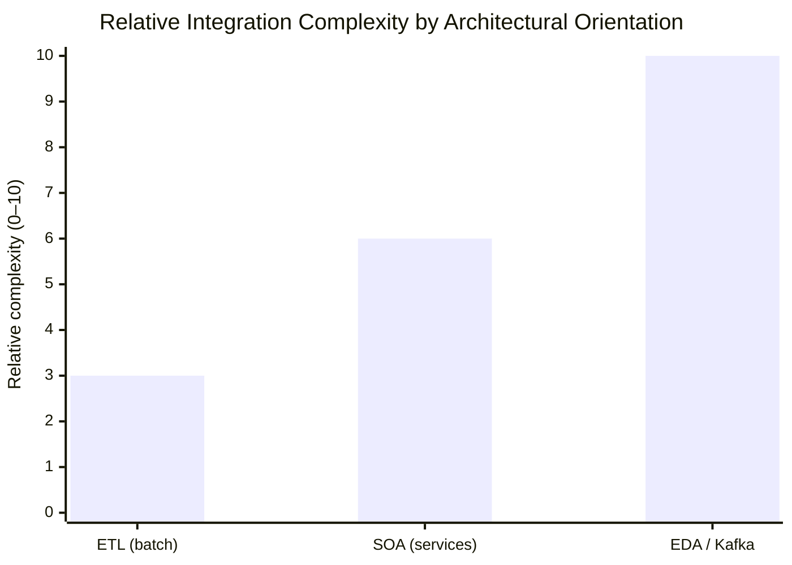

# Conclusion — Choosing Between ETL, SOA and EDA/Kafka (TCO and ROI)

> Part of the **Kafka Engineering Guide** for `org-rd-fullstack-springboot-eda`. See the [project README](../README.md).

**Scope:** conclude this guide with a strategic framework for choosing among batch-oriented ETL, synchronous service integration and event-driven architecture (EDA/Kafka). These styles are neither maturity levels nor mutually exclusive alternatives. Each moves complexity to a different part of the system. The appropriate choice is the one that satisfies the business and operational requirements at an acceptable **Total Cost of Ownership (TCO)** and produces a credible **Return on Investment (ROI)**.

## Table of contents

- [Executive conclusion](#executive-conclusion)
- [Three styles, three complexity profiles](#three-styles-three-complexity-profiles)
- [Complexity moves; it does not disappear](#complexity-moves-it-does-not-disappear)
- [When EDA creates enough value](#when-eda-creates-enough-value)
- [Evaluate TCO and ROI explicitly](#evaluate-tco-and-roi-explicitly)
- [Measure the decision after adoption](#measure-the-decision-after-adoption)
- [This project as a worked example](#this-project-as-a-worked-example)
- [Record the decision](#record-the-decision)
- [Closing thought](#closing-thought)
- [Sources and related reading](#sources-and-related-reading)

## Executive conclusion

The question is not whether EDA is more modern than ETL or SOA. The question is whether asynchronous events solve constraints that materially affect the organization:

- several independent consumers need the same business fact;
- producers and consumers must scale, deploy or fail independently;
- near-real-time reaction, buffering or replay has measurable value;
- workload volume or variability makes direct synchronous coordination fragile;
- the organization can operate asynchronous distributed systems and govern event contracts.

When these conditions are absent, a batch pipeline or synchronous API can provide the required outcome with less operational surface. When only some domains meet them, a hybrid architecture is usually more appropriate than an organization-wide mandate.

## Three styles, three complexity profiles

For this comparison, **ETL** means primarily batch-oriented data integration, and **SOA** means primarily synchronous service/API integration. Both styles can include asynchronous variants; the categories below describe their dominant use in this guide.

| Dimension | **ETL** (batch data integration) | **SOA** (synchronous services) | **EDA / Kafka** (asynchronous events) |
| --- | --- | --- | --- |
| Primary purpose | Move and reshape data between systems or analytical stores | Request a capability and receive an immediate result | Publish business facts for one or more independent consumers |
| Interaction model | Scheduled or triggered jobs | Request/response | Publish/subscribe or event stream |
| Coupling | Data model, schedule and pipeline dependencies | Interface, availability and temporal coupling | Reduced temporal and deployment coupling; semantic, schema and platform coupling remain |
| Typical latency | Minutes to hours, depending on schedule | Request latency, generally milliseconds to seconds | Near-real-time, subject to broker and consumer lag |
| Consistency | A batch-consistent view at a point in time | Often strong within one service call; cross-service consistency still requires coordination | Commonly eventual across consumers; stronger guarantees require explicit design |
| Failure model | Restart or resume a job or partition | Retry, timeout, circuit breaker and compensation | Redelivery, partial failure, poison records, replay and consumer lag |
| Flow visibility | Pipeline and scheduler lineage | Call graph and distributed trace | Event lineage, correlation identifiers, consumer lag and asynchronous traces |
| Operational surface | Orchestrator, workers, storage and data-quality controls | Services, gateways, discovery, resiliency and tracing | Brokers, partitions, schemas, consumers, retries/DLTs, replay and stream state |
| Best fit | Bulk movement, periodic synchronization and analytical preparation | Immediate commands, queries and simple request/response workflows | Fan-out, independent evolution, buffering, replay and real-time reactions |

No column is inherently simple. A large ETL estate can have hundreds of interdependent jobs, and a large SOA environment can become a deeply coupled distributed system. EDA does not eliminate coupling; it changes its form and introduces explicit responsibility for event semantics and asynchronous failure.

## Complexity moves; it does not disappear

Each style places coordination in a different location:

- **ETL** concentrates it in schedules, mappings, lineage and data-quality rules.
- **SOA** concentrates it in service contracts, request paths, availability dependencies and compensating workflows.
- **EDA** distributes it across producers, event contracts, brokers and consumers.

The goal is to place complexity where the organization can manage it and where it produces value. A system can combine the three styles by domain:

Using Kafka for every interaction can be as inappropriate as forcing every workflow through a nightly batch or a synchronous call chain. Architecture quality comes from selecting the smallest sufficient mechanism for each interaction.

## When EDA creates enough value

EDA tends to produce a stronger return when several of the following conditions apply.

| Decision factor | Evidence favouring EDA | Evidence favouring ETL or synchronous services |
| --- | --- | --- |
| Consumer fan-out | Several independently owned consumers need the same event | One known destination or a single requestor |
| Time sensitivity | Business value decreases materially with delay | Minutes or hours are acceptable |
| Workload | High volume, burstiness or the need to absorb backpressure | Low, stable and predictable traffic |
| Replay | Reprocessing history supports recovery, audit or new consumers | Reprocessing has little value or source data can be queried directly |
| Independence | Teams need separate deployment, scaling and availability boundaries | Producer and consumer change together |
| Consistency | Temporary divergence can be tolerated and reconciled | The workflow requires immediate cross-system consistency |
| Failure handling | Redelivery and compensation are acceptable | A simple immediate success/failure response is required |
| Operating maturity | Ownership, observability, schema governance and on-call support exist | The team lacks capacity for asynchronous operations and recovery |

Microsoft's architecture guidance similarly identifies multiple consumers, real-time processing, high volume and independent scalability as good EDA signals, while cautioning against it for simple request/response workflows or strict cross-service consistency requirements.

## Evaluate TCO and ROI explicitly

### TCO categories

TCO includes more than broker or cloud-service charges:

- **Platform:** compute, storage, network transfer, replication, schemas, observability and non-production environments.
- **Engineering:** platform construction, migration, reusable libraries, testing, CI/CD and developer enablement.
- **Operations:** on-call support, upgrades, capacity management, incident response, replay and DLT operations.
- **Correctness:** idempotency, ordering, schema evolution, data reconciliation and failure testing.
- **Governance and security:** ownership, access control, retention, classification, audit and compliance.
- **Opportunity cost:** features delayed while teams build or learn the platform.

A managed service can reduce infrastructure work, but it does not remove application-level correctness, governance, observability or consumption costs.

### ROI categories

EDA can create value through:

- faster reaction to business events;
- reuse of an event by multiple products or domains;
- reduced integration lead time for new consumers;
- independent scaling and deployment;
- buffering that prevents downstream outages from stopping producers;
- replay for recovery, audit, model rebuilding or new use cases;
- replacement of multiple point-to-point integrations with governed event contracts.

These benefits should be tied to measurable outcomes such as revenue protected, processing time reduced, integrations retired, incidents avoided or delivery lead time improved.

### Compare alternatives over the same horizon

For each viable option, estimate costs and benefits over the same period:

`ROI = (measurable benefits − TCO) / TCO`

The formula is simple; the assumptions are not. Record ranges, confidence levels and growth scenarios rather than relying on a single precise forecast. Include the cost of the simpler alternative so that the decision is based on **incremental** value, not only on the attractiveness of EDA in isolation.

> **Decision rule:** choose EDA when its incremental value over the best simpler alternative exceeds its incremental cost and risk by an agreed margin.

## Measure the decision after adoption

An architecture decision is a hypothesis. Validate it with operational and business measures such as:

- cost per million events and cost per active consumer;
- end-to-end event age or processing latency at the required percentile;
- consumer fan-out and reuse of existing event contracts;
- time required to onboard a new producer or consumer;
- replay frequency and the business value recovered by replay;
- DLT volume, duplicate rate and reconciliation effort;
- schema compatibility failures and breaking-change lead time;
- incident frequency, recovery time and on-call effort;
- unused capacity and the cost of non-production environments.

Review the decision when volume, team structure, service capabilities or platform pricing changes. A good decision at one scale can become a poor decision at another.

## This project as a worked example

This repository is a teaching sandbox that intentionally makes the event-driven operational surface visible. A conceptually simple requirement — process inventory requests and update balances — introduces several concerns:

- transactional, idempotent publication and `read_committed` consumption ([reliability and delivery semantics](./reliability_and_delivery_semantics.md));
- manual acknowledgement, at-least-once delivery and idempotent processing ([consumer acknowledgement and idempotency](./consumer_acknowledgement_and_idempotency.md));
- a Hazelcast distributed lock to coordinate per-client balance updates across partitions and pods;
- bounded retries and a dead-letter path ([architecture and topic design](./architecture_and_topic_design.md));
- an optional Flink path that exposes checkpointing, external-side-effect and deployment constraints ([Flink guide](./flink_guides.md));
- partition-aware scaling, graceful shutdown and the limitations of lag-driven autoscaling ([scale and shutdown](./dist_scale_and_shutdown.md), [horizontal elasticity](./horizontal_elasticity_keda_karpenter.md)).

Each mechanism addresses a specific failure mode or quality attribute. Together, they demonstrate why EDA must be evaluated as a complete operating model, not merely as a broker selection. In a production decision, each mechanism should be justified by a requirement and measured against a simpler design.

## Record the decision

Before adopting or expanding EDA, document the following in an architecture decision record (ADR):

1. the business problem and service-level objective;
2. expected volume, velocity, burstiness, latency and consumer fan-out;
3. delivery, ordering, replay, retention and consistency requirements;
4. alternatives considered, including a hybrid design;
5. the expected incremental benefit and TCO over an agreed horizon;
6. ownership of schemas, producers, consumers, DLTs and on-call operations;
7. security, privacy, retention and audit constraints;
8. success metrics, review date and conditions for simplifying or retiring the solution.

This prevents “use Kafka” from becoming the requirement. Kafka is one implementation choice; the requirement must describe the outcome.

## Closing thought

Integration architecture is not a ladder from ETL to SOA to EDA. It is a set of complementary tools. EDA/Kafka is well suited to systems that benefit from fan-out, independent evolution, buffering, replay and near-real-time processing. It is a poor default when a scheduled pipeline or synchronous interaction already meets the need.

Engineering maturity is demonstrated not by selecting the most sophisticated platform, but by matching the mechanism to the problem, making costs visible and revisiting the decision with evidence. **Build the event-driven system when its incremental ROI justifies its incremental TCO; keep the interaction simpler when it does not.**

```mermaid id="67cfmv"
flowchart LR

    subgraph ETL["ETL — batch processing"]
        E1["scheduled jobs"]
        E2["transformations"]
        E3["orchestration (DAGs)"]
    end

    subgraph SOA["SOA — synchronous services"]
        S1["service contracts"]
        S2["ESB / API Gateway"]
        S3["sagas / distributed transactions"]
    end

    subgraph EDA["EDA / Kafka — asynchronous events"]
        D1["delivery semantics + idempotency"]
        D2["partitioning / ordering / rebalancing"]
        D3["Schema Registry + schema evolution"]
        D4["DLQ / retries / replay"]
        D5["stateful processing (Flink) + checkpoints"]
        D6["distributed tracing of asynchronous flows"]
        D7["autoscaling (KEDA / Karpenter) + graceful shutdown"]
    end

    ETL --> SOA --> EDA

    EDA --> GATE{"TCO vs ROI:<br/>do decoupling / scalability / real-time processing<br/>justify the operational cost?"}

    GATE -->|"yes — high volume and velocity, high variability, real-time"| ADOPT["Adopt EDA"]

    GATE -->|"no — modest or stable needs"| SIMPLER["Prefer ETL / SOA<br/>(avoid over-engineering)"]
```

### Complexity Keeps Growing — and EDA Grows Faster

Moving from ETL to SOA and then to EDA does not mean that the concerns associated with the previous models disappear. Each orientation **adds new dimensions of complexity** on top of those that already exist.

Moreover, **a significant part of this complexity becomes distributed across teams**. Each producer must, among other things, be designed to support idempotent processing, while each consumer must correctly handle replays, event ordering, retries, and poison messages.

This **“correctness tax”** is distributed across teams and recurs throughout the system lifecycle. It represents one of the costs most often **underestimated in the business case** for an EDA.

The same progression can be represented as a **relative-complexity histogram**. The values are provided for illustrative purposes only and **do not constitute a measurement or benchmark**:

### Description

The progression is **super-linear rather than constant**: ETL introduces complexity related to transformation and orchestration; SOA adds, among other concerns, service-contract management and distributed interactions; and EDA adds, **on top of these concerns**, the full set of challenges associated with asynchronous-processing correctness and the operation of a distributed event-driven platform.

**The transition to EDA represents the largest increase in complexity in this illustration.** This is precisely why the **TCO/ROI** question must be addressed **before adoption**: the expected benefits — decoupling, scalability, resilience, real-time processing, and the ability to absorb high variability — must justify this additional complexity and its recurring operational cost.

## Sources and related reading

- [Microsoft Azure Architecture Center — Event-Driven Architecture Style](https://learn.microsoft.com/en-us/azure/architecture/guide/architecture-styles/event-driven)
- [Architecture and Topic Design](./architecture_and_topic_design.md) · [Reliability and Delivery Semantics](./reliability_and_delivery_semantics.md) · [Consumer Acknowledgement and Idempotency](./consumer_acknowledgement_and_idempotency.md)
- [Scale and Shutdown in Distributed Environments](./dist_scale_and_shutdown.md) · [Horizontal Elasticity on EKS](./horizontal_elasticity_keda_karpenter.md)
- [Flink Guide](./flink_guides.md) · [Governance and Observability](./governance_and_observability.md) · [Data Mesh / Data Fabric](./datamesh_datafabric.md)