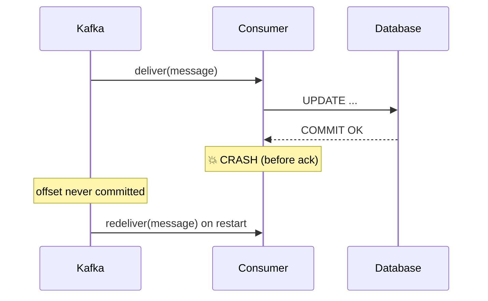
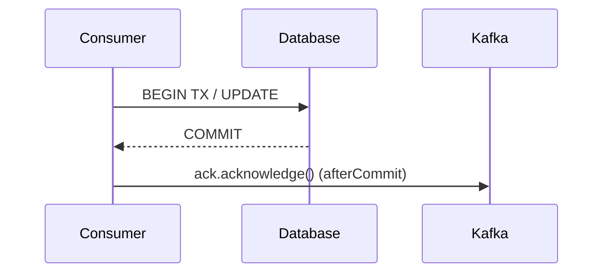
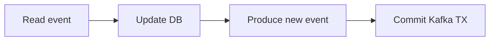
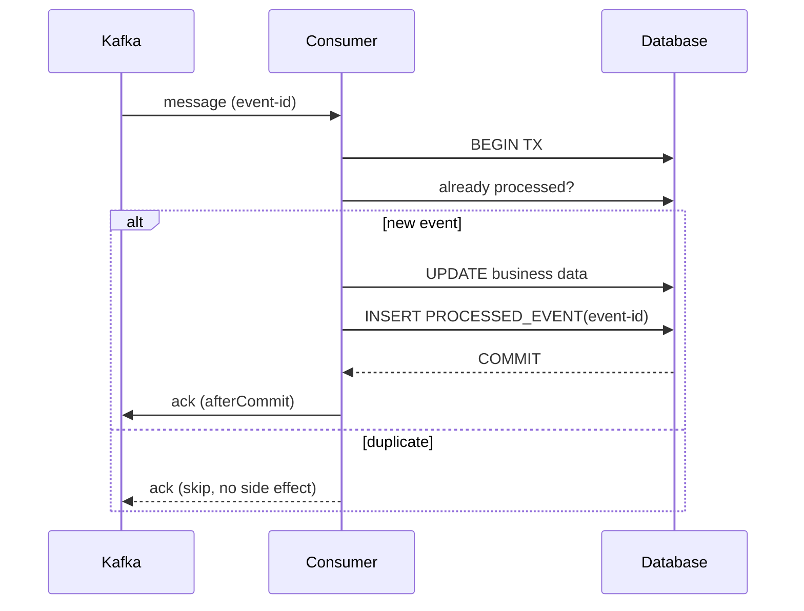

# Consumer acknowledgement and idempotency

> Part of the **Kafka Engineering Guide** of `org-rd-fullstack-springboot-eda`. See the [project README](../README.md).

**Scope:** one of the trickiest aspects of combining Kafka with a relational database — the ordering between the **database commit** and the **Kafka acknowledgement**. This guide walks through the failure window, the available acknowledgement strategies (manual ack, `afterCommit` synchronization, chained transactions, exactly-once), why none of them removes the need for an **idempotent** consumer, and the pragmatic *at-least-once + idempotency* pattern used in high-volume event-driven systems.

## Table of contents

- [Overview](#overview)
- [The core problem: commit vs acknowledge](#the-core-problem-commit-vs-acknowledge)
- [Why a Kafka consumer must be idempotent](#why-a-kafka-consumer-must-be-idempotent)
- [Option 1 — Acknowledge after the JPA commit](#option-1--acknowledge-after-the-jpa-commit)
- [Option 2 — Acknowledge in an afterCommit synchronization](#option-2--acknowledge-in-an-aftercommit-synchronization)
- [Option 3 — Chained Kafka + JDBC transaction (deprecated)](#option-3--chained-kafka--jdbc-transaction-deprecated)
- [Option 4 — Exactly-once semantics (EOS) and its limit](#option-4--exactly-once-semantics-eos-and-its-limit)
- [The pragmatic production pattern: at-least-once + idempotency](#the-pragmatic-production-pattern-at-least-once--idempotency)
- [The processed-event (inbox) table](#the-processed-event-inbox-table)
- [How this project applies it](#how-this-project-applies-it)
- [Pitfalls & best practices](#pitfalls--best-practices)
- [Sources & further reading](#sources--further-reading)

## Overview

A Kafka consumer that also writes to a database performs **two independent commits**: one in the database, one in Kafka (the offset). They cannot be made a single atomic operation without a distributed transaction coordinator — and even then, most real deployments avoid XA. Because the two commits are separate, there is always a window where the process can crash **after** the database commit but **before** the offset is acknowledged. Kafka will then redeliver the message on restart.

The practical conclusion, used across finance, e-commerce and banking systems, is simple:

> Treat Kafka delivery as **at-least-once**, and make the processing **idempotent** so that a redelivered message is a no-op.

This guide complements [Reliability & Delivery Semantics](./reliability_and_delivery_semantics.md) (the delivery guarantees themselves) and [Persistence & Transaction Patterns](./persistence_and_transaction_patterns.md) (idempotency, transactional outbox, locking).

## The core problem: commit vs acknowledge

A naive consumer does three things in order:

1. Receive the message from Kafka.
2. `UPDATE` the database.
3. Acknowledge the offset to Kafka.

What happens if the application crashes **between steps 2 and 3**?



The database change is durable, but the offset was never committed, so Kafka redelivers the same message. **The side effect is applied twice unless the processing is idempotent.** No acknowledgement strategy removes this window entirely — they only make it smaller or move it. This is why idempotency, not clever ack timing, is the real fix.

## Why a Kafka consumer must be idempotent

**Idempotent** means: applying the same message once or many times yields the same final state. Because at-least-once delivery is the realistic guarantee (rebalances, retries, crashes all cause redelivery), idempotency is what turns it into *effectively-once* from the business point of view:

```
at-least-once delivery  +  idempotent processing  ≈  effectively-once
```

The remaining sections show the acknowledgement options, then the idempotency mechanism that makes any of them safe.

## Option 1 — Acknowledge after the JPA commit

Disable auto-commit and acknowledge manually, after the business work:

```java
@KafkaListener(topics = "order-created", containerFactory = "manualAckContainerFactory")
@Transactional
public void consume(OrderCreatedEvent event, Acknowledgment ack) {
    service.updateDatabase(event);   // runs inside the JPA transaction
    ack.acknowledge();               // commit the offset afterwards
}
```

This is the most common shape, but the failure window is still there:

```
COMMIT (DB)
   │
   └── 💥 CRASH ──► ack lost ──► message redelivered
```

So **idempotency remains mandatory**. (Note: when the listener method itself is `@Transactional`, the proxy commits the DB transaction *before* the method returns; calling `ack.acknowledge()` as the last statement therefore acknowledges after the commit.)

## Option 2 — Acknowledge in an afterCommit synchronization

Register the acknowledgement so it runs **only after** the Spring transaction has committed:

```java
@Transactional
@KafkaListener(...)
public void consume(OrderCreatedEvent event, Acknowledgment ack) {
    repository.save(...);

    TransactionSynchronizationManager.registerSynchronization(new TransactionSynchronization() {
        @Override
        public void afterCommit() {
            ack.acknowledge();
        }
    });
}
```



This is cleaner and guarantees the ack is never sent for an *uncommitted* transaction. **But it does not eliminate the failure window**: a crash *after* the commit and *before* `afterCommit` runs still loses the ack and causes redelivery. Idempotency is still required — Option 2 simply makes the ordering explicit and robust.

## Option 3 — Chained Kafka + JDBC transaction (deprecated)

Spring once offered `ChainedKafkaTransactionManager` to chain a `KafkaTransactionManager` and a `JpaTransactionManager`:

```java
@Bean
public ChainedKafkaTransactionManager<?, ?> transactionManager(
        KafkaTransactionManager kafkaTm, JpaTransactionManager jpaTm) {
    return new ChainedKafkaTransactionManager<>(kafkaTm, jpaTm);
}
```

⚠️ **Avoid this in new architectures.** `ChainedKafkaTransactionManager` is **deprecated** (since Spring for Apache Kafka 2.7) and is *not* a true XA / two-phase commit. It only commits the chained managers one after another (best-effort 1PC): if the process fails between the two commits, the resources can still diverge. Prefer container-managed transactions plus idempotency, or the [transactional outbox](./persistence_and_transaction_patterns.md) for genuine atomicity.

## Option 4 — Exactly-once semantics (EOS) and its limit

Kafka supports transactions, enabling a transactional **read-process-write** loop:



EOS is real and powerful — **but only for Kafka-to-Kafka flows.** Kafka's transaction coordinator has no control over your PostgreSQL/MySQL database:

```
Kafka TX  ≠  DB TX
```

So the dual-write problem between Kafka and an external database is **not** solved by EOS alone. To make a Kafka write and a DB write atomic, use the **transactional outbox** pattern (write the event into an outbox table inside the same DB transaction, then relay it to Kafka via a poller or CDC such as Debezium). See [Persistence & Transaction Patterns](./persistence_and_transaction_patterns.md).

## The pragmatic production pattern: at-least-once + idempotency

High-volume systems converge on a deliberately simple model:

| Concern | Choice |
|---|---|
| Delivery guarantee | **at-least-once** (`enable.auto.commit=false`, manual ack) |
| Atomicity of business work | a single **DB transaction** (`@Transactional`) |
| Acknowledgement | after commit (Option 1) or `afterCommit` (Option 2) |
| Duplicate protection | **idempotent processing** (dedup key / processed-event table) |

This is simple, robust and widely deployed. The crash window stops mattering because a redelivered message is recognised and skipped.

## The processed-event (inbox) table

The generic way to make any consumer idempotent is to record processed event ids and check them inside the same transaction:

```sql
CREATE TABLE PROCESSED_EVENT (
    EVENT_ID VARCHAR(128) PRIMARY KEY
);
```

```java
@Transactional
public void consume(Event event) {
    if (processedEventRepository.existsById(event.id())) {
        return;                                   // already handled — skip
    }
    updateBusinessData();
    processedEventRepository.save(new ProcessedEvent(event.id()));
}
```



If the server crashes after the commit but before the ack, Kafka redelivers; the `EVENT_ID` is already present, so the work is skipped cleanly. The `UPDATE` is never applied twice.

## How this project applies it

This sandbox follows exactly the *at-least-once + idempotency* model, with one twist: instead of a dedicated `PROCESSED_EVENT` table, the **business row itself records that it was processed** (its `result` state), which is a valid and lighter form of the same idea.

- **No auto-commit, manual immediate ack** — [`KafkaConfig`](../src/main/java/org/rd/fullstack/springbooteda/config/KafkaConfig.java) sets `ENABLE_AUTO_COMMIT_CONFIG = false` and `AckMode.MANUAL_IMMEDIATE`; mirrored in [`application.yml`](../src/main/resources/application.yml) (`enable-auto-commit: false`, `ack-mode: manual_immediate`).
- **Transactional processing** — [`ProcessorSrv.process(...)`](../src/main/java/org/rd/fullstack/springbooteda/srv/ProcessorSrv.java) is `@Transactional`: the inventory update, the customer balance update and the request status are committed atomically (one DB transaction).
- **Acknowledge after commit (Option 1, done right)** — [`PipelineSrv.listen(...)`](../src/main/java/org/rd/fullstack/springbooteda/srv/PipelineSrv.java) calls `ack.acknowledge()` *after* `processor.process(...)` returns. Because `process(...)` is the proxied transactional method, the DB commit has already happened by the time the offset is acknowledged.
- **Idempotency via the business state** — `ProcessorSrv` skips any request whose `result` is no longer `PENDING`/`BACK_ORDER`: a redelivered message that was already `EXECUTED`/`ERROR` is recognised and ignored. The `Request` row plays the role of the `PROCESSED_EVENT` marker.
- **At-least-once on failure** — when processing throws, the offset is not acknowledged; the record is retried with bounded back-off and finally routed to a Dead Letter Topic by the error handler configured in [`KafkaSandbox`](../src/main/java/org/rd/fullstack/springbooteda/util/kafka/KafkaSandbox.java). On a crash before ack, the message is simply replayed after restart.
- **Correlation for replays** — the optional `replay-id` header (one UUID per publication) added in `PipelineSrv.publish()` is exactly the kind of event id a `PROCESSED_EVENT` table would key on, should you switch to that explicit form.

## Pitfalls & best practices

- ✅ **Always make the consumer idempotent.** No ack strategy removes redelivery; idempotency is the real fix.
- ✅ Disable `enable.auto.commit` and acknowledge **after** the DB commit (Option 1 or, more explicitly, Option 2 `afterCommit`).
- ✅ Keep the business write and the dedup marker in the **same** transaction, so they commit or roll back together.
- ✅ Prefer a **transactional outbox / CDC** when you truly need an atomic "update DB *and* publish to Kafka".
- ⚠️ **Do not** rely on `ChainedKafkaTransactionManager` for atomicity — it is deprecated and not XA.
- ⚠️ Remember EOS covers **Kafka→Kafka** only; it does not make your external DB write part of the Kafka transaction.
- ⚠️ Make the dedup key the **business/event id**, not the Kafka offset (offsets change on re-partitioning and replays).

## Sources & further reading

- Companion guides: [Reliability & Delivery Semantics](./reliability_and_delivery_semantics.md), [Persistence & Transaction Patterns](./persistence_and_transaction_patterns.md).
- Spring for Apache Kafka — *Transactions*, *Container ack modes*, and the deprecation note for `ChainedKafkaTransactionManager`.
- Apache Kafka — *Exactly-Once Semantics* (transactions, `transactional.id`, `read_committed`).
- Pattern references — *Idempotent Consumer*, *Transactional Outbox*, *Inbox / processed-event table* (microservices.io).
