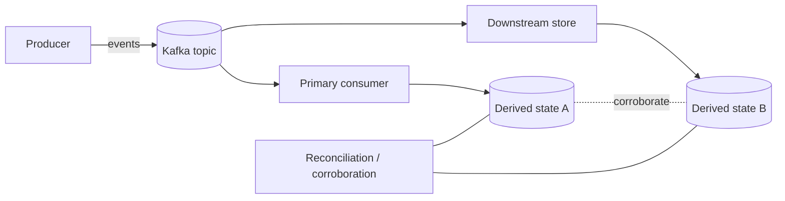
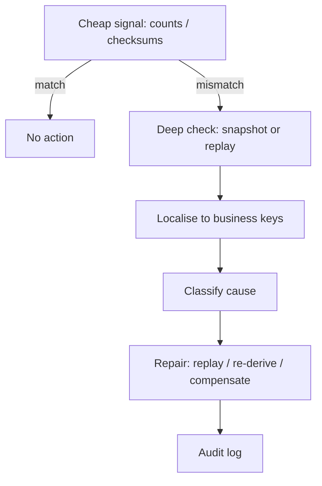

# Data corroboration

> Part of the **Kafka Engineering Guide** of `org-rd-fullstack-springboot-eda`. See the [project README](../README.md).

**Scope:** how to verify data integrity and consistency across an event-driven system — reconciling a source of truth against derived views, cross-checking sources, detecting divergence, and auditing — and how this sandbox applies those ideas to its request/inventory pipeline.

## Table of contents

- [Overview](#overview)
- [Why eventual consistency makes corroboration necessary](#why-eventual-consistency-makes-corroboration-necessary)
- [Reconciliation patterns](#reconciliation-patterns)
  - [Source of truth vs derived views](#source-of-truth-vs-derived-views)
  - [Event replay and reconciliation jobs](#event-replay-and-reconciliation-jobs)
  - [Periodic snapshots](#periodic-snapshots)
  - [Count and checksum corroboration](#count-and-checksum-corroboration)
  - [Control and checkpoint events](#control-and-checkpoint-events)
  - [Shadow consumers](#shadow-consumers)
  - [Business invariants](#business-invariants)
- [Detecting and handling divergence](#detecting-and-handling-divergence)
- [Relationship to idempotency and exactly-once](#relationship-to-idempotency-and-exactly-once)
- [How this project applies it](#how-this-project-applies-it)
- [Pitfalls & best practices](#pitfalls--best-practices)

## Overview

In an event-driven architecture (EDA), no single mechanism guarantees that every consumer and downstream store ends up with the same view of reality. Message delivery semantics, consumer crashes, partition rebalances, and transient network faults can all produce **divergence** between systems that are supposed to agree.


**Data corroboration** is the deliberate practice of confirming that two or more representations of the same facts are consistent: a source of truth and a derived projection, two independent consumers, or a recomputed state and a persisted state. It complements — but does not replace — delivery guarantees and idempotency. Where idempotency prevents a single message from corrupting state, corroboration *detects* when state has drifted anyway and gives you the evidence to repair it.

The key mindset shift is this:

> Event delivery does not guarantee global consistency. Corroboration must be designed, implemented, and operated deliberately.

## Why eventual consistency makes corroboration necessary

Kafka offers **at-least-once** delivery by default: a message is delivered at least once, but under failure conditions (a crash after processing but before the offset commit, a rebalance, a pod eviction in Kubernetes) it can be delivered again. The classic failure windows are:

- The consumer receives a message and crashes before processing it.
- The consumer processes the message and crashes before acknowledging it.
- A pod is evicted or restarted mid-flight.
- Network problems interrupt the commit.

Each of these can leave the system in a state where the events that *were* emitted no longer match the state that *was* persisted — duplicates applied twice, or work re-attempted on partial state. Because consumers update their own stores independently and asynchronously, the system as a whole is only **eventually consistent**. Corroboration is what turns "eventually" from a hope into a verifiable, auditable property.



## Reconciliation patterns

In production-grade EDA, corroboration is rarely a single technique. It is a **layered** set of mechanisms with different cost/latency trade-offs:

| Objective | Technique |
| --- | --- |
| Fast divergence detection | Counts, checksums / hashes |
| Audit & compliance | Event replay and snapshots |
| Operational confidence | Control / checkpoint events |
| Migration & refactoring | Shadow consumers |
| Foundational safety | Idempotency and sequencing |

### Source of truth vs derived views

The first design decision is naming the **source of truth**. In an event-sourced flavour this is the event log itself (Kafka, an event store); everything else — search indexes, read models, aggregate counters — is a **derived view** that can be recomputed from the log. Corroboration then reduces to a single question: *does this derived view still match what the source of truth implies?*

In a more database-centric system (like this sandbox), the relational tables are the authoritative state and the event stream is the *trigger* for mutating them. The corroboration question flips slightly: *does the persisted state match the cumulative effect of the events we processed?*

### Event replay and reconciliation jobs

Reprocess historical events from the source of truth to recompute the expected state, then compare it with the persisted state.

```text
Event Store (Kafka)
        |
Reconciliation consumer (dedicated group, reads from offset 0)
        |
Expected state  <->  Actual state
```

- Use a **dedicated consumer group** so replay does not disturb live offsets.
- Read from the beginning (or a known checkpoint) and rebuild the expected state.
- Diff expected vs actual; report discrepancies.

**Pros:** deterministic, strong auditability. **Cons:** expensive at high volume, not real-time.

### Periodic snapshots

Periodically materialise a snapshot of the business state derived from events and compare it with downstream systems on a schedule (hourly, daily).

```json
{
  "productId": "P123",
  "availableStock": 42,
  "snapshotAt": "2026-10-01T00:00:00Z"
}
```

Implement with a batch or stream job (Spring Batch, Spark, Flink) writing to a dedicated topic such as `inventory-snapshots`, keyed by business key plus a timestamp or version. **Pros:** low operational cost, easy to audit. **Cons:** delayed detection, no real-time guarantee.

### Count and checksum corroboration

The cheapest signals are **aggregate counts** and **checksums**.

- **Counts:** compare the number of processed records, grouped by outcome, against the number of effects they should have produced. A discrepancy in totals is a fast, low-volume tripwire.
- **Checksums:** each consumer computes a hash (e.g. SHA-256) over its derived state — or a critical subset — and publishes it periodically; hashes are compared across systems.

```text
Derived state --> SHA-256 --> state-checksum-topic
```

**Pros:** very fast, tiny data volume, early detection. **Cons:** signals *that* there is divergence, not *where*; checksums require a deterministic state representation (stable ordering, canonical encoding).

### Control and checkpoint events

Emit technical events used purely for validation and monitoring — `InventoryCheckpointReached`, `EndOfDayProcessed`, `SequenceGapDetected`. Consumers acknowledge or react to them, giving operators a heartbeat for end-to-end progress. **Pros:** simple, effective in production monitoring. **Cons:** not exhaustive; complementary rather than standalone.

### Shadow consumers

Run an independent "shadow" consumer that rebuilds state in parallel and continuously compares it with the primary consumer's output. Ideal for **consumer refactoring**, **logic changes**, and **platform migrations**: you gain near real-time validation and high confidence at the cost of extra infrastructure and operational complexity.

### Business invariants

Define invariants that must always hold and validate them automatically:

- Inventory level must never be negative.
- Account balances stay consistent.
- Daily totals reconcile.

Validate via stream processing, periodic batch jobs, or alerting. Invariant violations are often the *first* externally visible symptom of silent divergence.

## Detecting and handling divergence

Detection is necessary but not sufficient — you also need a response playbook:

1. **Detect** with a cheap, frequent signal (counts/checksums) and a periodic deep check (snapshots/replay).
2. **Localise** by drilling from the aggregate signal down to the offending business keys.
3. **Classify** the cause: duplicate application, missed event, out-of-order processing, or a genuine bug.
4. **Repair** by replaying from the source of truth, re-deriving the view, or issuing a compensating event — never by hand-editing derived state without an audit trail.
5. **Record** the discrepancy and the remediation for audit and trend analysis.



## Relationship to idempotency and exactly-once

Idempotency and sequencing are **not** corroboration mechanisms by themselves, but without them every reconciliation strategy is fragile:

- **Idempotency** ensures that reprocessing the same event (during replay, retry, or rebalance) does not double-apply effects. This is what makes safe replay — and therefore replay-based corroboration — possible.
- **Business-level sequencing** (a monotonic sequence number per aggregate) lets you detect duplicates and gaps:

```json
{
  "eventType": "StockDecreased",
  "productId": "P123",
  "sequence": 184
}
```

- **Exactly-once** semantics (Kafka transactions, the transactional outbox) shrink the window in which divergence can occur, but they are bounded by transactional scope. The moment effects cross a boundary the platform cannot enroll in one transaction — for instance, an external store or a separate database — at-least-once reappears and corroboration is again required.

In short: idempotency + sequencing make state *safe to recompute*; corroboration *checks whether you needed to*.

## How this project applies it

This sandbox is database-centric: the relational `Request` and `Inventory` tables are the authoritative state, and Kafka messages trigger their mutation. Two artefacts are central to corroboration here.

**The processor** — [`ProcessorSrv`](../src/main/java/org/rd/fullstack/springbooteda/srv/ProcessorSrv.java) — processes each request in its own JPA transaction and is explicitly **idempotent**: a request whose result is no longer `PENDING`/`BACK_ORDER` has already been handled and is skipped. This is precisely the property that makes the at-least-once redelivery of the Kafka error handler safe, and that would make a replay-based reconciliation job safe to run.

```java
// PipelineProcessorSrv.process(...) — idempotency guard
if ((request.getResult() != Result.PENDING) &&
    (request.getResult() != Result.BACK_ORDER))
    return; // already processed -> skip
```

Each request transitions through the result states **PENDING -> BACK_ORDER / EXECUTED / ERROR**, and every state-changing path also mutates inventory through [`InventoryRepository`](../src/main/java/org/rd/fullstack/springbooteda/dao/InventoryRepository.java) (`creditQTY` / `debitQTY`). That coupling is the natural corroboration target: the number of `EXECUTED` `CREDIT`/`DEBIT` requests should reconcile with the net inventory movement they caused.

**The count aggregation** — [`RequestRepository.countRequest()`](../src/main/java/org/rd/fullstack/springbooteda/dao/RequestRepository.java) — is a ready-made **count corroboration** probe. It returns a `RequestCount` summarising how many requests sit in each result state:

```sql
SELECT new ...RequestCount(
    SUM(CASE WHEN req.result = 10 THEN 1 ELSE 0 END) AS nbrPending,
    SUM(CASE WHEN req.result = 20 THEN 1 ELSE 0 END) AS nbrBackOrder,
    SUM(CASE WHEN req.result = 30 THEN 1 ELSE 0 END) AS nbrExecuted,
    SUM(CASE WHEN req.result = 99 THEN 1 ELSE 0 END) AS nbrError,
    SUM(CASE WHEN req.result NOT IN (10,20,30,99) OR req.result IS NULL
        THEN 1 ELSE 0 END) AS nbrUnknown)
FROM Request req
```

Practical corroboration uses for this aggregate in the sandbox:

- **Pipeline progress / heartbeat:** a stable, non-zero `nbrPending` over time means the pipeline has stalled — a control-event-style signal computed cheaply on demand.
- **Completeness check:** the sum of all buckets must equal the total number of submitted requests. The explicit `nbrUnknown` bucket (anything outside `10/20/30/99` or `NULL`) is a built-in invariant tripwire for corrupt or unexpected state values.
- **Cross-source reconciliation:** the count of `EXECUTED` requests reconciled against inventory movements is the project's concrete "derived view vs source of truth" check.

## Pitfalls & best practices

- **Treat corroboration as a first-class concern**, not a by-product of consumption. If it is not designed in, it will not happen.
- **Layer your checks**: cheap and frequent (counts/checksums) for early warning, expensive and periodic (snapshots/replay) for ground truth.
- **Make state deterministic** before you checksum it — unstable ordering or non-canonical encoding produces false divergence alarms.
- **Never repair derived state by hand** without an audit trail; prefer replay, re-derivation, or compensating events.
- **Guard idempotency and sequencing first** — they are the foundation that makes replay and reconciliation safe.
- **Mind the transaction boundary**: exactly-once shrinks the divergence window but does not remove the need for corroboration across stores it cannot enroll.
- **Alert on the cheap signal, investigate with the deep one** — don't run full replays on every tick.
- **Account for in-flight work**: a transient `nbrPending` is normal; only a *persistently* non-decreasing pending count indicates a stall.
