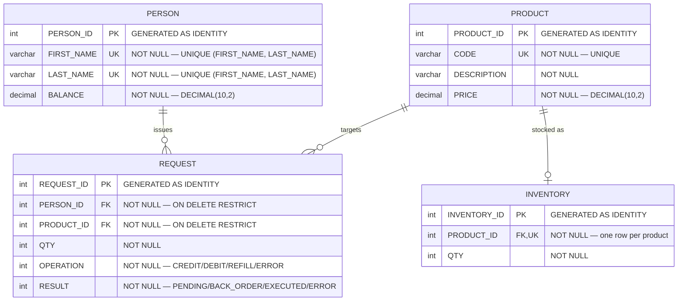

# Relational Database Schema

> Part of the **Kafka Engineering Guide** of `org-rd-fullstack-springboot-eda`. See the [project README](../README.md).

**Scope:** the relational schema that backs the sandbox — its four tables (`PERSON`, `PRODUCT`, `INVENTORY`, `REQUEST`), their columns, keys and relationships shown as an entity-relationship diagram — and how each table is used by the event-driven request/inventory pipeline, including the `OPERATION` and `RESULT` enumerations that drive a request's lifecycle.

## Database Schema

This document describes the relational schema backing the EDA sandbox and explains how
each table is used within the project. The schema is intentionally minimal: it exists to
give the event-driven pipeline (Kafka → Flink/Hazelcast → Spring Boot) a small, realistic
state store to read from and write to, so that resilience patterns — idempotency,
transactions, retries, back-pressure — can be observed end to end.

The Data Definition Language (DDL) lives in [`schema.sql`](../src/main/resources/schema.sql)
(with an identical copy under [`src/test/resources`](../src/test/resources/schema.sql) for
the test profile). The database engine is **HSQLDB**, embedded directly within the
application for demonstration purposes; in a production-grade architecture it would be an
independent, externally managed service. The concurrency model is forced to
`MVLOCKS` on every startup so that concurrent writes against the **same** row collide
deterministically — a behavior the sandbox deliberately exercises.

Each table is mapped to a JPA entity under
[`org.rd.fullstack.springbooteda.dto`](../src/main/java/org/rd/fullstack/springbooteda/dto)
and accessed through a Spring Data repository under
[`org.rd.fullstack.springbooteda.dao`](../src/main/java/org/rd/fullstack/springbooteda/dao).

---

## Entity-Relationship Diagram

> Tip: the diagram renders natively on GitHub and most documentation tooling. To edit it
> interactively, open it in the [Mermaid Live Editor](https://l.mermaid.ai/5xOre0).

**Cardinality notes**

* `PERSON ||--o{ REQUEST` — a request always belongs to exactly one person
  (`PERSON_ID NOT NULL`); a person may have zero, one, or many requests.
* `PRODUCT ||--o{ REQUEST` — likewise on the product side.
* `PRODUCT ||--o| INVENTORY` — a **one-to-one** relationship: `INVENTORY.PRODUCT_ID` is
  both `NOT NULL` and `UNIQUE`, so there is at most one stock row per product.
* The `UNIQUE (FIRST_NAME, LAST_NAME)` on `PERSON` is a **composite** unique key; Mermaid
  has no dedicated notation for that, so both columns are flagged `UK` (read as
  "unique together").

---

## Tables

### `PERSON`

The customer (account holder) that issues requests against the catalog.

| Column       | Type           | Constraints                                   | Description                                            |
|--------------|----------------|-----------------------------------------------|--------------------------------------------------------|
| `PERSON_ID`  | `INTEGER`      | PK, identity                                  | Surrogate primary key.                                 |
| `FIRST_NAME` | `VARCHAR(64)`  | `NOT NULL`, unique with `LAST_NAME`           | Given name.                                            |
| `LAST_NAME`  | `VARCHAR(64)`  | `NOT NULL`, unique with `FIRST_NAME`          | Family name.                                           |
| `BALANCE`    | `DECIMAL(10,2)`| `NOT NULL`                                    | Monetary account balance, debited/credited per request.|

**Usage in the project.** `BALANCE` is the customer's account funds. When a `CREDIT`
(sale) request is processed, the cost (`PRODUCT.PRICE × REQUEST.QTY`) is **subtracted**
from the balance; a `DEBIT` (restock/return) request **adds** it back. A sale that would
overdraw the balance is parked as `BACK_ORDER` rather than executed. The composite
`(FIRST_NAME, LAST_NAME)` unique key prevents duplicate customers. The client row is the
unit of serialization in the pipeline: a Hazelcast per-client lock guarantees that all
requests for the same person are applied atomically, one at a time.

Entity: [`Person.java`](../src/main/java/org/rd/fullstack/springbooteda/dto/Person.java) ·
Repository: [`PersonRepository.java`](../src/main/java/org/rd/fullstack/springbooteda/dao/PersonRepository.java)

---

### `PRODUCT`

The catalog of items that can be requested.

| Column        | Type            | Constraints      | Description                                |
|---------------|-----------------|------------------|--------------------------------------------|
| `PRODUCT_ID`  | `INTEGER`       | PK, identity     | Surrogate primary key.                     |
| `CODE`        | `VARCHAR(64)`   | `NOT NULL`, `UNIQUE` | Business product code (SKU).           |
| `DESCRIPTION` | `VARCHAR(128)`  | `NOT NULL`       | Human-readable label.                      |
| `PRICE`       | `DECIMAL(10,2)` | `NOT NULL`       | Unit price used to compute the request cost.|

**Usage in the project.** `PRICE` drives the monetary cost of a request
(`cost = PRICE × QTY`), which in turn moves the customer's `BALANCE`. `CODE` is the stable
business identifier and is enforced unique. Every product is expected to have a matching
`INVENTORY` row (see below) to be sellable.

Entity: [`Product.java`](../src/main/java/org/rd/fullstack/springbooteda/dto/Product.java) ·
Repository: [`ProductRepository.java`](../src/main/java/org/rd/fullstack/springbooteda/dao/ProductRepository.java)

---

### `INVENTORY`

The on-hand stock level for a product. One-to-one with `PRODUCT`.

| Column         | Type      | Constraints                          | Description                              |
|----------------|-----------|--------------------------------------|------------------------------------------|
| `INVENTORY_ID` | `INTEGER` | PK, identity                         | Surrogate primary key.                   |
| `PRODUCT_ID`   | `INTEGER` | `NOT NULL`, `UNIQUE`, FK → `PRODUCT` | The product this stock row tracks.       |
| `QTY`          | `INTEGER` | `NOT NULL`                           | Quantity currently available.            |

**Usage in the project.** `QTY` is decremented on a `CREDIT` (sale) and incremented on a
`DEBIT` (restock). The `UNIQUE` constraint on `PRODUCT_ID` makes this a strict one-to-one
relationship and lets the processor fetch stock by product. This row is the **hot spot**
the sandbox uses to demonstrate write contention: with no Kafka partition key, several
threads can process the same product concurrently and collide on this row. Under
`MVLOCKS` with a zero lock timeout, the losing transaction fails fast, is retried, and —
if it keeps failing — is routed to the Dead-Letter Topic (DLT). An optional artificial
latency widens this read-then-write critical section so the collision is reproducible.

Entity: [`Inventory.java`](../src/main/java/org/rd/fullstack/springbooteda/dto/Inventory.java) ·
Repository: [`InventoryRepository.java`](../src/main/java/org/rd/fullstack/springbooteda/dao/InventoryRepository.java)

---

### `REQUEST`

The central transactional table — each row is an **event payload**: a single command to
apply against a person's balance and a product's stock.

| Column       | Type      | Constraints                                  | Description                                          |
|--------------|-----------|----------------------------------------------|------------------------------------------------------|
| `REQUEST_ID` | `INTEGER` | PK, identity                                 | Surrogate primary key.                               |
| `PERSON_ID`  | `INTEGER` | `NOT NULL`, FK → `PERSON` (`ON DELETE RESTRICT`)  | Customer issuing the request.                   |
| `PRODUCT_ID` | `INTEGER` | `NOT NULL`, FK → `PRODUCT` (`ON DELETE RESTRICT`) | Target product.                                 |
| `QTY`        | `INTEGER` | `NOT NULL`                                   | Requested quantity.                                  |
| `OPERATION`  | `INTEGER` | `NOT NULL`                                   | The command type (enum, see below).                  |
| `RESULT`     | `INTEGER` | `NOT NULL`                                   | The processing outcome / lifecycle state (enum).     |

**Usage in the project.** A request is produced to Kafka, then consumed and handled by the
processing unit in a dedicated JPA transaction that rolls back on failure. Processing is
**idempotent**: a request whose `RESULT` is no longer `PENDING`/`BACK_ORDER` has already
been handled and is skipped on redelivery — which makes Kafka's at-least-once semantics
safe across retries and rebalances. The `ON DELETE RESTRICT` foreign keys protect
referential integrity by preventing the deletion of a person or product that still has
requests on file.

`OPERATION` is stored as an integer and mapped to the
[`Operation`](../src/main/java/org/rd/fullstack/springbooteda/util/Operation.java) enum
via a JPA converter:

| Value | Name     | Meaning                                                              |
|-------|----------|---------------------------------------------------------------------|
| `10`  | `CREDIT` | Sale — inventory **decreases**, the customer **pays** (balance ↓).  |
| `20`  | `DEBIT`  | Restock/return — inventory **increases**, the customer is credited (balance ↑). |
| `30`  | `REFILL` | Reserved (declared but not yet implemented in the processor).       |
| `99`  | `ERROR`  | Invalid / sentinel value.                                           |

`RESULT` is stored as an integer and mapped to the
[`Result`](../src/main/java/org/rd/fullstack/springbooteda/util/Result.java) enum:

| Value | Name         | Meaning                                                                          |
|-------|--------------|----------------------------------------------------------------------------------|
| `10`  | `PENDING`    | Newly created, not yet processed.                                                |
| `20`  | `BACK_ORDER` | Could not be fulfilled now — insufficient **stock** or insufficient **balance**. |
| `30`  | `EXECUTED`   | Successfully applied to inventory and balance.                                   |
| `99`  | `ERROR`      | Unrecoverable problem (missing inventory/product/person, or unsupported op).     |

Entity: [`Request.java`](../src/main/java/org/rd/fullstack/springbooteda/dto/Request.java) ·
Repository: [`RequestRepository.java`](../src/main/java/org/rd/fullstack/springbooteda/dao/RequestRepository.java) ·
Processor: [`ProcessorSrv.java`](../src/main/java/org/rd/fullstack/springbooteda/srv/ProcessorSrv.java)

---

## How it all fits together

A typical `CREDIT` (sale) flows through the pipeline as follows:

1. A `REQUEST` is created with `RESULT = PENDING` and produced to Kafka.
2. The consumer picks it up; the processor opens a transaction and re-checks the state
   (idempotency guard).
3. The matching `INVENTORY`, `PRODUCT`, and `PERSON` rows are loaded.
4. The cost is computed (`PRICE × QTY`):
   * if stock or balance is insufficient → `RESULT = BACK_ORDER`;
   * otherwise → `INVENTORY.QTY` is debited, `PERSON.BALANCE` is reduced, and
     `RESULT = EXECUTED`.
5. On any unexpected error the transaction rolls back; Kafka redelivers, and a persistently
   failing message ends up on the DLT.

This small four-table model is therefore enough to exercise the full set of EDA concerns
the sandbox is built to demonstrate. For the messaging and stream-processing side, see the
guides linked from the project [`README.md`](../README.md).
