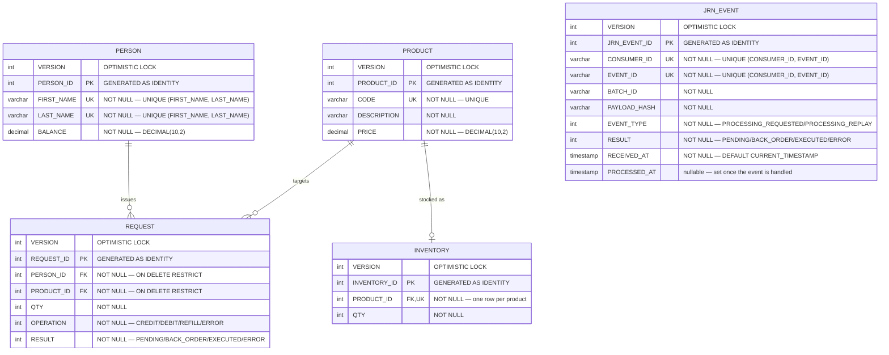
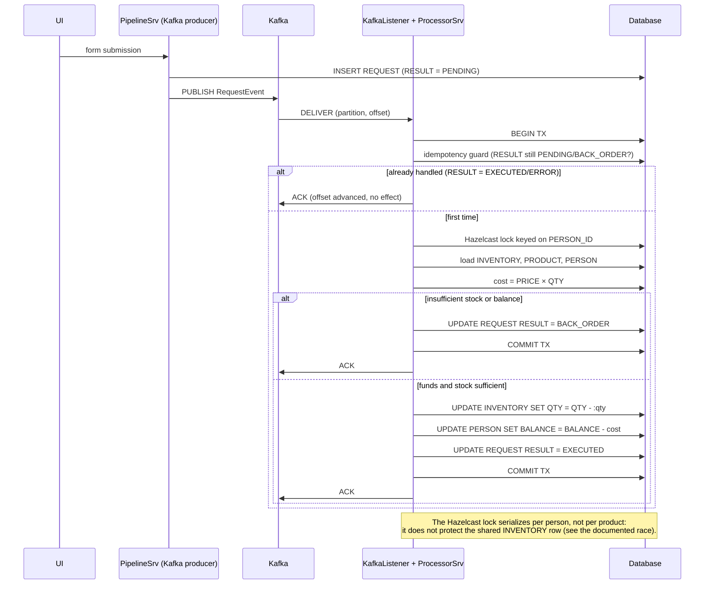

# Relational Database Schema

> Part of the **Kafka Engineering Guide** of `org-rd-fullstack-springboot-eda`. See the [project README](../README.md).

**Scope:** the relational schema that backs the sandbox — its five tables (`PERSON`, `PRODUCT`, `INVENTORY`, `REQUEST`, `JRN_EVENT`), their columns, keys and relationships shown as an entity-relationship diagram — the `OPERATION`, `RESULT` and `EVENT_TYPE` enumerations that drive a request's lifecycle and the Kafka event journal, and how the table set is used by the event-driven request/inventory pipeline.

## Table of Contents

- [Overview](#overview)
- [Entity-Relationship Diagram](#entity-relationship-diagram)
- [Tables](#tables)
- [Enumerations (`OPERATION`, `RESULT`, and `EVENT_TYPE`)](#enumerations-operation-result-and-event_type)
- [Request Lifecycle](#request-lifecycle)
- [Constraints & Key Dependencies](#constraints--key-dependencies)
- [How the Kafka Consumer Modifies It](#how-the-kafka-consumer-modifies-it)
- [Operational Views](#operational-views)
- [See also](#see-also)

## Overview

This document describes the relational schema backing the EDA sandbox and explains how each table is used within the project. The schema is intentionally minimal: it exists to give the event-driven pipeline (Kafka → Flink/Hazelcast → Spring Boot) a small, realistic state store to read from and write to, so that resilience patterns — idempotency, transactions, retries, back-pressure — can be observed end to end.

The Data Definition Language (DDL) lives in [`schema.sql`](../src/main/resources/schema.sql) (with an identical copy under [`src/test/resources`](../src/test/resources/schema.sql) for the test profile). The database engine is **HSQLDB**, embedded directly within the application for demonstration purposes; in a production-grade architecture it would be an independent, externally managed service. The schema itself is standard SQL and would run on PostgreSQL, MySQL, etc.

The concurrency model is forced to `MVLOCKS` on every startup (`SET DATABASE TRANSACTION CONTROL MVLOCKS` in `schema.sql`, mirroring the `hsqldb.tx=mvlocks;hsqldb.lock_timeout=0` URL properties). That setting is HSQLDB-specific. Note, however, that the inventory race the sandbox demonstrates is **not** a write-write lock conflict: the decrement is an atomic relative `UPDATE` that never collides, so it commits silently as a lost update rather than failing under MVLOCKS — see [`INVENTORY`](#inventory) and [Constraints & Key Dependencies](#constraints--key-dependencies) below.

Each table is mapped to a JPA entity under [`org.rd.fullstack.springbooteda.dto`](../src/main/java/org/rd/fullstack/springbooteda/dto) and accessed through a Spring Data repository under [`org.rd.fullstack.springbooteda.dao`](../src/main/java/org/rd/fullstack/springbooteda/dao).

## Entity-Relationship Diagram


```mermaid
erDiagram
    PERSON   ||--o{ REQUEST   : "issues"
    PRODUCT  ||--o{ REQUEST   : "targets"
    PRODUCT  ||--o| INVENTORY : "stocked as"

    PERSON {
        int     VERSION       "OPTIMISTIC LOCK"
        int     PERSON_ID  PK "GENERATED AS IDENTITY"
        varchar FIRST_NAME UK "NOT NULL — UNIQUE (FIRST_NAME, LAST_NAME)"
        varchar LAST_NAME  UK "NOT NULL — UNIQUE (FIRST_NAME, LAST_NAME)"
        decimal BALANCE       "NOT NULL — DECIMAL(10,2)"
    }
    PRODUCT {
        int     VERSION        "OPTIMISTIC LOCK"
        int     PRODUCT_ID  PK "GENERATED AS IDENTITY"
        varchar CODE        UK "NOT NULL — UNIQUE"
        varchar DESCRIPTION    "NOT NULL"
        decimal PRICE          "NOT NULL — DECIMAL(10,2)"
    }
    INVENTORY {
        int VERSION            "OPTIMISTIC LOCK"
        int INVENTORY_ID PK    "GENERATED AS IDENTITY"
        int PRODUCT_ID   FK,UK "NOT NULL — one row per product"
        int QTY                "NOT NULL"
    }
    REQUEST {
        int VERSION       "OPTIMISTIC LOCK"
        int REQUEST_ID PK "GENERATED AS IDENTITY"
        int PERSON_ID  FK "NOT NULL — ON DELETE RESTRICT"
        int PRODUCT_ID FK "NOT NULL — ON DELETE RESTRICT"
        int QTY           "NOT NULL"
        int OPERATION     "NOT NULL — CREDIT/DEBIT/REFILL/ERROR"
        int RESULT        "NOT NULL — PENDING/BACK_ORDER/EXECUTED/ERROR"
    }
    JRN_EVENT {
        int     VERSION         "OPTIMISTIC LOCK"
        int     JRN_EVENT_ID PK "GENERATED AS IDENTITY"
        varchar CONSUMER_ID  UK "NOT NULL — UNIQUE (CONSUMER_ID, EVENT_ID)"
        varchar EVENT_ID     UK "NOT NULL — UNIQUE (CONSUMER_ID, EVENT_ID)"
        varchar BATCH_ID        "NOT NULL"
        varchar PAYLOAD_HASH    "NOT NULL"
        int     EVENT_TYPE      "NOT NULL — PROCESSING_REQUESTED/PROCESSING_REPLAY"
        int     RESULT          "NOT NULL — PENDING/BACK_ORDER/EXECUTED/ERROR"
        timestamp RECEIVED_AT   "NOT NULL — DEFAULT CURRENT_TIMESTAMP"
        timestamp PROCESSED_AT  "nullable — set once the event is handled"
    }
```

### Cardinality notes

* `PERSON ||--o{ REQUEST` — a request always belongs to exactly one person
  (`PERSON_ID NOT NULL`); a person may have zero, one, or many requests.
* `PRODUCT ||--o{ REQUEST` — likewise on the product side.
* `PRODUCT ||--o| INVENTORY` — a **one-to-one** relationship: `INVENTORY.PRODUCT_ID` is
  both `NOT NULL` and `UNIQUE`, so there is at most one stock row per product. There is
  **no** `PERSON_ID` on `INVENTORY`.
* The `UNIQUE (FIRST_NAME, LAST_NAME)` on `PERSON` and the `UNIQUE (CONSUMER_ID, EVENT_ID)` on
  `JRN_EVENT` are **composite** unique keys; Mermaid has no dedicated notation for that, so
  both columns of each pair are flagged `UK` (read as "unique together").
* `JRN_EVENT` has **no** foreign key to `PERSON`, `PRODUCT` or `REQUEST` — it is not part of
  that relational graph. It journals Kafka events at the consumer-group level on its own
  surrogate `JRN_EVENT_ID`, with `(CONSUMER_ID, EVENT_ID)` enforced `UNIQUE` and used for
  lookups; see [`JRN_EVENT`](#jrn_event) below.

## Tables

### `PERSON`

The customer (account holder) that issues requests against the catalog.

| Column       | Type           | Constraints                                   | Description                                            |
|--------------|----------------|-----------------------------------------------|--------------------------------------------------------|
| `PERSON_ID`  | `INTEGER`      | PK, identity                                  | Surrogate primary key.                                 |
| `FIRST_NAME` | `VARCHAR(64)`  | `NOT NULL`, unique with `LAST_NAME`           | Given name.                                            |
| `LAST_NAME`  | `VARCHAR(64)`  | `NOT NULL`, unique with `FIRST_NAME`          | Family name.                                           |
| `BALANCE`    | `DECIMAL(10,2)`| `NOT NULL`                                    | Monetary account balance, debited/credited per request.|

**Usage in the project.** `BALANCE` is the customer's account funds. When a `CREDIT`
(sale) request is processed, the cost (`PRODUCT.PRICE × REQUEST.QTY`) is **subtracted**
from the balance; a `DEBIT` (restock/return) request **adds** it back. A sale that would
overdraw the balance is parked as `BACK_ORDER` rather than executed. The composite
`(FIRST_NAME, LAST_NAME)` unique key prevents duplicate customers. The client row is the
unit of serialization in the pipeline: a Hazelcast per-client lock (keyed on `PERSON_ID`)
guarantees that all requests for the same person are applied atomically, one at a time, so a
client cannot overdraw its balance. Note this lock serializes **per person, not per product**
— it does *not* protect the shared `INVENTORY` row (see [Constraints & Key Dependencies](#constraints--key-dependencies)).

Entity: [`Person.java`](../src/main/java/org/rd/fullstack/springbooteda/dto/Person.java) ·
Repository: [`PersonRepository.java`](../src/main/java/org/rd/fullstack/springbooteda/dao/PersonRepository.java)

### `PRODUCT`

The catalog of items that can be requested.

| Column        | Type            | Constraints      | Description                                |
|---------------|-----------------|------------------|--------------------------------------------|
| `PRODUCT_ID`  | `INTEGER`       | PK, identity     | Surrogate primary key.                     |
| `CODE`        | `VARCHAR(64)`   | `NOT NULL`, `UNIQUE` | Business product code (SKU).           |
| `DESCRIPTION` | `VARCHAR(128)`  | `NOT NULL`       | Human-readable label.                      |
| `PRICE`       | `DECIMAL(10,2)` | `NOT NULL`       | Unit price used to compute the request cost.|

**Usage in the project.** `PRICE` drives the monetary cost of a request
(`cost = PRICE × QTY`), which in turn moves the customer's `BALANCE`. `CODE` is the stable
business identifier and is enforced unique. Every product is expected to have a matching
`INVENTORY` row (see below) to be sellable.

Entity: [`Product.java`](../src/main/java/org/rd/fullstack/springbooteda/dto/Product.java) ·
Repository: [`ProductRepository.java`](../src/main/java/org/rd/fullstack/springbooteda/dao/ProductRepository.java)

### `INVENTORY`

The on-hand stock level for a product. One-to-one with `PRODUCT`.

| Column         | Type      | Constraints                          | Description                              |
|----------------|-----------|--------------------------------------|------------------------------------------|
| `INVENTORY_ID` | `INTEGER` | PK, identity                         | Surrogate primary key.                   |
| `PRODUCT_ID`   | `INTEGER` | `NOT NULL`, `UNIQUE`, FK → `PRODUCT` | The product this stock row tracks.       |
| `QTY`          | `INTEGER` | `NOT NULL`                           | Quantity currently available.            |

**Usage in the project.** `QTY` is decremented on a `CREDIT` (sale) and incremented on a
`DEBIT` (restock). The `UNIQUE` constraint on `PRODUCT_ID` makes this a strict one-to-one
relationship and lets the processor fetch stock by product. There are **no**
`STOCK_AVAILABLE`/`STOCK_RESERVED` columns — the stock is a single integer `QTY`. This row
is the **hot spot** the sandbox uses to demonstrate a silent check-then-act race (lost
update); the mechanism is described in full under
[Constraints & Key Dependencies](#constraints--key-dependencies).

Entity: [`Inventory.java`](../src/main/java/org/rd/fullstack/springbooteda/dto/Inventory.java) ·
Repository: [`InventoryRepository.java`](../src/main/java/org/rd/fullstack/springbooteda/dao/InventoryRepository.java)

### `REQUEST`

The central transactional table — each row is an **event payload**: a single command to
apply against a person's balance and a product's stock.

| Column       | Type      | Constraints                                  | Description                                          |
|--------------|-----------|----------------------------------------------|------------------------------------------------------|
| `REQUEST_ID` | `INTEGER` | PK, identity                                 | Surrogate primary key.                               |
| `PERSON_ID`  | `INTEGER` | `NOT NULL`, FK → `PERSON` (`ON DELETE RESTRICT`)  | Customer issuing the request.                   |
| `PRODUCT_ID` | `INTEGER` | `NOT NULL`, FK → `PRODUCT` (`ON DELETE RESTRICT`) | Target product.                                 |
| `QTY`        | `INTEGER` | `NOT NULL`                                   | Requested quantity.                                  |
| `OPERATION`  | `INTEGER` | `NOT NULL`                                   | The command type (enum, see below).                  |
| `RESULT`     | `INTEGER` | `NOT NULL`                                   | The processing outcome / lifecycle state (enum).     |

**Usage in the project.** A request is produced to Kafka, then consumed and handled by the
processing unit in a dedicated JPA transaction that rolls back on failure. Processing is
**idempotent**: a request whose `RESULT` is no longer `PENDING`/`BACK_ORDER` has already
been handled and is skipped on redelivery — which makes Kafka's at-least-once semantics
safe across retries and rebalances. The `ON DELETE RESTRICT` foreign keys protect
referential integrity by preventing the deletion of a person or product that still has
requests on file. There are **no** `REASON` or `KAFKA_*` columns: the outcome is carried
entirely by `RESULT` (including its `ERROR` value), and a persistently failing message is
correlated through the Dead-Letter Topic rather than through columns on the table.

Entity: [`Request.java`](../src/main/java/org/rd/fullstack/springbooteda/dto/Request.java) ·
Repository: [`RequestRepository.java`](../src/main/java/org/rd/fullstack/springbooteda/dao/RequestRepository.java) ·
Processor: [`ProcessorSrv.java`](../src/main/java/org/rd/fullstack/springbooteda/srv/ProcessorSrv.java)

### `JRN_EVENT`

A consumer-side event journal, independent of the `PERSON`/`PRODUCT`/`REQUEST` graph above.

| Column         | Type          | Constraints                                   | Description                                                     |
|----------------|---------------|------------------------------------------------|-------------------------------------------------------------------|
| `JRN_EVENT_ID` | `INTEGER`     | PK, identity                                   | Surrogate primary key.                                            |
| `CONSUMER_ID`  | `VARCHAR(64)` | `NOT NULL`, unique with `EVENT_ID`            | Name of the consumer group that received the event.               |
| `EVENT_ID`     | `VARCHAR(64)` | `NOT NULL`, unique with `CONSUMER_ID`         | Identifies the event; unique per `CONSUMER_ID`.                   |
| `BATCH_ID`     | `VARCHAR(64)` | `NOT NULL`                                    | Correlates events produced together in the same publication run. |
| `PAYLOAD_HASH` | `VARCHAR(64)` | `NOT NULL`                                    | Hash of the event payload, to detect a changed payload on replay.|
| `EVENT_TYPE`   | `INTEGER`     | `NOT NULL`                                    | First delivery vs. replay (enum, see below).                      |
| `RESULT`       | `INTEGER`     | `NOT NULL`                                    | This event's own processing outcome (enum, shared with `REQUEST.RESULT`). |
| `RECEIVED_AT`  | `TIMESTAMP`   | `NOT NULL`, `DEFAULT CURRENT_TIMESTAMP`       | When the event was received by the consumer.                      |
| `PROCESSED_AT` | `TIMESTAMP`   | nullable                                      | When the event finished processing; `NULL` while still pending.   |

**Usage in the project.** `JRN_EVENT` is a finer-grained, message-level idempotency journal
that sits alongside — not instead of — the business-level idempotency `REQUEST.RESULT`
already provides (see [Constraints & Key Dependencies](#constraints--key-dependencies)). The
table carries its own surrogate `JRN_EVENT_ID` primary key, but lookups go through
`(CONSUMER_ID, EVENT_ID)` rather than through `JRN_EVENT_ID` or `REQUEST_ID`:
[`JrnEventRepository.findByConsumerIdAndEventId(...)`](../src/main/java/org/rd/fullstack/springbooteda/dao/JrnEventRepository.java)
is what `ProcessorSrv` actually calls, backed by the `UNIQUE (CONSUMER_ID, EVENT_ID)`
constraint. `CONSUMER_ID` is the name of the consumer group that saw the record (today the
single
[`CST_LISTENER_PROCESSOR`](../src/main/java/org/rd/fullstack/springbooteda/util/kafka/KafkaConstants.java)
group; layered `bronze`/`silver`/`gold` consumer groups are reserved for a future
medallion-style pipeline — see the commented-out constants in the same file). `EVENT_ID` and
`BATCH_ID` correspond to the `event-id`/`batch-id` Kafka record headers, and `PAYLOAD_HASH`
lets a replayed `EVENT_ID` whose payload has actually changed be told apart from a pure
redelivery — a wider `UNIQUE (CONSUMER_ID, EVENT_ID, BATCH_ID, PAYLOAD_HASH)` constraint is
also declared on that same combination. `EVENT_TYPE` distinguishes a first-time delivery
(`PROCESSING_REQUESTED`) from a deliberate replay (`PROCESSING_REPLAY`); `RECEIVED_AT` is
stamped on arrival and left untouched on replay (it always reflects the original delivery),
and `PROCESSED_AT` stays `NULL` until the event is fully handled. The table is fully wired
into the processing path:
[`ProcessorSrv.sanityCheck(...)`](../src/main/java/org/rd/fullstack/springbooteda/srv/ProcessorSrv.java)
creates or looks up the row for every message that carries a header, and `finalizeOutcome(...)`
mirrors the request's terminal outcome (`EXECUTED`/`ERROR`/`BACK_ORDER`) onto `RESULT`,
stamping `PROCESSED_AT` only when the request was actually executed.

Entity: [`JrnEvent.java`](../src/main/java/org/rd/fullstack/springbooteda/dto/JrnEvent.java)
(surrogate `JRN_EVENT_ID`, `GenerationType.IDENTITY`) ·
Repository: [`JrnEventRepository.java`](../src/main/java/org/rd/fullstack/springbooteda/dao/JrnEventRepository.java)

## Enumerations (`OPERATION`, `RESULT`, and `EVENT_TYPE`)

`OPERATION`, `RESULT` and `EVENT_TYPE` are stored as integers and mapped to Java enums via a
JPA converter.

`OPERATION` → the [`Operation`](../src/main/java/org/rd/fullstack/springbooteda/util/Operation.java) enum:

| Value | Name     | Meaning                                                              |
|-------|----------|---------------------------------------------------------------------|
| `10`  | `CREDIT` | Sale — inventory **decreases**, the customer **pays** (balance ↓).  |
| `20`  | `DEBIT`  | Restock/return — inventory **increases**, the customer is credited (balance ↑). |
| `30`  | `REFILL` | Reserved (declared but not yet implemented in the processor).       |
| `99`  | `ERROR`  | Invalid / sentinel value.                                           |

`RESULT` → the [`Result`](../src/main/java/org/rd/fullstack/springbooteda/util/Result.java) enum:

| Value | Name         | Meaning                                                                          |
|-------|--------------|----------------------------------------------------------------------------------|
| `10`  | `PENDING`    | Newly created, not yet processed.                                                |
| `20`  | `BACK_ORDER` | Could not be fulfilled now — insufficient **stock** or insufficient **balance**. |
| `30`  | `EXECUTED`   | Successfully applied to inventory and balance.                                   |
| `99`  | `ERROR`      | Unrecoverable problem (missing inventory/product/person, or unsupported op).     |

`EVENT_TYPE` → the [`EventType`](../src/main/java/org/rd/fullstack/springbooteda/util/EventType.java) enum:

| Value | Name                   | Meaning                                             |
|-------|------------------------|------------------------------------------------------|
| `10`  | `PROCESSING_REQUESTED` | First-time delivery of the event to this consumer.   |
| `20`  | `PROCESSING_REPLAY`    | Deliberate replay of a previously seen event.        |

## Request Lifecycle

A typical `CREDIT` (sale) flows through the pipeline as follows.


```mermaid
sequenceDiagram
    participant UI as UI
    participant Prod as PipelineSrv (Kafka producer)
    participant Kafka
    participant Cons as KafkaListener + ProcessorSrv
    participant DB as Database

    UI->>Prod: form submission
    Prod->>DB: INSERT REQUEST (RESULT = PENDING)
    Prod->>Kafka: PUBLISH RequestEvent
    Kafka->>Cons: DELIVER (partition, offset)
    Cons->>DB: BEGIN TX
    Cons->>DB: idempotency guard (RESULT still PENDING/BACK_ORDER?)
    alt already handled (RESULT = EXECUTED/ERROR)
        Cons->>Kafka: ACK (offset advanced, no effect)
    else first time
        Cons->>DB: Hazelcast lock keyed on PERSON_ID
        Cons->>DB: load INVENTORY, PRODUCT, PERSON
        Cons->>DB: cost = PRICE × QTY
        alt insufficient stock or balance
            Cons->>DB: UPDATE REQUEST RESULT = BACK_ORDER
            Cons->>DB: COMMIT TX
            Cons->>Kafka: ACK
        else funds and stock sufficient
            Cons->>DB: UPDATE INVENTORY SET QTY = QTY - :qty
            Cons->>DB: UPDATE PERSON  SET BALANCE = BALANCE - cost
            Cons->>DB: UPDATE REQUEST RESULT = EXECUTED
            Cons->>DB: COMMIT TX
            Cons->>Kafka: ACK
        end
    end
    Note over Cons,DB: The Hazelcast lock serializes per person, not per product:<br/>it does not protect the shared INVENTORY row (see the documented race).
```

On any unexpected error the transaction rolls back; Kafka redelivers, and a persistently
failing message ends up on the Dead-Letter Topic (DLT).

## Constraints & Key Dependencies

* **`UNIQUE (PRODUCT_ID)` on `INVENTORY`** — one stock row per product (one-to-one). Every
  request targeting the same product updates the same row.
* **`UNIQUE (FIRST_NAME, LAST_NAME)` on `PERSON`** — a composite key that prevents duplicate
  customers.
* **`UNIQUE (CODE)` on `PRODUCT`** — the business code (SKU) is unique.
* **`UNIQUE (CONSUMER_ID, EVENT_ID)` on `JRN_EVENT`** — one journal row per event per consumer
  group; this is the pair `ProcessorSrv.sanityCheck(...)` looks up through
  `findByConsumerIdAndEventId(...)`. A second, wider
  `UNIQUE (CONSUMER_ID, EVENT_ID, BATCH_ID, PAYLOAD_HASH)` constraint is also declared on the
  table.
* **`ON DELETE RESTRICT` foreign keys** on `REQUEST.PERSON_ID` and `REQUEST.PRODUCT_ID` — a
  person or product with requests on file cannot be deleted; referential integrity is
  protected (no cascades in this sandbox).
* **Idempotency** — a request whose `RESULT` is no longer `PENDING`/`BACK_ORDER` has already
  been handled and is skipped on redelivery, making Kafka's at-least-once semantics safe
  across retries and rebalances.
* **The documented inventory race (silent lost update)** — this is the sandbox's central
  teaching point, and it is the opposite of optimistic locking. `Inventory` carries **no**
  `@Version`; the processor runs at `READ_COMMITTED` and `findByProductId` takes no
  pessimistic lock. The stock check (`inventory.getQty() < request.getQty()`) is therefore a
  *stale, unlocked* read, while the decrement is an **atomic relative `UPDATE`**
  (`SET QTY = QTY - :qty`). With no Kafka partition key, several threads process the same
  product concurrently; the Hazelcast lock, keyed on `PERSON_ID` (not on product), does not
  serialize access to the shared `INVENTORY` row. Because the write never reads-then-writes
  at the SQL level, it never collides and MVLOCKS raises nothing: two transactions can both
  pass the stale check and both apply their decrement, and `QTY` silently goes **negative**
  (oversell). There is no fail-fast, no retry, and no routing to the DLT — the bad state
  simply commits. An optional artificial latency widens this read-then-write window so the
  anomaly reproduces reliably. Routing requests by `PRODUCT_ID` in Kafka closes the race.
  This is the race documented end to end in
  [Persistence & Transaction Patterns](./persistence_and_transaction_patterns.md#the-documented-inventory-race)
  and shown in the [example reports](./reports.md) (keyed run vs. un-keyed run).

## How the Kafka Consumer Modifies It

[`ProcessorSrv.process(...)`](../src/main/java/org/rd/fullstack/springbooteda/srv/ProcessorSrv.java)
is the heart of the processing. It:

1. receives the event from the Kafka record and loads the `Request` entity (and, by
   reference, `PERSON`, `PRODUCT`, `INVENTORY`);
2. checks idempotency: if `RESULT` is no longer `PENDING`/`BACK_ORDER`, the request has
   already been handled and nothing is done;
3. acquires a **Hazelcast distributed lock keyed on `PERSON_ID`**, which serializes a single
   person's requests across all pods (this lock does **not** protect the `INVENTORY` row —
   see the race above);
4. computes the cost (`cost = PRICE × QTY`) and, depending on `OPERATION`:
   * `CREDIT` — if stock **and** balance are sufficient: `QTY` is decremented, `BALANCE` is
     reduced by `cost`, and `RESULT = EXECUTED`; otherwise `RESULT = BACK_ORDER`;
   * `DEBIT` — `QTY` is incremented, `BALANCE` is credited, and `RESULT = EXECUTED`;
5. commits the transaction; the Kafka consumer acknowledges (ACK) the offset.

All of this happens inside a **single DB transaction** (`@Transactional`), guaranteeing that
updates across several tables (`REQUEST`, `INVENTORY`, `PERSON`) commit or roll back together.

## Operational Views

For observability, a few useful SQL views (the `RESULT` codes are those of the enum:
`20` = `BACK_ORDER`, `30` = `EXECUTED`, `99` = `ERROR`).

```sql
-- View: latest requests and their status
SELECT
    r.REQUEST_ID, r.PERSON_ID, r.PRODUCT_ID,
    r.QTY, r.OPERATION, r.RESULT
FROM REQUEST r
ORDER BY r.REQUEST_ID DESC
LIMIT 100;

-- View: current inventory levels
SELECT
    i.PRODUCT_ID,
    p.CODE,
    p.DESCRIPTION AS product_description,
    i.QTY
FROM INVENTORY i
JOIN PRODUCT p ON p.PRODUCT_ID = i.PRODUCT_ID
ORDER BY p.CODE;

-- View: success rate by product
SELECT
    r.PRODUCT_ID,
    COUNT(*) AS total_requests,
    SUM(CASE WHEN r.RESULT = 30 THEN 1 ELSE 0 END) AS executed,
    SUM(CASE WHEN r.RESULT = 20 THEN 1 ELSE 0 END) AS back_ordered,
    SUM(CASE WHEN r.RESULT = 99 THEN 1 ELSE 0 END) AS errors,
    ROUND(100.0 * SUM(CASE WHEN r.RESULT = 30 THEN 1 ELSE 0 END) / COUNT(*), 2) AS success_rate
FROM REQUEST r
GROUP BY r.PRODUCT_ID;
```

The sandbox's web UI surfaces most of these views in real time.

## See also

* French counterpart: [Base de données — Schéma et opérations](./fr/base_de_donnees.md)
* [Persistence & Transaction Patterns](./persistence_and_transaction_patterns.md#the-documented-inventory-race)
* [Example reports](./reports.md) (keyed run vs. un-keyed run)
