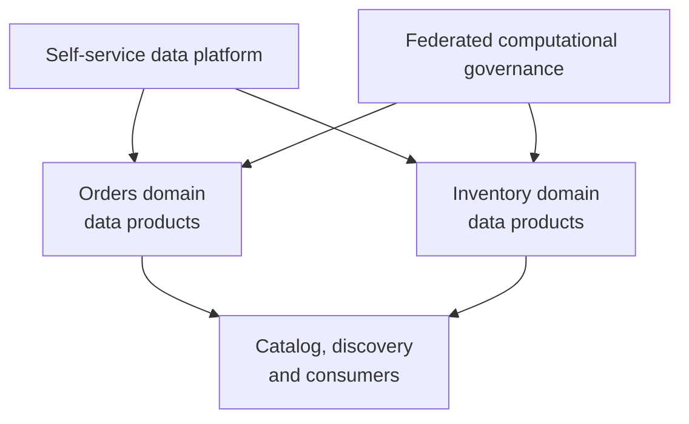
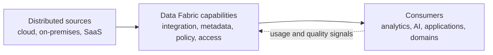

# Data Mesh and Data Fabric — Ownership, Platform and Event Streaming

> Part of the **Kafka Engineering Guide** for `org-rd-fullstack-springboot-eda`. See the [project README](../README.md).

**Scope:** explain Data Mesh and Data Fabric without treating them as competing products. Data Mesh is a socio-technical operating model built around domain ownership, data products, a self-service platform and federated computational governance. Data Fabric is an architectural approach that connects distributed data through shared integration, metadata, governance and access capabilities. This guide compares them, explains how event streaming can support both and proposes a pragmatic hybrid model.

## Table of contents

- [Overview](#overview)
- [Data Mesh: ownership and data products](#data-mesh-ownership-and-data-products)
- [Data Fabric: integration and shared capabilities](#data-fabric-integration-and-shared-capabilities)
- [Comparison](#comparison)
- [The role of EDA and Kafka](#the-role-of-eda-and-kafka)
- [A hybrid operating model](#a-hybrid-operating-model)
- [Choosing an approach](#choosing-an-approach)
- [How this project aligns](#how-this-project-aligns)
- [Adoption practices and anti-patterns](#adoption-practices-and-anti-patterns)
- [Sources and related reading](#sources-and-related-reading)

## Overview

Data Mesh and Data Fabric address different dimensions of enterprise data management:

- **Data Mesh asks who owns data and how domain teams make it trustworthy and reusable.**
- **Data Fabric asks how distributed data can be discovered, connected, governed and accessed consistently.**

They are complementary. A Data Mesh needs shared platform capabilities so that every domain does not rebuild ingestion, cataloguing, security and observability. A Data Fabric benefits from explicit domain ownership so that technical connectivity does not produce poorly understood or unaccountable datasets.

Neither term identifies a single technology:

- a Data Mesh is not created merely by splitting applications into microservices or giving each team Kafka topics;
- a Data Fabric is not necessarily one centralized lake, cluster or vendor product;
- Kafka can support either approach, but Kafka alone provides neither the operating model nor complete data governance.

## Data Mesh: ownership and data products

Data Mesh was introduced as a decentralized socio-technical approach for analytical data at scale. It distributes responsibility to the business domains closest to the meaning and production of the data.

Its four foundational principles are:

1. **Domain-oriented decentralized ownership** — domain teams own the data they produce and understand.
2. **Data as a product** — data is designed for consumers and has explicit quality, usability and support expectations.
3. **Self-service data platform** — a platform team provides reusable capabilities that let domains build and operate products without becoming infrastructure specialists.
4. **Federated computational governance** — domain representatives and platform owners define global interoperability and policy rules that are automated where practical.

### What makes something a data product

A table, file, API or Kafka topic is only a delivery interface. A usable data product also needs:

- a named owner and support model;
- a stable business meaning and bounded domain context;
- documented schemas, semantics and examples;
- discoverability and access instructions;
- quality indicators and service-level objectives (SLOs);
- security classification, authorization and retention rules;
- versioning, compatibility and deprecation policies;
- usage, lineage and operational health metadata.

A data product can expose events, batch files, tables, APIs or several interfaces. Data Mesh does not require Kafka and does not replace warehouses or lakes.

### Main benefits and risks

Data Mesh can reduce central-team bottlenecks and place quality accountability closer to the source. Its main risk is uncontrolled decentralization: inconsistent semantics, duplicated infrastructure and uneven quality appear when domain ownership is introduced without a capable self-service platform and enforceable global standards.

## Data Fabric: integration and shared capabilities

Data Fabric is a data-architecture approach for making distributed and heterogeneous data easier to discover, integrate, govern and consume across on-premises, cloud and SaaS environments. It creates a unified experience through shared services and metadata; it does not require physically moving all data into one repository.

Common capabilities include:

- connectors, ingestion, change data capture and event integration;
- cataloguing, lineage, semantic metadata and knowledge relationships;
- data virtualization, APIs, query and multiple delivery methods;
- data quality, policy enforcement, security and privacy controls;
- orchestration, transformation and lifecycle automation;
- observability of pipelines, products, access and cost.

Active metadata, rules and machine learning can automate classification, quality checks, lineage or optimization. AI/ML may enhance a Data Fabric, but it is not a prerequisite for establishing shared integration and governance capabilities.

### Main benefits and risks

A Data Fabric can reduce tool fragmentation, improve discovery and apply common controls across heterogeneous systems. Its main risk is becoming a technology program without clear ownership or consumer outcomes. A catalogue with no accountable owners, or a virtualization layer over poor-quality sources, makes problems easier to find but does not solve them.

## Comparison

| Dimension | **Data Mesh** | **Data Fabric** |
| --- | --- | --- |
| Nature | Socio-technical operating model | Data architecture and capability approach |
| Primary question | Who owns and serves trusted data? | How is distributed data connected, governed and accessed? |
| Organizing unit | Domain-owned data product | Shared integration, metadata and access capabilities |
| Ownership | Decentralized to domains | Compatible with centralized, federated or domain ownership |
| Governance | Federated decisions with automated global policies | Common policy services and metadata-driven enforcement |
| Platform | Self-service platform enables domain autonomy | Fabric capabilities provide interoperability across platforms |
| Data location | Polyglot and distributed | Polyglot and distributed; centralization is optional |
| Delivery interfaces | Events, tables, files, APIs, streams | Physical movement, virtualization, APIs, queries, events |
| Success measures | Product adoption, quality, consumer satisfaction and domain lead time | Discovery, interoperability, policy coverage, reuse and access lead time |
| Typical failure mode | Decentralization without standards or platform support | Central technology layer without ownership or trusted source data |

Cost, scalability and compliance do not inherently favour one model. They depend on product count, platform design, automation, organizational structure, regulatory requirements and the degree of duplicated capability.

## The role of EDA and Kafka

Event streaming is one possible foundation for real-time data movement and event-oriented data products. It is useful when consumers need low-latency updates, replay or independent processing.

Kafka and the surrounding platform can provide:

- durable topics as event-product interfaces;
- schemas and compatibility rules through Schema Registry;
- ingestion and delivery through Kafka Connect;
- transformations through Flink or other stream processors;
- discovery, ownership metadata, tags and lineage through a stream catalog;
- access control, retention, observability and consumer-lag metrics.

These capabilities can implement part of a self-service platform or Data Fabric. They become part of a Data Mesh only when domains own well-defined data products and participate in federated governance.

> **A topic is not automatically a data product, and a Kafka cluster is not automatically a Data Fabric.** Technology enables the model; ownership, contracts, quality and governance complete it.

Batch, table and API interfaces remain valid. A product should expose the interfaces its consumers need rather than forcing every use case through an event stream.

## A hybrid operating model

A common combination assigns responsibilities as follows:

| Participant | Primary responsibilities |
| --- | --- |
| **Domain teams** | Business semantics, source-aligned quality, product roadmap, schemas, SLOs, lifecycle and consumer support |
| **Data platform team** | Self-service provisioning, connectors, storage/streaming services, catalog integration, policy automation, observability and paved-road templates |
| **Federated governance group** | Global identifiers, interoperability, classifications, minimum controls, retention rules and cross-domain dispute resolution |
| **Consumers** | Correct use, access compliance, feedback, issue reporting and participation in contract evolution |

In this model, Data Mesh defines ownership and product behaviour, while Data Fabric capabilities implement much of the shared technical platform. The balance is intentional: domains control meaning and local evolution; the platform automates undifferentiated infrastructure; governance standardizes only what must interoperate globally.

The hybrid model does not require a separate Kafka cluster, lake or catalogue for every domain. Logical ownership and access boundaries can coexist on secure multi-tenant infrastructure.

## Choosing an approach

| Situation | Appropriate emphasis |
| --- | --- |
| Central data team is the main delivery bottleneck and domains are mature enough to own products | Introduce Data Mesh operating principles progressively |
| Data is fragmented across many platforms and difficult to discover, connect or govern | Invest in Data Fabric capabilities |
| Both ownership and technical fragmentation are problems | Combine domain-owned products with shared Fabric/platform services |
| Organization is small, domains are unclear or product demand is limited | Start with explicit ownership, a catalogue and common controls; avoid a large transformation program |

Before adopting either label, identify the problem, desired outcomes, accountable teams and measures of success. “Implement Data Mesh” or “buy a Data Fabric” is not a sufficient requirement.

## How this project aligns

This sandbox is not a complete Data Mesh or Data Fabric. It is a single teaching application with a shared database and a small number of Kafka topics. It demonstrates building blocks that could participate in either approach:

- Kafka topics can become event-product interfaces when ownership, semantics and SLOs are made explicit;
- schemas and Java types provide an implicit contract, but a production platform should externalize discovery, compatibility and ownership metadata;
- shared Kafka, monitoring and scaling capabilities resemble a platform or Fabric layer;
- delivery semantics, idempotency and replay illustrate the reliability work required for a trustworthy product.

To evolve toward a hybrid enterprise model:

1. define business domains and assign a product owner for each published dataset or event stream;
2. register topics, schemas, connectors, owners, classifications and lineage in a catalogue;
3. define product SLOs for freshness, quality, availability and compatibility;
4. provide self-service templates for secure topics, schemas, monitoring and CI/CD;
5. automate global policies while leaving domain semantics with the domain teams;
6. measure adoption, quality, support effort and time to onboard consumers.

Confluent Stream Catalog can support discovery and business metadata for topics, schemas, connectors and other streaming entities, but the catalogue does not replace ownership or product management.

## Adoption practices and anti-patterns

### Practices

- **Start with a bounded pilot.** Select domains with real consumers and measurable pain.
- **Define the product before the platform.** Identify users, decisions, interfaces, quality and support expectations.
- **Run the platform as a product.** Measure adoption, developer experience, reliability and time saved.
- **Automate global controls.** Apply classification, compatibility, access and retention policies through reusable tooling.
- **Support multiple delivery modes.** Events, tables, files and APIs can represent the same domain meaning for different consumers.
- **Manage the full lifecycle.** Include versioning, deprecation, deletion, replay and incident ownership.
- **Measure outcomes.** Track discovery-to-access time, reuse, quality, SLO attainment and consumer satisfaction.

### Anti-patterns

- Rebranding every topic or microservice as a “data product.”
- Calling a centralized lake, catalogue or integration tool a complete Data Fabric.
- Decentralizing ownership without a self-service platform and global interoperability rules.
- Building a central platform that leaves domain teams with no ownership of meaning or quality.
- Duplicating infrastructure per domain when logical isolation would be sufficient.
- Treating AI/ML automation as mandatory before metadata and governance fundamentals exist.

## Sources and related reading

- [Zhamak Dehghani — Data Mesh Principles and Logical Architecture](https://martinfowler.com/articles/data-mesh-principles.html)
- [IBM — What is a Data Fabric?](https://www.ibm.com/think/topics/data-fabric)
- [Confluent Cloud — Stream Catalog](https://docs.confluent.io/cloud/current/stream-governance/stream-catalog.html)
- [Confluent Cloud — Stream Lineage](https://docs.confluent.io/cloud/current/stream-governance/stream-lineage.html)
- [Architecture and Topic Design](./architecture_and_topic_design.md)
- [Governance and Observability](./governance_and_observability.md)
- [Scale and Shutdown](./dist_scale_and_shutdown.md)