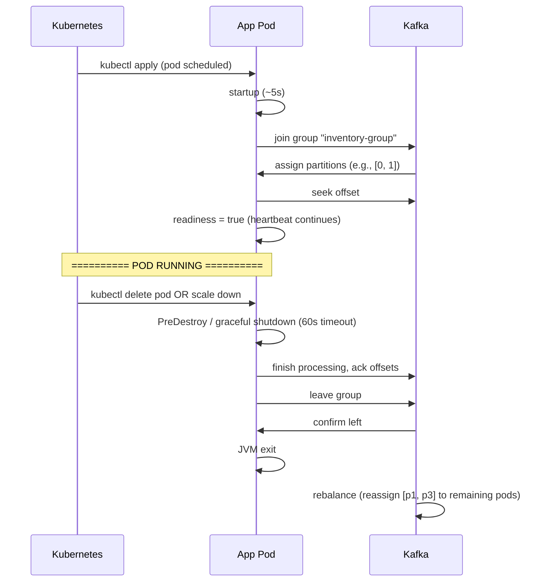

# Scale and shutdown in distributed environments

> Part of the **Kafka Engineering Guide** of `org-rd-fullstack-springboot-eda`. See the [project README](../README.md).

**Scope:** how Kafka consumer parallelism scales on **Amazon EKS** (the relationship between pods, threads and partitions, and why partition count caps achievable parallelism), how partitions are reassigned during scale events, the caveats of "hot" partitions and key skew, and why the ephemeral nature of pods makes graceful shutdown a hard requirement — with concrete Spring Boot / Spring Kafka patterns for stopping consumers and flushing producers cleanly to avoid rebalances, duplicates and message loss.

## Table of contents

- [Overview](#overview)
- [Processes, threads and partitions on EKS](#processes-threads-and-partitions-on-eks)
- [Deploying a Kafka application on EKS](#deploying-a-kafka-application-on-eks)
- [Horizontal scaling and rebalancing](#horizontal-scaling-and-rebalancing)
- [Parallelism ceilings](#parallelism-ceilings)
- [Hot partitions and skew](#hot-partitions-and-skew)
- [Mitigation strategies](#mitigation-strategies)
- [Graceful shutdown on EKS](#graceful-shutdown-on-eks)
- [Best practices](#best-practices)
- [Key takeaways](#key-takeaways)
- [Related reading](#related-reading)

## Overview

When you deploy the sandbox application on EKS, Kubernetes manages pod scheduling, node allocation, networking, and so on. This simplifies the infrastructure but adds layers of complexity to the orchestration of Kafka consumers: partitions are reassigned as pods come and go, parallelism is capped by the topic layout, and every pod termination must be handled cleanly.

## Processes, threads and partitions on EKS

In a Kubernetes environment such as **Amazon EKS**, Kafka consumers are typically deployed as **multiple pod replicas**. Each pod runs a **consumer process**, and within that process the application may use one or more **threads** to process records.

Kafka enforces a strict rule: **a partition can be consumed by only one consumer instance within a consumer group at any given time.** This means:

* Scaling consumer pods increases parallelism **only up to the number of partitions**.
* Threads within a single consumer process do not increase Kafka-level parallelism unless they are explicitly mapped to independent partitions.

As a result, the number of partitions in a topic effectively defines the **maximum achievable parallelism** for consumers, regardless of how many pods or threads are deployed. This single fact drives most of the trade-offs in the rest of this guide.

## Deploying a Kafka application on EKS

### Typical Kubernetes spec

```yaml
apiVersion: apps/v1
kind: Deployment
metadata:
  name: inventory-service
spec:
  replicas: 3  # 3 pods, each one Kafka consumer
  selector:
    matchLabels:
      app: inventory-service
  template:
    metadata:
      labels:
        app: inventory-service
    spec:
      containers:
      - name: app
        image: myregistry/inventory-service:1.0.0
        env:
        - name: KAFKA_BOOTSTRAP_SERVERS
          value: "kafka-broker-1:9092,kafka-broker-2:9092,kafka-broker-3:9092"
        - name: KAFKA_GROUP_ID
          value: "inventory-group"
        - name: KAFKA_CONCURRENCY
          value: "3"
        ports:
        - containerPort: 8080
        livenessProbe:
          httpGet:
            path: /actuator/health/liveness
            port: 8080
          initialDelaySeconds: 30
          periodSeconds: 10
        readinessProbe:
          httpGet:
            path: /actuator/health/readiness
            port: 8080
          initialDelaySeconds: 10
          periodSeconds: 5
      terminationGracePeriodSeconds: 60  # graceful shutdown: 60s max
      affinity:
        podAntiAffinity:  # spread replicas across different nodes
          preferredDuringSchedulingIgnoredDuringExecution:
          - weight: 100
            podAffinityTerm:
              labelSelector:
                matchExpressions:
                - key: app
                  operator: In
                  values:
                  - inventory-service
              topologyKey: kubernetes.io/hostname
```

### Pod lifecycle



## Horizontal scaling and rebalancing

When you change the number of replicas (e.g. `kubectl scale deployment inventory-service --replicas=5`), the extra pods are scheduled and the Kafka consumer group rebalances.

### Example: scaling from 3 to 5 pods

**Before:**

```
Pods: Pod-A, Pod-B, Pod-C
Topic APP-Kafka-Requests: 8 partitions
Assigned partitions:
  Pod-A : [p0, p1]
  Pod-B : [p2, p3]
  Pod-C : [p4, p5, p6, p7]
```

**After scaling to 5:**

```
Kubernetes starts 2 new pods: Pod-D, Pod-E
Kafka consumer group detects 5 members
Rebalance triggered (max 60s + backoff)

New assignments:
  Pod-A : [p0]
  Pod-B : [p2]
  Pod-C : [p4, p5]
  Pod-D : [p1, p3]
  Pod-E : [p6, p7]
```

**Impact:**

- During the rebalance (~30s), pods do not process messages (pause).
- Newly assigned partitions → offset seek to the last committed offset.
- After the rebalance, the old pods stop processing their former partitions.

### Example: scaling from 5 to 3 pods

```
Kubernetes stops Pod-D, Pod-E
Consumer group detects 3 members
Rebalance triggered

New assignments:
  Pod-A : [p0, p1]
  Pod-B : [p2, p3]
  Pod-C : [p4, p5, p6, p7]
```

The impact is similar: a rebalance pause, then consumption resumes with the new distribution.

## Parallelism ceilings

Reminder: **the useful number of consumer threads is capped by the number of partitions.**

```
Topic: 8 partitions
Pods: 1 → parallelism = min(1, 8) = 1
Pods: 3 → parallelism = min(3 * concurrency, 8) = min(3*3, 8) = 8 (useful max)
Pods: 5 → parallelism = min(5 * concurrency, 8) = 8 (useful max, surplus idle)
```

**Beyond the ceiling, scaling no longer helps:**

- More pods than partitions → surplus threads sit idle.
- Allocating more CPU does not help; Kafka already keeps every active thread busy.

**Lesson:** size partitions for the expected peak parallelism (e.g. if you plan for 10 pods with concurrency=3, plan for ~30 partitions, perhaps 24 to keep some headroom for skew and hot partitions).

## Hot partitions and skew

A **hot partition** is a partition that almost all traffic visits, while others sit empty. This happens with skewed keys (e.g. a dominant region, or a `country_code` where 90% of the traffic lands in a single country).

### Example: hot partition

```
Topic: 8 partitions, key = product_id (skewed)

Key distribution:
  Partition-0 (product_ids 1-10k)      : 1% of traffic (idle)
  Partition-1 (product_ids 10k-20k)    : 2% of traffic
  ...
  Partition-3 (product_ids 30k-40k)    : 85% of traffic  ← HOT
  ...
  Partition-7 (product_ids 70k-80k)    : 1% of traffic

If a single pod handles Partition-3: that pod is fully loaded
Other pods handle quiet partitions: under-utilized
```

**Impact:**

- Overall throughput is limited by the hot partition, not by the number of pods.
- Scaling does not help; the hot partition remains the bottleneck.

### Mitigation

1. **Redesign the partition key** — instead of `product_id`, use `hash(product_id + random_salt)` to artificially disperse hot products.
2. **Repartition the topic** — increase the number of partitions (with CARE: this changes the key→partition mapping).
3. **Accept the constraint** — if the hot partition represents 85% of the traffic and one instance handles it at full capacity, that is a number, not a bug.

## Mitigation strategies

### 1. Pod affinity for locality

Place pods close to the Kafka brokers to minimize network latency:

```yaml
affinity:
  podAffinity:
    preferredDuringSchedulingIgnoredDuringExecution:
    - weight: 100
      podAffinityTerm:
        labelSelector:
          matchExpressions:
          - key: component
            operator: In
            values:
            - kafka-broker
        topologyKey: kubernetes.io/hostname
```

### 2. Pod Disruption Budgets (PDB) to soften rebalancing

```yaml
apiVersion: policy/v1
kind: PodDisruptionBudget
metadata:
  name: inventory-service-pdb
spec:
  minAvailable: 2  # keep at least 2 pods live (fewer rebalances)
  selector:
    matchLabels:
      app: inventory-service
```

### 3. Kafka-lag-based autoscaling (KEDA)

See [Horizontal elasticity on EKS (KEDA + Karpenter)](./horizontal_elasticity_keda_karpenter.md).

## Graceful shutdown on EKS

In **Amazon EKS**, pods are inherently **ephemeral**. They can be terminated or replaced at any time due to scaling events, rolling deployments, node failures, or rescheduling decisions made by the Kubernetes control plane. For Kafka producers and consumers, this makes **graceful shutdown a critical requirement** rather than an optional optimization.

When a consumer pod is terminated abruptly:

* Partition ownership may be revoked unexpectedly, triggering a **consumer group rebalance**.
* In-flight messages may be left unprocessed or processed more than once.
* Offsets may not be committed correctly, leading to **message duplication or data loss**, depending on the delivery semantics.

To mitigate these risks, Kafka applications running on EKS must handle the Kubernetes termination signal (`SIGTERM`), stop polling new records while letting in-flight processing complete, commit offsets before shutdown, and close Kafka clients cleanly so partition revocation and rebalance happen in an orderly way. Producers must likewise flush and acknowledge buffered records before the pod terminates.

### Kubernetes configuration (EKS)

Graceful shutdown on EKS is orchestrated by `terminationGracePeriodSeconds`, sized to cover the optional `preStop` delay plus the application's own shutdown phase:

```yaml
spec:
  terminationGracePeriodSeconds: 60   # SIGTERM → SIGKILL window
  containers:
    - name: kafka-app
      image: my-kafka-app:latest
      lifecycle:
        preStop:
          exec:
            # let endpoints deregister and in-flight work drain before SIGTERM
            command: ["sh", "-c", "sleep 10"]
```

### SIGTERM → SIGKILL timeline

When Kubernetes terminates a pod:

1. The pod receives `SIGTERM`.
2. The app has up to `terminationGracePeriodSeconds` to shut down cleanly (finish work, commit offsets, flush producers).
3. After the grace period, Kubernetes sends `SIGKILL` (forced stop, no negotiation).

For Kafka-heavy pods, 60s is often enough. For heavier workloads, raise it (e.g. to 120s). Note that the timeout is **not guaranteed**: if the node itself is lost (machine failure), there is no graceful shutdown at all.

### Kafka consumer (Spring Kafka)

Spring Boot's graceful shutdown drains in-flight web requests, and Spring Kafka listener containers implement `SmartLifecycle`, so they are stopped when the application context closes — during the shutdown phase bounded by `timeout-per-shutdown-phase`. Keep that timeout long enough for in-flight records to finish and offsets to commit, and shorter than `terminationGracePeriodSeconds`.

```yaml
server:
  shutdown: graceful                    # drain in-flight web requests on SIGTERM
spring:
  lifecycle:
    timeout-per-shutdown-phase: 45s     # grace window for SmartLifecycle beans (incl. Kafka listener containers)
  kafka:
    listener:
      ack-mode: manual                  # commit offsets only after successful processing
```

> ⚠️ Manual acknowledgment is recommended when message processing must complete before offsets are committed.

**Consumer example:**

```java
@KafkaListener(
    topics = "orders",
    groupId = "order-consumers"
)
public void consume(
        ConsumerRecord<String, String> record,
        Acknowledgment acknowledgment
) {
    process(record);
    acknowledgment.acknowledge();
}
```

During shutdown, Spring stops polling for new records, in-flight records are processed, and offsets are committed before partitions are revoked.

### Kafka producer (Spring Kafka)

Ensure the producer flushes buffered messages on shutdown:

```yaml
spring:
  kafka:
    producer:
      acks: all
      retries: 3
```

Spring Boot automatically closes the `KafkaTemplate` when the application context shuts down, which triggers a `flush()` on the underlying producer.

**Producer example:**

```java
@Service
public class OrderProducer {

    private final KafkaTemplate<String, String> kafkaTemplate;

    public OrderProducer(KafkaTemplate<String, String> kafkaTemplate) {
        this.kafkaTemplate = kafkaTemplate;
    }

    public void sendOrder(String orderId, String payload) {
        kafkaTemplate.send("orders", orderId, payload);
    }
}
```

### Handling shutdown explicitly (optional)

For more control, you can hook into the Spring lifecycle:

```java
@Component
public class ShutdownHandler {

    private final KafkaTemplate<?, ?> kafkaTemplate;

    public ShutdownHandler(KafkaTemplate<?, ?> kafkaTemplate) {
        this.kafkaTemplate = kafkaTemplate;
    }

    @PreDestroy
    public void onShutdown() {
        kafkaTemplate.flush();
    }
}
```

## Best practices

- ✅ **Plan partitions for peak parallelism** — e.g. 10 pods, concurrency 3 → 24-32 partitions.
- ✅ **Use readiness probes** — `/actuator/health/readiness` signals when the pod is ready to receive traffic.
- ✅ **Spread replicas via anti-affinity** — a single node failure should not take down every pod.
- ✅ **Configure PDBs** — minimize disruption during rolling updates.
- ✅ **Test scaling** — change the replicas and verify that Kafka lag does not explode during the rebalance.
- ✅ **Size `terminationGracePeriodSeconds` to match the app** — grace period ≥ preStop delay + `timeout-per-shutdown-phase`.
- ⚠️ **Do not exceed the partition count** — surplus pods sit idle and add nothing to throughput.
- ⚠️ **Watch for hot partitions** — scaling does not fix key skew.
- ⚠️ **Graceful timeouts are not guaranteed** — if Kubernetes loses the node (machine failure), there is no graceful shutdown.

## Key takeaways

* **Pods are ephemeral** on EKS; shutdowns are expected and frequent.
* Partition count — not pod or thread count — sets the ceiling on consumer parallelism.
* Rebalances pause consumption briefly; scale deliberately and watch lag.
* Spring Kafka integrates naturally with the Kubernetes lifecycle: consumers must stop polling, finish processing and commit offsets; producers must flush pending records.
* Proper graceful shutdown minimizes rebalances, duplicates and message loss.

## Related reading

- [Horizontal elasticity on EKS (KEDA + Karpenter)](./horizontal_elasticity_keda_karpenter.md)
- [Lifecycle & Operations](./lifecycle_and_operations.md)
- [Architecture & Topic Design](./architecture_and_topic_design.md)

The parallelism model above (partitions cap consumer parallelism) is also *why* CPU/memory-based autoscaling is the wrong fit for Kafka consumers. For how to scale these pods correctly on EKS — **KEDA** driving replicas from consumer lag and **Karpenter** provisioning nodes — see [Horizontal elasticity on EKS (KEDA + Karpenter)](./horizontal_elasticity_keda_karpenter.md).
