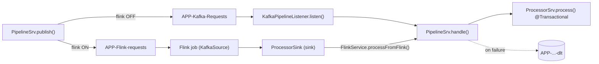
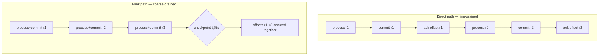

# Flink guide — the optional Flink processing path

> Part of the **Kafka Engineering Guide** of `org-rd-fullstack-springboot-eda`. See the [project README](../README.md) and the [sandbox guides](./sandbox_guides.md).

**Scope:** documents the optional **Flink** path of the operations pipeline — how it is enabled from the UI, how requests are routed through the embedded Flink job, how the job invokes the processor, and the fault-tolerance machinery added around it (checkpointing, Dead-Letter handling and pause/resume via savepoint). It also discusses two cross-cutting concerns that matter a great deal in practice: **why a Flink checkpoint is not as fine-grained as the direct path's per-record acknowledgement**, and **why the in-JVM design works only because the MiniCluster shares the application's JVM** (it would not survive on a real Flink cluster).

## Table of contents

- [Overview: two processing paths](#overview-two-processing-paths)
- [Enabling the option](#enabling-the-option)
- [The Flink job](#the-flink-job)
- [Calling the processor from a Flink operator (the in-JVM bridge)](#calling-the-processor-from-a-flink-operator-the-in-jvm-bridge)
- [In-JVM MiniCluster vs. a real Flink cluster](#in-jvm-minicluster-vs-a-real-flink-cluster)
- [Fault tolerance: checkpointing and restart](#fault-tolerance-checkpointing-and-restart)
- [Checkpoint granularity ≠ per-commit acknowledgement](#checkpoint-granularity--per-commit-acknowledgement)
- [Alternatives to tighten the synchronization](#alternatives-to-tighten-the-synchronization)
- [Dead-Letter handling on the Flink path](#dead-letter-handling-on-the-flink-path)
- [Pause / resume via stop-with-savepoint](#pause--resume-via-stop-with-savepoint)
- [Direct path vs. Flink path — side by side](#direct-path-vs-flink-path--side-by-side)
- [Configuration reference](#configuration-reference)
- [Pitfalls & best practices](#pitfalls--best-practices)
- [Sources & further reading](#sources--further-reading)

## Overview: two processing paths

The operations pipeline can run requests through one of two paths, selected by the **Flink** toggle in the operations dashboard. The toggle is read at *publish* time and stored in [`PipelineContext`](../src/main/java/org/rd/fullstack/springbooteda/dto/PipelineContext.java) (`flink`, default `false`).

| Mode | Flow |
|---|---|
| **Flink OFF** (direct) | `PipelineSrv.publish()` → `APP-Kafka-Requests` → `KafkaPipelineListener.listen()` (`@KafkaListener`) → `PipelineSrv.handle()` → `ProcessorSrv.process()` |
| **Flink ON** | `PipelineSrv.publish()` → `APP-Flink-requests` → **Flink job** → **`ProcessorSink`** → `FlinkService.processFromFlink()` → `PipelineSrv.handle()` → `ProcessorSrv.process()` |

Both paths converge on the same per-record handler, [`PipelineSrv.handle()`](../src/main/java/org/rd/fullstack/springbooteda/srv/PipelineSrv.java) (per-client Hazelcast lock + transactional `ProcessorSrv.process()` + completion counting), so the business processing, locking and stats behave identically. Only the *transport* differs.

> **Decomposition.** The pipeline is split across three beans: [`PipelineSrv`](../src/main/java/org/rd/fullstack/springbooteda/srv/PipelineSrv.java) is the path-agnostic **core** (start/publish/handle/state/stats/pause); [`KafkaPipelineListener`](../src/main/java/org/rd/fullstack/springbooteda/srv/KafkaPipelineListener.java) owns the direct **Kafka** path (`@KafkaListener` + DLT retry observer); [`FlinkService`](../src/main/java/org/rd/fullstack/springbooteda/srv/FlinkSrv.java) owns the **Flink** path (job lifecycle + `processFromFlink` + Flink DLT). The two transport beans depend on the core (for `handle()`); the core depends on neither — pause/resume is signalled through events.



> **Note.** The Flink job's KafkaSource is a *separate consumer* from the `@KafkaListener` — different consumer group, different topic. The two never compete. In direct mode the Flink job is idle (nothing is published to `APP-Flink-requests`); in Flink mode the `@KafkaListener` is idle (nothing is published to `APP-Kafka-Requests`).

## Enabling the option

**Frontend** — [`frontend/app/pages/operations/index.vue`](../src/frontend/app/pages/operations/index.vue) adds a `flink` switch (icon `mdi-pipe`, labels `operations.flink` / `operations.flink-desc` in `en_CA.json` / `fr_CA.json`). Its value is included in the `PipelineContext` sent to `POST /pipeline/start` and is re-hydrated on mount like the other options.

**Backend** — [`PipelineSrv.publish()`](../src/main/java/org/rd/fullstack/springbooteda/srv/PipelineSrv.java) reads the flag once and routes accordingly:

```java
final boolean flink  = Boolean.TRUE.equals(context.getFlink());
final String  target = flink ? KafkaConstants.CST_TOPIC_FLINK_REQ
                             : KafkaConstants.CST_TOPIC_KAFKA_REQ;
```

Everything else in `publish()` (the single Kafka transaction, the optional `key`/`replay` headers, the `nbrPublished` count) is unchanged; only the destination topic changes.

## The Flink job

[`FlinkService`](../src/main/java/org/rd/fullstack/springbooteda/srv/FlinkSrv.java) builds and submits the job once, on `ApplicationReadyEvent`, against the embedded `MiniCluster` (`createRemoteEnvironment(host, port)`):

- **Source** — `KafkaSource` on `APP-Flink-requests`, `value-only` (`SimpleStringSchema`), group id = the Kafka sandbox UUID, `OffsetsInitializer.earliest()`.
- **Transform** — none. The records are the serialized JSON requests; they pass through **unchanged** so the processor can deserialize them.
- **Sink** — `ProcessorSink` (sink2 API), which calls the processor directly.

Because the records carry no Kafka key through the `value-only` source/sink, key-based partitioning and the `replay-id`/`batch-id` headers do **not** survive the Flink hop (if they are not included in the payload). Per-client correctness is still guaranteed because the Hazelcast lock keys on `personId`, which is recomputed from the payload inside `handle()`.

## Calling the processor from a Flink operator (the in-JVM bridge)

A Flink operator cannot be given a Spring bean directly: Flink **serializes** operators and ships them to TaskManagers, and a JPA-backed `@Service` is not serializable. The sink therefore holds *no* Spring reference and resolves the target at runtime from a **cross-classloader bridge**. `FlinkService` publishes **itself** (it owns `processFromFlink`, which delegates to `PipelineSrv.handle()`):

```java
// Resolves the bridge consumer from the JVM-global bridge. A no-op once resolved;
// tolerant of the (transient, should-not-happen) window where the bridge is not yet published.
private void resolveBridge() throws IOException {
    if (bridge != null)
        return;
    Object bean = System.getProperties().get(CST_BRIDGE_KEY);
    if (bean == null)
        return;
    if (!(bean instanceof Consumer<?> consumer))
        throw new IOException("Flink sink bridge value is not a Consumer<String>.");
    @SuppressWarnings("unchecked")
    Consumer<String> stringConsumer = (Consumer<String>) consumer;
    this.bridge = stringConsumer;
}
```

The naive approach — a `private static volatile PipelineSrv pipelineSrvRef` set in `startJob()` and read in the sink — **fails under Spring Boot DevTools.** DevTools loads the application beans in a throwaway `RestartClassLoader`, but the MiniCluster task threads resolve `FlinkService` through a *different* (base) classloader. The static set on the Spring-side copy of the class is `null` on the copy the task threads see, so the sink logs `...not wired...; dropping record` and silently drops every message (the job stays RUNNING — no error).

The bridge above avoids that two ways: (1) the carrier is `System.getProperties()`, held by the **bootstrap classloader**, so it has a *single identity across every classloader*; (2) invocation is **reflective**, dispatching on the object's own class, so no shared `FlinkService` type identity between the two classloaders is required. The resolved target is still the real Spring-managed `FlinkService`, whose `processFromFlink` delegates to the AOP-proxied `PipelineSrv.handle()`, so `ProcessorSrv.process()`'s `@Transactional` semantics apply on the Flink task thread.

## In-JVM MiniCluster vs. a real Flink cluster

> **This is the single most important caveat of the Flink path.** The design is a teaching shortcut that is valid for the embedded sandbox and **would not work on a distributed Flink cluster.**

On a real cluster, operators run in **separate TaskManager JVMs**, usually on **different machines**. Consequences:

- **No shared in-JVM bridge.** The `System.getProperties()` carrier is populated in the *application* JVM; a remote TaskManager JVM never sees it — the lookup would return `null`.
- **No Spring context.** There is no `ApplicationContext`, no `EntityManager`, no repositories, no Hazelcast member, and no Spring transaction manager in the TaskManager JVM. `ProcessorSrv.process()`'s `@Transactional` relies on Spring's thread-bound transaction manager, which simply does not exist there.
- **Classes are not always available.** The application classes (`ProcessorSrv`, the repositories, the DTOs) must be on the TaskManager classpath — bundled into the submitted **job jar** — and they load under Flink's **user-code classloader**, distinct from the application's. Anything resolved by identity/static state across classloaders breaks. In the MiniCluster all classes happen to be on the one application classpath, which is exactly why the shortcut compiles *and* runs here.
- **Serialization.** Any non-`transient`, non-serializable field captured by an operator fails job submission. The sink avoids this by capturing nothing and looking the bean up lazily — but that lookup is precisely what has no answer on a remote TM.

**What a cluster-safe design would do instead** (pick per use case):

1. **Write to Kafka and let a Spring consumer do the DB work** — the classic decoupling: `KafkaSink` → a topic → an ordinary `@KafkaListener` (this is the per-record-ack design described below under *alternatives*). The Flink operator touches no Spring bean.
2. **Use a native Flink sink** — e.g. the Flink **JDBC** connector to write to the database directly, with no Spring/JPA on the TaskManager.
3. **Call a remote service** — the operator invokes the application over REST/gRPC, which keeps the DB logic in the Spring app and out of the TaskManager.
4. **Implement a Spring Boot & JPA Pipeline** - e.g., the Flink **RichMapFunction** can be used to load a [`Spring Boot context`](./flink_springboot.md).

## Fault tolerance: checkpointing and restart

[`FlinkService.startJob()`](../src/main/java/org/rd/fullstack/springbooteda/srv/FlinkSrv.java) enables checkpointing and a bounded restart strategy:

```java
// All tunables are injected from application.yml — see the Configuration reference below.
env.enableCheckpointing(checkpointIntervalMs, CheckpointingMode.AT_LEAST_ONCE); // default 5 s

Configuration restartCfg = new Configuration();
restartCfg.set(RestartStrategyOptions.RESTART_STRATEGY, "fixed-delay");
restartCfg.set(RestartStrategyOptions.RESTART_STRATEGY_FIXED_DELAY_ATTEMPTS, restartAttempts);
restartCfg.set(RestartStrategyOptions.RESTART_STRATEGY_FIXED_DELAY_DELAY, Duration.ofMillis(restartDelayMs));
env.configure(restartCfg);
```

- **How Flink tracks progress.** The `KafkaSource` keeps its consuming offsets in Flink's **checkpointed state**, *not* in Kafka's committed offsets (which it writes only on checkpoint, for lag monitoring). On recovery, Flink restores from the last completed checkpoint — it never relies on the Kafka committed offsets.
- **`AT_LEAST_ONCE` is the honest mode.** The sink performs an *external* side effect (DB writes) and is not transactional/2PC, so exactly-once cannot be claimed end-to-end. Replays are made safe for the database by the **idempotency** of `ProcessorSrv.process()` (a request that is no longer `PENDING`/`BACK_ORDER` is skipped).
- **Restart strategy.** With checkpointing disabled, Flink's default was *no-restart* — a single sink exception killed the job. The bounded `fixed-delay` (3 × 5 s) retries transient failures before the job ultimately fails. (Most processing failures are intercepted earlier; see the DLT section.)
- **Why programmatic config?** The deprecated `setRestartStrategy(RestartStrategies…)` API is avoided in favour of `RestartStrategyOptions` + `env.configure(...)`, and the non-deprecated `enableCheckpointing(long, core.execution.CheckpointingMode)` overload is used.

## Checkpoint granularity ≠ per-commit acknowledgement

This is the key semantic difference between the two paths, and it is **not** a drop-in equivalence.

**Direct path — per-record ack.** The listener container uses `MANUAL_IMMEDIATE`, and `listen()` calls `ack.acknowledge()` *immediately after* the record's DB transaction commits. The Kafka offset therefore advances **one record at a time, right after each commit**. On a crash, the replay window is at most the single in-flight record per consumer thread.

**Flink path — per-checkpoint advance.** The DB writes happen continuously (one `@Transactional` commit per record, inside the sink), but the **source offset is only secured at a checkpoint boundary** — every 5 s. There is no "commit the offset right after this record's DB commit" hook in Flink. So:

- On a crash, Flink restores from the last completed checkpoint and **replays every record processed since then** (up to ~5 s of work), *even though their DB transactions already committed*. The replay window is a whole checkpoint interval, not a single record.
- The database stays correct because `process()` is idempotent. But the **completion counter is not** replay-idempotent: `recordProcessed()` would be called again for replayed records, **over-counting** `nbrProcessed` and possibly missing the exact `nbrPublished == nbrProcessed + nbrProcessedWithError` completion edge.

In short: a Flink checkpoint is a **batch boundary for the source position and internal state**, decoupled from the **external DB commit** of any single record. It cannot reproduce the direct path's "advance the offset exactly when this record's commit lands" guarantee. The current implementation accepts this (the recovery path is exceptional); the section below lists ways to close the gap.



## Alternatives to tighten the synchronization

Depending on how strict you need the guarantee, from lightest to heaviest:

1. **Idempotent processing — already in place.** `process()` skips already-handled requests, so replays never double-apply DB effects. This is the cheapest and most important safeguard; keep it.
2. **Make completion replay-safe.** Derive `nbrProcessed` from **DB state** (count `EXECUTED` / `ERROR` requests) instead of an incrementing counter, or de-duplicate by `requestId` in a distributed set before counting. This removes the only observable defect on replay (stats over-count) without changing the transport.
3. **Regain per-record ack — route Flink output back to Kafka.** Replace `ProcessorSink` with a `KafkaSink` writing to `APP-Kafka-Requests`, and let the existing `@KafkaListener` (`MANUAL_IMMEDIATE`) do the DB work. This restores the direct path's fine-grained ack semantics (and is **cluster-safe**, since the operator no longer touches a Spring bean) — at the cost of one extra topic hop and the loss of the "call the processor directly" property. This was an earlier design iteration and remains the simplest way to recover per-record granularity.
4. **Exactly-once sink (2PC).** Implement a sink that participates in checkpoints: stage the DB work and commit it on `notifyCheckpointComplete`, aborting on failure. This aligns the external effect with the checkpoint, but coordinating a JPA/JDBC transaction with Flink's two-phase commit is intricate and often impractical with a Spring/JPA stack.
5. **Transactional outbox.** Have `process()` write its outcome to an *outbox* table in the same DB transaction; a separate relay publishes/acknowledges downstream. This fully decouples the external effect from Flink's checkpoint cadence.
6. **Tuning, not a fix.** A shorter checkpoint interval shrinks the replay window but increases overhead and never eliminates the granularity gap. Unaligned checkpoints help with backpressure, not with this.

## Dead-Letter handling on the Flink path

The Flink path mirrors the direct path's `DefaultErrorHandler` → DLT behaviour, implemented inside [`FlinkService.processFromFlink()`](../src/main/java/org/rd/fullstack/springbooteda/srv/FlinkSrv.java):

1. **Bounded retry** — `CST_RETRY_ATTEMPTS + 1` attempts with `CST_RETRY_INTERVAL` (250 ms) back-off, reusing the Kafka path's constants for parity.
2. **Success** → completion counted via `PipelineSrv.handle()` (`recordProcessed(false)`).
3. **Retries exhausted** → `sendToFlinkDlt(value, cause)` then `PipelineSrv.recordProcessed(true)`. The job **survives** the poison record and the pipeline can still reach completion (`EXCEPTION`, since errors > 0) — exactly like the Kafka path's `RetryListener.recovered`.
4. **DLT publish itself fails** (genuine infrastructure problem) → the exception propagates, the restart strategy applies, and the record is replayed from the last checkpoint.

`sendToFlinkDlt()` publishes **transactionally** (like the direct path's DLT recoverer, so the dead-lettered record is visible to `read_committed` consumers) to **`APP-Flink-requests-dlt`** (the DLT paired with the Flink source topic, created in `KafkaConfig`), attaching the failure cause in a `flink-dlt-cause` header.

| Aspect | Direct path (Kafka) | Flink path |
|---|---|---|
| Retry | `DefaultErrorHandler` (1 retry, 250 ms) | loop in `FlinkService.processFromFlink` (same values) |
| DLT topic | `APP-Kafka-Requests-dlt` | `APP-Flink-requests-dlt` |
| Error count | `recordProcessed(true)` (RetryListener) | `recordProcessed(true)` |
| DLT publish | transactional | transactional |

> The retry back-off runs `Thread.sleep` on the Flink task thread (acceptable for the sandbox — the same nature as the optional latency feature).

## Pause / resume via stop-with-savepoint

The direct path pauses by calling `container.pause()/resume()` on the `@KafkaListener` (done in `KafkaPipelineListener`). Flink has **no equivalent lightweight pause** of a running source, so the closest equivalent is **stop-with-savepoint** (a true pause: the job is stopped with a savepoint and later restarted from it).

**Trigger & decoupling.** `PipelineSrv.setPause()` updates the pause flag, then publishes a [`KafkaListenerPauseEvent`](../src/main/java/org/rd/fullstack/springbooteda/srv/KafkaListenerPauseEvent.java) (always — a harmless no-op in Flink mode, where the listener carries no records) and — **only when the Flink option is on** — a [`FlinkPauseEvent`](../src/main/java/org/rd/fullstack/springbooteda/srv/FlinkPauseEvent.java). `KafkaPipelineListener` and `FlinkService` listen for their respective events. Routing both through events keeps the dependencies one-directional: those two beans depend on `PipelineSrv` (for `handle()`), so the core must **not** depend back on them (that would be a bean cycle).

**Pause** — `FlinkService.pause()` checks the job is `RUNNING`, then:

```java
pausedSavepoint = client.stopWithSavepoint(false, dir, SavepointFormatType.CANONICAL)
                        .get(savepointTimeoutSec, TimeUnit.SECONDS);   // dir & timeout from config
client = null;
```

**Resume** — `FlinkService.resume()` rebuilds the job and restores it from the saved path:

```java
StreamGraph sg = env.getStreamGraph();
sg.setSavepointRestoreSettings(SavepointRestoreSettings.forPath(pausedSavepoint));
client = env.executeAsync(sg);
```

> **Why the `StreamGraph`?** `StreamExecutionEnvironment.configure()` only reads the savepoint **output directory** (`CheckpointingOptions.SAVEPOINT_DIRECTORY`), *not* the restore path. The restore must be attached via `SavepointRestoreSettings` on the `StreamGraph` — verified against the Flink 1.20 API.

**Design notes & limitations:**

- The lifecycle (`startJob` / `onStop` / `pause` / `resume`) is serialized by synchronizing on the service instance, since all mutate the single `client`.
- `setPause` **blocks** for the duration of the savepoint (possibly a few seconds) — the assumed trade-off versus the instantaneous `container.pause()`.
- Savepoints are written under the configured `flink.pipeline.savepoint-dir` (blank → `${java.io.tmpdir}/springboot-eda-flink-savepoints`; fine for the sandbox, point at shared/durable storage for a real deployment). See the [Configuration reference](#configuration-reference).
- The savepoint path is held **in memory**: if the application restarts while paused, the path is lost (though the savepoint files remain on disk).
- Intended to be used in pairs during a run. If the job is not `RUNNING` (already failed/finished), pause is logged and skipped.
- A *blocking-backpressure* pause (block the sink until resumed) was considered and rejected: a blocked operator cannot process checkpoint barriers, so a long pause would time out checkpoints and could fail the job. Stop-with-savepoint avoids that.

## Direct path vs. Flink path — side by side

| Concern | Direct path | Flink path |
|---|---|---|
| Transport | `APP-Kafka-Requests` → `KafkaPipelineListener` (`@KafkaListener`) | `APP-Flink-requests` → Flink job → `ProcessorSink` |
| Business processing | `PipelineSrv.handle()` → `ProcessorSrv.process()` | identical (`FlinkService.processFromFlink` → `PipelineSrv.handle()`) |
| Offset / progress | per-record `ack` after DB commit | per-checkpoint (every 5 s) |
| Replay window on crash | ~1 in-flight record | ~1 checkpoint interval of records |
| Retry + DLT | `DefaultErrorHandler` → `…-dlt` | in-`processFromFlink` retry → `APP-Flink-requests-dlt` |
| Pause/resume | `container.pause()/resume()` | stop-with-savepoint / restore |
| Key & headers | preserved | dropped (value-only) |
| Cluster-safe | yes | **no** (in-JVM bean call) |

## Configuration reference

The application Flink job is tuned under `org.rd.fullstack.springbooteda.flink.pipeline.*` in [`application.yml`](../src/main/resources/application.yml) (mirrored in [`src/test/resources/application.yml`](../src/test/resources/application.yml)). The keys are bound in [`FlinkService`](../src/main/java/org/rd/fullstack/springbooteda/srv/FlinkSrv.java) via `@Value`, the same pattern as the sandbox settings in [`FlinkConfig`](../src/main/java/org/rd/fullstack/springbooteda/config/FlinkConfig.java).

```yaml
org:
  rd:
    fullstack:
      springbooteda:
        flink:
          sandbox:        # the embedded MiniCluster engine — see the Sandbox guides
            ...
          pipeline:       # the application job — see below
            parallelism: 4
            checkpoint-interval-ms: 5000
            restart-attempts: 3
            restart-delay-ms: 5000
            savepoint-dir: ""
            savepoint-timeout-sec: 60
            status-timeout-sec: 10
```

| Key | Default | Meaning | Used by |
|---|---|---|---|
| `parallelism` | `4` | Job parallelism (`env.setParallelism`). | job build |
| `checkpoint-interval-ms` | `5000` | Checkpoint period, in ms (`enableCheckpointing`, `AT_LEAST_ONCE`). | [checkpointing](#fault-tolerance-checkpointing-and-restart) |
| `restart-attempts` | `3` | Bounded `fixed-delay` restart attempts before the job fails. | [restart strategy](#fault-tolerance-checkpointing-and-restart) |
| `restart-delay-ms` | `5000` | Delay between restart attempts, in ms. | [restart strategy](#fault-tolerance-checkpointing-and-restart) |
| `savepoint-dir` | `""` | Savepoint base directory. **Blank → `${java.io.tmpdir}/springboot-eda-flink-savepoints`.** Point at durable/shared storage for a real deployment. | [pause/resume](#pause--resume-via-stop-with-savepoint) |
| `savepoint-timeout-sec` | `60` | Upper bound for the stop-with-savepoint (pause) wait. | [pause/resume](#pause--resume-via-stop-with-savepoint) |
| `status-timeout-sec` | `10` | Upper bound for the job-status query before a pause. | [pause/resume](#pause--resume-via-stop-with-savepoint) |

**Related but intentionally *not* under this section:**

- **MiniCluster sizing** (`flink.sandbox.num-task-managers`, `…num-slots-per-task-manager`, ports, `active-metrics`, `enabled`) lives under `flink.sandbox.*` and is documented in the [Sandbox guides](./sandbox_guides.md). Keep `parallelism` ≤ `num-task-managers × num-slots-per-task-manager`.
- **Flink-path DLT retry** reuses the Kafka path's policy (`KafkaConstants.CST_RETRY_ATTEMPTS`, `CST_RETRY_INTERVAL`) so both paths retry identically; it is centralized in [`KafkaConstants`](../src/main/java/org/rd/fullstack/springbooteda/util/kafka/KafkaConstants.java) rather than duplicated here.

## Pitfalls & best practices

- **Do not ship this design to a real cluster as-is.** The static-bridge bean call is in-JVM only. See [In-JVM MiniCluster vs. a real Flink cluster](#in-jvm-minicluster-vs-a-real-flink-cluster).
- **Keep `process()` idempotent.** It is the safety net for every replay (checkpoint recovery, DLT redelivery, savepoint restore).
- **Treat the stats counter as approximate under recovery.** `recordProcessed()` is not replay-idempotent; if exactness matters, derive completion from DB state (alternative #2).
- **No transform in the Flink job.** The payload must reach the processor as valid JSON; any map/transform must be JSON-safe.
- **Savepoint storage defaults to local temp.** Adequate for the sandbox; set `flink.pipeline.savepoint-dir` to durable/shared storage for anything real.
- **Pause is a heavyweight operation** here (a savepoint round-trip), gated to Flink mode on purpose to avoid penalising direct-mode pauses.

### Develop and Debugging

**Debugging an Apache Flink application running in cluster mode is more complex than debugging it locally.** The code is distributed across multiple processes and potentially multiple nodes (*JobManager* and *TaskManagers*), making it difficult to use a traditional debugger with breakpoints. Parallel execution, task redistribution, and Flink's recovery mechanisms can also make issues difficult to reproduce.

This distributed architecture also introduces constraints on the **reuse of existing application code**. For example, code designed for a **Spring Boot** application may depend on the Spring context, dependency injection, or annotations such as `@Autowired`, `@Service`, or `@Component`. However, code executed by Flink *TaskManagers* does not necessarily run within that same Spring context. A component that works directly within a Spring Boot application may therefore need to be **decoupled, adapted, or explicitly initialized** to run correctly in a Flink cluster.

In practice, troubleshooting relies more heavily on **structured logging**, **metrics**, the Flink Web UI, and **distributed observability**, complemented by local and integration testing to isolate issues before deployment to the cluster.

## Sources & further reading

- [Sandbox guides](./sandbox_guides.md) — the embedded Kafka / Flink / Hazelcast sandboxes.
- [Reliability & delivery semantics](./reliability_and_delivery_semantics.md), [Consumer acknowledgement & idempotency](./consumer_acknowledgement_and_idempotency.md) — the direct path's at-least-once and ack model.
- Apache Flink docs: *Kafka Source — consumer offset committing*, *Checkpointing*, *Savepoints*, *Restart strategies*, *The new Sink API (sink2)*.
- Source: [`FlinkService`](../src/main/java/org/rd/fullstack/springbooteda/srv/FlinkSrv.java), [`PipelineSrv`](../src/main/java/org/rd/fullstack/springbooteda/srv/PipelineSrv.java), [`FlinkSandbox`](../src/main/java/org/rd/fullstack/springbooteda/util/flink/FlinkSandbox.java), [`KafkaConfig`](../src/main/java/org/rd/fullstack/springbooteda/config/KafkaConfig.java).
