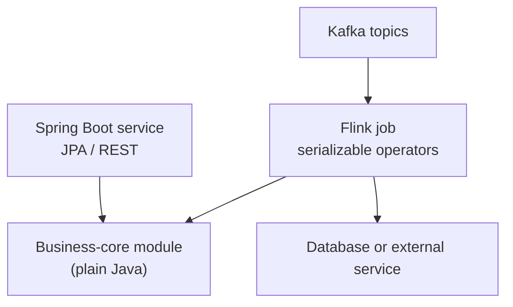
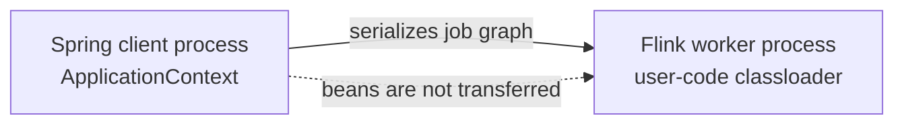

# Flink and Spring Boot — Integration Guide

> Part of the **Kafka Engineering Guide** for `org-rd-fullstack-springboot-eda`. See the [project README](../README.md) and the [sandbox guides](./sandbox_guides.md).

**Scope:** describe safe ways to reuse Spring Boot business logic in an Apache Flink pipeline, with particular attention to Confluent Cloud, classloading, serialization, database access, idempotency and lifecycle management. The preferred design keeps the Flink runtime independent from Spring; bootstrapping a Spring context inside an operator is documented as an advanced option for self-managed Flink only.

## Table of contents

- [Overview](#overview)
- [Choose the deployment model first](#choose-the-deployment-model-first)
- [Integration challenges](#integration-challenges)
- [Preferred pattern: separate runtime, shared business module](#preferred-pattern-separate-runtime-shared-business-module)
- [Advanced pattern: Spring inside a Flink operator](#advanced-pattern-spring-inside-a-flink-operator)
- [Idempotent database processing](#idempotent-database-processing)
- [Transactions and end-to-end guarantees](#transactions-and-end-to-end-guarantees)
- [Classloading, serialization and connection pools](#classloading-serialization-and-connection-pools)
- [Lifecycle and graceful shutdown](#lifecycle-and-graceful-shutdown)
- [Packaging](#packaging)
- [Deployment on Confluent Cloud](#deployment-on-confluent-cloud)
- [How this project applies the patterns](#how-this-project-applies-the-patterns)
- [Best practices](#best-practices)
- [Sources and further reading](#sources-and-further-reading)

## Overview

Spring Boot and Flink solve different problems. Spring Boot provides dependency injection, configuration and transaction management for application services. Flink distributes a job graph across processes, serializes user functions and state, restarts failed subtasks and replays input from checkpoints.

These lifecycle models do not combine automatically:

- a Spring bean is not a safe field to serialize with a Flink operator;
- JPA repositories, entity managers and database connections are process-local resources;
- checkpoint recovery can execute database side effects more than once;
- each parallel Flink subtask can create its own Spring context and connection pool;
- Confluent Cloud supports specific Flink development surfaces and does not treat every arbitrary DataStream fat JAR as a deployable managed application.

The recommended architecture is therefore to share **plain Java business logic**, not a running Spring container:



## Choose the deployment model first

The correct integration pattern depends on where the code runs.

| Model | Where application code runs | Recommended Spring approach |
| --- | --- | --- |
| **Confluent Cloud Flink SQL or Table API** | Managed Flink runtime; a Table API program submits statements from an external Java process | Keep Spring outside the managed operators. Use Spring only in the submitting application if useful. |
| **Confluent Cloud UDF or process table function** | User artifact executes in the managed runtime under the supported function contract | Package a small, deterministic function. Do not treat the artifact as a full Spring Boot service. |
| **Self-managed Flink cluster** | Your JobManager and TaskManagers execute the DataStream job JAR | Prefer plain operators and supported connectors. A minimal Spring context inside an operator is possible but expensive. |
| **Local or test runtime launched by Spring Boot** | Spring owns the client process that submits or runs the job | Spring can assemble configuration and retain the `JobClient`; operators must still obey Flink serialization rules. |

> **Platform boundary:** uploading a UDF artifact to Confluent Cloud is not equivalent to uploading and launching an arbitrary Spring Boot/DataStream application. Select a supported Confluent Cloud surface before designing the integration.

## Integration challenges

### Isolated classloaders

Flink loads job code through a user-code classloader. Depending on the deployment, this loader can use inverted loading and can differ from the loader that contains cluster libraries. A bean created in a Spring client process is not available inside a remote TaskManager.



Pass serializable values and DTOs to the job. Create non-serializable runtime resources in `open(...)`, and release them in `close()`.

### Serialization boundaries

Flink serializes operators and distributed state. The following objects must not be captured in an operator constructor or lambda:

- Spring application contexts and beans;
- JPA repositories, `EntityManager` instances and Hibernate proxies;
- JDBC connections, prepared statements and connection pools;
- non-serializable configuration clients or secret-provider sessions.

Mark runtime-only fields `transient`, but remember that `transient` only prevents serialization; it does not initialize the field on a worker.

### Independent lifecycle and recovery

Flink may restart an operator after a failure and replay records since the last completed checkpoint. `open(...)` can therefore run multiple times over the lifetime of a job. Cleanup in `close()` is best effort and cannot replace server-side timeouts or bounded pools because a hard process failure may bypass it.

## Preferred pattern: separate runtime, shared business module

Extract deterministic rules into a framework-neutral module that both Spring Boot and Flink can use:

```java
public final class InventoryPolicy {

    public InventoryDecision evaluate(RequestEvent event, int availableStock) {
        if (event.quantity() <= 0) {
            throw new IllegalArgumentException("quantity must be positive");
        }
        return availableStock >= event.quantity()
            ? InventoryDecision.accept(event)
            : InventoryDecision.backOrder(event);
    }
}
```

Create runtime-only collaborators in the Flink lifecycle method:

```java
import org.apache.flink.api.common.functions.OpenContext;
import org.apache.flink.api.common.functions.RichMapFunction;

public final class InventoryDecisionMap
        extends RichMapFunction<RequestEvent, InventoryDecision> {

    private transient InventoryPolicy policy;

    @Override
    public void open(OpenContext openContext) {
        this.policy = new InventoryPolicy();
    }

    @Override
    public InventoryDecision map(RequestEvent event) {
        return policy.evaluate(event, event.availableStock());
    }
}
```

Use a serializable configuration object for non-secret values:

```java
public record FlinkJobConfig(
        String inputTopic,
        String outputTopic,
        Duration checkpointInterval) implements Serializable {
}
```

Do not embed database passwords or API secrets in serialized job objects. Supply them through the deployment platform's secret and external-connectivity mechanisms.

For external I/O, prefer a supported Flink connector, an asynchronous I/O operator or a separate Spring Boot service. Avoid a synchronous REST or JDBC call in a regular `map()` function because it blocks the operator thread and limits throughput.

## Advanced pattern: Spring inside a Flink operator

For a self-managed Flink deployment, a minimal headless Spring context can be created in an operator when existing Spring-managed logic cannot yet be extracted. Treat this as a migration technique, not the default architecture.

```java
import org.apache.flink.api.common.functions.OpenContext;
import org.apache.flink.api.common.functions.RichMapFunction;
import org.springframework.boot.WebApplicationType;
import org.springframework.boot.builder.SpringApplicationBuilder;
import org.springframework.context.ConfigurableApplicationContext;

public final class SpringJpaOperator
        extends RichMapFunction<OrderEvent, ProcessingResult> {

    private transient ConfigurableApplicationContext context;
    private transient OrderBusinessService service;

    @Override
    public void open(OpenContext openContext) {
        this.context = new SpringApplicationBuilder(FlinkWorkerConfiguration.class)
            .web(WebApplicationType.NONE)
            .properties("spring.main.banner-mode=off")
            .run();
        this.service = context.getBean(OrderBusinessService.class);
    }

    @Override
    public ProcessingResult map(OrderEvent event) {
        service.processAndSave(event);
        return ProcessingResult.success(event.eventId());
    }

    @Override
    public void close() {
        if (context != null) {
            context.close();
        }
    }
}
```

Consequences of this pattern:

- each parallel subtask can create a context and a connection pool;
- startup and recovery take longer;
- dependency and classloader conflicts become more likely;
- a database side effect is still not part of a Flink checkpoint;
- the approach must be validated against the target Flink distribution and deployment policy.

A static “singleton per TaskManager” context is not a reliable general guarantee: the scope is actually tied to the user-code classloader, and closing or redeploying one job can complicate shared lifecycle. Prefer one clearly owned context per subtask or, better, remove the Spring dependency from the operator.

## Idempotent database processing

Checkpointing provides consistent recovery for Flink-managed state. It does not automatically make an external database write exactly once. A failure after the database commit but before the next completed checkpoint can replay the event.

Use a stable event identifier, a unique database constraint and a single database transaction for both the idempotency marker and the business update:

```java
@Service
public class OrderBusinessService {
    private final ProcessedEventRepository processedEvents;
    private final InventoryRepository inventory;

    @Transactional
    public void processAndSave(OrderEvent event) {
        // Backed by a UNIQUE or PRIMARY KEY constraint on event_id.
        boolean firstAttempt = processedEvents.insertIfAbsent(event.eventId());
        if (!firstAttempt) {
            return;
        }

        inventory.decrement(event.productId(), event.quantity());
    }
}
```

The check and update must be atomic. A separate `existsByEventId()` followed by `save()` has a race condition under concurrent delivery unless a unique constraint remains the final authority.

If the database write occurs in the middle of a pipeline, a replay that skips the write can also skip downstream output. Prefer to make the database operation a terminal sink, or use an outbox/connector design that coordinates downstream publication.

## Transactions and end-to-end guarantees

Multiple SQL statements must share one transaction:

```java
connection.setAutoCommit(false);
try {
    if (insertProcessedEvent(connection, event.eventId())) {
        decrementInventory(connection, event.productId(), event.quantity());
    }
    connection.commit();
} catch (Exception e) {
    connection.rollback();
    throw e;
}
```

The resulting guarantee depends on the sink:

- the standard Flink JDBC sink provides at-least-once delivery;
- idempotent upserts or a transactional event marker can make replays harmless for the database;
- `JdbcSink.exactlyOnceSink(...)` uses XA and requires compatible database and JDBC-driver support;
- end-to-end exactly-once requires a replayable source and a transactional or idempotent sink.

Do not describe a JPA or JDBC write as exactly once merely because Flink checkpointing is enabled.

## Classloading, serialization and connection pools

### Classloading

Do not force `classloader.resolve-order` in application code without a diagnosed conflict. Flink normally uses its configured user-code classloading strategy. If reflection needs the job classloader, obtain it from `getRuntimeContext().getUserCodeClassLoader()`.

Keep Flink runtime dependencies in `provided` scope for a self-managed cluster, and avoid packaging a second incompatible copy of libraries already supplied by the runtime. Test the final artifact on the same Flink distribution used in production.

### Connection pools

Estimate the total database connections before deployment:

`maximum connections ≈ parallel subtasks × pool size per subtask × concurrent job replicas`

Choose the pool size from the database capacity and workload; `1` or `2` may be appropriate for a blocking single-threaded operator, but it is not a universal rule. Set connection, validation and idle timeouts, and verify that autoscaling or rescaling cannot exhaust the database.

## Lifecycle and graceful shutdown

When a Spring Boot process submits a local or self-managed Flink job, `executeAsync()` already returns without waiting for job completion. A raw thread is unnecessary:

```java
@Component
public class FlinkJobManager {
    private final StreamExecutionEnvironment environment;
    private volatile JobClient jobClient;

    public FlinkJobManager(StreamExecutionEnvironment environment) {
        this.environment = environment;
    }

    @PostConstruct
    public void start() throws Exception {
        this.jobClient = environment.executeAsync("flink-inventory-job");
    }

    @PreDestroy
    public void stop() throws Exception {
        if (jobClient != null) {
            jobClient.cancel().get();
        }
    }
}
```

In production, decide whether shutdown should cancel the job or stop it with a savepoint. Cancellation and savepoint semantics are operational choices and should not be hidden in a generic bean lifecycle.

For Confluent Cloud Table API programs, use the supported statement lifecycle operations from the application, CLI or REST API rather than embedding a TaskManager lifecycle in Spring Boot.

## Packaging

### Self-managed DataStream job

Produce a regular Flink job JAR. When dependencies must be bundled, use an uber/shaded JAR and merge service metadata. Flink dependencies generally remain `provided`.

A Spring Boot executable JAR stores application classes and dependencies under `BOOT-INF`; it is designed for `java -jar`, not as a normal Flink user-code dependency. If Spring code must be reused, prefer a separate ordinary library module. If a self-managed Flink job truly needs Spring dependencies, build and test a flattened shaded artifact rather than assuming that a repackaged Boot JAR will work.

### Confluent Cloud

Packaging depends on the supported surface:

- a **Table API program** is a regular Java application run from your workstation, build agent or application platform; the Confluent plugin submits its statements to the managed service;
- a **Java UDF or process table function** is packaged as a focused JAR artifact and uploaded to the appropriate Confluent Cloud environment and region;
- artifact upload does not convert a general Spring Boot/DataStream JAR into a supported managed Flink application.

## Deployment on Confluent Cloud

1. Choose Flink SQL, Table API, a UDF or another supported extension point.
2. Configure the Confluent Cloud environment, region, compute pool, service account and credentials.
3. Configure external connectivity and secrets before introducing database or service calls.
4. For Table API, build and run the Java program from the delivery platform so that it submits and manages statements.
5. For a UDF or process table function, upload the artifact and register the function using the supported Cloud, CLI or API workflow.
6. Monitor statement status, checkpoints, restarts, backpressure, external-call latency and database connection consumption.

## How this project applies the patterns

The project provides [`FlinkSandbox`](../src/main/java/org/rd/fullstack/springbooteda/util/flink/FlinkSandbox.java) as the optional Flink path. Its target design should follow the preferred separation model:

- pass serializable, non-secret configuration values to the job;
- keep Spring beans, JPA entities and repositories outside serialized operators;
- create worker-local runtime resources in `open(...)` and release them in `close()`;
- use a supported connector or an explicitly idempotent terminal database operation;
- bound connection use according to job parallelism;
- retain the Spring-aware operator only as an experimental self-managed migration option.

Before targeting Confluent Cloud, adapt the pipeline to a supported Flink SQL, Table API or function model. Do not assume that the self-managed DataStream job JAR can be uploaded and launched unchanged.

## Best practices

- **Share plain Java rules, not live Spring beans.** A separate business module is easier to test and deploy.
- **Keep operators serializable.** Initialize connections, pools and contexts only on the worker.
- **Keep secrets out of the job graph.** Use the platform's secret and connectivity facilities.
- **Design every external write for replay.** Use a unique event key and one atomic database transaction.
- **Use supported sinks.** Prefer connector-managed batching, retries and checkpoint integration over hand-written per-record JDBC.
- **Treat Spring-in-Flink as an exception.** Measure startup time, memory and connection multiplication before production use.
- **Do not change classloading globally as a first response.** Diagnose dependency duplication and loader boundaries first.
- **Size pools from total parallelism.** Include rescaling and overlapping deployments in the calculation.
- **Test recovery.** Terminate workers before and after database commit and verify both database state and downstream output.
- **Separate platform workflows.** A Table API client, a UDF artifact and a self-managed DataStream job have different packaging and deployment models.

## Sources and further reading

- [Confluent Cloud — Table API reference](https://docs.confluent.io/cloud/current/flink/reference/table-api.html)
- [Confluent Cloud — Deploy and manage Table API programs](https://docs.confluent.io/cloud/current/flink/operate-and-deploy/table-api-deploy.html)
- [Confluent Cloud — User-defined functions and artifacts](https://docs.confluent.io/cloud/current/flink/concepts/user-defined-functions.html)
- [Apache Flink — Fault tolerance and end-to-end exactly once](https://nightlies.apache.org/flink/flink-docs-stable/docs/learn-flink/fault_tolerance/)
- [Apache Flink — JDBC connector guarantees](https://nightlies.apache.org/flink/flink-docs-stable/docs/connectors/datastream/jdbc/)
- [Apache Flink — Debugging classloading](https://nightlies.apache.org/flink/flink-docs-stable/docs/ops/debugging/debugging_classloading/)
- [Spring Boot — Executable archive packaging](https://docs.spring.io/spring-boot/maven-plugin/packaging.html)
- Related guide: [Consumer Acknowledgement and Idempotency](./consumer_acknowledgement_and_idempotency.md)