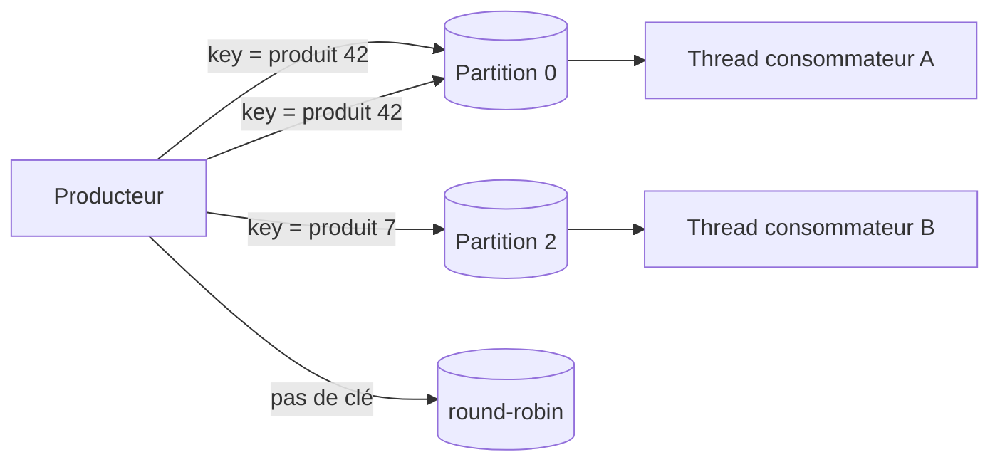
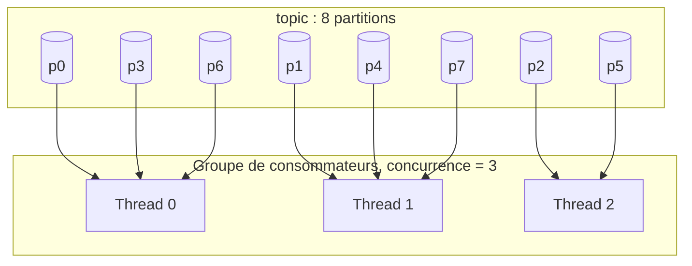
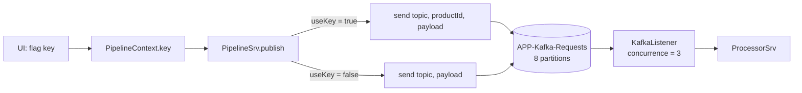

# Architecture et conception des topics

> Partie du **Guide Kafka Engineering** de `org-rd-fullstack-springboot-eda`. Voir le [LISEZ_MOI du projet](./LISEZ_MOI.md).

**Portée** : cette section présente le partitionnement Kafka, les clés de messages, la garantie d'ordre, le parallélisme des consommateurs, et l'impact de la typologie des topics (Thin pipe vs Fat pipe) dans la conception d'une architecture événementielle résiliente et maintenable. Le guide relie ces concepts aux choix faits dans ce sandbox, où le flag `key` du contexte de pipeline détermine si les enregistrements utilisent l'ID du produit comme clé.

## Table des matières

- [Vue d'ensemble](#vue-densemble)
- [Les partitions comme unité de parallélisme](#les-partitions-comme-unité-de-parallélisme)
- [Partitionnement par clé et partitions](#partitionnement-par-clé-et-partitions)
- [Garanties d'ordre et sémantique métier](#garanties-dordre-et-sémantique-métier)
- [Nombre de partitions et parallélisme des consommateurs](#nombre-de-partitions-et-parallélisme-des-consommateurs)
- [Typologie des topics](#typologie-des-topics)
- [Trouver le juste équilibre](#trouver-le-juste-équilibre)
- [Comment ce projet l'applique](#comment-ce-projet-lapplique)
- [Pièges et bonnes pratiques](#pièges-et-bonnes-pratiques)

## Vue d'ensemble

Kafka est une plateforme de streaming d'événements distribuée, scalable et tolérante aux pannes. Ces propriétés reposent sur une idée centrale : un topic se divise en partitions, chaque partition étant un journal ordonné et immuable d'enregistrements. Le partitionnement n'est pas un détail d'implémentation caché derrière un appel du producteur, mais une décision architecturale qui détermine la mise à l'échelle du système, le déploiement des consommateurs et le maintien de l'ordre métier critique.

Deux questions de conception dominent cet espace :

1. **Au sein d'un topic** — comment les enregistrements se distribuent-ils sur les partitions (keyés vs non-keyés) et comment cette distribution affecte-t-elle le parallélisme des consommateurs et l’ordonnancement ?
2. **Entre les topics** — un topic doit-il transporter plusieurs types d'événements (un Fat pipe) ou chaque type d'événement doit-il avoir son propre topic (Thin pipe) ?

Dans un environnement conteneurisé comme EKS, où les pods sont reprogrammés, redémarrés et mis à l'échelle de façon dynamique, une mauvaise gestion de ces mécanismes peut rapidement entraîner des incidents. Le parallélisme, en particulier, peut compromettre silencieusement une logique d'affaires pourtant parfaitement valide lorsqu'elle s'exécute sur une seule instance. Ce guide explore ces enjeux et montre comment ce sandbox vous permet de les expérimenter et de les observer en temps réel.

## Les partitions comme unité de parallélisme

Les partitions d'un topic sont l'unité fondamentale du parallélisme et de l'élasticité :

- Les enregistrements se répartissent sur les partitions, qui peuvent vivre sur des brokers différents.
- Les consommateurs d'un même groupe divisent les partitions entre eux, les traitant en parallèle.
- L'ordre est garanti uniquement au sein d'une seule partition, jamais entre les partitions.

La partition dans laquelle est acheminé un enregistrement est déterminée par sa clé de partition. Les enregistrements partageant une même clé sont toujours routés vers la même partition, ce qui garantit la préservation de leur ordre. En revanche, les enregistrements sans clé sont répartis par le producteur entre les partitions disponibles, généralement à l'aide d'une stratégie de type *round-robin* ou *sticky batching*.



## Partitionnement par clé et partitions

Le producteur détermine la partition de destination en appliquant les règles de priorité suivantes :

| Appel du producteur             | Sélection de la partition          | Résultat sur l'ordre                                       |
| ------------------------------- | ---------------------------------- | ---------------------------------------------------------- |
| Numéro de partition explicite   | Cette partition, telle quelle      | Ordre garanti uniquement dans cette partition              |
| Enregistrement avec une **clé** | `hash(clé) % nombrePartitions`     | Tous les enregistrements d'une même clé demeurent ordonnés |
| Enregistrement **sans clé**     | *Round-robin* ou *sticky batching* | Aucun ordre garanti par entité                             |

Le partitionnement par clé (hachage de la clé) est le mécanisme standard permettant d'acheminer tous les événements d'une même entité vers une seule partition, ce qui préserve leur ordre de traitement.

En contrepartie, la clé doit être suffisamment répartie. Une clé de faible cardinalité ou fortement déséquilibrée (par exemple une constante ou un champ `pays` dont une valeur est largement dominante) concentre le trafic sur un petit nombre de **partitions chaudes** (*hot partitions*). Ce déséquilibre limite le débit global, peu importe le nombre de partitions ou de consommateurs que vous ajoutez.

```java
// Publication avec clé : hash(key) % partitionCount décide la partition.
ops.send(topic, key, payload);    // même clé  -> même partition -> ordonnée

// Publication sans clé : le producteur disperse les enregistrements.
ops.send(topic, payload);         // pas de clé -> round-robin -> pas d'ordre
```

## Garanties d'ordre et sémantique métier

L'ordre est habituellement une exigence *métier*, pas seulement technique. Considérez un article d'inventaire dont le cycle de vie est une séquence d'événements :

- `ProductCreated`
- `ProductStockIncreased`
- `ProductStockDecreased`
- `ProductDiscontinued`

Ces événements doivent être traités dans l'ordre **par produit**. Si `ProductStockDecreased` est appliqué avant `ProductCreated`, ou après `ProductDiscontinued`, l'état matérialisé ne reflète plus la réalité. Kafka respecte cela *uniquement* quand chaque événement pour un produit donné porte la même clé (par exemple `product_id`) et aboutit donc sur la même partition.

Lorsque les événements d'une même entité sont répartis sur plusieurs partitions — en raison de clés incohérentes ou parce qu'ils sont publiés dans plusieurs topics — leur ordre n'est plus garanti. Les consommateurs doivent alors compenser en mettant en œuvre des mécanismes de mise en mémoire tampon (*buffering*), des numéros de séquence ou une logique de réconciliation.

Cette complexité est le prix d'un mauvais partitionnement :

- Les enregistrements d'une même entité peuvent être traités simultanément par différents threads de consommateurs ou par plusieurs pods.
- Des conditions de course (*race conditions*) et des corruptions d'état peuvent (et vont) alors survenir.
- La mise à l'échelle horizontale devient plus risquée, car l'augmentation du parallélisme accroît les risques de violer les invariants de votre logique d'affaires.

La règle empirique : **appliquez l'ordre où il importe (par entité métier), et évitez-le délibérément où il ne le fait pas** (les entités sans rapport n'ont besoin d'aucun ordre partagé).

## Nombre de partitions et parallélisme des consommateurs

Le nombre de partitions détermine la limite supérieure du parallélisme dans un groupe de consommateurs. Comme une partition ne peut être consommée que par un seul consommateur du groupe à la fois, le parallélisme effectif est défini par la relation suivante :

```text
parallélisme effectif = min(nombre de partitions, nombre de consommateurs/threads du groupe)
```

- Si le nombre de threads de consommateurs dépasse le nombre de partitions, les threads excédentaires restent **inactifs**.
- Si le nombre de partitions dépasse le nombre de consommateurs, certains consommateurs se voient attribuer plusieurs partitions. Cette situation est normale, mais chaque consommateur traite toujours les événements de ses partitions de manière séquentielle.



Provisionnez les partitions pour le *pic* de parallélisme que vous attendez, avec une marge : augmenter les partitions ultérieurement change le mapping clé→partition (`hash % N`), ce qui remélange où les clés existantes aboutissent et peut déranger l'ordre en vol. Choisir le bon nombre au départ est moins cher que repartitionner un topic actif.

## Typologie des topics

Au-delà de l'organisation d'un seul topic se pose une question plus fondamentale : **un même topic doit-il transporter plusieurs types d'événements ?** Comme souvent en architecture, la réponse est : *ça dépend*. Pour bien comprendre les compromis, il est utile d'examiner les deux approches extrêmes.

### Le topic unique (*Fat pipe*)

*Un seul topic pour tous les événements.*

En apparence, cette approche est simple : tous les événements, quel que soit leur domaine ou leur type, sont publiés dans un unique topic. En pratique, elle résiste rarement aux réalités d'un environnement de production.

- **Responsabilité des services.** Chaque consommateur devrait avoir une responsabilité bien définie. Un topic unique oblige tous les services à recevoir tous les événements, ce qui favorise l'élargissement progressif de leur périmètre fonctionnel et brouille les frontières entre les domaines.
- **Gaspillage des ressources.** Les consommateurs sont sollicités pour traiter des événements qu'ils ignorent finalement. Même rejetés, ces événements consomment de la bande passante, des E/S sur les brokers et de l'espace de stockage.
- **Gouvernance des schémas.** Mélanger des schémas sans lien dans un même topic affaiblit son contrat et complique l'évolution ainsi que la gouvernance des données.
- **Compréhension du système.** Lorsque tous les événements transitent par un seul topic, il devient difficile d'identifier quels événements existent, qui les produit et quels consommateurs en dépendent. La suppression d'un producteur devient alors plus risquée.
- **Choix de la clé de partition.** C'est souvent la principale faiblesse de cette approche. Des événements hétérogènes n'ont généralement pas de clé de partition commune. Les équipes finissent alors par utiliser une clé trop générique (créant des **partitions chaudes**), à ne pas définir de clé (perte de l'ordre), ou à réutiliser une clé pertinente uniquement pour certains événements (couplage artificiel). Dans tous les cas, le parallélisme et les garanties d'ordre s'en trouvent dégradés.

### Les topics spécialisés (*Thin pipe*)

*Diviser pour mieux régner.*

Chaque type d'événement possède son propre topic. Les consommateurs s'abonnent uniquement aux événements qui les concernent. Cette approche améliore la séparation des responsabilités, mais elle introduit également certains compromis.

- **Ordre entre les topics.** Kafka ne garantit l'ordre qu'à l'intérieur d'une partition. Dès qu'une séquence d'événements est répartie entre plusieurs topics, il faut recourir à des mécanismes complémentaires (mise en mémoire tampon, corrélation ou numéros de séquence) pour reconstruire un ordre global. Si le cas d'usage ne dépend pas de cet ordre, cette contrainte disparaît.
- **Évolutivité et exploitation.** Kafka ne fixe pas de limite stricte au nombre de topics, mais les topics, les partitions et les brokers sont étroitement liés. En pratique, il est recommandé de rester largement sous la barre d'environ **4 000 partitions par broker**, car un nombre trop élevé augmente les métadonnées à gérer, rallonge les temps de récupération et complexifie les opérations.

| Dimension                           | **Fat pipe** (un seul topic)                | **Thin pipe** (un topic par type d'événement)                       |
| ----------------------------------- | --------------------------------------------- | --------------------------------------------------------------------- |
| Responsabilité des services         | Faible — tous les événements sont reçus       | Forte — chaque service ne reçoit que les événements utiles            |
| Utilisation des ressources          | Beaucoup d'événements inutiles sont consommés | Les événements sont distribués uniquement aux consommateurs concernés |
| Contrat et schémas                  | Contrat hétérogène, difficile à gouverner     | Un contrat clair par topic                                          |
| Choix de la clé de partition        | Souvent difficile                             | Clé naturelle propre à chaque entité                                  |
| Ordre des événements                | Plus difficile à préserver                    | Garanti à l'intérieur de chaque topic                               |
| Nombre de topics et de partitions | Faible                                        | Plus élevé, avec un impact sur l'exploitation                         |

## Trouver le juste équilibre

La plupart des architectures réelles adoptent une approche hybride. Les qualités recherchées — responsabilité claire des services, compréhensibilité, testabilité, maintenabilité et efficacité — conduisent généralement à utiliser **plusieurs topics**, sans pour autant créer **un topic par type d'événement**.

Deux critères influencent particulièrement cette décision :

- **Préservation de l'ordre.** Regroupez les événements par **agrégat** ou **entité métier** afin de préserver l'ordre là où il est essentiel (par exemple, une commande doit être créée avant d'être annulée) et d'éviter de coupler des événements indépendants (l'annulation d'une commande est sans lien avec un changement d'adresse courriel). Dans la majorité des cas, c'est le meilleur critère pour déterminer quels événements doivent partager un même topic.
- **Protection des données.** Les données sensibles ou soumises à des exigences réglementaires peuvent justifier une isolation supplémentaire. Cette isolation doit d'abord être pensée lors de la conception des services et des événements : publiez uniquement les informations dont les consommateurs ont réellement besoin (par exemple, un **changement d'état** d'un paiement plutôt que les détails complets du paiement), appliquez des ACL au niveau des topics et évitez de transformer les topics en canaux génériques de partage de données.

Considérez les topics comme des **contrats intentionnels** plutôt que comme de simples mécanismes de transport. Concevez-les pour répondre aux besoins actuels, tout en laissant la place à l'évolution future du système.

## Comment ce projet l'applique

Ce sandbox est conçu pour vous laisser *voir* ces effets plutôt que juste les lire. Le pipeline publie les enregistrements d'inventaire `Request` sur un seul topic de traitement et les consomme, avec un toggle d'interface utilisateur contrôlant si les enregistrements utilisent une clé.

- **Avec clé vs Sans clé est un toggle d'exécution.** [`PipelineContext`](../../src/main/java/org/rd/fullstack/springbooteda/dto/PipelineContext.java) porte un flag booléen `key` (par défaut `false`). [`PipelineSrv.publish()`](../../src/main/java/org/rd/fullstack/springbooteda/srv/PipelineSrv.java) le lit et choisit le chemin de publication en conséquence :

  ```java
  final boolean useKey = Boolean.TRUE.equals(getPipelineContext().getKey());
  // ...
  if (useKey)
      ops.send(KafkaConstants.CST_TOPIC_KAFKA_REQ, message.getKey(), message.getValue());
  else
      ops.send(KafkaConstants.CST_TOPIC_KAFKA_REQ, message.getValue());
  ```

  La clé est l'**ID du produit** (`String.valueOf(request.getProductId())`). Avec le flag activé, toutes les demandes d'un même produit sont hachées vers la même partition, ce qui préserve leur ordre (partitionnement par clé). Sans clé, le producteur disperse les enregistrements entre les partitions (round-robin/sticky) → pas d'ordre par produit. Tous les envois se produisent dans une seule transaction Kafka (`executeInTransaction`), et l'écouteur lit `read_committed`.

- **Un topic de traitement unique et focalisé.** Le pipeline utilise un topic, `APP-Kafka-Requests` (`CST_TOPIC_KAFKA_REQ` dans [`KafkaConstants`](../../src/main/java/org/rd/fullstack/springbooteda/util/kafka/KafkaConstants.java)), avec un topic associé dead-letter `-dlt`. Un topic séparé existe pour la partie Flink (`APP-Flink-requests`, `CST_TOPIC_FLINK_REQ`, avec aussi un compagnon `-dlt`). C'est un layout penchant vers une solution de type Thin pipe : chaque topic a un objectif clair et un contrat plutôt que de multiplexer des types d'événements non-liés.

- **Le nombre de partitions vs la concurrence est explicite et plafonné.** Dans [`KafkaConfig`](../../src/main/java/org/rd/fullstack/springbooteda/config/KafkaConfig.java), le topic du processeur est créé avec **8 partitions**, et la fabrique d'écouteurs définit la `concurrency` du conteneur à partir de la config du sandbox :

  ```java
  factory.setConcurrency(kafkaSandbox().getCfg().concurrency());
  ```

  [`KafkaSandbox`](../../src/main/java/org/rd/fullstack/springbooteda/util/kafka/KafkaSandbox.java) avertit quand la concurrence demandée dépasse le nombre de partitions, car les threads excédentaires ne recevraient jamais une partition — le plafond `min(partitions, concurrence)` en action. La concurrence par défaut est 3 (`CST_NBR_CONCURRENCY`), confortablement en dessous des 8 partitions.

- **La vue d'ensemble consommateur montre les effets de l'ordre.** [`KafkaPipelineListener.listen(...)`](../../src/main/java/org/rd/fullstack/springbooteda/srv/KafkaPipelineListener.java) enregistre le topic, la partition et le décalage pour chaque enregistrement, afin que vous puissiez observer comment la publication avec clé vs sans clé change quelle partition les enregistrements d'un produit donné aboutissent, et comment cela interagit avec la concurrence configurée. Le traitement est délégué à [`PipelineSrv.handle(...)`](../../src/main/java/org/rd/fullstack/springbooteda/srv/PipelineSrv.java) dans sa propre transaction.



Pour connaître les effets du partitionnement lors de la mise à l'échelle de l'élasticité horizontale et l'arrêt des pods sur EKS, voir la note associée [distribution_scale_et_arret.md](./distribution_scale_et_arret.md).

## Pièges et bonnes pratiques

**À faire**

- Établissez la clé en fonction de l'**entité métier** dont les événements doivent rester ordonnés (ici, ID du produit) quand l'ordre importe.
- Dimensionnez les partitions pour le pic de parallélisme avec une marge; décidez le nombre avant que le topic ne porte le trafic de production.
- Gardez `concurrence <= nombrePartitions`; écoutez l'avertissement du sandbox quand il est dépassé.
- Groupez les événements par agrégat / entité métier — un topic par famille d'événements étroitement liée, pas par type d'événement isolé.
- Traitez chaque topic comme un contrat : propriété claire, une intention de schéma, ACL pour les données sensibles.

**À ne pas faire**

- Ne supposez pas qu'une clé garantit un ordre global : elle garantit uniquement l'ordre des événements au sein d'une même partition.
- Ne choisissez pas une clé de faible cardinalité ou fortement déséquilibrée : elle créera des **partitions chaudes** et limitera le débit global.
- N'espérez pas augmenter le débit en ajoutant davantage de threads consommateurs que de partitions : les threads excédentaires resteront inactifs.
- N'augmentez pas le nombre de partitions d'un topic utilisant déjà des clés sans en mesurer les conséquences : le calcul `hash % N` change, redistribue les clés entre les partitions et peut perturber l'ordre des événements pendant la transition.
- Évitez les **topics monolithiques** (*Fat pipes*) regroupant des événements sans lien entre eux : le choix d'une clé de partition devient rapidement insoluble et les consommateurs finissent par accumuler de la logique de filtrage et de rejet.
- N'utilisez pas un topic comme un canal générique de partage de données, en particulier pour des données sensibles. Publiez uniquement les informations dont les consommateurs ont réellement besoin.
