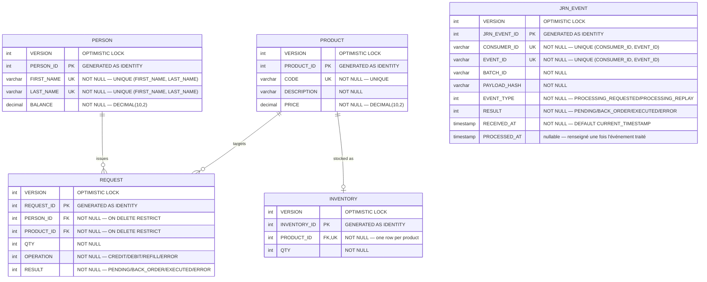
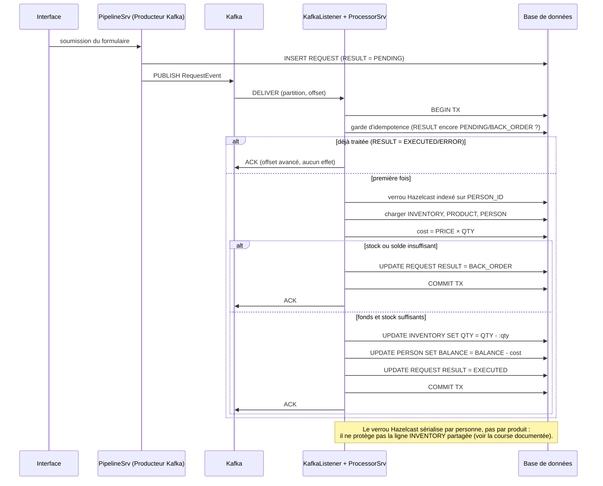

# Base de données — Schéma et opérations

> Partie du **Guide Kafka Engineering** de `org-rd-fullstack-springboot-eda`. Voir le [LISEZ_MOI du projet](./LISEZ_MOI.md).

**Portée :** le schéma relationnel qui sous-tend le sandbox — ses cinq tables (`PERSON`, `PRODUCT`, `INVENTORY`, `REQUEST`, `JRN_EVENT`), leurs colonnes, clés et relations présentées sous forme de diagramme entité-association — les énumérations `OPERATION`, `RESULT` et `EVENT_TYPE` qui pilotent le cycle de vie d'une requête et le journal d'événements Kafka, et la manière dont cet ensemble est utilisé par le pipeline événementiel requête/inventaire.

## Table des matières

- [Vue d'ensemble](#vue-densemble)
- [Diagramme entité-association](#diagramme-entité-association)
- [Tables](#tables)
- [Énumérations (`OPERATION`, `RESULT` et `EVENT_TYPE`)](#énumérations-operation-result-et-event_type)
- [Cycle de vie d'une requête](#cycle-de-vie-dune-requête)
- [Contraintes et dépendances clés](#contraintes-et-dépendances-clés)
- [Comment le consommateur Kafka le modifie](#comment-le-consommateur-kafka-le-modifie)
- [Vues opérationnelles](#vues-opérationnelles)
- [Voir aussi](#voir-aussi)

## Vue d'ensemble

Ce document décrit le schéma relationnel qui sous-tend le sandbox EDA et explique comment chaque table est utilisée dans le projet. Le schéma reste volontairement minimal : il donne au pipeline événementiel (Kafka → Flink/Hazelcast → Spring Boot) un petit état persistant réaliste à lire et à écrire, afin que les patterns de résilience — idempotence, transactions, retentatives, back-pressure — puissent être observés de bout en bout.

Les définitions (DDL) vivent dans [`schema.sql`](../../src/main/resources/schema.sql) (avec une copie identique sous [`src/test/resources`](../../src/test/resources/schema.sql) pour le profil de test). Le moteur est **HSQLDB**, embarqué directement dans l'application à des fins de démonstration ; dans une architecture de production, ce serait un service externe géré indépendamment. Le schéma lui-même est du SQL standard et fonctionnerait sur PostgreSQL, MySQL, etc.

Le modèle de concurrence est forcé à `MVLOCKS` à chaque démarrage (`SET DATABASE TRANSACTION CONTROL MVLOCKS` dans `schema.sql`, en écho aux propriétés d'URL `hsqldb.tx=mvlocks;hsqldb.lock_timeout=0`). Ce réglage est spécifique à HSQLDB. À noter cependant que la course d'inventaire démontrée par le sandbox n'est **pas** un conflit de verrous écriture-écriture : le décrément est un `UPDATE` relatif atomique qui n'entre jamais en collision, si bien qu'il valide silencieusement une mise à jour perdue plutôt que d'échouer sous MVLOCKS — voir [`INVENTORY`](#inventory) et [Contraintes et dépendances clés](#contraintes-et-dépendances-clés).

Chaque table est mappée à une entité JPA sous [`org.rd.fullstack.springbooteda.dto`](../../src/main/java/org/rd/fullstack/springbooteda/dto) et accédée via un repository Spring Data sous [`org.rd.fullstack.springbooteda.dao`](../../src/main/java/org/rd/fullstack/springbooteda/dao).

## Diagramme entité-association



## Notes de cardinalité

* `PERSON ||--o{ REQUEST` — une requête appartient toujours à exactement une personne
  (`PERSON_ID NOT NULL`) ; une personne peut avoir zéro, une ou plusieurs requêtes.
* `PRODUCT ||--o{ REQUEST` — de même côté produit.
* `PRODUCT ||--o| INVENTORY` — une relation **un-à-un** : `INVENTORY.PRODUCT_ID` est à la fois
  `NOT NULL` et `UNIQUE`, donc il y a au plus une ligne de stock par produit. Il n'y a
  **pas** de `PERSON_ID` dans `INVENTORY`.
* Le `UNIQUE (FIRST_NAME, LAST_NAME)` sur `PERSON` et le `UNIQUE (CONSUMER_ID, EVENT_ID)` sur
  `JRN_EVENT` sont des clés uniques **composites** ; Mermaid n'ayant pas de notation dédiée,
  les deux colonnes de chaque paire sont marquées `UK` (à lire « uniques ensemble »).
* `JRN_EVENT` n'a **aucune** clé étrangère vers `PERSON`, `PRODUCT` ou `REQUEST` — elle ne
  fait pas partie de ce graphe relationnel. Elle journalise les événements Kafka au niveau du
  groupe de consommateurs sur sa propre clé de substitution `JRN_EVENT_ID`, avec
  `(CONSUMER_ID, EVENT_ID)` contraint `UNIQUE` et utilisé pour les recherches ; voir
  [`JRN_EVENT`](#jrn_event) plus bas.

## Tables

### `PERSON`

Le client (titulaire du compte) qui émet des requêtes sur le catalogue.

| Colonne      | Type           | Contraintes                                   | Description                                             |
|--------------|----------------|-----------------------------------------------|---------------------------------------------------------|
| `PERSON_ID`  | `INTEGER`      | PK, identité                                  | Clé primaire de substitution.                           |
| `FIRST_NAME` | `VARCHAR(64)`  | `NOT NULL`, unique avec `LAST_NAME`           | Prénom.                                                 |
| `LAST_NAME`  | `VARCHAR(64)`  | `NOT NULL`, unique avec `FIRST_NAME`          | Nom de famille.                                         |
| `BALANCE`    | `DECIMAL(10,2)`| `NOT NULL`                                    | Solde monétaire du compte, débité/crédité par requête.  |

**Usage dans le projet.** `BALANCE` représente les fonds du client. Lors du traitement
d'une requête `CREDIT` (vente), le coût (`PRODUCT.PRICE × REQUEST.QTY`) est **soustrait** du
solde ; une requête `DEBIT` (réappro./retour) le **recrédite**. Une vente qui mettrait le
solde à découvert est mise en attente comme `BACK_ORDER` plutôt qu'exécutée. La clé unique
composite `(FIRST_NAME, LAST_NAME)` empêche les clients en double. La ligne client est
l'unité de sérialisation du pipeline : un verrou Hazelcast par client (indexé sur
`PERSON_ID`) garantit que toutes les requêtes d'une même personne sont appliquées
atomiquement, une à la fois, de sorte qu'un client ne peut pas mettre son solde à découvert.
Ce verrou sérialise **par personne, pas par produit** — il ne protège *pas* la ligne
`INVENTORY` partagée (voir [Contraintes et dépendances clés](#contraintes-et-dépendances-clés)).

Entité : [`Person.java`](../../src/main/java/org/rd/fullstack/springbooteda/dto/Person.java) ·
Repository : [`PersonRepository.java`](../../src/main/java/org/rd/fullstack/springbooteda/dao/PersonRepository.java)

### `PRODUCT`

Le catalogue des articles pouvant être demandés.

| Colonne       | Type            | Contraintes          | Description                                     |
|---------------|-----------------|----------------------|-------------------------------------------------|
| `PRODUCT_ID`  | `INTEGER`       | PK, identité         | Clé primaire de substitution.                   |
| `CODE`        | `VARCHAR(64)`   | `NOT NULL`, `UNIQUE` | Code produit métier (SKU).                      |
| `DESCRIPTION` | `VARCHAR(128)`  | `NOT NULL`           | Libellé lisible.                                |
| `PRICE`       | `DECIMAL(10,2)` | `NOT NULL`           | Prix unitaire servant à calculer le coût.       |

**Usage dans le projet.** `PRICE` détermine le coût monétaire d'une requête
(`cost = PRICE × QTY`), qui à son tour fait bouger le `BALANCE` du client. `CODE` est
l'identifiant métier stable, contraint `UNIQUE`. Chaque produit est censé avoir une ligne
`INVENTORY` correspondante (voir ci-dessous) pour être vendable.

Entité : [`Product.java`](../../src/main/java/org/rd/fullstack/springbooteda/dto/Product.java) ·
Repository : [`ProductRepository.java`](../../src/main/java/org/rd/fullstack/springbooteda/dao/ProductRepository.java)

### `INVENTORY`

Le niveau de stock disponible d'un produit. Relation un-à-un avec `PRODUCT`.

| Colonne        | Type      | Contraintes                          | Description                              |
|----------------|-----------|--------------------------------------|------------------------------------------|
| `INVENTORY_ID` | `INTEGER` | PK, identité                         | Clé primaire de substitution.            |
| `PRODUCT_ID`   | `INTEGER` | `NOT NULL`, `UNIQUE`, FK → `PRODUCT` | Le produit suivi par cette ligne.        |
| `QTY`          | `INTEGER` | `NOT NULL`                           | Quantité actuellement disponible.        |

**Usage dans le projet.** `QTY` est décrémenté sur un `CREDIT` (vente) et incrémenté sur un
`DEBIT` (réappro.). La contrainte `UNIQUE` sur `PRODUCT_ID` en fait une relation un-à-un
stricte et permet au processeur de récupérer le stock par produit. Il n'existe **pas** de
colonnes `STOCK_AVAILABLE` / `STOCK_RESERVED` — le stock est un unique entier `QTY`. Cette
ligne est le **point chaud** que le sandbox utilise pour démontrer une course silencieuse de
type check-then-act (mise à jour perdue) ; le mécanisme est décrit en détail dans
[Contraintes et dépendances clés](#contraintes-et-dépendances-clés).

Entité : [`Inventory.java`](../../src/main/java/org/rd/fullstack/springbooteda/dto/Inventory.java) ·
Repository : [`InventoryRepository.java`](../../src/main/java/org/rd/fullstack/springbooteda/dao/InventoryRepository.java)

### `REQUEST`

La table transactionnelle centrale — chaque ligne est une **charge utile d'événement** :
une commande unique à appliquer sur le solde d'une personne et le stock d'un produit.

| Colonne      | Type      | Contraintes                                       | Description                                          |
|--------------|-----------|---------------------------------------------------|------------------------------------------------------|
| `REQUEST_ID` | `INTEGER` | PK, identité                                      | Clé primaire de substitution.                        |
| `PERSON_ID`  | `INTEGER` | `NOT NULL`, FK → `PERSON` (`ON DELETE RESTRICT`)  | Client émettant la requête.                          |
| `PRODUCT_ID` | `INTEGER` | `NOT NULL`, FK → `PRODUCT` (`ON DELETE RESTRICT`) | Produit ciblé.                                       |
| `QTY`        | `INTEGER` | `NOT NULL`                                        | Quantité demandée.                                   |
| `OPERATION`  | `INTEGER` | `NOT NULL`                                        | Le type de commande (énumération, voir plus bas).    |
| `RESULT`     | `INTEGER` | `NOT NULL`                                        | L'issue du traitement / l'état du cycle de vie.      |

**Usage dans le projet.** Une requête est produite vers Kafka, puis consommée et traitée par
l'unité de traitement dans une transaction JPA dédiée qui est annulée en cas d'échec. Le
traitement est **idempotent** : une requête dont le `RESULT` n'est plus `PENDING`/`BACK_ORDER`
a déjà été traitée et est ignorée en cas de redélivrance — ce qui rend la sémantique
*at-least-once* de Kafka sûre face aux retentatives et rééquilibrages. Les clés étrangères
`ON DELETE RESTRICT` protègent l'intégrité référentielle en empêchant la suppression d'une
personne ou d'un produit ayant encore des requêtes. Il n'y a **pas** de colonnes `REASON` ni
`KAFKA_*` : l'issue est intégralement portée par `RESULT` (dont sa valeur `ERROR`), et un
message qui échoue durablement est corrélé via le Dead-Letter Topic, pas via des colonnes de
la table.

Entité : [`Request.java`](../../src/main/java/org/rd/fullstack/springbooteda/dto/Request.java) ·
Repository : [`RequestRepository.java`](../../src/main/java/org/rd/fullstack/springbooteda/dao/RequestRepository.java) ·
Processeur : [`ProcessorSrv.java`](../../src/main/java/org/rd/fullstack/springbooteda/srv/ProcessorSrv.java)

### `JRN_EVENT`

Un journal d'événements côté consommateur, indépendant du graphe `PERSON`/`PRODUCT`/`REQUEST`
ci-dessus.

| Colonne        | Type          | Contraintes                              | Description                                                          |
|----------------|---------------|-------------------------------------------|------------------------------------------------------------------------|
| `JRN_EVENT_ID` | `INTEGER`     | PK, identité                              | Clé primaire de substitution.                                          |
| `CONSUMER_ID`  | `VARCHAR(64)` | `NOT NULL`, unique avec `EVENT_ID`       | Nom du groupe de consommateurs qui a reçu l'événement.                 |
| `EVENT_ID`     | `VARCHAR(64)` | `NOT NULL`, unique avec `CONSUMER_ID`    | Identifie l'événement ; unique par `CONSUMER_ID`.                      |
| `BATCH_ID`     | `VARCHAR(64)` | `NOT NULL`                               | Corrèle les événements produits ensemble lors de la même publication.  |
| `PAYLOAD_HASH` | `VARCHAR(64)` | `NOT NULL`                               | Hachage de la charge utile, pour détecter un contenu modifié en cas de replay. |
| `EVENT_TYPE`   | `INTEGER`     | `NOT NULL`                               | Première livraison ou replay (énumération, voir plus bas).             |
| `RESULT`       | `INTEGER`     | `NOT NULL`                               | L'issue du traitement propre à cet événement (énumération partagée avec `REQUEST.RESULT`). |
| `RECEIVED_AT`  | `TIMESTAMP`   | `NOT NULL`, `DEFAULT CURRENT_TIMESTAMP`  | Date de réception de l'événement par le consommateur.                  |
| `PROCESSED_AT` | `TIMESTAMP`   | nullable                                 | Date de fin de traitement ; `NULL` tant que l'événement est en attente.|

**Usage dans le projet.** `JRN_EVENT` est un journal d'idempotence plus fin, au niveau du
message, qui s'ajoute — sans la remplacer — à l'idempotence métier déjà assurée par
`REQUEST.RESULT` (voir [Contraintes et dépendances clés](#contraintes-et-dépendances-clés)).
La table porte sa propre clé primaire de substitution `JRN_EVENT_ID`, mais les recherches
passent par `(CONSUMER_ID, EVENT_ID)` plutôt que par `JRN_EVENT_ID` ou `REQUEST_ID` :
[`JrnEventRepository.findByConsumerIdAndEventId(...)`](../../src/main/java/org/rd/fullstack/springbooteda/dao/JrnEventRepository.java)
est ce que `ProcessorSrv` appelle réellement, adossé à la contrainte
`UNIQUE (CONSUMER_ID, EVENT_ID)`. `CONSUMER_ID` est le nom du groupe de consommateurs qui a vu
l'enregistrement (aujourd'hui l'unique groupe
[`CST_LISTENER_PROCESSOR`](../../src/main/java/org/rd/fullstack/springbooteda/util/kafka/KafkaConstants.java) ;
des groupes de consommateurs en couches `bronze`/`silver`/`gold` sont réservés à un futur
pipeline de type médaillon — voir les constantes mises en commentaire dans le même fichier).
`EVENT_ID` et `BATCH_ID` correspondent aux en-têtes Kafka `event-id`/`batch-id`, et
`PAYLOAD_HASH` permet de distinguer un `EVENT_ID` rejoué dont la charge utile a réellement
changé d'une simple redélivrance — une contrainte plus large
`UNIQUE (CONSUMER_ID, EVENT_ID, BATCH_ID, PAYLOAD_HASH)` est également déclarée sur cette même
combinaison. `EVENT_TYPE` distingue une première livraison (`PROCESSING_REQUESTED`) d'un
replay délibéré (`PROCESSING_REPLAY`) ; `RECEIVED_AT` est horodaté à l'arrivée et n'est jamais
modifié lors d'un replay (il reflète toujours la livraison d'origine), et `PROCESSED_AT` reste
`NULL` jusqu'à ce que l'événement soit entièrement traité. La table est pleinement branchée
sur le chemin de traitement :
[`ProcessorSrv.sanityCheck(...)`](../../src/main/java/org/rd/fullstack/springbooteda/srv/ProcessorSrv.java)
crée ou récupère la ligne pour tout message porteur d'un en-tête, et `finalizeOutcome(...)`
reporte l'issue finale de la requête (`EXECUTED`/`ERROR`/`BACK_ORDER`) sur `RESULT`, en
n'horodatant `PROCESSED_AT` que lorsque la requête a réellement été exécutée.

Entité : [`JrnEvent.java`](../../src/main/java/org/rd/fullstack/springbooteda/dto/JrnEvent.java)
(clé de substitution `JRN_EVENT_ID`, `GenerationType.IDENTITY`) ·
Repository : [`JrnEventRepository.java`](../../src/main/java/org/rd/fullstack/springbooteda/dao/JrnEventRepository.java)

## Énumérations (`OPERATION`, `RESULT` et `EVENT_TYPE`)

`OPERATION`, `RESULT` et `EVENT_TYPE` sont stockés comme des entiers et mappés à des
énumérations Java via un convertisseur JPA.

`OPERATION` → l'énumération [`Operation`](../../src/main/java/org/rd/fullstack/springbooteda/util/Operation.java) :

| Valeur | Nom      | Signification                                                                 |
|--------|----------|-------------------------------------------------------------------------------|
| `10`   | `CREDIT` | Vente — l'inventaire **diminue**, le client **paie** (`BALANCE` ↓).           |
| `20`   | `DEBIT`  | Réappro./retour — l'inventaire **augmente**, le client est crédité (`BALANCE` ↑). |
| `30`   | `REFILL` | Réservé (déclaré mais pas encore implémenté dans le processeur).              |
| `99`   | `ERROR`  | Valeur invalide / sentinelle.                                                 |

`RESULT` → l'énumération [`Result`](../../src/main/java/org/rd/fullstack/springbooteda/util/Result.java) :

| Valeur | Nom          | Signification                                                                      |
|--------|--------------|------------------------------------------------------------------------------------|
| `10`   | `PENDING`    | Nouvellement créée, pas encore traitée.                                            |
| `20`   | `BACK_ORDER` | Non satisfiable maintenant — **stock** insuffisant ou **solde** insuffisant.       |
| `30`   | `EXECUTED`   | Appliquée avec succès à l'inventaire et au solde.                                  |
| `99`   | `ERROR`      | Problème irrécupérable (inventaire/produit/personne manquant, ou op. non gérée).   |

`EVENT_TYPE` → l'énumération [`EventType`](../../src/main/java/org/rd/fullstack/springbooteda/util/EventType.java) :

| Valeur | Nom                    | Signification                                        |
|--------|------------------------|--------------------------------------------------------|
| `10`   | `PROCESSING_REQUESTED` | Première livraison de l'événement à ce consommateur.   |
| `20`   | `PROCESSING_REPLAY`    | Replay délibéré d'un événement déjà vu.                |

## Cycle de vie d'une requête

Un `CREDIT` (vente) typique traverse le pipeline comme suit.



Sur toute erreur inattendue, la transaction est annulée ; Kafka redélivre le message, et un
message qui échoue durablement finit sur le Dead-Letter Topic (DLT).

## Contraintes et dépendances clés

* **`UNIQUE (PRODUCT_ID)` sur `INVENTORY`** — une seule ligne de stock par produit (un-à-un).
  Toutes les requêtes visant le même produit mettent à jour la même ligne.
* **`UNIQUE (FIRST_NAME, LAST_NAME)` sur `PERSON`** — clé composite qui empêche les clients en
  double.
* **`UNIQUE (CODE)` sur `PRODUCT`** — le code métier (SKU) est unique.
* **`UNIQUE (CONSUMER_ID, EVENT_ID)` sur `JRN_EVENT`** — une seule ligne de journal par
  événement et par groupe de consommateurs ; c'est la paire que `ProcessorSrv.sanityCheck(...)`
  recherche via `findByConsumerIdAndEventId(...)`. Une seconde contrainte, plus large,
  `UNIQUE (CONSUMER_ID, EVENT_ID, BATCH_ID, PAYLOAD_HASH)` est également déclarée sur la
  table.
* **Clés étrangères `ON DELETE RESTRICT`** sur `REQUEST.PERSON_ID` et `REQUEST.PRODUCT_ID` —
  impossible de supprimer une personne ou un produit ayant encore des requêtes ; l'intégrité
  référentielle est protégée (pas de cascade dans ce sandbox).
* **Idempotence** — une requête dont le `RESULT` n'est plus `PENDING`/`BACK_ORDER` a déjà été
  traitée et est ignorée en cas de redélivrance, ce qui rend la sémantique *at-least-once* de
  Kafka sûre face aux retentatives et rééquilibrages.
* **La course d'inventaire documentée (mise à jour perdue silencieuse)** — c'est le
  comportement pédagogique central du sandbox, et il est à l'opposé d'un verrouillage
  optimiste. `Inventory` ne porte **aucun** `@Version` ; le processeur tourne en
  `READ_COMMITTED` et `findByProductId` ne prend aucun verrou pessimiste. Le test de stock
  (`inventory.getQty() < request.getQty()`) est donc une lecture périmée et non verrouillée,
  tandis que le décrément est un `UPDATE` relatif atomique (`SET QTY = QTY - :qty`). Sans clé
  de partition Kafka, plusieurs threads traitent le même produit en parallèle ; le verrou
  Hazelcast, indexé sur `PERSON_ID` (et non sur le produit), ne sérialise pas les accès à la
  ligne `INVENTORY` partagée. Comme l'écriture ne relit pas avant d'écrire au niveau SQL,
  elle n'entre jamais en collision et MVLOCKS ne lève rien : deux transactions passent le
  test périmé, appliquent chacune leur décrément, et `QTY` devient silencieusement
  **négatif** (oversell). Aucun fail-fast, aucune retentative, aucun routage vers le DLT — le
  mauvais état est simplement validé. Une latence artificielle optionnelle élargit cette
  fenêtre lecture-écriture pour que l'anomalie se reproduise de façon fiable. Router les
  requêtes par `PRODUCT_ID` dans Kafka referme la course. C'est la course documentée de bout
  en bout dans
  [Patrons de Persistance et Transaction](./patrons_persistance_et_transaction.md#la-course-dinventaire-documentée)
  et illustrée dans les [exemples de rapports](./rapports.md) (exécution avec clé vs. sans clé).

## Comment le consommateur Kafka le modifie

[`ProcessorSrv.process(...)`](../../src/main/java/org/rd/fullstack/springbooteda/srv/ProcessorSrv.java)
est le cœur du traitement. Il :

1. reçoit l'événement issu de l'enregistrement Kafka et charge l'entité `Request` (et, par
   référence, `PERSON`, `PRODUCT`, `INVENTORY`) ;
2. vérifie l'idempotence : si `RESULT` n'est plus `PENDING`/`BACK_ORDER`, la requête est déjà
   traitée et rien n'est fait ;
3. acquiert un **verrou distribué Hazelcast indexé sur `PERSON_ID`**, qui sérialise les
   requêtes d'une même personne sur tous les pods (ce verrou ne protège **pas** la ligne
   `INVENTORY` — voir la course ci-dessus) ;
4. calcule le coût (`cost = PRICE × QTY`) puis, selon `OPERATION` :
   * `CREDIT` — si le stock **et** le solde sont suffisants : `QTY` est décrémenté, `BALANCE`
     est réduit de `cost`, et `RESULT = EXECUTED` ; sinon `RESULT = BACK_ORDER` ;
   * `DEBIT` — `QTY` est incrémenté, `BALANCE` est crédité, et `RESULT = EXECUTED` ;
5. commite la transaction ; le consommateur Kafka accuse réception (ACK) de l'offset.

Tout cela se déroule dans une **unique transaction DB** (`@Transactional`), garantissant que
les mises à jour de plusieurs tables (`REQUEST`, `INVENTORY`, `PERSON`) sont validées ou
annulées ensemble.

## Vues opérationnelles

Pour l'observabilité, quelques vues SQL utiles (les codes de `RESULT` sont ceux de
l'énumération : `20` = `BACK_ORDER`, `30` = `EXECUTED`, `99` = `ERROR`).

```sql
-- Vue : dernières requêtes et leur statut
SELECT
    r.REQUEST_ID, r.PERSON_ID, r.PRODUCT_ID,
    r.QTY, r.OPERATION, r.RESULT
FROM REQUEST r
ORDER BY r.REQUEST_ID DESC
LIMIT 100;

-- Vue : niveaux d'inventaire actuels
SELECT
    i.PRODUCT_ID,
    p.CODE,
    p.DESCRIPTION AS product_description,
    i.QTY
FROM INVENTORY i
JOIN PRODUCT p ON p.PRODUCT_ID = i.PRODUCT_ID
ORDER BY p.CODE;

-- Vue : taux de succès par produit
SELECT
    r.PRODUCT_ID,
    COUNT(*) AS total_requests,
    SUM(CASE WHEN r.RESULT = 30 THEN 1 ELSE 0 END) AS executed,
    SUM(CASE WHEN r.RESULT = 20 THEN 1 ELSE 0 END) AS back_ordered,
    SUM(CASE WHEN r.RESULT = 99 THEN 1 ELSE 0 END) AS errors,
    ROUND(100.0 * SUM(CASE WHEN r.RESULT = 30 THEN 1 ELSE 0 END) / COUNT(*), 2) AS success_rate
FROM REQUEST r
GROUP BY r.PRODUCT_ID;
```

L'interface web du sandbox affiche la plupart de ces vues en temps réel.

## Voir aussi

* Version anglaise : [Relational Database Schema](../database.md)
* [Patrons de Persistance et Transaction](./patrons_persistance_et_transaction.md#la-course-dinventaire-documentée)
* [Exemples de rapports](./rapports.md) (exécution avec clé vs. sans clé)
