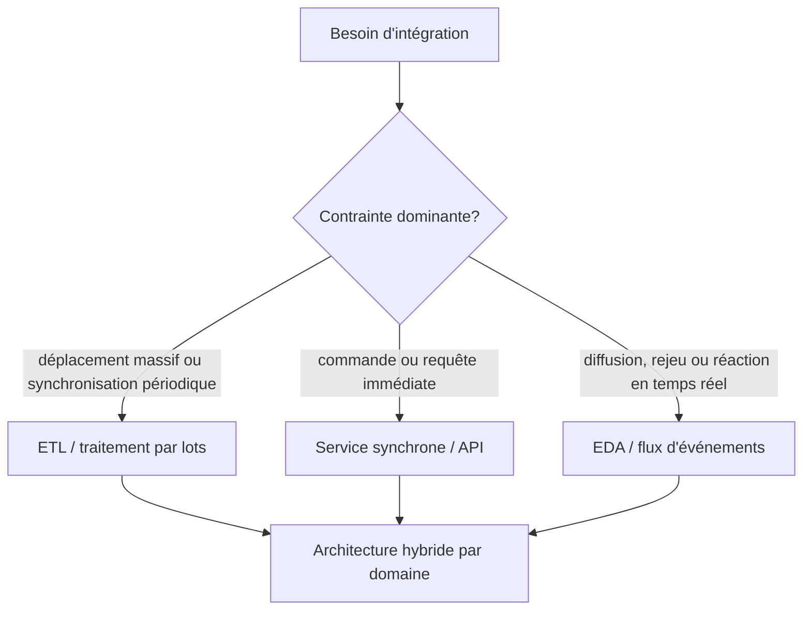
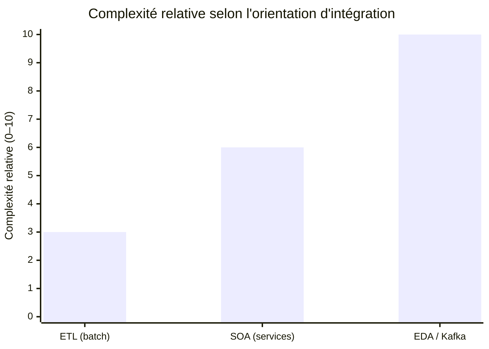

# Conclusion — Choisir entre ETL, SOA et EDA/Kafka (TCO et ROI)

> Partie du **Guide Kafka Engineering** de `org-rd-fullstack-springboot-eda`. Voir le [LISEZ_MOI du projet](./LISEZ_MOI.md).

**Portée :** conclure ce guide au moyen d'un cadre stratégique permettant de choisir entre l'ETL orienté traitement par lots, l'intégration synchrone de services et l'architecture événementielle (EDA/Kafka). Ces styles ne constituent ni des niveaux de maturité ni des solutions mutuellement exclusives. Chacun déplace la complexité vers une partie différente du système. Le bon choix est celui qui répond aux exigences métier et opérationnelles selon un **coût total de possession (TCO)** acceptable et un **retour sur investissement (ROI)** crédible.

## Table des matières

- [Synthèse](#synthèse)
- [Trois styles, trois profils de complexité](#trois-styles-trois-profils-de-complexité)
- [La complexité se déplace; elle ne disparaît pas](#la-complexité-se-déplace-elle-ne-disparaît-pas)
- [Quand EDA crée suffisamment de valeur](#quand-eda-crée-suffisamment-de-valeur)
- [Évaluer explicitement le TCO et le ROI](#évaluer-explicitement-le-tco-et-le-roi)
- [Mesurer la décision après l'adoption](#mesurer-la-décision-après-ladoption)
- [Ce projet comme exemple étudié](#ce-projet-comme-exemple-étudié)
- [Consigner la décision](#consigner-la-décision)
- [Réflexion finale](#réflexion-finale)
- [Sources et lectures associées](#sources-et-lectures-associées)

## Synthèse

La question n'est pas de savoir si EDA est plus moderne que l'ETL ou la SOA. Il faut plutôt déterminer si les événements asynchrones corrigent des contraintes qui ont une incidence réelle sur l'organisation :

- plusieurs consommateurs indépendants ont besoin du même fait métier;
- les producteurs et les consommateurs doivent évoluer, être déployés ou tomber en panne indépendamment;
- la réaction quasi immédiate, la mise en mémoire tampon ou le rejeu produit une valeur mesurable;
- le volume ou la variabilité de la charge fragilise une coordination synchrone directe;
- l'organisation est en mesure d'exploiter des systèmes distribués asynchrones et de gouverner les contrats d'événements.

Lorsque ces conditions sont absentes, un pipeline par lots ou une API synchrone peut produire le résultat attendu avec une surface opérationnelle plus petite. Lorsque seuls certains domaines les remplissent, une architecture hybride est généralement préférable à une orientation imposée à toute l'organisation.

## Trois styles, trois profils de complexité

Dans cette comparaison, **ETL** désigne principalement l'intégration de données par lots, tandis que **SOA** désigne principalement l'intégration synchrone par services ou API. Ces deux styles peuvent aussi comprendre des variantes asynchrones; les catégories suivantes décrivent leur utilisation dominante dans ce guide.

| Dimension | **ETL** (intégration de données par lots) | **SOA** (services synchrones) | **EDA / Kafka** (événements asynchrones) |
| --- | --- | --- | --- |
| Objectif principal | Déplacer et transformer des données entre des systèmes ou des entrepôts analytiques | Demander une capacité et obtenir un résultat immédiat | Publier des faits métier destinés à un ou plusieurs consommateurs indépendants |
| Modèle d'interaction | Tâches planifiées ou déclenchées | Requête-réponse | Publication-abonnement ou flux d'événements |
| Couplage | Modèle de données, calendrier et dépendances entre pipelines | Interface, disponibilité et couplage temporel | Réduction du couplage temporel et de déploiement; maintien du couplage sémantique, des schémas et de la plateforme |
| Latence habituelle | De quelques minutes à plusieurs heures, selon la planification | Latence de la requête, généralement de quelques millisecondes à quelques secondes | Quasi temps réel, selon le broker et le retard des consommateurs |
| Cohérence | Vue cohérente à un instant donné par traitement par lots | Souvent forte dans un appel de service; la cohérence entre services exige encore une coordination | Généralement éventuelle entre les consommateurs; des garanties plus fortes exigent une conception explicite |
| Modèle de défaillance | Redémarrer ou reprendre une tâche ou une partition | Nouvelle tentative, délai d'expiration, disjoncteur et compensation | Nouvelle livraison, défaillance partielle, message invalide, rejeu et retard du consommateur |
| Visibilité des flux | Lignage du pipeline et de l'ordonnanceur | Graphe d'appels et traçage distribué | Lignage des événements, identifiants de corrélation, retard des consommateurs et traces asynchrones |
| Surface opérationnelle | Orchestrateur, workers, stockage et contrôles de qualité des données | Services, passerelles, découverte, résilience et traçage | Brokers, partitions, schémas, consommateurs, reprises/DLT, rejeu et état des flux |
| Contexte idéal | Déplacements massifs, synchronisation périodique et préparation analytique | Commandes et requêtes immédiates, ainsi que flux simples de requête-réponse | Diffusion à plusieurs consommateurs, évolution indépendante, mise en mémoire tampon, rejeu et réactions en temps réel |

Aucune colonne n'est intrinsèquement simple. Un vaste environnement ETL peut compter des centaines de tâches interdépendantes, et un vaste environnement SOA peut devenir un système distribué fortement couplé. EDA n'élimine pas le couplage; elle en modifie la forme et rend explicite la responsabilité des sémantiques d'événements et des défaillances asynchrones.

## La complexité se déplace; elle ne disparaît pas

Chaque style place la coordination à un endroit différent :

- **ETL** la concentre dans les calendriers, les correspondances, le lignage et les règles de qualité des données.
- **SOA** la concentre dans les contrats de services, les chemins de requêtes, les dépendances de disponibilité et les flux de compensation.
- **EDA** la distribue entre les producteurs, les contrats d'événements, les brokers et les consommateurs.

L'objectif consiste à placer la complexité là où l'organisation peut la maîtriser et où elle produit de la valeur. Un même système peut combiner les trois styles selon les domaines :

Utiliser Kafka pour toutes les interactions peut être aussi inapproprié que d'imposer un traitement nocturne ou une chaîne d'appels synchrones à tous les flux. La qualité de l'architecture repose sur le choix du mécanisme suffisant le plus simple pour chaque interaction.

## Quand EDA crée suffisamment de valeur

EDA tend à produire un meilleur rendement lorsque plusieurs des conditions suivantes sont réunies.

| Facteur de décision | Indices favorisant EDA | Indices favorisant l'ETL ou les services synchrones |
| --- | --- | --- |
| Multiplication des consommateurs | Plusieurs consommateurs sous des responsabilités distinctes ont besoin du même événement | Une seule destination connue ou un seul demandeur |
| Sensibilité au temps | La valeur métier diminue sensiblement avec le délai | Un délai de quelques minutes ou heures est acceptable |
| Charge de travail | Volume élevé, pointes de trafic ou besoin d'absorber la contre-pression | Trafic faible, stable et prévisible |
| Rejeu | Le retraitement de l'historique facilite la restauration, l'audit ou l'ajout de consommateurs | Le retraitement offre peu de valeur ou les données sources peuvent être interrogées directement |
| Indépendance | Les équipes ont besoin de limites distinctes de déploiement, de mise à l'échelle et de disponibilité | Le producteur et le consommateur évoluent ensemble |
| Cohérence | Une divergence temporaire peut être tolérée et réconciliée | Le flux exige une cohérence immédiate entre les systèmes |
| Gestion des défaillances | La nouvelle livraison et la compensation sont acceptables | Une réponse immédiate et simple de réussite ou d'échec est nécessaire |
| Maturité opérationnelle | La responsabilité, l'observabilité, la gouvernance des schémas et le soutien de garde sont établis | L'équipe n'a pas la capacité nécessaire pour les opérations et la restauration asynchrones |

Les recommandations architecturales de Microsoft considèrent également les consommateurs multiples, le traitement en temps réel, les volumes élevés et la mise à l'échelle indépendante comme de bons indicateurs pour EDA, tout en déconseillant ce style pour des flux simples de requête-réponse ou des exigences strictes de cohérence entre services.

## Évaluer explicitement le TCO et le ROI

### Catégories du TCO

Le TCO comprend davantage que les frais du broker ou du service infonuagique :

- **Plateforme :** calcul, stockage, transfert réseau, réplication, schémas, observabilité et environnements hors production.
- **Ingénierie :** construction de la plateforme, migration, bibliothèques réutilisables, tests, CI/CD et accompagnement des développeurs.
- **Exploitation :** soutien de garde, mises à niveau, gestion de la capacité, réponse aux incidents, rejeu et exploitation des DLT.
- **Exactitude :** idempotence, ordre, évolution des schémas, réconciliation des données et essais de défaillance.
- **Gouvernance et sécurité :** responsabilité, contrôle des accès, conservation, classification, audit et conformité.
- **Coût de renonciation :** fonctionnalités retardées pendant la construction ou l'apprentissage de la plateforme.

Un service géré peut réduire le travail d'infrastructure, mais il n'élimine ni l'exactitude applicative, ni la gouvernance, ni l'observabilité, ni les coûts de consommation.

### Catégories du ROI

EDA peut produire de la valeur grâce aux éléments suivants :

- réaction plus rapide aux événements métier;
- réutilisation d'un événement par plusieurs produits ou domaines;
- réduction du délai d'intégration de nouveaux consommateurs;
- mise à l'échelle et déploiement indépendants;
- mise en mémoire tampon empêchant l'indisponibilité d'un système en aval d'arrêter les producteurs;
- rejeu pour la restauration, l'audit, la reconstruction de modèles ou de nouveaux cas d'usage;
- remplacement de plusieurs intégrations point à point par des contrats d'événements gouvernés.

Ces bénéfices doivent être associés à des résultats mesurables, comme les revenus protégés, la réduction du temps de traitement, le retrait d'intégrations, les incidents évités ou l'amélioration du délai de livraison.

### Comparer les options sur le même horizon

Pour chaque option viable, il faut estimer les coûts et les bénéfices sur une même période :

`ROI = (bénéfices mesurables − TCO) / TCO`

La formule est simple, mais les hypothèses ne le sont pas. Il faut consigner des fourchettes, des niveaux de confiance et des scénarios de croissance plutôt que de s'appuyer sur une seule prévision précise. Le coût de la solution plus simple doit aussi être inclus afin que la décision repose sur la valeur **incrémentale**, et non uniquement sur l'attrait d'EDA considérée isolément.

> **Règle de décision :** choisir EDA lorsque sa valeur incrémentale par rapport à la meilleure solution plus simple dépasse son coût et son risque incrémentaux selon une marge convenue.

## Mesurer la décision après l'adoption

Une décision d'architecture est une hypothèse. Elle doit être validée au moyen d'indicateurs opérationnels et métier comme :

- le coût par million d'événements et par consommateur actif;
- l'âge de l'événement ou la latence de traitement de bout en bout au percentile exigé;
- le nombre de consommateurs et la réutilisation des contrats d'événements existants;
- le temps nécessaire pour intégrer un nouveau producteur ou consommateur;
- la fréquence des rejeux et la valeur métier récupérée grâce à ceux-ci;
- le volume des DLT, le taux de doublons et l'effort de réconciliation;
- les incompatibilités de schémas et le délai de préparation des changements incompatibles;
- la fréquence des incidents, le temps de rétablissement et l'effort de garde;
- la capacité inutilisée et le coût des environnements hors production.

La décision doit être réévaluée lorsque le volume, la structure des équipes, les capacités des services ou les tarifs de la plateforme changent. Une bonne décision à une certaine échelle peut devenir inadéquate à une autre.

## Ce projet comme exemple étudié

Ce dépôt est un bac à sable pédagogique qui rend volontairement visible la surface opérationnelle d'une architecture événementielle. Une exigence conceptuellement simple — traiter les demandes d'inventaire et mettre à jour les soldes — introduit plusieurs préoccupations :

- publication transactionnelle et idempotente, puis consommation `read_committed` ([sémantiques de livraison et fiabilité](./semantiques_livraison_et_fiabilite.md));
- accusé de réception manuel, livraison *at-least-once* et traitement idempotent ([accusés de réception et idempotence du consommateur](./reconnaissance_et_idempotence_consommateur.md));
- verrou distribué Hazelcast pour coordonner les mises à jour de solde d'un client entre les partitions et les pods;
- nouvelles tentatives limitées et chemin de lettres mortes ([architecture et conception des topics](./architecture_et_conception_des_topics.md));
- chemin Flink optionnel illustrant les contraintes liées aux points de contrôle, aux effets externes et au déploiement ([guide Flink](./guides_flink.md));
- mise à l'échelle tenant compte des partitions, arrêt gracieux et limites de l'autoscaling piloté par le retard ([mise à l'échelle et arrêt](./distribution_scale_et_arret.md), [élasticité horizontale](./elasticite_horizontale_eks.md)).

Chaque mécanisme répond à un mode de défaillance ou à un attribut de qualité précis. Ensemble, ils montrent pourquoi EDA doit être évaluée comme un modèle d'exploitation complet, et non comme un simple choix de broker. Dans une décision de production, chaque mécanisme doit être justifié par une exigence et comparé à une conception plus simple.

## Consigner la décision

Avant d'adopter ou d'étendre EDA, les éléments suivants doivent être documentés dans un dossier de décision d'architecture (ADR) :

1. le problème métier et l'objectif de niveau de service;
2. le volume, la vélocité, les pointes, la latence et le nombre de consommateurs prévus;
3. les exigences de livraison, d'ordre, de rejeu, de conservation et de cohérence;
4. les solutions envisagées, y compris une conception hybride;
5. le bénéfice incrémental et le TCO attendus sur une période convenue;
6. la responsabilité des schémas, des producteurs, des consommateurs, des DLT et des opérations de garde;
7. les contraintes de sécurité, de confidentialité, de conservation et d'audit;
8. les indicateurs de réussite, la date de révision et les conditions de simplification ou de retrait de la solution.

Cette démarche empêche « utiliser Kafka » de devenir l'exigence. Kafka est un choix d'implémentation; l'exigence doit décrire le résultat attendu.

## Réflexion finale

L'architecture d'intégration n'est pas une échelle menant de l'ETL à la SOA, puis à EDA. Elle constitue un ensemble d'outils complémentaires. EDA/Kafka convient aux systèmes qui tirent profit de la diffusion à plusieurs consommateurs, de l'évolution indépendante, de la mise en mémoire tampon, du rejeu et du traitement quasi immédiat. Elle constitue un mauvais choix par défaut lorsqu'un pipeline planifié ou une interaction synchrone répond déjà au besoin.

La maturité d'ingénierie ne se démontre pas par la sélection de la plateforme la plus sophistiquée, mais par l'adaptation du mécanisme au problème, la visibilité des coûts et la réévaluation de la décision à partir de données probantes. **Construisez le système événementiel lorsque son ROI incrémental justifie son TCO incrémental; gardez l'interaction plus simple dans le cas contraire.**

```mermaid
flowchart LR

    subgraph ETL["ETL — traitements par lots"]
        E1["traitements planifiés"]
        E2["transformations"]
        E3["orchestration (DAGs)"]
    end

    subgraph SOA["SOA — services synchrones"]
        S1["contrats de service"]
        S2["ESB / API Gateway"]
        S3["sagas / transactions distribuées"]
    end

    subgraph EDA["EDA / Kafka — événements asynchrones"]
        D1["sémantiques de livraison + idempotence"]
        D2["partitionnement / ordre / rééquilibrage"]
        D3["Schema Registry + évolution des schémas"]
        D4["DLQ / retries / replay"]
        D5["traitement avec état (Flink) + checkpoints"]
        D6["traçage distribué des flux asynchrones"]
        D7["autoscaling (KEDA / Karpenter) + graceful shutdown"]
    end

    ETL --> SOA --> EDA

    EDA --> GATE{"TCO vs ROI :<br/>le découplage / passage à l'échelle / temps réel<br/>justifient-ils le coût opérationnel?"}

    GATE -->|"oui — volume et vélocité élevés, forte variabilité, temps réel"| ADOPT["Adopter l'EDA"]

    GATE -->|"non — besoins modestes ou stables"| SIMPLER["Privilégier ETL / SOA<br/>(éviter la sur-ingénierie)"]
```

### La complexité ne cesse de croître — et celle de l’EDA croît plus rapidement

L’évolution de l’ETL vers la SOA, puis vers l’EDA, ne signifie pas que les préoccupations propres aux modèles précédents disparaissent. Chaque orientation **ajoute de nouvelles dimensions de complexité** à celles qui existent déjà.

De plus, **une grande partie de cette complexité devient distribuée entre les équipes**. Chaque producteur doit notamment être conçu de manière à permettre un traitement idempotent, tandis que chaque consommateur doit gérer correctement les rejeux (*replays*), l’ordre des événements, les nouvelles tentatives (*retries*) et les messages problématiques (*poison messages*).

Cette **« taxe de fiabilité »** (*correctness tax*) est distribuée entre les équipes et se répète tout au long du cycle de vie des systèmes. Elle représente l’un des coûts les plus souvent **sous-estimés dans l’analyse de rentabilité** (*business case*) d’une architecture EDA.

La même progression peut être représentée sous forme d’un **histogramme de complexité relative**. Les valeurs sont fournies uniquement à titre illustratif et **ne constituent pas une mesure ni une référence comparative (*benchmark*)** :

### Description

La progression est **super-linéaire plutôt que constante** : l’ETL introduit une complexité liée aux transformations et à l’orchestration; la SOA y ajoute notamment la gestion des contrats de service et des interactions distribuées; puis l’EDA ajoute, **par-dessus ces préoccupations**, l’ensemble des enjeux associés à la fiabilité des traitements asynchrones et à l’exploitation d’une plateforme événementielle distribuée.

**Le passage à l’EDA représente ici l’augmentation de complexité la plus importante.** C’est précisément pourquoi la question du **TCO/ROI** doit être posée **avant son adoption** : les bénéfices attendus — découplage, passage à l’échelle, résilience, traitement en temps réel et capacité à absorber une forte variabilité — doivent justifier cette complexité supplémentaire et son coût opérationnel récurrent.

## Sources et lectures associées

- [Microsoft Azure Architecture Center — Style d'architecture événementielle](https://learn.microsoft.com/en-us/azure/architecture/guide/architecture-styles/event-driven)
- [Architecture et conception des topics](./architecture_et_conception_des_topics.md) · [Sémantiques de livraison et fiabilité](./semantiques_livraison_et_fiabilite.md) · [Accusés de réception et idempotence du consommateur](./reconnaissance_et_idempotence_consommateur.md)
- [Mise à l'échelle et arrêt dans les environnements distribués](./distribution_scale_et_arret.md) · [Élasticité horizontale sur EKS](./elasticite_horizontale_eks.md)
- [Guide Flink](./guides_flink.md) · [Gouvernance et observabilité](./gouvernance_et_observabilite.md) · [Data Mesh / Data Fabric](./datamesh_datafabric.md)