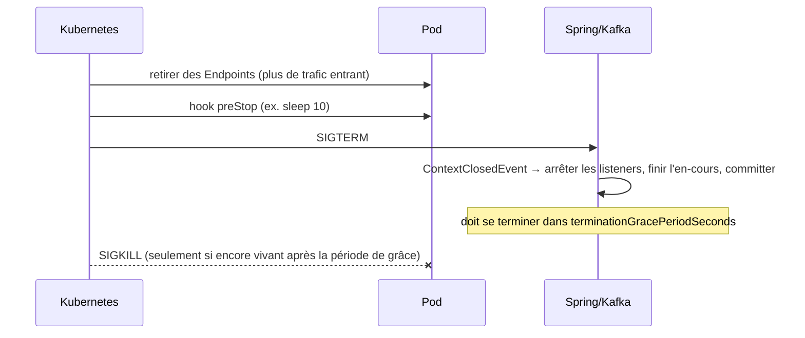
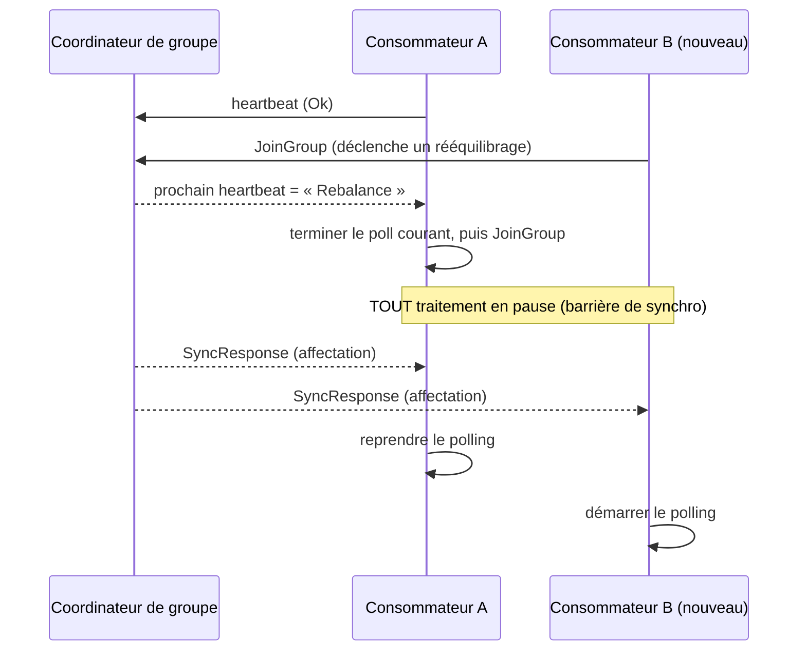

# Cycle de vie et opérations

> Partie du **Guide Kafka Engineering** de `org-rd-fullstack-springboot-eda`. Voir le [LISEZ_MOI du projet](./LISEZ_MOI.md).

**Portée :** comment un service Spring Boot + Kafka s'arrête proprement, comment il survit aux rééquilibrages de groupe de consommateurs, et comment les listeners sont mis en pause, repris et pilotés à l'exécution — avec le contexte opérationnel pour l'exécuter sur Kubernetes/EKS ou ECS.

## Table des matières

- [Vue d'ensemble](#vue-densemble)
- [Cycle de vie de l'application Spring Boot (démarrage → arrêt)](#cycle-de-vie-de-lapplication-spring-boot-démarrage--arrêt)
- [Arrêt gracieux JVM et Spring](#arrêt-gracieux-jvm-et-spring)
- [Signaux, SIGTERM/SIGKILL et cycle de vie d'un pod Kubernetes](#signaux-sigtermsigkill-et-cycle-de-vie-dun-pod-kubernetes)
- [Arrêter proprement un consommateur Kafka](#arrêter-proprement-un-consommateur-kafka)
- [Rééquilibrages de groupe de consommateurs](#rééquilibrages-de-groupe-de-consommateurs)
- [Atténuer les rééquilibrages](#atténuer-les-rééquilibrages)
- [Mettre en pause, reprendre et piloter les listeners à l'exécution](#mettre-en-pause-reprendre-et-piloter-les-listeners-à-lexécution)
- [Dimensionner consommateurs et partitions](#dimensionner-consommateurs-et-partitions)
- [Sondes de santé, readiness et drainage du trafic](#sondes-de-santé-readiness-et-drainage-du-trafic)
- [Considérations opérationnelles EKS vs ECS/Pods](#considérations-opérationnelles-eks-vs-ecspods)
- [Comment ce projet l'applique](#comment-ce-projet-lapplique)
- [Pièges et bonnes pratiques](#pièges-et-bonnes-pratiques)
- [Lectures associées](#lectures-associées)

## Vue d'ensemble

Dans un service événementiel, le moment le plus délicat n'est pas le démarrage — c'est l'arrêt. Un consommateur tué en plein `poll()` abandonne le travail en cours, peut laisser des offsets non validés, et déclenche un rééquilibrage de groupe qui met le traitement en pause pour *tous* les membres du groupe. Dans un environnement élastique (déploiements progressifs, autoscaling, drainages de nœuds, kills OOM), les arrêts sont fréquents et attendus : l'arrêt gracieux est donc une exigence de correction, pas une optimisation.

Ce guide relie quatre préoccupations qui doivent être conçues comme un tout :

1. **Arrêt JVM/Spring** — cesser d'accepter du travail, laisser l'en-cours se terminer, libérer les ressources dans le bon ordre.
2. **Traitement des signaux** — réagir au `SIGTERM` de la plateforme dans la fenêtre de grâce, avant le `SIGKILL`.
3. **Gestion des rééquilibrages** — minimiser le nombre et l'impact des rééquilibrages de groupe.
4. **Contrôle des listeners à l'exécution** — mettre en pause/reprendre/arrêter la consommation délibérément, indépendamment de l'arrêt du processus.

Le choix de conception récurrent pour ces quatre points est **désactiver l'auto-commit + acquitter seulement après un traitement réussi** : un arrêt à n'importe quel instant se contente alors de rejouer l'enregistrement non acquitté (*at-least-once*), donc aucun message n'est perdu.

## Cycle de vie de l'application Spring Boot (démarrage → arrêt)

Avant les préoccupations opérationnelles, il est utile de visualiser tout le cycle de vie piloté par la plateforme. Une application Spring Boot suit une séquence bien définie du démarrage du processus à la sortie propre ; la comprendre est ce qui rend la logique de démarrage, la readiness et l'arrêt gracieux prévisibles.

| Phase | Ce qui se passe | État |
| --- | --- | --- |
| **1. Bootstrap** | Un `SpringApplication` est créé ; les listeners/initializers sont découverts ; le type d'application (SERVLET/REACTIVE/NONE) est résolu. | Pas encore d'`ApplicationContext`. |
| **2. Préparation de l'environnement** | Les propriétés sont chargées (`application.yml`, variables d'env., propriétés système, arguments CLI) et les profils actifs résolus. | Environnement prêt, aucun bean. |
| **3. Création du contexte** | L'`ApplicationContext` approprié est créé ; les définitions de beans sont enregistrées. | Aucun bean instancié. |
| **4. Rafraîchissement du contexte** | Les beans sont instanciés et injectés ; `@PostConstruct`/`InitializingBean` et les `BeanPostProcessor` s'exécutent ; les `CommandLineRunner`/`ApplicationRunner` s'exécutent. | Application initialisée. |
| **5. Application prête** | `ApplicationReadyEvent` est publié ; les serveurs embarqués acceptent les requêtes. | En marche. |
| **6. Arrêt** | Sur `SIGTERM`/`CTRL+C`, `ContextClosedEvent` se déclenche ; `@PreDestroy` et `DisposableBean.destroy()` s'exécutent ; les beans `SmartLifecycle` sont arrêtés ; le contexte se ferme. | Sortie gracieuse. |

C'est sur la phase 6 que se concentre tout le reste de ce guide ; les sections ci-dessous la détaillent.

### S'accrocher au cycle de vie

- **Événements d'application** — réagir aux changements d'état globaux avec `@EventListener` :

  ```java
  @Component
  public class AppEventsListener {
      @EventListener(ApplicationReadyEvent.class)
      public void onReady()    { /* préchauffage du cache, notifications externes */ }
      @EventListener(ContextClosedEvent.class)
      public void onShutdown() { /* lever un drapeau « arrêt en cours » */ }
  }
  ```

- **`CommandLineRunner` / `ApplicationRunner`** — exécuter la logique de démarrage après le
  rafraîchissement du contexte mais avant que l'application soit considérée prête.
  `CommandLineRunner` reçoit les `String[] args` bruts ; `ApplicationRunner` expose des
  `ApplicationArguments` structurés.

- **`SmartLifecycle`** — lier le démarrage/arrêt d'un composant d'arrière-plan au contexte,
  `getPhase()` contrôlant l'ordre. Détaillé dans [Arrêt gracieux JVM et Spring](#arrêt-gracieux-jvm-et-spring) ci-dessous.

- **`@PreDestroy` / `DisposableBean`** — nettoyage garanti pendant l'arrêt (fermer les
  connexions, vider les tampons, libérer les ressources). Également traité plus bas.

| Hook | Quand il s'exécute | Usage courant |
| --- | --- | --- |
| `ApplicationStartingEvent` | Très tôt, avant la création du contexte | Amorçage des logs/métriques |
| `ApplicationReadyEvent` | Après la fin du démarrage | Préchauffage du cache, notifications |
| `CommandLineRunner` / `ApplicationRunner` | Après le rafraîchissement du contexte | Logique de démarrage, seeding de données |
| `@PreDestroy` / `DisposableBean` | Avant l'arrêt | Nettoyage des ressources |
| `SmartLifecycle` | Phase de démarrage/arrêt | Gestion des processus d'arrière-plan |

## Arrêt gracieux JVM et Spring

Spring Boot orchestre un arrêt ordonné quand l'`ApplicationContext` se ferme :

- `server.shutdown: graceful` laisse le serveur web cesser d'accepter de nouvelles requêtes et terminer celles en cours.
- `spring.lifecycle.timeout-per-shutdown-phase` borne la durée que chaque phase `SmartLifecycle` peut prendre avant que Spring ne force la suivante.
- Les beans sont détruits dans l'ordre inverse des dépendances ; `@PreDestroy` et `DisposableBean.destroy()` s'exécutent ; `SmartLifecycle.stop()` s'exécute par groupe de `getPhase()`.

Un `ContextClosedEvent` est publié dès que le contexte commence à se fermer — le hook le plus pratique pour lever un drapeau « arrêt en cours » que le reste de l'application peut observer.

```java
@Component
public class ShutdownFlag {
    private final AtomicBoolean shuttingDown = new AtomicBoolean(false);

    @EventListener
    public void onShutdown(ContextClosedEvent e) {
        shuttingDown.set(true);
    }

    public boolean isShuttingDown() {
        return shuttingDown.get();
    }
}
```

`SmartLifecycle` est la façon la plus propre de lier le cycle de vie d'une ressource au contexte, et `getPhase()` contrôle l'ordre. Les composants qui doivent s'arrêter **après** les conteneurs de listeners Kafka (situés en phase 0) doivent renvoyer une phase supérieure pour être arrêtés plus tard :

```java
@Component
public class KafkaShutdownWatcher implements SmartLifecycle {
    private volatile boolean running = false;

    @Override public void start() { running = true; }
    @Override public void stop()  { running = false; /* nettoyage après les listeners */ }
    @Override public boolean isRunning() { return running; }

    @Override public int getPhase() { return 1000; } // arrêté après les conteneurs de phase 0
}
```

> Recommandation pour un service Spring Boot standard : un drapeau global alimenté par `ContextClosedEvent`, plus une vérification dans le listener. C'est lisible, fiable et idiomatique côté Spring. Ne recourez à `consumer.wakeup()` / à la gestion du cycle de vie d'un `KafkaConsumer` brut que lorsque vous possédez vous-même la boucle de poll.

## Signaux, SIGTERM/SIGKILL et cycle de vie d'un pod Kubernetes

Quand la plateforme veut supprimer un pod (un `kubectl delete`, une réduction d'échelle, un déploiement progressif, un drainage de nœud), la séquence est :

1. Le pod est retiré des **Endpoints** du Service (sa readiness est considérée comme perdue) afin que le nouveau trafic cesse de lui parvenir.
2. Le hook `preStop` s'exécute (s'il est configuré).
3. Le processus principal du conteneur reçoit **`SIGTERM`**.
4. La plateforme attend jusqu'à `terminationGracePeriodSeconds` (30 s par défaut).
5. Si le processus n'est pas sorti, il reçoit **`SIGKILL`** (non interceptable, immédiat).

Spring Boot installe un shutdown hook JVM qui ferme le contexte sur `SIGTERM`, ce qui fait s'exécuter le chemin gracieux ci-dessus. La période de grâce doit être assez longue pour la plus longue unité de travail en cours réaliste, plus la libération des ressources.



Le `sleep` du `preStop` est délibéré : lors d'un déploiement progressif ou d'une réduction d'échelle, il existe une brève fenêtre entre le retrait d'un pod des Endpoints et la mise à jour des règles iptables/IPVS sur chaque nœud. Un court `sleep` laisse cette propagation réseau se terminer avant le `SIGTERM`, évitant que des requêtes soient routées vers un pod en cours de drainage.

> Note : `Signal.md` dans les sources, malgré son nom, concerne l'annulation asynchrone en JavaScript/TypeScript (`AbortController`, gardes de réentrance) côté Nuxt — il ne s'agit pas de la gestion des signaux OS et cela sort du périmètre de ce guide.

## Arrêter proprement un consommateur Kafka

Une boucle de poll de consommateur ne répondra pas à un `interrupt()` de thread — `poll()` l'ignore. Le mécanisme prévu par Kafka pour sortir d'un `poll()` bloquant est `consumer.wakeup()`, qui lève une `WakeupException` sur le thread de polling (et est thread-safe, donc appelable depuis un autre thread, tel qu'un événement d'arrêt). Les conteneurs de listeners de Spring Kafka gèrent cela pour vous : à la fermeture du contexte, les conteneurs s'arrêtent, réveillent leurs consommateurs, terminent le batch courant, et se ferment.

Les garanties que l'on veut réellement à l'arrêt concernent les offsets, pas les threads :

| Mode d'acquittement | Ce que fait Spring Kafka | Rejoué après un arrêt ? |
| --- | --- | --- |
| Auto-commit (`enable.auto.commit=true`) | Commit périodique/automatique | Non — risque de **perte** de message |
| Ack `BATCH` / `TIME` / `COUNT` | Commit périodique | Non — perte possible |
| `MANUAL` / `MANUAL_IMMEDIATE`, ack appelé | Commit sur `ack.acknowledge()` | Non (déjà traité) |
| `MANUAL` / `MANUAL_IMMEDIATE`, ack **non appelé** | Pas de commit | **Oui** — rejoué au prochain démarrage |

La règle qui en découle : **ne jamais auto-committer, et ne jamais acquitter à l'arrêt.** Si un arrêt survient, retournez simplement sans acquitter ; Kafka redélivre l'enregistrement au consommateur qui possédera ensuite la partition.

```java
@KafkaListener(id = "consumerA", topics = "demo", containerFactory = "kafkaListenerContainerFactory")
public void listen(String message, Acknowledgment ack) {
    if (shutdownFlag.isShuttingDown()) {
        // Pas d'ack → pas de commit → Kafka rejoue cet enregistrement plus tard. Aucune perte.
        log.warn("Arrêt imminent — enregistrement NON acquitté, sera rejoué.");
        return;
    }
    process(message);
    ack.acknowledge(); // MANUAL_IMMEDIATE : committé immédiatement
}
```

`MANUAL_IMMEDIATE` committe dès que `acknowledge()` est appelé, ce qui est le comportement le plus prévisible sous redémarrages fréquents. Les producteurs doivent flusher avant la sortie ; Spring ferme le `KafkaTemplate` à l'arrêt du contexte, ce qui déclenche un `flush()`, mais un `@PreDestroy { kafkaTemplate.flush(); }` explicite le rend délibéré.

Événements Spring Kafka utiles autour du cycle de vie du consommateur :

- `org.springframework.context.event.ContextClosedEvent` — début d'arrêt (juste après `SIGTERM`).
- `org.springframework.kafka.listener.ListenerContainerIdleEvent` — se déclenche quand un conteneur est inactif pendant `idleEventInterval` ; permet de réagir (ex. arrêter un conteneur) même sans messages.
- `org.springframework.kafka.event.ConsumerStoppedEvent` (Spring Kafka 2.8+/2.9+) — un consommateur s'est arrêté.
- `ConsumerAwareRebalanceListener.onPartitionsRevokedBeforeCommit(...)` — dernière chance de committer/nettoyer avant que les partitions soient révoquées, ce qui précède exactement un rééquilibrage ou un arrêt de pod.

## Rééquilibrages de groupe de consommateurs

Un **groupe de consommateurs** partage un `group.id` ; les partitions du groupe sont réparties entre ses membres. L'appartenance au groupe est suivie côté broker par le **Group Coordinator** ; l'affectation effective partition→consommateur est calculée côté client par un **leader** de groupe élu. Invariant clé : **au sein d'un groupe, une partition est consommée par exactement un membre à la fois.** Plus de membres que de partitions signifie que les membres en surplus sont inactifs.

Un **rééquilibrage** réaffecte les partitions au sein du groupe. Il est déclenché quand :

- un nouveau consommateur rejoint (`JoinGroup`),
- un consommateur quitte (`LeaveGroup`),
- le coordinateur estime qu'un consommateur a échoué (heartbeat manqué ou `poll()` manqué),
- les ressources changent autrement (ex. un abonnement par motif correspond à un topic nouvellement créé).

Deux timeouts déterminent si un consommateur est considéré sain :

| Configuration | Signification | Défaut (Kafka ≥ 3.0) |
| --- | --- | --- |
| `session.timeout.ms` | Un heartbeat doit atteindre le coordinateur dans cette fenêtre, sinon le consommateur est évincé. | 45 s |
| `heartbeat.interval.ms` | Fréquence des heartbeats du consommateur (sur un thread **séparé**). Garder ≤ 1/3 du session timeout. | 3 s |
| `max.poll.interval.ms` | Temps max entre deux appels `poll()` sur le thread de **traitement** avant que le consommateur soit considéré en échec. | 5 min |

Les heartbeats tournent sur un thread d'arrière-plan ; le traitement tourne sur le thread principal, qui doit appeler `poll()` dans `max.poll.interval.ms`. Ainsi, une **panne dure** (toute l'app meurt → plus de heartbeat) est détectée par `session.timeout.ms`, tandis qu'un **thread de traitement bloqué** (heartbeats toujours émis mais plus de poll) est détecté par `max.poll.interval.ms`. `max.poll.interval.ms` est de fait le contrôle de santé de votre traitement métier.

Un piège subtil : si plusieurs consommateurs sur des **topics mutuellement exclusifs partagent un même `group.id`**, un rééquilibrage déclenché par *l'un* d'eux révoque et réaffecte *toutes* les affectations du groupe, y compris celles sans rapport. Préférez des groupes distincts par consommateur logique, p. ex. `[service]-[topic]-consumer-group`.

### Stratégies de rééquilibrage

**Rééquilibrage eager (par défaut).** Tous les consommateurs cessent de traiter pendant la réaffectation des partitions. Le groupe se stabilise sur une « barrière de synchronisation », un leader calcule les affectations, et le traitement reprend. Simple, mais la pause grandit avec la taille du groupe.



**Rééquilibrage incrémental / coopératif.** Configuré avec le `CooperativeStickyAssignor` (`partition.assignment.strategy`). Les consommateurs existants continuent de traiter pendant le rééquilibrage ; seules les partitions *spécifiques* qui doivent bouger sont révoquées, sur deux tours de protocole. Latence totale plus élevée (deux tours) mais impact bien moindre — les partitions qui ne bougent pas ne sont jamais interrompues.

### Risques du rééquilibrage

- **Messages en double.** Un consommateur évincé pour dépassement d'un timeout peut tout de même finir de traiter son batch, mais son commit d'offset est rejeté (le rééquilibrage incrémente l'id de génération). Un nouveau propriétaire retraite alors les mêmes enregistrements. Les consommateurs doivent être idempotents.
- **Tempêtes de rééquilibrage.** Si un aval lent fait dépasser à répétition `max.poll.interval.ms`, chaque consommateur est évincé, rejoint, et déclenche encore un rééquilibrage — rééquilibrage après rééquilibrage. La static membership et le rééquilibrage coopératif aident, mais les configurations doivent tout de même être réglées.

## Atténuer les rééquilibrages

- **Assignor coopératif sticky** — garder actives les partitions non affectées pendant un rééquilibrage.
- **Static group membership** — définir un `group.instance.id` stable par consommateur. Le coordinateur le mappe au `member.id` interne ; un membre statique qui disparaît n'est **pas** retiré avant l'expiration de `session.timeout.ms`, et un redémarrage avec le même id est reconnu comme le *même* membre, donc **aucun rééquilibrage** n'est déclenché et ses partitions lui sont rendues. Liez `group.instance.id` à l'identité du pod (p. ex. l'ordinal du StatefulSet) pour qu'un redémarrage de pod évite un rééquilibrage coûteux. C'est particulièrement précieux quand le consommateur détient un état en mémoire (p. ex. des compteurs de retry) qu'un rééquilibrage perdrait autrement.
  - Compromis : avec un membre statique en panne, ses partitions restent non consommées jusqu'à l'expiration de `session.timeout.ms`. Trop long → les consommateurs en panne bloquent des partitions ; trop court → les redémarrages ne parviennent pas à rejoindre à temps et un rééquilibrage se déclenche quand même.
- **Bien dimensionner `max.poll.interval.ms` et `max.poll.records`** — borner le batch pour que le traitement finisse toujours dans l'intervalle. Trop bas → éviction prématurée et doublons ; trop haut → détection lente des consommateurs réellement morts.
- **Régler heartbeat/session** — des heartbeats fréquents avec `heartbeat.interval.ms ≤ session.timeout.ms / 3` survivent aux à-coups réseau transitoires.
- **Groupes de consommateurs séparés** pour les consommateurs sur des topics sans rapport.

```yaml
# Réglage consommateur illustratif pour un environnement à redémarrages fréquents
spring:
  kafka:
    consumer:
      enable-auto-commit: false
      properties:
        partition.assignment.strategy: org.apache.kafka.clients.consumer.CooperativeStickyAssignor
        group.instance.id: ${POD_NAME}        # static membership
        max.poll.records: 50
        max.poll.interval.ms: 300000          # 5 min — ≥ pire cas de traitement de batch
        heartbeat.interval.ms: 1000
        session.timeout.ms: 10000
    listener:
      ack-mode: MANUAL_IMMEDIATE
```

## Mettre en pause, reprendre et piloter les listeners à l'exécution

On ne peut pas désactiver une annotation `@KafkaListener` à l'exécution, mais on peut piloter le **MessageListenerContainer** sous-jacent via le `KafkaListenerEndpointRegistry`. Donnez au listener un `id` stable, puis retrouvez le conteneur par cet id :

```java
@KafkaListener(id = "myConsumerId", topics = "my-topic")
public void listen(String message) { /* ... */ }

@Service
public class KafkaControlService {
    private final KafkaListenerEndpointRegistry registry;
    KafkaControlService(KafkaListenerEndpointRegistry registry) { this.registry = registry; }

    public void pause()  { registry.getListenerContainer("myConsumerId").pause();  }
    public void resume() { registry.getListenerContainer("myConsumerId").resume(); }
    public void stop()   { registry.getListenerContainer("myConsumerId").stop();   }
}
```

`pause()` vs `stop()` est la distinction critique :

| Méthode | Effet sur le consommateur | Effet sur Kafka |
| --- | --- | --- |
| `pause()` | Cesse de demander des enregistrements dans `poll()`, mais le consommateur reste vivant et continue d'émettre des heartbeats. | Le membre reste dans le groupe — **aucun rééquilibrage**. |
| `stop()` | Arrête entièrement le conteneur. | Le membre quitte le groupe — **déclenche un rééquilibrage**. |

Donc pour « cesser de consommer un moment sans perturber le groupe », utilisez `pause()`/`resume()`. Comme les heartbeats continuent, le broker traite cela comme un membre faisant une sieste ; le session timeout n'est pas en péril.

## Dimensionner consommateurs et partitions

Le parallélisme Kafka pour un groupe de consommateurs est plafonné par le **nombre de partitions**, pas par le nombre de pods ou de threads :

- Un topic à *N* partitions supporte au plus *N* membres consommant activement dans un groupe.
- Ajouter des pods (ou de la `concurrency` de conteneur) au-delà de *N* laisse les consommateurs supplémentaires inactifs.
- Des threads dans un même processus n'ajoutent du parallélisme au niveau Kafka que s'ils sont mappés à des partitions indépendantes — ce que fait exactement la concurrency du `ConcurrentMessageListenerContainer` de Spring (un consommateur par thread, jusqu'au nombre de partitions).

Donc pour augmenter le débit, on augmente les partitions **et** les consommateurs ensemble. L'autoscaling des consommateurs doit être piloté par le **lag du consommateur**, pas par le CPU/la mémoire — un HPA basé CPU ne reflète pas un arriéré. Le HPA Kubernetes ne connaît nativement que CPU/mémoire, donc le scaling basé sur le lag nécessite soit une chaîne Prometheus-adapter (Prometheus scrape le lag → adapter → External Metrics → HPA), soit, plus directement, **KEDA**, dont le scaler Kafka lit le lag du groupe et calcule `desiredReplicas = totalLag / lagThreshold`, et peut même descendre à zéro à l'inactivité :

```yaml
apiVersion: keda.sh/v1alpha1
kind: ScaledObject
metadata:
  name: demo-kafka-scaledobject
spec:
  scaleTargetRef:
    name: demo
  pollingInterval: 60
  cooldownPeriod: 300
  minReplicaCount: 0
  maxReplicaCount: 10        # garder ≤ nombre de partitions pour éviter les consommateurs inactifs
  triggers:
    - type: kafka
      metadata:
        consumerGroup: demo.consumer-group.id
        bootstrapServersFromEnv: KAFKA_BOOTSTRAP_SERVERS
        lagThreshold: "1000"           # desiredReplicas = totalLag / lagThreshold
        activationLagThreshold: "3000" # le lag doit dépasser ceci pour scaler depuis 0
```

Chaque événement de scaling est lui-même un rééquilibrage : combinez donc l'autoscaling basé lag avec la static/cooperative membership et un `cooldownPeriod` raisonnable pour éviter le thrash.

## Sondes de santé, readiness et drainage du trafic

Spring Boot Actuator expose des endpoints de sonde alignés sur Kubernetes ; l'application modélise aussi explicitement la disponibilité via `AvailabilityChangeEvent`/`LivenessState`/`ReadinessState`. Cette section couvre le *câblage* opérationnel (YAML des sondes, drainage du trafic) ; pour l'API d'indicateur de santé elle-même — statuts, mapping HTTP, groupes de santé, et la distinction liveness vs readiness — voir [Gouvernance & Observabilité](./gouvernance_et_observabilite.md#indicateurs-de-santé-spring-boot).

| Sonde | Question | En cas d'échec |
| --- | --- | --- |
| **startup** | L'app a-t-elle fini de démarrer ? | Liveness/readiness sont *suspendues* jusqu'à ce qu'elle passe — évite de tuer une JVM lente à démarrer. |
| **liveness** | Le processus est-il sain (non bloqué) ? | Le pod est **redémarré**. |
| **readiness** | Peut-il accepter du trafic ? | Le pod est **retiré des Endpoints** (pas de redémarrage). |

```yaml
management:
  endpoint:
    health:
      probes:
        enabled: true
  health:
    livenessstate:  { enabled: true }
    readinessstate: { enabled: true }
```

```yaml
startupProbe:
  httpGet: { path: /actuator/health/liveness, port: 8080 }
  failureThreshold: 30
  periodSeconds: 2
livenessProbe:
  httpGet: { path: /actuator/health/liveness, port: 8080 }
  periodSeconds: 10
  failureThreshold: 3
  timeoutSeconds: 5
readinessProbe:
  httpGet: { path: /actuator/health/readiness, port: 8080 }
  periodSeconds: 5
  failureThreshold: 3
  timeoutSeconds: 5
```

Opérationnellement : une sonde de readiness rapide fait qu'à peine un arrêt commencé, la readiness bascule sur `REFUSING_TRAFFIC`, le pod quitte les Endpoints, et (pour HTTP) le trafic s'arrête immédiatement. Pour Kafka, le consommateur doit tout de même terminer son poll et ne pas acquitter en sortant. La cause n°1 de `CrashLoopBackOff` avec Spring Boot est l'oubli de la sonde startup, de sorte que la liveness tue la JVM avant qu'elle ait fini de démarrer. Le piège n°2 est de coupler la readiness trop étroitement à une dépendance partagée (p. ex. la DB) — un à-coup transitoire de la DB retire alors tous les pods de la rotation d'un coup.

## Considérations opérationnelles EKS vs ECS/Pods

Les deux exécutent la même image de conteneur ; le modèle de cycle de vie et les contrôles diffèrent.

| Préoccupation | EKS (Kubernetes) | ECS (Fargate/EC2) |
| --- | --- | --- |
| Unité de déploiement | Deployment → Pod | Service → Task |
| Format de config | Manifestes YAML / Helm (portable) | `task-definition.json` (spécifique AWS) |
| Point d'entrée réseau | Service + Ingress/ALB | Target group ALB |
| Arrêt gracieux | `terminationGracePeriodSeconds` + hook `preStop` | `stopTimeout` (pas de hook preStop) |
| Modèle de santé | sondes startup + liveness + readiness | `healthCheck` de conteneur (type liveness) + health check ALB (type readiness) |
| Philosophie de cycle de vie | Les pods sont **éphémères** par conception ; de nombreux mécanismes d'auto-réparation les replanifient/redémarrent | La task tourne jusqu'à un crash ou un ordre d'arrêt — façon Docker, plus prévisible |

Kubernetes n'est pas intrinsèquement moins stable qu'ECS ; il a simplement davantage de mécanismes automatisés capables d'arrêter/redémarrer un pod — sondes de liveness agressives, `OOMKill` par des `limits.memory` trop serrées, éviction sous pression de nœud, drainage de nœud par le cluster-autoscaler, préemption, et des défauts de déploiement progressif plus agressifs. Un pod qui « redémarre beaucoup » est presque toujours un problème de calibrage (seuils de sondes, requests/limits de ressources), pas un défaut d'EKS. Contre-mesures : des seuils de sondes généreux et une sonde startup, des requests/limits basées sur des métriques réelles, des Pod Disruption Budgets pour plafonner les évictions simultanées, et un `terminationGracePeriodSeconds` correctement dimensionné. Parce que les pods sont éphémères, concevez le consommateur pour tolérer d'être arrêté à tout instant — ce qui est exactement la conception *at-least-once* + pas-d'ack-à-l'arrêt ci-dessus.

ECS mappe `terminationGracePeriodSeconds` sur `stopTimeout`, sépare la « liveness » (`healthCheck` de conteneur) de la « readiness » (health check ALB), et n'a ni hook preStop ni sondes fines. C'est plus proche de `docker run --restart=always`, donc la transition Docker→ECS est douce ; EKS exige le modèle mental Kubernetes mais offre la portabilité et un écosystème bien plus vaste (Helm, ArgoCD, KEDA, Prometheus). Pour une charge unique centrée AWS, ECS démarre plus vite ; pour la portabilité multi-cloud, l'autoscaling événementiel basé sur le lag et un contrôle fin du cycle de vie, EKS est le meilleur choix.

Métriques opérationnelles utiles (Actuator/Prometheus) : `kafka_consumer_records_lag_max` (la plus importante), `kafka_consumer_rebalance_total`, `kafka_listener_seconds_max`, `kafka_consumer_poll_time_max`, `kafka_listener_failures_total`.

## Comment ce projet l'applique

- **L'arrêt gracieux JVM/Spring** est configuré dans [`application.yml`](../../src/main/resources/application.yml) : `server.shutdown: graceful`, `spring.lifecycle.timeout-per-shutdown-phase: 45s`, et `spring.main.cloud-platform: kubernetes` (ce qui fait activer par Spring les états de disponibilité liveness/readiness). Actuator expose `info,health,prometheus`.
- **La consommation at-least-once sans perte** vit dans [`PipelineSrv`](../../src/main/java/org/rd/fullstack/springbooteda/srv/PipelineSrv.java) : la méthode `listen(...)` du `@KafkaListener(... groupId = KafkaConstants.CST_TOPIC_GROUP)` traite l'enregistrement via un processeur transactionnel et n'appelle `ack.acknowledge()` **qu'après** le succès. Un arrêt ou un crash avant ce point rejoue l'enregistrement. Le hook `@PostConstruct registerDltRetryListener()` attache un `RetryListener` au `DefaultErrorHandler` partagé, de sorte qu'un enregistrement qui épuise ses retries bornés est routé vers le DLT et compté exactement une fois.
- **L'acquittement manual-immediate et le polling borné** sont réglés dans [`KafkaConfig`](../../src/main/java/org/rd/fullstack/springbooteda/config/KafkaConfig.java) : le `kafkaListenerContainerFactory` utilise `AckMode.MANUAL_IMMEDIATE`, `enable.auto.commit=false`, `isolation.level=read_committed`, et `max.poll.records=10` (`KafkaConstants.CST_MAX_POLL_RECORDS`), de sorte que même avec la latence optionnelle de 500 ms par enregistrement, un batch ne peut pas dépasser `max.poll.interval.ms` et forcer un rééquilibrage. La concurrency de conteneur vaut 3 par défaut (`CST_NBR_CONCURRENCY`).
- **La libération ordonnée et drain-aware des ressources** est implémentée dans [`KafkaSandbox.stop()`](../../src/main/java/org/rd/fullstack/springbooteda/util/kafka/KafkaSandbox.java) : les moniteurs sont arrêtés, puis les conteneurs de listeners sont `stop()`-és et laissés drainer les error handlers en cours (`Thread.sleep(CST_POLL_DURATION)`) avant d'être `destroy()`-és, puis les templates et producteurs sont `flush()`-és et fermés, puis l'AdminClient et le broker sont démantelés. `KafkaSandbox` implémente `AutoCloseable`, et les chemins de création se prémunissent contre la fuite d'un producteur/conteneur si le sandbox est arrêté en parallèle. Son `seekConsumerGroupOffsets(...)` utilise délibérément `assign()` (pas `subscribe()`) pour la gestion admin des offsets, afin de **ne pas** rejoindre le groupe ni déclencher de rééquilibrage.
- **Une sentinelle d'état d'arrêt**, [`SmartLifecycleSrv`](../../src/main/java/org/rd/fullstack/springbooteda/srv/SmartLifecycleSrv.java), implémente `SmartLifecycle` avec un drapeau `AtomicBoolean` (elle ne surcharge pas `getPhase()`, donc elle reste à la phase 0 par défaut). C'est un porteur d'état, pas un contrôleur d'ordre : son `isRunning()` bascule à `false` dès que le contexte commence à se fermer, et [`PipelineSrv`](../../src/main/java/org/rd/fullstack/springbooteda/srv/PipelineSrv.java) le lit dans `listen()` (et dans le callback de récupération DLT) pour cesser de traiter et sauter l'ack pendant l'arrêt, de sorte que l'enregistrement en cours est redélivré après redémarrage.
- **Le contrôle readiness/liveness** est exposé par [`HealthController`](../../src/main/java/org/rd/fullstack/springbooteda/controller/HealthController.java) : `POST /api/liveness_state_{up,down}` et `POST /api/readiness_state_{up,down}` publient des `AvailabilityChangeEvent` (`LivenessState.BROKEN/CORRECT`, `ReadinessState.REFUSING_TRAFFIC/ACCEPTING_TRAFFIC`). Basculer la readiness à down est la façon dont un nœud signale « drainage » pour qu'EKS cesse de router vers lui. Le même contrôleur sert `/api/kafkaDashboardData`, qui expose le **lag** du groupe de consommateurs calculé dans `KafkaSandbox.getDashboardData()` (via `GroupLagSummary`) — l'entrée qu'un opérateur ou un scaler KEDA surveillerait.
- **Surface de contrôle des listeners à l'exécution.** Le point d'entrée REST [`PipelineController`](../../src/main/java/org/rd/fullstack/springbooteda/controller/PipelineController.java) expose actuellement `start`/`reset`/`getState`/`setState` pour le pipeline ; il n'y a pas encore d'endpoint `pause`/`resume`. Pour ajouter la pause/reprise à l'exécution, injectez un `KafkaListenerEndpointRegistry` et pilotez le conteneur derrière l'`id` du listener comme montré dans [Mettre en pause, reprendre et piloter les listeners](#mettre-en-pause-reprendre-et-piloter-les-listeners-à-lexécution).

## Pièges et bonnes pratiques

- **Ne jamais auto-committer ; ne jamais acquitter à l'arrêt.** L'auto-commit (ou l'ack `BATCH`/`TIME`/`COUNT`) peut committer un enregistrement non terminé, le perdant sur un arrêt. N'acquittez qu'après un traitement committé.
- **Rendez toujours le traitement idempotent.** Les rééquilibrages et timeouts peuvent livrer des doublons ; l'application doit les tolérer.
- **Bornez le batch.** Gardez `max.poll.records` × temps par enregistrement bien en dessous de `max.poll.interval.ms`, sinon un traitement lent déclenchera une éviction et un rééquilibrage.
- **Ne partagez pas un même `group.id` entre topics sans rapport** — un seul consommateur lent rééquilibre tout le groupe. Utilisez `[service]-[topic]-consumer-group`.
- **Réglez la fenêtre de grâce sur le vrai pire cas.** `terminationGracePeriodSeconds` (EKS) / `stopTimeout` (ECS) doit dépasser la plus longue unité en cours plus la libération ; dans ce projet, alignez-la sur `timeout-per-shutdown-phase: 45s`.
- **Utilisez un `sleep` `preStop` sur EKS** pour absorber le délai de propagation des Endpoints/iptables avant le `SIGTERM`.
- **Ajoutez une sonde startup** pour Spring Boot, et gardez des seuils de liveness/readiness généreux — la première cause de `CrashLoopBackOff`.
- **Ne sur-couplez pas la readiness à des dépendances partagées**, sinon un à-coup de la DB retire toutes les répliques de la rotation simultanément.
- **`pause()` pour investiguer, `stop()` pour quitter le groupe.** `pause()` continue d'émettre des heartbeats (aucun rééquilibrage) ; `stop()` en déclenche un.
- **Scalez sur le lag, pas le CPU**, et gardez répliques ≤ partitions ; associez l'autoscaling à la cooperative/static membership et à un cooldown pour éviter les tempêtes de rééquilibrage.
- **Préférez cooperative sticky + static membership** pour les déploiements à redémarrages fréquents, afin de réduire le nombre et l'impact des rééquilibrages.

## Lectures associées

- [Distribution, Scaling et Shutdown](./distribution_scale_et_arret.md)
- [Élasticité horizontale sur EKS (KEDA + Karpenter)](./elasticite_horizontale_eks.md)
- [Reconnaissance et idempotence consommateur](./reconnaissance_et_idempotence_consommateur.md)
