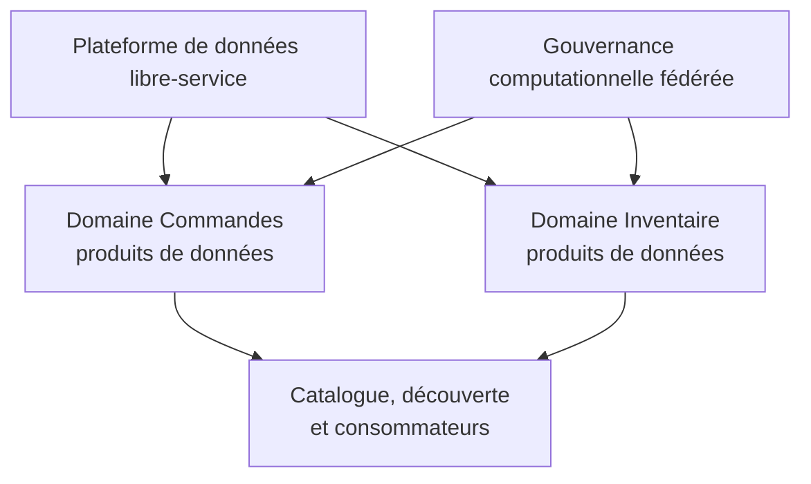
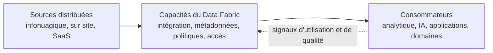

# Data Mesh et Data Fabric — Propriété, plateforme et diffusion événementielle

> Partie du **Guide Kafka Engineering** de `org-rd-fullstack-springboot-eda`. Voir le [LISEZ_MOI du projet](./LISEZ_MOI.md).

**Portée :** expliquer le Data Mesh et le Data Fabric sans les présenter comme des produits concurrents. Le Data Mesh est un modèle d'exploitation sociotechnique fondé sur la propriété par domaine, les produits de données, une plateforme libre-service et une gouvernance computationnelle fédérée. Le Data Fabric est une approche architecturale qui relie les données distribuées au moyen de capacités partagées d'intégration, de métadonnées, de gouvernance et d'accès. Ce guide les compare, explique comment la diffusion événementielle peut soutenir les deux et propose un modèle hybride pragmatique.

## Table des matières

- [Vue d'ensemble](#vue-densemble)
- [Data Mesh : propriété et produits de données](#data-mesh--propriété-et-produits-de-données)
- [Data Fabric : intégration et capacités partagées](#data-fabric--intégration-et-capacités-partagées)
- [Comparaison](#comparaison)
- [Rôle d'EDA et de Kafka](#rôle-deda-et-de-kafka)
- [Modèle d'exploitation hybride](#modèle-dexploitation-hybride)
- [Choisir une approche](#choisir-une-approche)
- [Alignement de ce projet](#alignement-de-ce-projet)
- [Pratiques d'adoption et antipatrons](#pratiques-dadoption-et-antipatrons)
- [Sources et lectures associées](#sources-et-lectures-associées)

## Vue d'ensemble

Le Data Mesh et le Data Fabric abordent des dimensions différentes de la gestion des données d'entreprise :

- **Le Data Mesh demande qui possède les données et comment les équipes de domaine les rendent fiables et réutilisables.**
- **Le Data Fabric demande comment les données distribuées peuvent être découvertes, reliées, gouvernées et consultées de façon cohérente.**

Ces approches sont complémentaires. Un Data Mesh a besoin de capacités de plateforme partagées afin que chaque domaine ne reconstruise pas l'ingestion, le catalogage, la sécurité et l'observabilité. Un Data Fabric bénéficie d'une propriété explicite par domaine afin que la connectivité technique ne produise pas des jeux de données mal compris ou sans responsable.

Aucun de ces termes ne désigne une technologie unique :

- un Data Mesh n'est pas créé simplement en divisant les applications en microservices ou en attribuant des topics Kafka à chaque équipe;
- un Data Fabric ne correspond pas nécessairement à un lac, à un cluster ou à un produit fournisseur centralisé unique;
- Kafka peut soutenir l'une ou l'autre approche, mais ne fournit à lui seul ni le modèle d'exploitation ni une gouvernance complète des données.

## Data Mesh : propriété et produits de données

Le Data Mesh a été introduit comme une approche sociotechnique décentralisée pour les données analytiques à grande échelle. Il répartit la responsabilité entre les domaines métier les plus proches de la signification et de la production des données.

Ses quatre principes fondateurs sont les suivants :

1. **Propriété décentralisée et orientée domaine** — les équipes de domaine possèdent les données qu'elles produisent et comprennent.
2. **Données considérées comme un produit** — les données sont conçues pour leurs consommateurs et assorties d'attentes explicites de qualité, d'utilisabilité et de soutien.
3. **Plateforme de données libre-service** — une équipe de plateforme fournit des capacités réutilisables permettant aux domaines de créer et d'exploiter des produits sans devenir spécialistes de l'infrastructure.
4. **Gouvernance computationnelle fédérée** — les représentants des domaines et les responsables de la plateforme définissent des règles globales d'interopérabilité et de politique, automatisées lorsque cela est possible.

### Ce qui constitue un produit de données

Une table, un fichier, une API ou un topic Kafka n'est qu'une interface de livraison. Un produit de données utilisable exige également :

- un responsable désigné et un modèle de soutien;
- une signification métier stable et un contexte de domaine délimité;
- des schémas, une sémantique et des exemples documentés;
- des mécanismes de découverte et des directives d'accès;
- des indicateurs de qualité et des objectifs de niveau de service (SLO);
- une classification de sécurité ainsi que des règles d'autorisation et de conservation;
- des politiques de versionnement, de compatibilité et de retrait;
- des métadonnées d'utilisation, de lignage et de santé opérationnelle.

Un produit de données peut exposer des événements, des fichiers par lots, des tables, des API ou plusieurs interfaces. Le Data Mesh n'exige pas Kafka et ne remplace pas les entrepôts ni les lacs de données.

### Principaux bénéfices et risques

Le Data Mesh peut réduire les goulots d'étranglement d'une équipe centrale et rapprocher la responsabilité de la qualité de la source. Son principal risque est une décentralisation non maîtrisée : des sémantiques incohérentes, une infrastructure dupliquée et une qualité inégale apparaissent lorsque la propriété par domaine est instaurée sans plateforme libre-service efficace ni normes globales applicables.

## Data Fabric : intégration et capacités partagées

Le Data Fabric est une approche d'architecture de données visant à faciliter la découverte, l'intégration, la gouvernance et la consommation de données distribuées et hétérogènes dans des environnements sur site, infonuagiques et SaaS. Il crée une expérience unifiée au moyen de services et de métadonnées partagés; il n'exige pas le déplacement physique de toutes les données vers un dépôt unique.

Les capacités courantes comprennent :

- les connecteurs, l'ingestion, la capture de changements et l'intégration événementielle;
- le catalogage, le lignage, les métadonnées sémantiques et les relations de connaissances;
- la virtualisation des données, les API, les requêtes et plusieurs modes de livraison;
- la qualité des données, l'application des politiques ainsi que les contrôles de sécurité et de confidentialité;
- l'orchestration, la transformation et l'automatisation du cycle de vie;
- l'observabilité des pipelines, des produits, des accès et des coûts.

Les métadonnées actives, les règles et l'apprentissage automatique peuvent automatiser la classification, les contrôles de qualité, le lignage ou l'optimisation. L'IA et l'apprentissage automatique peuvent bonifier un Data Fabric, mais ne sont pas indispensables à l'établissement de capacités partagées d'intégration et de gouvernance.

### Principaux bénéfices et risques

Un Data Fabric peut réduire la fragmentation des outils, améliorer la découverte et appliquer des contrôles communs à des systèmes hétérogènes. Son principal risque est de devenir un programme technologique dépourvu de responsables et de résultats pour les consommateurs. Un catalogue sans responsables imputables ou une couche de virtualisation reposant sur des sources de mauvaise qualité facilite la découverte des problèmes, sans les résoudre.

## Comparaison

| Dimension | **Data Mesh** | **Data Fabric** |
| --- | --- | --- |
| Nature | Modèle d'exploitation sociotechnique | Approche d'architecture et de capacités de données |
| Question principale | Qui possède et fournit des données fiables? | Comment les données distribuées sont-elles reliées, gouvernées et consultées? |
| Unité d'organisation | Produit de données possédé par un domaine | Capacités partagées d'intégration, de métadonnées et d'accès |
| Propriété | Décentralisée vers les domaines | Compatible avec une propriété centralisée, fédérée ou par domaine |
| Gouvernance | Décisions fédérées et politiques globales automatisées | Services de politiques communs et application pilotée par les métadonnées |
| Plateforme | Une plateforme libre-service permet l'autonomie des domaines | Les capacités du Fabric assurent l'interopérabilité entre les plateformes |
| Emplacement des données | Polyglotte et distribué | Polyglotte et distribué; la centralisation est facultative |
| Interfaces de livraison | Événements, tables, fichiers, API et flux | Déplacement physique, virtualisation, API, requêtes et événements |
| Indicateurs de réussite | Adoption des produits, qualité, satisfaction des consommateurs et délai des domaines | Découverte, interopérabilité, couverture des politiques, réutilisation et délai d'accès |
| Mode d'échec courant | Décentralisation sans normes ni soutien de la plateforme | Couche technologique centrale sans propriété ni données sources fiables |

Le coût, la capacité de mise à l'échelle et la conformité ne favorisent pas intrinsèquement un modèle. Ils dépendent du nombre de produits, de la conception de la plateforme, de l'automatisation, de la structure organisationnelle, des exigences réglementaires et du degré de duplication des capacités.

## Rôle d'EDA et de Kafka

La diffusion événementielle constitue l'un des fondements possibles du déplacement de données en temps réel et des produits de données orientés événements. Elle est utile lorsque les consommateurs ont besoin de mises à jour à faible latence, de rejeu ou de traitements indépendants.

Kafka et la plateforme qui l'entoure peuvent fournir :

- des topics durables comme interfaces de produits événementiels;
- des schémas et des règles de compatibilité au moyen de Schema Registry;
- l'ingestion et la livraison au moyen de Kafka Connect;
- des transformations au moyen de Flink ou d'autres moteurs de traitement de flux;
- la découverte, les métadonnées de propriété, les étiquettes et le lignage au moyen d'un catalogue de flux;
- le contrôle des accès, la conservation, l'observabilité et les métriques de retard des consommateurs.

Ces capacités peuvent mettre en œuvre une partie d'une plateforme libre-service ou d'un Data Fabric. Elles deviennent une composante d'un Data Mesh seulement lorsque les domaines possèdent des produits de données bien définis et participent à une gouvernance fédérée.

> **Un topic n'est pas automatiquement un produit de données, et un cluster Kafka n'est pas automatiquement un Data Fabric.** La technologie rend le modèle possible; la propriété, les contrats, la qualité et la gouvernance le complètent.

Les interfaces par lots, sous forme de tables ou d'API demeurent valides. Un produit doit exposer les interfaces nécessaires à ses consommateurs plutôt que d'imposer un flux événementiel à chaque cas d'usage.

## Modèle d'exploitation hybride

Une combinaison courante répartit les responsabilités comme suit :

| Participant | Responsabilités principales |
| --- | --- |
| **Équipes de domaine** | Sémantique métier, qualité près de la source, feuille de route du produit, schémas, SLO, cycle de vie et soutien aux consommateurs |
| **Équipe de plateforme de données** | Approvisionnement libre-service, connecteurs, services de stockage et de diffusion, intégration au catalogue, automatisation des politiques, observabilité et modèles de référence |
| **Groupe de gouvernance fédérée** | Identifiants globaux, interopérabilité, classifications, contrôles minimaux, règles de conservation et résolution des différends entre domaines |
| **Consommateurs** | Utilisation correcte, respect des accès, rétroaction, signalement des problèmes et participation à l'évolution des contrats |

Dans ce modèle, le Data Mesh définit la propriété et le comportement des produits, tandis que les capacités du Data Fabric mettent en œuvre une grande partie de la plateforme technique partagée. L'équilibre est volontaire : les domaines contrôlent la signification et l'évolution locale; la plateforme automatise l'infrastructure non différenciatrice; la gouvernance normalise uniquement ce qui doit être interopérable à l'échelle globale.

Le modèle hybride n'exige pas un cluster Kafka, un lac ou un catalogue distinct pour chaque domaine. La propriété logique et les limites d'accès peuvent coexister dans une infrastructure multilocataire sécurisée.

## Choisir une approche

| Situation | Orientation appropriée |
| --- | --- |
| L'équipe centrale de données constitue le principal goulot de livraison et les domaines sont suffisamment matures pour posséder des produits | Introduire progressivement les principes d'exploitation du Data Mesh |
| Les données sont fragmentées entre plusieurs plateformes et difficiles à découvrir, à relier ou à gouverner | Investir dans les capacités d'un Data Fabric |
| La propriété et la fragmentation technique posent toutes deux problème | Combiner les produits possédés par les domaines aux services partagés du Fabric ou de la plateforme |
| L'organisation est petite, les domaines sont mal définis ou la demande de produits est limitée | Commencer par une propriété explicite, un catalogue et des contrôles communs; éviter un vaste programme de transformation |

Avant d'adopter l'une de ces étiquettes, il faut définir le problème, les résultats recherchés, les équipes responsables et les indicateurs de réussite. « Mettre en œuvre un Data Mesh » ou « acheter un Data Fabric » ne constitue pas une exigence suffisante.

## Alignement de ce projet

Ce bac à sable ne constitue ni un Data Mesh complet ni un Data Fabric. Il s'agit d'une application pédagogique unique reposant sur une base de données partagée et un petit nombre de topics Kafka. Il présente toutefois des composants qui pourraient participer à l'une ou l'autre approche :

- les topics Kafka peuvent devenir des interfaces de produits événementiels lorsque leur propriété, leur sémantique et leurs SLO sont explicites;
- les schémas et les types Java fournissent un contrat implicite, mais une plateforme de production devrait externaliser la découverte, la compatibilité et les métadonnées de propriété;
- les capacités partagées de Kafka, de surveillance et de mise à l'échelle ressemblent à une couche de plateforme ou de Fabric;
- les sémantiques de livraison, l'idempotence et le rejeu illustrent le travail de fiabilité nécessaire à un produit digne de confiance.

Pour évoluer vers un modèle hybride d'entreprise :

1. définir les domaines métier et désigner un responsable de produit pour chaque jeu de données ou flux d'événements publié;
2. enregistrer dans un catalogue les topics, schémas, connecteurs, responsables, classifications et lignages;
3. définir des SLO de fraîcheur, de qualité, de disponibilité et de compatibilité pour les produits;
4. fournir des modèles libre-service pour les topics sécurisés, les schémas, la surveillance et le CI/CD;
5. automatiser les politiques globales tout en laissant la sémantique des domaines aux équipes concernées;
6. mesurer l'adoption, la qualité, l'effort de soutien et le temps nécessaire pour intégrer les consommateurs.

Le Stream Catalog de Confluent peut soutenir la découverte et les métadonnées métier des topics, schémas, connecteurs et autres entités de diffusion, mais le catalogue ne remplace ni la propriété ni la gestion de produit.

## Pratiques d'adoption et antipatrons

### Pratiques

- **Commencez par un projet pilote délimité.** Choisissez des domaines ayant de vrais consommateurs et une difficulté mesurable.
- **Définissez le produit avant la plateforme.** Identifiez les utilisateurs, les décisions, les interfaces, la qualité et les attentes de soutien.
- **Exploitez la plateforme comme un produit.** Mesurez l'adoption, l'expérience de développement, la fiabilité et le temps économisé.
- **Automatisez les contrôles globaux.** Appliquez les politiques de classification, de compatibilité, d'accès et de conservation au moyen d'outils réutilisables.
- **Prenez en charge plusieurs modes de livraison.** Les événements, tables, fichiers et API peuvent représenter la même signification de domaine pour des consommateurs différents.
- **Gérez le cycle de vie complet.** Incluez le versionnement, le retrait, la suppression, le rejeu et la responsabilité des incidents.
- **Mesurez les résultats.** Suivez le délai entre la découverte et l'accès, la réutilisation, la qualité, l'atteinte des SLO et la satisfaction des consommateurs.

### Antipatrons

- Rebaptiser chaque topic ou microservice « produit de données ».
- Présenter un lac centralisé, un catalogue ou un outil d'intégration comme un Data Fabric complet.
- Décentraliser la propriété sans plateforme libre-service ni règles globales d'interopérabilité.
- Construire une plateforme centrale qui ne laisse aux domaines aucune responsabilité quant à la signification ou à la qualité.
- Dupliquer l'infrastructure par domaine lorsque l'isolation logique serait suffisante.
- Considérer l'automatisation par IA ou apprentissage automatique comme obligatoire avant d'établir les fondements des métadonnées et de la gouvernance.

## Sources et lectures associées

- [Zhamak Dehghani — Principes et architecture logique du Data Mesh](https://martinfowler.com/articles/data-mesh-principles.html)
- [IBM — Qu'est-ce qu'un Data Fabric?](https://www.ibm.com/fr-fr/think/topics/data-fabric)
- [Confluent Cloud — Stream Catalog](https://docs.confluent.io/cloud/current/stream-governance/stream-catalog.html)
- [Confluent Cloud — Stream Lineage](https://docs.confluent.io/cloud/current/stream-governance/stream-lineage.html)
- [Architecture et conception des topics](./architecture_et_conception_des_topics.md)
- [Gouvernance et observabilité](./gouvernance_et_observabilite.md)
- [Mise à l'échelle et arrêt](./distribution_scale_et_arret.md)