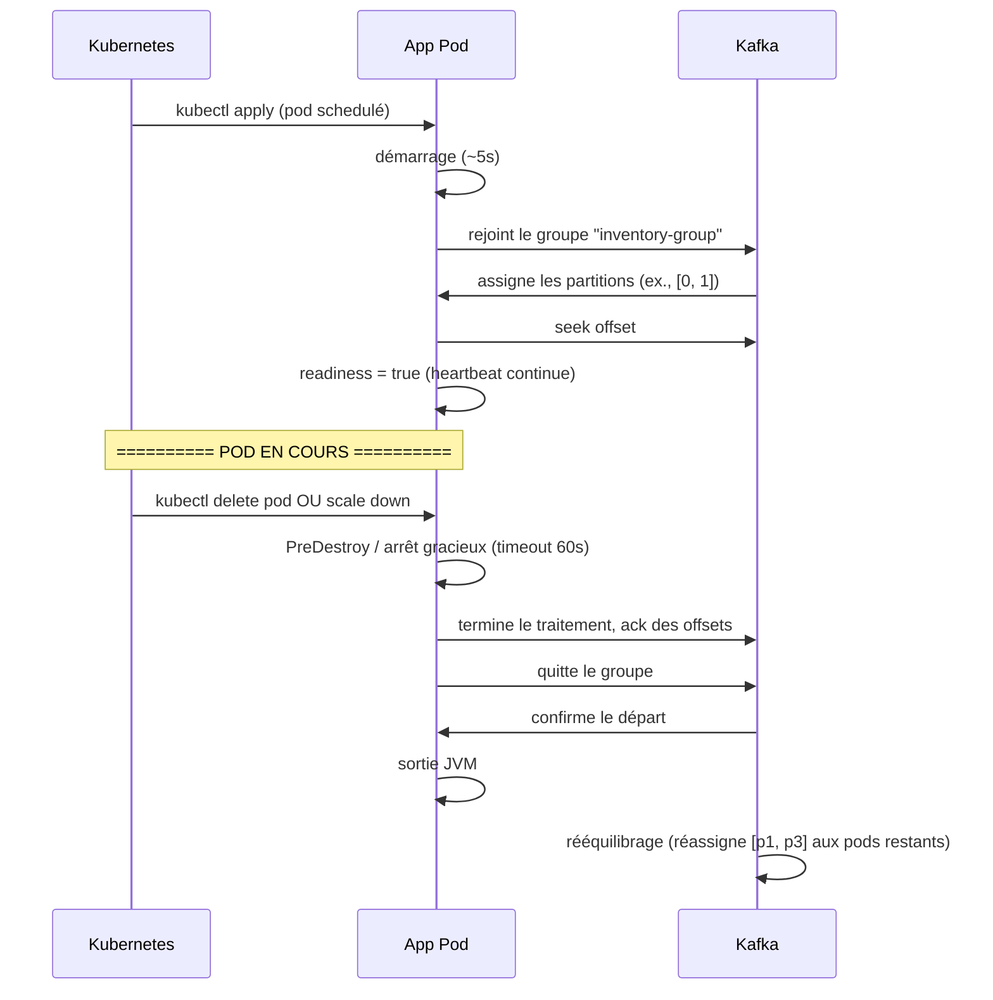

# Distribution, élasticité et Arrêt dans les environnements distribués

> Partie du **Guide Kafka Engineering** de `org-rd-fullstack-springboot-eda`. Voir le [LISEZ_MOI du projet](./LISEZ_MOI.md).

**Portée :** comment le parallelisme des consommateurs Kafka évolue sur **Amazon EKS** (la relation entre pods, threads et partitions, et pourquoi le nombre de partitions plafonne le parallélisme atteignable), comment les partitions sont réassignées lors des événements de scaling, les pièges des partitions « chaudes » et du skew de clés, et pourquoi la nature éphémère des pods fait de l'arrêt gracieux une exigence stricte — avec des modèles Spring Boot / Spring Kafka concrets pour arrêter les consommateurs et vider (flush) les producteurs proprement, afin d'éviter rééquilibrages, doublons et pertes de messages.

## Table des matières

- [Vue d'ensemble](#vue-densemble)
- [Processus, threads et partitions sur EKS](#processus-threads-et-partitions-sur-eks)
- [Déploiement d'une application Kafka sur EKS](#déploiement-dune-application-kafka-sur-eks)
- [Scaling horizontal et rééquilibrage](#scaling-horizontal-et-rééquilibrage)
- [Plafonds de parallélisme](#plafonds-de-parallélisme)
- [Partitions chaudes et skew](#partitions-chaudes-et-skew)
- [Stratégies de mitigation](#stratégies-de-mitigation)
- [Arrêt gracieux sur EKS](#arrêt-gracieux-sur-eks)
- [Bonnes pratiques](#bonnes-pratiques)
- [Points clés](#points-clés)
- [Lectures associées](#lectures-associées)

## Vue d'ensemble

Quand vous déployez l'application du sandbox sur EKS, Kubernetes gère l'ordonnancement (scheduling) des pods, l'allocation des nœuds, le networking, etc. Cela simplifie l'infrastructure mais ajoute des couches de complexité à l'orchestration des consommateurs Kafka : les partitions sont réassignées au gré des pods qui arrivent et partent, le parallélisme est plafonné par la disposition du topic, et chaque arrêt de pod doit être géré proprement.

## Processus, threads et partitions sur EKS

Dans un environnement Kubernetes tel qu'**Amazon EKS**, les consommateurs Kafka sont généralement déployés sous forme de **plusieurs réplicas de pods**. Chaque pod exécute un **processus consommateur**, et à l'intérieur de ce processus l'application peut utiliser un ou plusieurs **threads** pour traiter les enregistrements.

Kafka impose une règle stricte : **une partition ne peut être consommée que par une seule instance de consommateur au sein d'un groupe de consommateurs à un instant donné.** Cela implique :

* Augmenter le nombre de pods consommateurs n'accroît le parallélisme **que jusqu'au nombre de partitions**.
* Les threads d'un même processus consommateur n'augmentent pas le parallélisme côté Kafka, sauf s'ils sont explicitement mappés à des partitions indépendantes.

Par conséquent, le nombre de partitions d'un topic définit de fait le **parallélisme maximal atteignable** pour les consommateurs, quel que soit le nombre de pods ou de threads déployés. Ce seul fait détermine la plupart des compromis abordés dans la suite de ce guide.

## Déploiement d'une application Kafka sur EKS

### Spec Kubernetes typique

```yaml
apiVersion: apps/v1
kind: Deployment
metadata:
  name: inventory-service
spec:
  replicas: 3  # 3 pods, chacun un consommateur Kafka
  selector:
    matchLabels:
      app: inventory-service
  template:
    metadata:
      labels:
        app: inventory-service
    spec:
      containers:
      - name: app
        image: myregistry/inventory-service:1.0.0
        env:
        - name: KAFKA_BOOTSTRAP_SERVERS
          value: "kafka-broker-1:9092,kafka-broker-2:9092,kafka-broker-3:9092"
        - name: KAFKA_GROUP_ID
          value: "inventory-group"
        - name: KAFKA_CONCURRENCY
          value: "3"
        ports:
        - containerPort: 8080
        livenessProbe:
          httpGet:
            path: /actuator/health/liveness
            port: 8080
          initialDelaySeconds: 30
          periodSeconds: 10
        readinessProbe:
          httpGet:
            path: /actuator/health/readiness
            port: 8080
          initialDelaySeconds: 10
          periodSeconds: 5
      terminationGracePeriodSeconds: 60  # arrêt gracieux : 60s max
      affinity:
        podAntiAffinity:  # répartit les réplicas sur différents nœuds
          preferredDuringSchedulingIgnoredDuringExecution:
          - weight: 100
            podAffinityTerm:
              labelSelector:
                matchExpressions:
                - key: app
                  operator: In
                  values:
                  - inventory-service
              topologyKey: kubernetes.io/hostname
```

### Cycle de vie du pod



## Scaling horizontal et rééquilibrage

Quand vous changez le nombre de réplicas (ex., `kubectl scale deployment inventory-service --replicas=5`), les pods supplémentaires sont schedulés et le groupe de consommateurs Kafka se rééquilibre.

### Exemple : scale de 3 à 5 pods

**Avant :**

```
Pods: Pod-A, Pod-B, Pod-C
Topic APP-Kafka-Requests: 8 partitions
Partitions assignées:
  Pod-A : [p0, p1]
  Pod-B : [p2, p3]
  Pod-C : [p4, p5, p6, p7]
```

**Après scale à 5 :**

```
Kubernetes démarre 2 nouveaux pods: Pod-D, Pod-E
Le groupe de consommateurs Kafka détecte 5 membres
Rééquilibrage déclenché (max 60s + backoff)

Nouvelles assignations:
  Pod-A : [p0]
  Pod-B : [p2]
  Pod-C : [p4, p5]
  Pod-D : [p1, p3]
  Pod-E : [p6, p7]
```

**Impact :**

- Pendant le rééquilibrage (~30s), les pods ne traitent pas les messages (pause).
- Nouvelles partitions assignées → seek de l'offset au dernier commité.
- Après le rééquilibrage, les anciens pods cessent de traiter leurs anciennes partitions.

### Exemple : scale de 5 à 3 pods

```
Kubernetes arrête Pod-D, Pod-E
Le groupe de consommateurs détecte 3 membres
Rééquilibrage déclenché

Nouvelles assignations:
  Pod-A : [p0, p1]
  Pod-B : [p2, p3]
  Pod-C : [p4, p5, p6, p7]
```

L'impact est similaire : une pause de rééquilibrage, puis la consommation reprend avec la nouvelle distribution.

## Plafonds de parallélisme

Rappel : **le nombre utile de threads consommateurs est plafonné par le nombre de partitions.**

```
Topic: 8 partitions
Pods: 1 → parallélisme = min(1, 8) = 1
Pods: 3 → parallélisme = min(3 * concurrence, 8) = min(3*3, 8) = 8 (max utile)
Pods: 5 → parallélisme = min(5 * concurrence, 8) = 8 (max utile, excédent inactif)
```

**Au-delà du plafond, le scaling n'aide plus :**

- Plus de pods que de partitions → les threads excédentaires restent inactifs.
- Allouer plus de CPU n'aide pas ; Kafka occupe déjà tous les threads actifs.

**Leçon :** dimensionner les partitions pour le pic de parallélisme attendu (ex., si vous prévoyez 10 pods avec concurrence=3, planifiez ~30 partitions, peut-être 24 pour garder de la marge face au skew et aux partitions chaudes).

## Partitions chaudes et skew

Une **partition chaude** est une partition que presque tout le trafic visite, tandis que les autres restent vides. Cela arrive avec des clés biaisées (ex., une région dominante, ou un `country_code` dont 90% du trafic atterrit dans un seul pays).

### Exemple : partition chaude

```
Topic: 8 partitions, clé = product_id (biaisée)

Distribution des clés:
  Partition-0 (product_ids 1-10k)      : 1% du trafic (inactif)
  Partition-1 (product_ids 10k-20k)    : 2% du trafic
  ...
  Partition-3 (product_ids 30k-40k)    : 85% du trafic  ← CHAUDE
  ...
  Partition-7 (product_ids 70k-80k)    : 1% du trafic

Si un seul pod traite Partition-3 : ce pod est pleinement chargé
Les autres pods traitent des partitions tranquilles : sous-utilisés
```

**Impact :**

- Le débit global est limité par la partition chaude, pas par le nombre de pods.
- Le scaling n'aide pas ; la partition chaude demeure le goulot d'étranglement.

### Mitigation

1. **Redessiner la clé de partition** — plutôt que `product_id`, utiliser `hash(product_id + random_salt)` pour disperser artificiellement les produits chauds.
2. **Re-partitionner le topic** — augmenter le nombre de partitions (avec PRÉCAUTION : cela change le mapping clé→partition).
3. **Accepter la contrainte** — si la partition chaude représente 85% du trafic et qu'une instance le traite à pleine capacité, c'est un chiffre, pas un bug.

## Stratégies de mitigation

### 1. Pod Affinity pour la localité

Placer les pods près des brokers Kafka pour minimiser la latence réseau :

```yaml
affinity:
  podAffinity:
    preferredDuringSchedulingIgnoredDuringExecution:
    - weight: 100
      podAffinityTerm:
        labelSelector:
          matchExpressions:
          - key: component
            operator: In
            values:
            - kafka-broker
        topologyKey: kubernetes.io/hostname
```

### 2. Pod Disruption Budgets (PDB) pour atténuer le rééquilibrage

```yaml
apiVersion: policy/v1
kind: PodDisruptionBudget
metadata:
  name: inventory-service-pdb
spec:
  minAvailable: 2  # garde au moins 2 pods en vie (moins de rééquilibrages)
  selector:
    matchLabels:
      app: inventory-service
```

### 3. Autoscaling basé sur le lag Kafka (KEDA)

Voir [Élasticité horizontale sur EKS (KEDA + Karpenter)](./elasticite_horizontale_eks.md).

## Arrêt gracieux sur EKS

Sur **Amazon EKS**, les pods sont par nature **éphémères**. Ils peuvent être arrêtés ou remplacés à tout moment en raison d'événements de scaling, de déploiements progressifs (rolling), de pannes de nœuds ou de décisions de replanification prises par le control plane Kubernetes. Pour les producteurs et consommateurs Kafka, cela fait de l'**arrêt gracieux une exigence critique** plutôt qu'une optimisation optionnelle.

Lorsqu'un pod consommateur est arrêté brutalement :

* La propriété des partitions peut être révoquée de façon inattendue, déclenchant un **rééquilibrage du groupe de consommateurs**.
* Des messages en cours de traitement peuvent rester non traités ou être traités plus d'une fois.
* Les offsets peuvent ne pas être commités correctement, entraînant des **doublons ou une perte de messages**, selon les sémantiques de livraison.

Pour atténuer ces risques, les applications Kafka sur EKS doivent gérer le signal de terminaison Kubernetes (`SIGTERM`), cesser de poller de nouveaux enregistrements tout en laissant le traitement en cours se terminer, commiter les offsets avant l'arrêt, et fermer proprement les clients Kafka afin que la révocation des partitions et le rééquilibrage se déroulent de manière ordonnée. Les producteurs doivent de même vider (flush) et faire acquitter les enregistrements en tampon avant que le pod ne se termine.

### Configuration Kubernetes (EKS)

L'arrêt gracieux sur EKS est orchestré par `terminationGracePeriodSeconds`, dimensionné pour couvrir le délai optionnel `preStop` plus la propre phase d'arrêt de l'application :

```yaml
spec:
  terminationGracePeriodSeconds: 60   # fenêtre SIGTERM → SIGKILL
  containers:
    - name: kafka-app
      image: my-kafka-app:latest
      lifecycle:
        preStop:
          exec:
            # laisse les endpoints se désenregistrer et le travail en cours se drainer avant SIGTERM
            command: ["sh", "-c", "sleep 10"]
```

### Chronologie SIGTERM → SIGKILL

Quand Kubernetes met fin à un pod :

1. Le pod reçoit `SIGTERM`.
2. L'application dispose de `terminationGracePeriodSeconds` au maximum pour s'arrêter proprement (terminer les travaux, commiter les offsets, vider les producteurs).
3. Après la période de grâce, Kubernetes envoie `SIGKILL` (arrêt forcé, aucune négociation).

Pour des pods Kafka-heavy, 60s suffit souvent. Pour des workloads plus lourds, augmentez la valeur (ex., jusqu'à 120s). À noter : ce délai n'est **pas garanti** : si le nœud lui-même est perdu (panne machine), il n'y a aucun arrêt gracieux.

### Consommateur Kafka (Spring Kafka)

L'arrêt gracieux de Spring Boot draine les requêtes web en cours, et les conteneurs de listener Spring Kafka implémentent `SmartLifecycle` : ils sont donc arrêtés à la fermeture du contexte applicatif — pendant la phase d'arrêt bornée par `timeout-per-shutdown-phase`. Gardez ce délai suffisamment long pour que les enregistrements en cours se terminent et que les offsets soient commités, et plus court que `terminationGracePeriodSeconds`.

```yaml
server:
  shutdown: graceful                    # draine les requêtes web en cours sur SIGTERM
spring:
  lifecycle:
    timeout-per-shutdown-phase: 45s     # fenêtre de grâce pour les beans SmartLifecycle (dont les conteneurs de listener Kafka)
  kafka:
    listener:
      ack-mode: manual                  # commit des offsets uniquement après traitement réussi
```

> ⚠️ L'acquittement manuel est recommandé lorsque le traitement du message doit se terminer avant que les offsets ne soient commités.

**Exemple de consommateur :**

```java
@KafkaListener(
    topics = "orders",
    groupId = "order-consumers"
)
public void consume(
        ConsumerRecord<String, String> record,
        Acknowledgment acknowledgment
) {
    process(record);
    acknowledgment.acknowledge();
}
```

Pendant l'arrêt, Spring cesse de poller de nouveaux enregistrements, les enregistrements en cours sont traités, et les offsets sont commités avant la révocation des partitions.

### Producteur Kafka (Spring Kafka)

Assurez-vous que le producteur vide (flush) les messages en tampon lors de l'arrêt :

```yaml
spring:
  kafka:
    producer:
      acks: all
      retries: 3
```

Spring Boot ferme automatiquement le `KafkaTemplate` à l'arrêt du contexte applicatif, ce qui déclenche un `flush()` sur le producteur sous-jacent.

**Exemple de producteur :**

```java
@Service
public class OrderProducer {

    private final KafkaTemplate<String, String> kafkaTemplate;

    public OrderProducer(KafkaTemplate<String, String> kafkaTemplate) {
        this.kafkaTemplate = kafkaTemplate;
    }

    public void sendOrder(String orderId, String payload) {
        kafkaTemplate.send("orders", orderId, payload);
    }
}
```

### Gérer l'arrêt explicitement (optionnel)

Pour plus de contrôle, vous pouvez vous brancher sur le cycle de vie Spring :

```java
@Component
public class ShutdownHandler {

    private final KafkaTemplate<?, ?> kafkaTemplate;

    public ShutdownHandler(KafkaTemplate<?, ?> kafkaTemplate) {
        this.kafkaTemplate = kafkaTemplate;
    }

    @PreDestroy
    public void onShutdown() {
        kafkaTemplate.flush();
    }
}
```

## Bonnes pratiques

- ✅ **Planifiez les partitions pour le pic de parallélisme** — ex., 10 pods, concurrence 3 → 24-32 partitions.
- ✅ **Utilisez les readiness probes** — `/actuator/health/readiness` signale quand le pod est prêt à recevoir du trafic.
- ✅ **Répartissez les réplicas via l'anti-affinity** — une panne de nœud ne doit pas tuer tous les pods.
- ✅ **Configurez les PDB** — minimise les interruptions pendant les mises à jour progressives.
- ✅ **Testez le scaling** — changez les réplicas et vérifiez que le lag Kafka n'explose pas pendant le rééquilibrage.
- ✅ **Dimensionnez `terminationGracePeriodSeconds` en fonction de l'application** — période de grâce ≥ délai preStop + `timeout-per-shutdown-phase`.
- ⚠️ **Ne dépassez pas le nombre de partitions** — les pods excédentaires restent inactifs et n'ajoutent rien au débit.
- ⚠️ **Attention aux partitions chaudes** — le scaling ne résout pas le biais de clé.
- ⚠️ **Les timeouts gracieux ne sont pas garantis** — si Kubernetes perd le nœud (panne machine), il n'y a aucun arrêt gracieux.

## Points clés

* **Les pods sont éphémères** sur EKS ; les arrêts sont attendus et fréquents.
* C'est le nombre de partitions — et non le nombre de pods ou de threads — qui fixe le plafond du parallélisme des consommateurs.
* Les rééquilibrages interrompent brièvement la consommation ; faites évoluer l'échelle de façon délibérée et surveillez le lag.
* Spring Kafka s'intègre naturellement au cycle de vie Kubernetes : les consommateurs doivent cesser de poller, terminer le traitement et commiter les offsets ; les producteurs doivent vider les enregistrements en attente.
* Un arrêt gracieux correct minimise les rééquilibrages, les doublons et la perte de messages.

## Lectures associées

- [Élasticité horizontale sur EKS (KEDA + Karpenter)](./elasticite_horizontale_eks.md)
- [Cycle de vie et opérations](./cycle_vie_et_operations.md)
- [Architecture & Conception des Topics](./architecture_et_conception_des_topics.md)

Le modèle de parallélisme ci-dessus (les partitions plafonnent le parallélisme des consommateurs) explique aussi *pourquoi* l'autoscaling basé sur le CPU/mémoire est inadapté aux consommateurs Kafka. Pour scaler ces pods correctement sur EKS — **KEDA** pilotant les réplicas à partir du lag de consommation et **Karpenter** provisionnant les nœuds — voir [Élasticité horizontale sur EKS (KEDA + Karpenter)](./elasticite_horizontale_eks.md).
