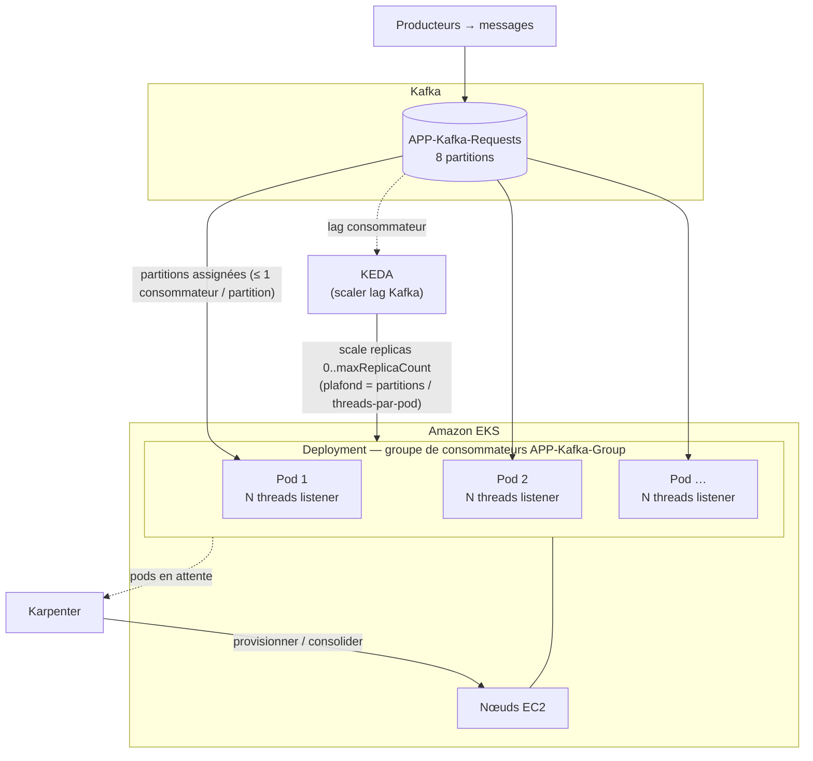
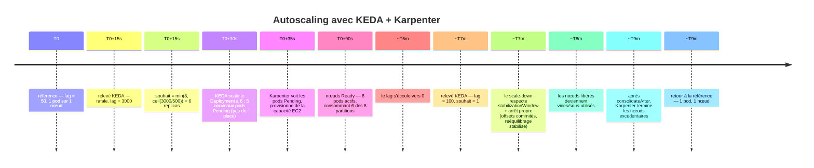

# Élasticité horizontale sur EKS : pourquoi l'autoscaling classique échoue, et comment KEDA + Karpenter le corrigent

> Partie du **Guide Kafka Engineering** de `org-rd-fullstack-springboot-eda`. Voir le [LISEZ_MOI du projet](./LISEZ_MOI.md).

**Portée :** comment scaler les pods consommateurs Kafka de cette application sur **Amazon EKS**. Ce guide explique pourquoi l'autoscaler Kubernetes *classique* (HPA sur CPU/mémoire) est le **mauvais outil** pour un consommateur Kafka, comment **KEDA** (autoscaling de pods piloté par le lag) et **Karpenter** (provisionnement de nœuds à la demande) forment le bon modèle à deux couches, et les pièges propres au projet (plafond des partitions, nombre de threads par pod, état du cluster Hazelcast, et le chemin Flink non scalable).

Ce document s'appuie directement sur le modèle de parallélisme pods/threads/partitions et sur les exigences d'arrêt propre décrites dans [Distribution, scaling et arrêt en environnement distribué](./distribution_scale_et_arret.md) — à lire d'abord.

## Table des matières

- [Pourquoi l'élasticité « classique » fonctionne mal ici](#pourquoi-lélasticité--classique--fonctionne-mal-ici)
- [Le bon modèle : deux couches d'élasticité](#le-bon-modèle--deux-couches-délasticité)
- [KEDA — scaler les pods sur le lag](#keda--scaler-les-pods-sur-le-lag)
- [Karpenter — scaler les nœuds à la demande](#karpenter--scaler-les-nœuds-à-la-demande)
- [Exemple de bout en bout](#exemple-de-bout-en-bout-une-rafale-du-début-à-la-fin)
- [Pièges propres au projet](#pièges-propres-au-projet)
- [Points clés](#points-clés)

## Pourquoi l'élasticité « classique » fonctionne mal ici

Le **HorizontalPodAutoscaler (HPA)** Kubernetes par défaut scale les replicas sur le **CPU et la mémoire**. Pour un consommateur Kafka, c'est le mauvais signal, pour quatre raisons indépendantes :

1. **Le vrai signal de retard, c'est le lag, pas le CPU.** Un consommateur peut prendre beaucoup de retard (lag élevé) alors que son CPU reste bas : il passe son temps à attendre le poll du broker, le verrou Hazelcast ou le commit JPA/DB (tout cela est de l'I/O, pas du CPU). L'HPA voit un pod qui semble inactif et **ne scale pas** précisément au moment où le retard grandit. À l'inverse, un pic de CPU sans lien avec le lag peut faire scaler le groupe sans aucun gain de débit.

2. **Le nombre de partitions est un plafond dur.** Kafka autorise **au plus un consommateur actif par partition au sein d'un groupe de consommateurs**. Avec 8 partitions, le 9ᵉ consommateur est **inactif** — il ne possède rien. L'HPA ignore ce plafond : il créera volontiers des replicas qui ne consomment aucun enregistrement (gaspillage de nœuds et déclenchement de rééquilibrages). Voir la règle de parallélisme dans [distribution_scale_et_arret](./distribution_scale_et_arret.md#processus-threads-et-partitions-sur-eks).

3. **Le battement provoque des tempêtes de rééquilibrage.** Chaque événement de scaling modifie la composition du groupe et déclenche un **rééquilibrage du groupe de consommateurs**, pendant lequel la consommation est suspendue. Un HPA piloté par le CPU qui oscille de haut en bas rééquilibre le groupe en continu, ce qui *réduit* le débit — l'inverse de l'objectif.

4. **Pas de scale-to-zero.** Un HPA simple ne peut pas ramener un `Deployment` à zéro : un pipeline inactif continue donc de payer au moins un replica en cours d'exécution même lorsqu'il n'y a rien à consommer.

> **En résumé :** le CPU/mémoire est un signal de *ressource* ; un consommateur Kafka a besoin d'un signal de *charge de travail en attente*. Ce signal, c'est le **lag du consommateur**.

## Le bon modèle : deux couches d'élasticité

| Couche | Outil | Signal | Agit sur |
|---|---|---|---|
| **Pods** (consommateurs) | **KEDA** | **lag** du consommateur Kafka | nombre de replicas du `Deployment` (plafonné au nombre de partitions) |
| **Nœuds** (capacité) | **Karpenter** | **pods en attente** (non planifiables) | provisionnement / consolidation des nœuds EC2 |

KEDA décide *combien de pods consommateurs* le retard justifie ; Karpenter décide *si le cluster a la place* de les exécuter et provisionne/consolide la capacité EC2 en conséquence. Ils sont complémentaires : KEDA ne regarde jamais les nœuds, Karpenter ne regarde jamais le lag.



## KEDA — scaler les pods sur le lag

[KEDA](https://keda.sh) ajoute à Kubernetes des autoscalers pilotés par événements. Son **scaler Kafka** lit le lag du groupe de consommateurs et calcule le nombre de replicas souhaité, en gros `ceil(totalLag / lagThreshold)`, borné par `minReplicaCount`/`maxReplicaCount`. En coulisses, KEDA crée toujours un HPA, mais piloté par la **métrique externe de lag** au lieu du CPU.

```yaml
apiVersion: keda.sh/v1alpha1
kind: ScaledObject
metadata:
  name: kafka-requests-consumer
spec:
  scaleTargetRef:
    name: springboot-eda                 # le Deployment consommateur
  pollingInterval: 15                     # secondes entre deux relevés du lag
  cooldownPeriod: 120                     # délai avant scale-down (limite le battement)
  minReplicaCount: 1                      # voir le piège « scale-to-zero » plus bas
  maxReplicaCount: 8                      # NE JAMAIS dépasser partitions / threads-par-pod
  advanced:
    horizontalPodAutoscalerConfig:
      behavior:                           # dompter les tempêtes de rééquilibrage en descente
        scaleDown:
          stabilizationWindowSeconds: 300
  triggers:
    - type: kafka
      metadata:
        bootstrapServers: kafka-bootstrap:9092
        consumerGroup: APP-Kafka-Group    # KafkaConstants.CST_TOPIC_GROUP
        topic: APP-Kafka-Requests         # KafkaConstants.CST_TOPIC_KAFKA_REQ
        lagThreshold: "500"               # lag cible porté par replica
        activationLagThreshold: "1"       # réveille le scaler dès qu'un lag apparaît
        offsetResetPolicy: latest
```

> **Précision — KEDA connaît déjà les partitions (en partie).** Par défaut, le scaler Kafka ne scale **pas** au-delà du nombre de partitions du topic, car les consommateurs supplémentaires resteraient inactifs (`allowIdleConsumers: false`, la valeur par défaut). Ce que KEDA **ignore**, c'est votre **nombre de threads par pod** : il compte les *pods*, pas les *threads*. Donc si chaque pod exécute plusieurs threads listener, le plafond utile est inférieur au nombre de partitions, et vous devez fixer `maxReplicaCount` vous-même (voir le dimensionnement ci-dessous).

### Dimensionnement : pods × threads vs. partitions (le couplage critique)

Le parallélisme effectif de consommation est :

```
parallélisme_effectif = min( partitions , replicas × threads_par_pod )
```

où `threads_par_pod` est la **concurrency** du conteneur Spring Kafka (`org.rd.fullstack.springbooteda.kafka.sandbox.concurrency`, définie sur la factory dans [`KafkaConfig`](../../src/main/java/org/rd/fullstack/springbooteda/config/KafkaConfig.java)).

**Les valeurs par défaut du projet sont un piège pour le scaling horizontal :** le topic a **8 partitions** (`CST_NBR_TOPICS_PARTITIONS`) et chaque pod exécute **concurrency = 8** threads. Un *seul* pod sature donc déjà les 8 partitions — ajouter un second pod donne **8 threads de plus mais 0 partition de plus**, si bien que le pod supplémentaire reste inactif et n'ajoute que des rééquilibrages.

Pour que le scaling de pods par KEDA ait un sens, **réduisez la concurrency par pod** afin que les replicas correspondent aux partitions, et plafonnez `maxReplicaCount` en conséquence :

| threads par pod | replicas utiles (= 8 / threads) | `maxReplicaCount` |
|---|---|---|
| 8 (défaut actuel) | 1 | 1 — *le scaling horizontal est inutile* |
| 4 | 2 | 2 |
| 2 | 4 | 4 |
| 1 | 8 | 8 — *un thread consommateur par pod, pleinement élastique* |

> **Règle empirique pour l'élasticité :** `maxReplicaCount = floor(partitions / threads_par_pod)`. Pour scaler *au-delà*, il faut **ajouter des partitions** au topic (les partitions sont la véritable unité de parallélisme Kafka). Un thread consommateur par pod (`concurrency = 1`) donne à KEDA le contrôle le plus fin et le plus prévisible.

### Pièges opérationnels de KEDA

- **Le lag n'est pas une métrique parfaite.** Le scaler suppose que chaque replica écoule environ `lagThreshold` enregistrements, mais les partitions sont rarement équilibrées. Une **partition « chaude » (déséquilibrée)** peut porter bien plus de lag que les autres ; ajouter des replicas n'y changera rien, car cette partition unique reste traitée par un seul consommateur. Corrigez la distribution des clés, pas le nombre de replicas.
- **La détection est différée.** KEDA relève le lag toutes les `pollingInterval` (15 s ici) ; un pic soudain met donc ~15–30 s à être détecté. Une rafale très courte peut disparaître avant que KEDA ne réagisse — ne réglez pas `pollingInterval` si bas que vous poursuiviez le bruit.
- **Chaque événement de scaling coûte un rééquilibrage.** Chaque changement du nombre de replicas redéclenche un rééquilibrage du groupe (typiquement quelques dizaines de secondes) pendant lequel la consommation est suspendue. Un battement fréquent *réduit* le débit ; c'est pourquoi `cooldownPeriod` et `stabilizationWindowSeconds` ci-dessus sont réglés généreusement.

## Karpenter — scaler les nœuds à la demande

Lorsque KEDA ajoute des replicas et que le cluster manque de capacité, les nouveaux pods passent en **Pending**. [Karpenter](https://karpenter.sh) surveille les pods non planifiables et provisionne en quelques secondes des nœuds EC2 correctement dimensionnés ; quand la charge retombe et que KEDA retire des replicas, Karpenter **consolide** et termine les nœuds désormais vides ou sous-utilisés.

```yaml
apiVersion: karpenter.sh/v1
kind: NodePool
metadata:
  name: kafka-consumers
spec:
  template:
    spec:
      requirements:
        - key: karpenter.sh/capacity-type
          operator: In
          values: ["spot", "on-demand"]
        - key: node.kubernetes.io/instance-type
          operator: In
          values: ["c5.large", "c5.xlarge", "m5.large", "m5.xlarge"]
      expireAfter: 720h                    # rotation des nœuds tous les 30 jours (drift/patch)
      nodeClassRef:
        group: karpenter.k8s.aws
        kind: EC2NodeClass
        name: default
  disruption:
    consolidationPolicy: WhenEmptyOrUnderutilized
    consolidateAfter: 1m
  limits:
    cpu: "200"                             # plafond dur de ce que ce pool peut provisionner
---
apiVersion: karpenter.k8s.aws/v1
kind: EC2NodeClass
metadata:
  name: default
spec:
  amiFamily: AL2023
  role: KarpenterNodeRole-eks              # profil d'instance / rôle IAM des nœuds
  subnetSelectorTerms:
    - tags:
        karpenter.sh/discovery: "true"
  securityGroupSelectorTerms:
    - tags:
        karpenter.sh/discovery: "true"
```

> Karpenter **ne connaît pas** le lag Kafka ni les partitions — il réagit uniquement à la pression de planification des pods créée par KEDA. Gardez les responsabilités séparées : **KEDA plafonne les replicas au budget de partitions**, Karpenter se contente de trouver la place pour ce que KEDA a demandé.
>
> **Note d'API :** ceci est l'API stable **`karpenter.sh/v1`** (GA depuis Karpenter 1.0). Les anciens types `Provisioner` / `AWSNodeTemplate` (`v1alpha5`) et les champs `ttlSecondsAfterEmpty` / `ttlSecondsUntilExpired` ont été supprimés — utilisez `NodePool` + `EC2NodeClass` avec le bloc `disruption` (`consolidationPolicy`, `consolidateAfter`) et `expireAfter`.

## Exemple de bout en bout (une rafale, du début à la fin)

On suppose la configuration élastique ci-dessus : `concurrency = 1`, `maxReplicaCount: 8`, `lagThreshold: 500`, 8 partitions, groupe `APP-Kafka-Group`.



Les deux couches agissent en séquence mais restent indépendantes : KEDA a décidé **6** (borné par le budget de partitions), et Karpenter s'est contenté de trouver la place pour ce que KEDA a demandé — puis l'a récupérée lorsque KEDA a redescendu.

## Pièges propres au projet

Ceux-ci comptent pour *cette* application en particulier et sont faciles à rater :

- **L'arrêt propre est obligatoire, pas optionnel.** Chaque scale-down de KEDA termine des pods et déclenche un rééquilibrage. L'application n'acquitte les offsets qu'*après* une transaction DB commitée et s'arrête proprement sur `SIGTERM` (voir [`SmartLifecycleSrv`](../../src/main/java/org/rd/fullstack/springbooteda/srv/SmartLifecycleSrv.java) et [distribution_scale_et_arret](./distribution_scale_et_arret.md#arrêt-gracieux-sur-eks)). Définissez `terminationGracePeriodSeconds` et un délai `preStop` pour que les enregistrements en vol se terminent et que le rééquilibrage se stabilise.

- **Protégez le scale-down avec un PodDisruptionBudget.** La consolidation de Karpenter peut elle aussi évincer des pods consommateurs quand elle repacke les nœuds — pas seulement KEDA. Un `PodDisruptionBudget` (p. ex. `maxUnavailable: 1`) empêche la consolidation de vider plusieurs consommateurs à la fois et d'empiler les rééquilibrages.

- **Hazelcast doit former un vrai cluster entre les pods.** Le verrou par client (`CST_MAPNAME_CLIENT_LOCKS`) qui empêche le découvert de solde est **à l'échelle du cluster** — mais seulement si les pods rejoignent réellement un même cluster Hazelcast. La configuration sandbox utilise la **découverte multicast**, qui **ne fonctionne pas** sur EKS : passez au plugin de **découverte Hazelcast Kubernetes**. Si la découverte échoue, chaque pod devient un cluster isolé à un seul membre, le verrou par client ne sérialise plus entre les pods, et des requêtes concurrentes pour le même client peuvent provoquer un découvert. Les événements de scaling font aussi bouger la composition Hazelcast (migration de partitions) : dimensionnez pour cela.

- **Attention au scale-to-zero.** Les **paramètres du pipeline et les statistiques d'exécution vivent dans des IMaps Hazelcast** (`CST_MAPNAME_CTX`, `CST_MAPNAME_STATS`). Ramener le `Deployment` consommateur à zéro détruit les membres Hazelcast et **perd cet état de cluster en mémoire**. Préférez ici `minReplicaCount: 1`, ou externalisez l'état du pipeline avant d'activer le scale-to-zero.

- **Le chemin Flink NE scale PAS horizontalement tel qu'il est construit.** `FlinkService` exécute un **MiniCluster embarqué par pod**, et son `KafkaSource` utilise un **groupe de consommateurs aléatoire par instance** (`kafkaSandbox.getCfg().uuidID()`). Avec plusieurs pods, le job Flink de chaque pod est son *propre* groupe et consomme donc **tous** les enregistrements de `APP-Flink-requests` — c'est-à-dire que les enregistrements sont traités une fois **par pod** (doublons). L'autoscaling KEDA doit donc cibler **uniquement le `Deployment` listener Kafka direct** (groupe fixe `APP-Kafka-Group`, qui distribue correctement les partitions entre les pods). Pour scaler le volet Flink, exécutez un **vrai cluster Flink géré en externe** avec un seul job et un identifiant de groupe stable — et non N MiniClusters embarqués. Voir le [Guide Flink](./guides_flink.md#minicluster-in-jvm-vs-cluster-flink-réel).

- **Les transactions ne sont pas affectées.** Le producteur transactionnel + les consommateurs `read_committed` se comportent de façon identique quel que soit le nombre de replicas ; le scaling change *qui* consomme une partition, pas la sémantique de livraison.

## Points clés

* **L'HPA CPU/mémoire est le mauvais autoscaler pour des consommateurs Kafka** — il ignore le lag, le plafond des partitions, le coût des rééquilibrages, et ne peut pas descendre à zéro.
* **KEDA scale les pods sur le lag du consommateur**, plafonné au budget de partitions ; **Karpenter scale les nœuds** sur les pods en attente. Deux couches, deux signaux, proprement séparés.
* **Les partitions sont l'unité de parallélisme.** `maxReplicaCount = floor(partitions / threads_par_pod)` ; avec la `concurrency = 8` du projet et 8 partitions, réduisez la concurrency par pod (idéalement à 1) avant d'espérer le moindre bénéfice du scaling horizontal de pods.
* **Ne scalez que le Deployment listener Kafka direct** ; le chemin Flink embarqué est mono-instance par conception.
* **Gardez Hazelcast en cluster (découverte K8s) et évitez le scale-to-zero** tant que l'état du pipeline vit dans des IMaps ; associez toujours le scaling à un arrêt propre et à un PodDisruptionBudget.

## Lectures associées

- [Distribution, scaling et arrêt en environnement distribué](./distribution_scale_et_arret.md)
- [Cycle de vie et opérations](./cycle_vie_et_operations.md)
- [Architecture & conception des topics](./architecture_et_conception_des_topics.md)
- [Guide Flink](./guides_flink.md)
- [KEDA — scaler Kafka](https://keda.sh/docs/latest/scalers/apache-kafka/) · [KEDA — spécification ScaledObject](https://keda.sh/docs/latest/reference/scaledobject-spec/)
- [Karpenter — concepts & NodePools](https://karpenter.sh/docs/concepts/nodepools/) · [Karpenter — disruption & consolidation](https://karpenter.sh/docs/concepts/disruption/)
- [Apache Kafka — groupes de consommateurs & assignation des partitions](https://kafka.apache.org/documentation/#intro_consumers)
