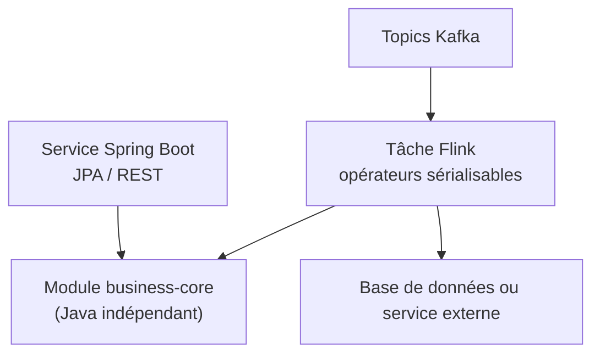
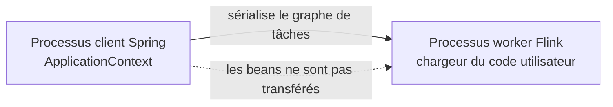

# Flink et Spring Boot — Guide d'intégration

> Partie du **Guide Kafka Engineering** de `org-rd-fullstack-springboot-eda`. Voir le [LISEZ_MOI du projet](./LISEZ_MOI.md) et les [guides Flink](./guides_flink.md).

**Portée :** présenter des façons sûres de réutiliser la logique métier Spring Boot dans un pipeline Apache Flink, en portant une attention particulière à Confluent Cloud, au chargement des classes, à la sérialisation, aux accès à la base de données, à l'idempotence et à la gestion du cycle de vie. L'approche privilégiée maintient le runtime Flink indépendant de Spring; le démarrage d'un contexte Spring dans un opérateur est documenté comme une option avancée réservée à un environnement Flink autogéré.

## Table des matières

- [Vue d'ensemble](#vue-densemble)
- [Choisir d'abord le modèle de déploiement](#choisir-dabord-le-modèle-de-déploiement)
- [Défis d'intégration](#défis-dintégration)
- [Modèle privilégié : runtimes séparés et module métier partagé](#modèle-privilégié--runtimes-séparés-et-module-métier-partagé)
- [Modèle avancé : Spring dans un opérateur Flink](#modèle-avancé--spring-dans-un-opérateur-flink)
- [Traitement idempotent en base de données](#traitement-idempotent-en-base-de-données)
- [Transactions et garanties de bout en bout](#transactions-et-garanties-de-bout-en-bout)
- [Chargement des classes, sérialisation et pools de connexions](#chargement-des-classes-sérialisation-et-pools-de-connexions)
- [Cycle de vie et arrêt gracieux](#cycle-de-vie-et-arrêt-gracieux)
- [Création des artefacts](#création-des-artefacts)
- [Déploiement sur Confluent Cloud](#déploiement-sur-confluent-cloud)
- [Application des modèles dans ce projet](#application-des-modèles-dans-ce-projet)
- [Bonnes pratiques](#bonnes-pratiques)
- [Sources et lectures complémentaires](#sources-et-lectures-complémentaires)

## Vue d'ensemble

Spring Boot et Flink répondent à des besoins différents. Spring Boot fournit l'injection de dépendances, la configuration et la gestion des transactions pour les services applicatifs. Flink distribue un graphe de tâches entre plusieurs processus, sérialise les fonctions et les états, redémarre les sous-tâches en échec et rejoue les entrées à partir des points de contrôle.

Ces modèles de cycle de vie ne se combinent pas automatiquement :

- un bean Spring ne peut pas être sérialisé sans risque avec un opérateur Flink;
- les repositories JPA, les gestionnaires d'entités et les connexions à la base de données sont des ressources locales à un processus;
- la restauration d'un point de contrôle peut exécuter plus d'une fois un effet en base de données;
- chaque sous-tâche Flink parallèle peut créer son propre contexte Spring et son propre pool de connexions;
- Confluent Cloud prend en charge des interfaces de développement Flink précises et ne considère pas tout JAR DataStream autonome comme une application gérée pouvant être déployée.

L'architecture recommandée consiste donc à partager de la **logique métier Java indépendante du framework**, et non un conteneur Spring actif :



## Choisir d'abord le modèle de déploiement

Le bon modèle d'intégration dépend de l'endroit où le code s'exécute.

| Modèle | Emplacement du code applicatif | Approche Spring recommandée |
| --- | --- | --- |
| **Flink SQL ou Table API sur Confluent Cloud** | Runtime Flink géré; un programme Table API soumet des instructions à partir d'un processus Java externe | Garder Spring à l'extérieur des opérateurs gérés. Au besoin, utiliser Spring seulement dans l'application qui soumet les instructions. |
| **UDF ou fonction de table de traitement sur Confluent Cloud** | L'artefact utilisateur s'exécute dans le runtime géré selon le contrat de fonction pris en charge | Créer une fonction petite et déterministe. Ne pas traiter l'artefact comme un service Spring Boot complet. |
| **Cluster Flink autogéré** | Les JobManagers et TaskManagers de l'organisation exécutent le JAR DataStream | Privilégier des opérateurs indépendants et des connecteurs pris en charge. Un contexte Spring minimal dans un opérateur est possible, mais coûteux. |
| **Runtime local ou de test lancé par Spring Boot** | Spring contrôle le processus client qui soumet ou exécute la tâche | Spring peut assembler la configuration et conserver le `JobClient`; les opérateurs doivent néanmoins respecter les règles de sérialisation de Flink. |

> **Limite de la plateforme :** téléverser un artefact UDF dans Confluent Cloud n'équivaut pas à téléverser et à lancer une application Spring Boot/DataStream arbitraire. Il faut choisir une interface Confluent Cloud prise en charge avant de concevoir l'intégration.

## Défis d'intégration

### Chargeurs de classes isolés

Flink charge le code d'une tâche au moyen d'un chargeur de classes utilisateur. Selon le déploiement, celui-ci peut utiliser un ordre de chargement inversé et différer du chargeur contenant les bibliothèques du cluster. Un bean créé dans un processus client Spring n'est pas accessible dans un TaskManager distant.



Il faut transmettre à la tâche uniquement des valeurs et des DTO sérialisables. Les ressources non sérialisables doivent être créées dans `open(...)`, puis libérées dans `close()`.

### Limites de sérialisation

Flink sérialise les opérateurs et l'état distribué. Les objets suivants ne doivent pas être capturés dans le constructeur d'un opérateur ni dans une expression lambda :

- les contextes applicatifs et les beans Spring;
- les repositories JPA, les instances d'`EntityManager` et les proxies Hibernate;
- les connexions JDBC, les instructions préparées et les pools de connexions;
- les clients de configuration ou les sessions de fournisseur de secrets non sérialisables.

Les champs utilisés seulement à l'exécution doivent être marqués `transient`. Ce mot-clé empêche uniquement leur sérialisation; il ne les initialise pas sur le worker.

### Cycle de vie et restauration indépendants

Flink peut redémarrer un opérateur après une défaillance et rejouer les messages reçus depuis le dernier point de contrôle terminé. `open(...)` peut donc être exécuté plusieurs fois pendant la durée de vie d'une tâche. Le nettoyage dans `close()` est offert au mieux et ne remplace pas les délais d'expiration côté serveur ni les limites de pool, car une panne brutale du processus peut l'empêcher de s'exécuter.

## Modèle privilégié : runtimes séparés et module métier partagé

Il faut extraire les règles déterministes dans un module indépendant du framework, que Spring Boot et Flink peuvent tous deux utiliser :

```java
public final class InventoryPolicy {

    public InventoryDecision evaluate(RequestEvent event, int availableStock) {
        if (event.quantity() <= 0) {
            throw new IllegalArgumentException("quantity must be positive");
        }
        return availableStock >= event.quantity()
            ? InventoryDecision.accept(event)
            : InventoryDecision.backOrder(event);
    }
}
```

Les collaborateurs propres au runtime sont créés dans la méthode de cycle de vie de Flink :

```java
import org.apache.flink.api.common.functions.OpenContext;
import org.apache.flink.api.common.functions.RichMapFunction;

public final class InventoryDecisionMap
        extends RichMapFunction<RequestEvent, InventoryDecision> {

    private transient InventoryPolicy policy;

    @Override
    public void open(OpenContext openContext) {
        this.policy = new InventoryPolicy();
    }

    @Override
    public InventoryDecision map(RequestEvent event) {
        return policy.evaluate(event, event.availableStock());
    }
}
```

Un objet de configuration sérialisable peut contenir les valeurs non secrètes :

```java
public record FlinkJobConfig(
        String inputTopic,
        String outputTopic,
        Duration checkpointInterval) implements Serializable {
}
```

Les mots de passe de base de données et les secrets d'API ne doivent pas être intégrés aux objets sérialisés de la tâche. Il faut les fournir au moyen des mécanismes de secrets et de connectivité externe de la plateforme de déploiement.

Pour les entrées-sorties externes, il faut privilégier un connecteur Flink pris en charge, un opérateur d'E/S asynchrone ou un service Spring Boot distinct. Un appel REST ou JDBC synchrone dans une fonction `map()` ordinaire bloque le thread de l'opérateur et limite le débit.

## Modèle avancé : Spring dans un opérateur Flink

Dans un déploiement Flink autogéré, un contexte Spring minimal et sans serveur Web peut être créé dans un opérateur lorsque la logique existante gérée par Spring ne peut pas encore être extraite. Cette approche doit servir de technique de migration, et non d'architecture par défaut.

```java
import org.apache.flink.api.common.functions.OpenContext;
import org.apache.flink.api.common.functions.RichMapFunction;
import org.springframework.boot.WebApplicationType;
import org.springframework.boot.builder.SpringApplicationBuilder;
import org.springframework.context.ConfigurableApplicationContext;

public final class SpringJpaOperator
        extends RichMapFunction<OrderEvent, ProcessingResult> {

    private transient ConfigurableApplicationContext context;
    private transient OrderBusinessService service;

    @Override
    public void open(OpenContext openContext) {
        this.context = new SpringApplicationBuilder(FlinkWorkerConfiguration.class)
            .web(WebApplicationType.NONE)
            .properties("spring.main.banner-mode=off")
            .run();
        this.service = context.getBean(OrderBusinessService.class);
    }

    @Override
    public ProcessingResult map(OrderEvent event) {
        service.processAndSave(event);
        return ProcessingResult.success(event.eventId());
    }

    @Override
    public void close() {
        if (context != null) {
            context.close();
        }
    }
}
```

Conséquences de ce modèle :

- chaque sous-tâche parallèle peut créer un contexte et un pool de connexions;
- le démarrage et la restauration prennent plus de temps;
- les conflits de dépendances et de chargeurs de classes deviennent plus probables;
- un effet en base de données ne fait toujours pas partie d'un point de contrôle Flink;
- l'approche doit être validée avec la distribution Flink et les règles de déploiement visées.

Un contexte statique « singleton par TaskManager » ne constitue pas une garantie générale fiable : sa portée dépend en réalité du chargeur de classes du code utilisateur, et la fermeture ou le redéploiement d'une tâche complique le cycle de vie partagé. Il vaut mieux utiliser un contexte dont chaque sous-tâche est clairement propriétaire ou, mieux encore, retirer la dépendance à Spring de l'opérateur.

## Traitement idempotent en base de données

Les points de contrôle assurent une restauration cohérente de l'état géré par Flink. Ils ne rendent pas automatiquement une écriture dans une base externe *exactly-once*. Une défaillance après la validation en base de données, mais avant le prochain point de contrôle terminé, peut entraîner le rejeu de l'événement.

Il faut utiliser un identifiant d'événement stable, une contrainte d'unicité dans la base et une seule transaction pour le marqueur d'idempotence et la mise à jour métier :

```java
@Service
public class OrderBusinessService {
    private final ProcessedEventRepository processedEvents;
    private final InventoryRepository inventory;

    @Transactional
    public void processAndSave(OrderEvent event) {
        // Appuyé par une contrainte UNIQUE ou PRIMARY KEY sur event_id.
        boolean firstAttempt = processedEvents.insertIfAbsent(event.eventId());
        if (!firstAttempt) {
            return;
        }

        inventory.decrement(event.productId(), event.quantity());
    }
}
```

La vérification et la mise à jour doivent être atomiques. Un appel distinct à `existsByEventId()` suivi de `save()` présente une condition de concurrence lorsque plusieurs livraisons surviennent simultanément, à moins qu'une contrainte d'unicité demeure l'autorité finale.

Si l'écriture en base de données se trouve au milieu d'un pipeline, un rejeu qui ignore cette écriture peut également omettre la sortie en aval. Il est préférable d'utiliser l'opération de base de données comme sink terminal ou d'adopter un modèle d'outbox ou de connecteur qui coordonne la publication en aval.

## Transactions et garanties de bout en bout

Plusieurs instructions SQL doivent appartenir à la même transaction :

```java
connection.setAutoCommit(false);
try {
    if (insertProcessedEvent(connection, event.eventId())) {
        decrementInventory(connection, event.productId(), event.quantity());
    }
    connection.commit();
} catch (Exception e) {
    connection.rollback();
    throw e;
}
```

La garantie obtenue dépend du sink :

- le sink JDBC standard de Flink assure une livraison *at-least-once*;
- des opérations d'upsert idempotentes ou un marqueur d'événement transactionnel peuvent rendre les rejeux sans effet pour la base de données;
- `JdbcSink.exactlyOnceSink(...)` utilise XA et exige une base de données ainsi qu'un pilote JDBC compatibles;
- une garantie *exactly-once* de bout en bout exige une source rejouable et un sink transactionnel ou idempotent.

Une écriture JPA ou JDBC ne doit pas être qualifiée d'*exactly-once* uniquement parce que les points de contrôle Flink sont activés.

## Chargement des classes, sérialisation et pools de connexions

### Chargement des classes

Il ne faut pas imposer `classloader.resolve-order` dans le code applicatif sans avoir diagnostiqué un conflit. Flink utilise normalement la stratégie de chargement configurée pour le code utilisateur. Lorsqu'une opération réflexive a besoin du chargeur de la tâche, il est possible de l'obtenir au moyen de `getRuntimeContext().getUserCodeClassLoader()`.

Dans un cluster autogéré, les dépendances du runtime Flink doivent conserver la portée `provided`. Il faut éviter d'intégrer une seconde copie incompatible des bibliothèques déjà fournies par le runtime et tester l'artefact final avec la même distribution Flink qu'en production.

### Pools de connexions

Il faut estimer le nombre total de connexions avant le déploiement :

`connexions maximales ≈ sous-tâches parallèles × taille du pool par sous-tâche × répliques simultanées de la tâche`

La taille du pool dépend de la capacité de la base de données et de la charge. Une valeur de `1` ou `2` peut convenir à un opérateur bloquant à thread unique, mais ne constitue pas une règle universelle. Il faut configurer les délais de connexion, de validation et d'inactivité, puis vérifier que l'autoscaling ou le redimensionnement ne peut pas saturer la base de données.

## Cycle de vie et arrêt gracieux

Lorsqu'un processus Spring Boot soumet une tâche Flink locale ou autogérée, `executeAsync()` retourne déjà sans attendre la fin de la tâche. Un thread manuel est inutile :

```java
@Component
public class FlinkJobManager {
    private final StreamExecutionEnvironment environment;
    private volatile JobClient jobClient;

    public FlinkJobManager(StreamExecutionEnvironment environment) {
        this.environment = environment;
    }

    @PostConstruct
    public void start() throws Exception {
        this.jobClient = environment.executeAsync("flink-inventory-job");
    }

    @PreDestroy
    public void stop() throws Exception {
        if (jobClient != null) {
            jobClient.cancel().get();
        }
    }
}
```

En production, il faut décider si l'arrêt doit annuler la tâche ou l'arrêter en créant un point de sauvegarde (*savepoint*). La sémantique d'annulation ou de sauvegarde est un choix opérationnel qui ne doit pas être dissimulé dans le cycle de vie d'un bean générique.

Pour les programmes Table API sur Confluent Cloud, il faut utiliser les opérations de cycle de vie des instructions prises en charge par l'application, la CLI ou l'API REST, plutôt que d'intégrer le cycle de vie d'un TaskManager à Spring Boot.

## Création des artefacts

### Tâche DataStream autogérée

Il faut produire un JAR Flink ordinaire. Lorsque les dépendances doivent être regroupées, il faut créer un JAR autonome ou ombré (*uber/shaded JAR*) et fusionner les métadonnées de service. Les dépendances Flink conservent généralement la portée `provided`.

Un JAR exécutable Spring Boot place les classes et les dépendances sous `BOOT-INF`; il est conçu pour `java -jar`, et non pour servir de dépendance ordinaire au code utilisateur Flink. Si du code Spring doit être partagé, il est préférable de le déplacer dans un module de bibliothèque distinct. Si une tâche Flink autogérée a réellement besoin de dépendances Spring, il faut construire et tester un artefact ombré aplati plutôt que de présumer qu'un JAR Spring Boot reconditionné fonctionnera.

### Confluent Cloud

La création de l'artefact dépend de l'interface prise en charge :

- un **programme Table API** est une application Java ordinaire exécutée à partir d'un poste de travail, d'un agent de compilation ou d'une plateforme applicative; le plugin Confluent soumet ses instructions au service géré;
- une **UDF Java ou une fonction de table de traitement** est créée sous forme de JAR ciblé, puis téléversée dans l'environnement et la région Confluent Cloud appropriés;
- le téléversement d'un artefact ne transforme pas un JAR Spring Boot/DataStream général en application Flink gérée prise en charge.

## Déploiement sur Confluent Cloud

1. Choisir Flink SQL, Table API, une UDF ou un autre point d'extension pris en charge.
2. Configurer l'environnement Confluent Cloud, la région, le pool de calcul, le compte de service et les identifiants d'accès.
3. Configurer la connectivité externe et les secrets avant d'ajouter des appels à une base de données ou à un service.
4. Pour Table API, construire et exécuter le programme Java à partir de la plateforme de livraison afin qu'il soumette et gère les instructions.
5. Pour une UDF ou une fonction de table de traitement, téléverser l'artefact et enregistrer la fonction au moyen du processus Cloud, CLI ou API pris en charge.
6. Surveiller l'état des instructions, les points de contrôle, les redémarrages, la contre-pression, la latence des appels externes et la consommation des connexions à la base de données.

## Application des modèles dans ce projet

Le projet fournit [`FlinkSandbox`](../../src/main/java/org/rd/fullstack/springbooteda/util/flink/FlinkSandbox.java) comme chemin Flink optionnel. Sa conception cible devrait respecter le modèle de séparation privilégié :

- transmettre à la tâche uniquement des valeurs de configuration sérialisables et non secrètes;
- garder les beans Spring, les entités JPA et les repositories hors des opérateurs sérialisés;
- créer les ressources locales au worker dans `open(...)` et les libérer dans `close()`;
- utiliser un connecteur pris en charge ou une opération terminale de base de données explicitement idempotente;
- limiter le nombre de connexions en fonction du parallélisme de la tâche;
- conserver l'opérateur sensible à Spring uniquement comme option expérimentale de migration en environnement autogéré.

Avant de cibler Confluent Cloud, le pipeline doit être adapté à un modèle Flink SQL, Table API ou de fonction pris en charge. Il ne faut pas présumer que le JAR DataStream autogéré peut être téléversé et lancé sans modification.

## Bonnes pratiques

- **Partagez des règles Java indépendantes, et non des beans Spring actifs.** Un module métier distinct est plus facile à tester et à déployer.
- **Gardez les opérateurs sérialisables.** Initialisez les connexions, les pools et les contextes seulement sur le worker.
- **Gardez les secrets hors du graphe de tâches.** Utilisez les mécanismes de secrets et de connectivité de la plateforme.
- **Concevez chaque écriture externe en fonction des rejeux.** Utilisez une clé d'événement unique et une seule transaction atomique en base de données.
- **Utilisez les sinks pris en charge.** Privilégiez le regroupement, les reprises et l'intégration aux points de contrôle fournis par les connecteurs plutôt qu'un accès JDBC manuel pour chaque message.
- **Traitez l'intégration de Spring dans Flink comme une exception.** Mesurez le temps de démarrage, la mémoire et la multiplication des connexions avant la mise en production.
- **Ne modifiez pas globalement le chargement des classes comme première solution.** Diagnostiquez d'abord les dépendances en double et les limites entre les chargeurs.
- **Dimensionnez les pools selon le parallélisme total.** Incluez le redimensionnement et les déploiements simultanés dans le calcul.
- **Testez la restauration.** Arrêtez des workers avant et après la validation en base de données, puis vérifiez l'état de la base et les sorties en aval.
- **Distinguez les processus de la plateforme.** Un client Table API, un artefact UDF et une tâche DataStream autogérée utilisent des modèles de création et de déploiement différents.

## Sources et lectures complémentaires

- [Confluent Cloud — Référence de Table API](https://docs.confluent.io/cloud/current/flink/reference/table-api.html)
- [Confluent Cloud — Déployer et gérer les programmes Table API](https://docs.confluent.io/cloud/current/flink/operate-and-deploy/table-api-deploy.html)
- [Confluent Cloud — Fonctions définies par l'utilisateur et artefacts](https://docs.confluent.io/cloud/current/flink/concepts/user-defined-functions.html)
- [Apache Flink — Tolérance aux pannes et exactly-once de bout en bout](https://nightlies.apache.org/flink/flink-docs-stable/docs/learn-flink/fault_tolerance/)
- [Apache Flink — Garanties du connecteur JDBC](https://nightlies.apache.org/flink/flink-docs-stable/docs/connectors/datastream/jdbc/)
- [Apache Flink — Diagnostic du chargement des classes](https://nightlies.apache.org/flink/flink-docs-stable/docs/ops/debugging/debugging_classloading/)
- [Spring Boot — Création d'archives exécutables](https://docs.spring.io/spring-boot/maven-plugin/packaging.html)
- Guide connexe : [Accusés de réception et idempotence du consommateur](./reconnaissance_et_idempotence_consommateur.md)