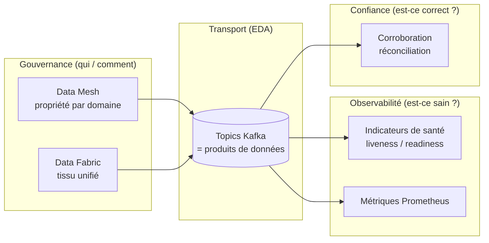
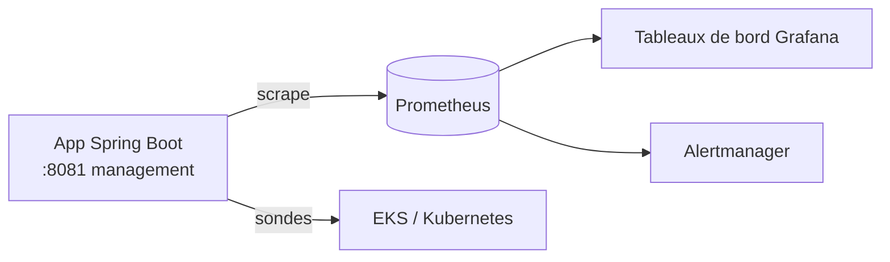

# Gouvernance et observabilité

> Partie du **Guide Kafka Engineering** de `org-rd-fullstack-springboot-eda`. Voir le [LISEZ_MOI du projet](./LISEZ_MOI.md).

**Portée :** Gouvernance et observabilité pour les architectures événementielles (EDA). Côté **gouvernance** : les quatre principes du Data Mesh et leur contraste avec le Data Fabric, la gouvernance des données dans les systèmes de streaming, un catalogue de topics traités comme des produits de données, les contrats d'événements, et des SLA explicites avec alertes. Côté **observabilité** : les indicateurs de santé Spring Boot et les sondes liveness/readiness, Actuator et Prometheus, les métriques Kafka, les modes de défaillance courants des projets Kafka (stratégiques et opérationnels), le traçage distribué, la corrélation des événements et un bref aperçu de la corroboration des données.

## Table des matières

- [Vue d'ensemble](#vue-densemble)
- [Data Mesh : les quatre principes](#data-mesh--les-quatre-principes)
- [Data Mesh vs Data Fabric](#data-mesh-vs-data-fabric)
- [Gouvernance des données en EDA](#gouvernance-des-données-en-eda)
- [Gouvernance en pratique : catalogue et contrats](#gouvernance-en-pratique--catalogue-et-contrats)
- [SLA et alertes](#sla-et-alertes)
- [Indicateurs de santé Spring Boot](#indicateurs-de-santé-spring-boot)
  - [Indicateurs intégrés et personnalisés](#indicateurs-intégrés-et-personnalisés)
  - [Statut de santé et correspondance HTTP](#statut-de-santé-et-correspondance-http)
  - [Sondes liveness vs readiness](#sondes-liveness-vs-readiness)
  - [Groupes de santé (health groups)](#groupes-de-santé-health-groups)
  - [Information de santé vs métriques](#information-de-santé-vs-métriques)
- [Observabilité : Actuator et Prometheus](#observabilité--actuator-et-prometheus)
- [Métriques Kafka](#métriques-kafka)
- [Modes de défaillance](#modes-de-défaillance)
  - [Pourquoi les projets Kafka échouent (stratégique)](#pourquoi-les-projets-kafka-échouent-stratégique)
  - [Modes de défaillance courants à l'exécution (opérationnel)](#modes-de-défaillance-courants-à-lexécution-opérationnel)
- [Tracing distribué](#tracing-distribué)
- [Corrélation des événements](#corrélation-des-événements)
- [Corroboration des données (aperçu)](#corroboration-des-données-aperçu)
- [Comment ce projet l'implémente](#comment-ce-projet-limplémente)
- [Pièges et bonnes pratiques](#pièges-et-bonnes-pratiques)
- [Sources et lectures associées](#sources-et-lectures-associées)

## Vue d'ensemble

Dans une entreprise événementielle, deux questions déterminent si les données créent de la valeur : *qui possède et gouverne les données* et *comment savoir si le système en fonctionnement est sain et si ses données sont dignes de confiance*. La première est une préoccupation organisationnelle et architecturale, traitée par le **Data Mesh** et le **Data Fabric** ; la seconde est une préoccupation opérationnelle, traitée par les **indicateurs de santé**, les **sondes** et l'**observabilité**.

Une architecture événementielle n'est **pas** plus simple à exploiter qu'une architecture synchrone — elle est même souvent plus complexe. Les dépendances entre services sont **implicites** (qui publie et qui consomme chaque événement ?) et les défaillances sont **distribuées** (un producteur peut s'arrêter alors que les consommateurs ne constateront le problème que plus tard). La gouvernance et l'observabilité existent précisément pour rendre l'implicite explicite : savoir qui est responsable de chaque flux d'événements, comprendre l'état du système en temps réel et détecter les anomalies avant qu'elles ne se propagent.

Ce guide relie les deux. Le Data Mesh traite les données de chaque domaine comme un produit doté d'une propriété et de contrats explicites ; l'EDA (ici Kafka) est le transport qui rend ces produits disponibles en temps réel. Les indicateurs de santé et les métriques Prometheus nous disent si les producteurs, consommateurs et brokers derrière ces produits fonctionnent réellement. La corroboration des données boucle la boucle en vérifiant que ce qui a été livré correspond à l'état attendu.



## Data Mesh : les quatre principes

Le Data Mesh est avant tout une philosophie et un modèle opératoire, pas un produit. Il transfère la responsabilité de la qualité, de la documentation et de la livraison des données vers les domaines métier qui les produisent, éliminant le goulot d'étranglement d'une équipe data centrale. Il repose sur quatre principes largement cités :

- **Propriété par domaine (décentralisation).** Chaque domaine métier possède ses données de bout en bout : qualité, documentation, cycle de vie et SLA. La donnée est un actif stratégique aligné sur le processus métier qui la crée, et non un sous-produit d'une application.
- **La donnée comme produit.** Chaque jeu de données (ou topic) est un produit de première classe : découvrabilité, versionnement, schémas/contrats définis, SLA et une expérience consommateur exploitable. Les consommateurs doivent pouvoir le trouver, le comprendre et lui faire confiance sans parler à l'équipe productrice.
- **Plateforme de données en libre-service.** L'infrastructure, le stockage et l'outillage partagés sont fournis comme une plateforme afin que les équipes de domaine publient et consomment des produits de données de façon autonome, sans que les approbations centrales ou les transferts ne deviennent le goulot d'étranglement.
- **Gouvernance computationnelle fédérée.** Les règles globales (sécurité, confidentialité, interopérabilité, standards de schémas) sont définies de façon centrale mais appliquées de manière automatisée et fédérée à travers des domaines autonomes, afin que le mesh reste cohérent et interopérable tout en préservant l'autonomie des équipes.

> La note existante du dépôt présente les trois premiers sous les termes *décentralisation*, *donnée comme produit*, *autonomie des équipes* et *plateforme en libre-service*. Voir la [note Data Mesh / Data Fabric](./datamesh_datafabric.md) pour ce cadrage organisationnel.

## Data Mesh vs Data Fabric

Le Data Mesh et le Data Fabric s'attaquent au même problème métier — maximiser la valeur des données de l'entreprise — mais à des niveaux différents et selon des directions presque opposées.

| Aspect | Data Mesh | Data Fabric |
| --- | --- | --- |
| Niveau principal | Organisationnel / gouvernance / culturel | Technique / infrastructure |
| Question centrale | *Qui possède les données et comment sont-elles gouvernées ?* | *Comment rendre les données accessibles, gouvernées et interopérables ?* |
| Propriété | Décentralisée, par domaine | Services centralisés au-dessus de sources distribuées |
| Mécanisme clé | Équipes de domaine, produits de données, gouvernance fédérée | Intégration, virtualisation, automatisation IA/ML, lignage |
| Force | Responsabilisation, agilité, alignement métier | Accès transparent, cohérence, automatisation |

La plupart des organisations adoptent une approche **hybride** : le Data Mesh fixe le « code de la route » (propriété et pensée produit) tandis que le Data Fabric fournit le « réseau autoroutier » (intégration, catalogage, lignage, sécurité) qui permet aux données gouvernées de circuler en toute sécurité. L'EDA sous-tend les deux, en déplaçant les données sous forme d'événements découplés et temps réel. La note du dépôt développe cette analogie en détail — voir [`datamesh_datafabric.md`](./datamesh_datafabric.md).

## Gouvernance des données en EDA

Dans les systèmes de streaming, la gouvernance n'est pas un vernis optionnel — son absence est une cause majeure d'échec (voir [Pourquoi les projets Kafka échouent](#pourquoi-les-projets-kafka-échouent-stratégique)). Des topics non gouvernés rendent les données difficiles à trouver, comprendre et fiabiliser. Une gouvernance efficace en EDA couvre :

- **Schémas et contrats.** Imposer les formats de message et l'évolution des schémas (par ex. un schema registry avec des règles de compatibilité). Kafka n'a aucune validation intégrée ; cela doit donc être ajouté délibérément.
- **Propriété et intendance (stewardship).** Chaque topic a un propriétaire documenté, des définitions de données et des cas d'usage. Les topics non documentés créés ad hoc sont une dette technique dès leur existence.
- **Catalogue et lignage.** Un catalogue suit les schémas et métadonnées des topics ; le lignage enregistre l'origine des données et leurs transformations. Kafka ne fournit ni l'un ni l'autre par défaut.
- **Qualité et cohérence.** Validation et nettoyage appliqués de façon cohérente à tout l'écosystème, et non consommateur par consommateur.
- **Politiques et standards.** Classification, contrôle d'accès, rétention et règles de confidentialité appliqués uniformément — le principe de gouvernance fédérée du Data Mesh en pratique.

## Gouvernance en pratique : catalogue et contrats

Les principes ci-dessus se concrétisent par deux artefacts : un **catalogue de topics** et des **contrats** par événement.

### Catalogue des topics

Documentez chaque topic Kafka comme un **produit de données** :

| Topic | Propriétaire | Schéma | Producteurs | Consommateurs | SLA de rétention |
| --- | --- | --- | --- | --- | --- |
| `APP-Kafka-Requests` | Équipe Inventory | `RequestSchema v1` | `PipelineSrv` | `ProcessorSrv` | 7 jours / 1 Go |
| `APP-Flink-Requests` | Équipe Stream | `FlinkRequestSchema v1` | (externe) | Cluster Flink | 3 jours |
| `APP-Requests-dlt` | Équipe Platform | `ErrorSchema v1` | DLQ handler | `ErrorHandlerSrv` | 30 jours |

### Contrat d'événement

Documentez chaque événement avec un contrat stable :

**Événement :** `RequestCreated`
**Version :** 1.0
**Topic :** `APP-Kafka-Requests`
**Producteur :** `PipelineSrv`
**Consommateurs :** `ProcessorSrv` (in-JVM), Flink (optionnel)

Schéma :

```json
{
  "eventType": "RequestCreated",
  "eventId": "uuid",
  "productId": 123,
  "personId": 456,
  "quantity": 10,
  "timestamp": 1234567890000
}
```

SLA :

- **Latence P50 :** < 100 ms (du producteur à la première livraison consommateur).
- **Livraison :** at-least-once.
- **Retraits :** aucun sans raison métier (possibles, mais doivent être annoncés).

## SLA et alertes

Chaque topic / produit de données doit avoir des **SLA** explicites et des **alertes** associées.

### SLA typiques

| SLA | Métrique | Seuil | Action |
| --- | --- | --- | --- |
| Disponibilité | uptime broker | > 99,5 % | alerte si < 99 % |
| Latence | latence de bout en bout producteur→consommateur | < 1 s P99 | alerte si > 5 s |
| Débit | événements par seconde | > 1000 eps | alerte si < 100 eps |
| Décalage (lag) | offset consumer lag | < 100 messages | alerte si > 10k |
| Erreurs | taux d'erreur consommateur | < 0,1 % | alerte si > 1 % |

### Implémentation des alertes

Utilisez Prometheus + Grafana + Alertmanager :

```yaml
# prometheus-rules.yml
groups:
  - name: kafka_consumer_lag
    rules:
      - alert: HighConsumerLag
        expr: kafka_consumer_lag > 10000
        for: 5m
        annotations:
          summary: "Consumer lag pour {{ $labels.topic }} est {{ $value }}"

      - alert: ProducerFailureRate
        expr: rate(kafka_producer_errors_total[5m]) > 0.01
        for: 5m
        annotations:
          summary: "Taux d'erreur producteur > 1%"
```

## Indicateurs de santé Spring Boot

L'information de santé indique à la plateforme (et aux exploitants) si l'application et ses dépendances fonctionnent. Dans Spring Boot, elle est fournie par le module Actuator via les API `HealthContributor` / `HealthIndicator`.

Ajoutez la dépendance :

```xml
<dependency>
  <groupId>org.springframework.boot</groupId>
  <artifactId>spring-boot-starter-actuator</artifactId>
</dependency>
```

### Indicateurs intégrés et personnalisés

Spring Boot enregistre automatiquement de nombreux indicateurs. Certains sont presque toujours présents (`DiskSpaceHealthIndicator`, `PingHealthIndicator`) ; d'autres dépendent du classpath (`DataSourceHealthIndicator` pour les bases relationnelles, `CassandraHealthIndicator` pour Cassandra, etc.). Le résultat agrégé est exposé sur `/actuator/health` ; un indicateur isolé sur `/actuator/health/{nom}`.

Un indicateur personnalisé n'est qu'un bean Spring implémentant `HealthIndicator` :

```java
@Component
public class RandomHealthIndicator implements HealthIndicator {

    @Override
    public Health health() {
        double chance = ThreadLocalRandom.current().nextDouble();
        Health.Builder status = Health.up();
        if (chance > 0.9) {
            status = Health.down();
        }
        return status
            .withDetail("chance", chance)
            .withDetail("strategy", "thread-local")
            .build();
    }
}
```

Notes issues de l'API :

- **Identifiant** — le nom de l'indicateur est le nom du bean sans le suffixe `HealthIndicator` (donc `RandomHealthIndicator` → `/actuator/health/random`). Nommer le bean `@Component("rand")` change le chemin en `/actuator/health/rand`.
- **Détails** — attachez des détails clé/valeur avec `withDetail(...)` / `withDetails(map)`, et signalez les échecs avec `Health.down(ex)` ou `withException(ex)` (la stack trace apparaît sous `error`).
- **Désactivation** — définissez `management.health.<id>.enabled=false` (à combiner avec `@ConditionalOnEnabledHealthIndicator("<id>")` sur un indicateur personnalisé) ; l'endpoint renvoie alors `404`.
- **Applications réactives** — implémentez `ReactiveHealthIndicator`, dont `health()` renvoie `Mono<Health>`.
- **Exposition des détails** — `management.endpoint.health.show-details` accepte `never`, `when_authorized` (utilisateur authentifié avec les rôles de `management.endpoint.health.roles`) ou `always`.

Exemple concret : un indicateur Kafka qui vérifie la connectivité broker et la présence des topics clés. Esquisse illustrative de ce à quoi `KafkaHealthIndicator` ressemblerait (absent du code source de ce projet) :

```java
@Component
public class KafkaHealthIndicator extends AbstractHealthIndicator {
    @Override
    protected void doHealthCheck(Health.Builder builder) {
        try {
            // Vérifier la connectivité broker
            adminClient.describeCluster().get();

            // Vérifier que les topics clés existent
            if (topicExists(MAIN_TOPIC) && topicExists(DLT_TOPIC)) {
                builder.up()
                    .withDetail("broker_version", getBrokerVersion())
                    .withDetail("partition_count", getPartitionCount());
            } else {
                builder.down().withDetail("reason", "topics non trouvés");
            }
        } catch (Exception e) {
            builder.down().withDetail("error", e.getMessage());
        }
    }
}
```

Réponse :

```json
{
  "status": "UP",
  "components": {
    "kafka": {
      "status": "UP",
      "details": {
        "broker_version": "3.5.0",
        "partition_count": 24
      }
    }
  }
}
```

### Statut de santé et correspondance HTTP

Les quatre statuts intégrés sont `UP`, `DOWN`, `OUT_OF_SERVICE` et `UNKNOWN`. Ce sont des instances `public static final` (et non des valeurs d'enum), si bien que des états personnalisés sont autorisés via `Health.status("WARNING")`.

Le statut détermine le code HTTP : par défaut, `DOWN` et `OUT_OF_SERVICE` correspondent à `503`, tandis que `UP` et les statuts non mappés correspondent à `200`. Surcharge par statut :

```yaml
management:
  endpoint:
    health:
      status:
        http-mapping:
          down: 500
          out_of_service: 503
          warning: 500
```

Ou enregistrez un bean `HttpCodeStatusMapper` pour un mapping programmatique.

### Sondes liveness vs readiness

Pour les déploiements orchestrés (Kubernetes/EKS), Spring Boot expose deux états de disponibilité. La distinction est cruciale car l'orchestrateur réagit différemment à chacun :

| Sonde | Signification | Un échec signifie | Action de l'orchestrateur |
| --- | --- | --- | --- |
| **Liveness** (`/actuator/health/liveness`) | L'état interne est correct | L'état est cassé et irrécupérable | **Redémarrer** le pod |
| **Readiness** (`/actuator/health/readiness`) | Prêt à accepter du trafic | Ne peut pas servir les requêtes (par ex. arrêt gracieux, préchauffage) | **Cesser d'acheminer** le trafic (sans redémarrer) |

Les états sont modifiés dans le code en publiant un `AvailabilityChangeEvent` avec `LivenessState` (`CORRECT` / `BROKEN`) ou `ReadinessState` (`ACCEPTING_TRAFFIC` / `REFUSING_TRAFFIC`). C'est exactement ce que fait ce projet — voir [Comment ce projet l'implémente](#comment-ce-projet-limplémente).

### Groupes de santé (health groups)

Les indicateurs de santé peuvent être agrégés en **groupes** nommés afin qu'une sonde ne reflète que les indicateurs pertinents pour cette décision :

```yaml
management:
  endpoint:
    health:
      probes:
        enabled: true
      group:
        readiness:
          include: readinessState, kafka, db
        liveness:
          include: livenessState
```

Cela évite qu'une dépendance aval lente ne déclenche un redémarrage inutile : elle relève de `readiness`, pas de `liveness`.

### Information de santé vs métriques

Utilisez les **indicateurs de santé** pour répondre à *l'application peut-elle joindre ce composant ?* (Kafka, BD, Hazelcast joignable / up / down). Utilisez les **métriques** pour *mesurer* des valeurs — CPU, tas (heap), distributions de latence des requêtes, comptes, durées. N'implémentez pas de compteurs ou de chronomètres comme indicateurs de santé ; c'est le rôle des métriques et de Prometheus.

## Observabilité : Actuator et Prometheus

Dans ce projet, Actuator tourne sur le **port de management `8081`** (distinct du port applicatif `8080`). Endpoints clés, tous listés dans le [LISEZ_MOI](../../README.md) :

| Endpoint | Rôle |
| --- | --- |
| [`/actuator`](http://localhost:8081/actuator) | Index des endpoints disponibles |
| [`/actuator/info`](http://localhost:8081/actuator/info) | Infos build/app |
| [`/actuator/health`](http://localhost:8081/actuator/health) | Santé agrégée |
| [`/actuator/health/liveness`](http://localhost:8081/actuator/health/liveness) | Sonde liveness |
| [`/actuator/health/readiness`](http://localhost:8081/actuator/health/readiness) | Sonde readiness |
| [`/actuator/prometheus`](http://localhost:8081/actuator/prometheus) | Endpoint de scraping Prometheus |

L'endpoint `/actuator/prometheus` expose les métriques Micrometer au format texte Prometheus pour le scraping, les tableaux de bord (Grafana) et l'alerting. C'est l'endroit approprié pour les métriques JVM, HTTP et client Kafka (consumer lag, enregistrements consommés/produits, compteurs de rééquilibrage).



## Métriques Kafka

### Métriques clés

**Producteur :**

- `kafka.producer.record.send.total` — enregistrements envoyés
- `kafka.producer.record.error.rate` — taux d'erreur
- `kafka.producer.record.send.latency.avg` — latence moyenne d'envoi

**Consommateur :**

- `kafka.consumer.lag` — décalage (nombre de messages non consommés)
- `kafka.consumer.records.lag.max` — lag max sur toutes les partitions
- `kafka.consumer.poll.records.rate` — enregistrements consommés par seconde
- `kafka.consumer.fetch.latency.avg` — latence de fetch moyenne

**Broker :**

- `kafka.server.replica.fetcher.max.bytes.rate` — taux de bytes répliqués
- `kafka.network.request.latency.avg` — latence réseau moyenne

### Visualisation avec Prometheus/Grafana

```text
# Requête Grafana
sum(rate(kafka_consumer_lag[5m])) by (topic)
```

Cela affiche le lag consommateur moyen par topic.

## Modes de défaillance

La gouvernance et l'observabilité ne sont pas théoriques. Les déploiements Kafka non gouvernés et non observés échouent de façon prévisible — à la fois **stratégiquement** (pourquoi l'initiative dans son ensemble peine) et **opérationnellement** (ce qui casse à l'exécution).

### Pourquoi les projets Kafka échouent (stratégique)

Le rapport Confluent/Ferraro identifie six risques récurrents :

1. **Manque d'expertise et de ressources** — Kafka est facile à démarrer mais difficile à exploiter de façon fiable ; construire un service digne de confiance exige des compétences rares.
2. **Difficulté à passer du développement à la production** — ce qui fonctionne sur un portable n'est pas un cluster durci et hautement disponible.
3. **Pannes et indisponibilités imprévisibles** — erreurs de réplication/intégrité des données, complexité infrastructure/réseau/logiciel, timeouts mal réglés et erreurs de configuration (facteur de réplication, allocation des partitions) provoquent pertes de données et indisponibilités.
4. **Difficulté à sécuriser les données en streaming** — authentification, contrôle d'accès, chiffrement, gestion des clés, surveillance et audit exigent une rare combinaison d'expertise Kafka + sécurité.
5. **Manque de gouvernance** — des topics non documentés, aux propriétaires/définitions inconnus, érodent la confiance ; les lacunes en qualité, cohérence, lignage, intendance, catalogue et politiques se multiplient à mesure que le nombre de topics atteint les milliers. (C'est la [section gouvernance](#gouvernance-des-données-en-eda) ci-dessus, formulée comme un mode de défaillance.)
6. **Difficulté à passer à l'échelle** — la mise à l'échelle multi-régions et l'orchestration de charges concurrentes exigent souvent une intervention manuelle et dépassent la capacité humaine.

Les enseignements pour ce guide : investir tôt dans la gouvernance, traiter sondes/métriques comme des citoyens de première classe, et valider les données par corroboration plutôt que de supposer que livraison rime avec exactitude.

### Modes de défaillance courants à l'exécution (opérationnel)

**1. Effondrement d'un broker**
- *Symptôme :* le lag consommateur augmente brutalement ; les producteurs voient des timeouts.
- *Cause :* un ou plusieurs brokers (ou le leader de partition) sont injoignables.
- *Détection :* `kafka_broker_up == 0` ou `kafka_producer_request_latency_ms > seuil`.
- *Récupération :* Kafka bascule automatiquement le leader vers une réplica lorsque `min.insync.replicas` est satisfait. Si toutes les réplicas sont down, le topic est indisponible jusqu'au redémarrage du broker.

**2. Consumer lag croissant**
- *Symptôme :* les messages s'empilent sur le broker ; les consommateurs tardent à rattraper.
- *Cause :* le consommateur est plus lent que le producteur (bug, surcharge CPU, GC) ou s'est écrasé et redémarre.
- *Détection :* `kafka_consumer_lag > seuil` pendant > N minutes.
- *Récupération :* passer à l'échelle (ajouter des threads consommateurs, jusqu'au nombre de partitions) ; déboguer (vérifier les logs du consommateur pour des exceptions, des pauses GC) ; en dernier recours, réinitialiser l'offset (à risque !).

**3. Message empoisonné (poison pill)**
- *Symptôme :* le consommateur s'écrase sur un message spécifique, dans une boucle crash/retry/crash.
- *Cause :* le message est corrompu, le schéma est incompatible, ou la logique du consommateur ne peut pas le traiter.
- *Détection :* logs répétés `ERROR processing message at offset X`, pas de progression du lag.
- *Récupération :* router le message vers le topic de lettres mortes (`APP-Requests-dlt`) avec les détails d'erreur ; corriger le consommateur ou attendre une mise à jour de schéma compatible ; retraiter manuellement le message via replay après correction.

**4. Rééquilibrage (rebalance) prolongé**
- *Symptôme :* le lag consommateur saute brièvement quand les pods redémarrent ; les consommateurs sont brièvement « inactifs ».
- *Cause :* quand le nombre de consommateurs d'un groupe change (scaling, redémarrage, défaillance), Kafka réassigne les partitions. Pendant ce temps, aucune consommation n'a lieu.
- *Détection :* lag constant pendant plus longtemps que `session.timeout.ms`.
- *Récupération :* voir [Distribution, scaling et arrêt sur EKS](./distribution_scale_et_arret.md).

## Tracing distribué

Pour tracer un événement à travers plusieurs services, utilisez un **correlation ID** :

```java
@Component
public class CorrelationIdFilter extends OncePerRequestFilter {
    @Override
    protected void doFilterInternal(HttpServletRequest req, HttpServletResponse res, FilterChain chain) {
        String correlationId = req.getHeader("X-Correlation-Id");
        if (correlationId == null) {
            correlationId = UUID.randomUUID().toString();
        }
        MDC.put("correlationId", correlationId);
        res.setHeader("X-Correlation-Id", correlationId);
        chain.doFilter(req, res);
    }
}
```

**Dans Kafka :**

```java
ProducerRecord<String, String> record = new ProducerRecord<>(topic, value);
record.headers().add("X-Correlation-Id", correlationId.getBytes(StandardCharsets.UTF_8));
kafkaTemplate.send(record);
```

Consommateur :

```java
@KafkaListener(...)
public void consume(ConsumerRecord<String, String> record) {
    String correlationId = new String(record.headers().lastHeader("X-Correlation-Id").value());
    MDC.put("correlationId", correlationId);
    // tous les logs incluent désormais le correlationId
}
```

Avec Jaeger/Zipkin, cela produit une trace distribuée visible à travers les services.

## Corrélation des événements

Enregistrez l'**event ID** et sa **source** sur chaque ligne de données :

```sql
CREATE TABLE REQUEST (
    ...
    EVENT_ID VARCHAR(128),                -- ID unique de l'événement source
    KAFKA_TOPIC VARCHAR(64),              -- d'où provient l'événement
    KAFKA_PARTITION INT,
    KAFKA_OFFSET BIGINT,
    CORRELATION_ID VARCHAR(128),          -- lié à d'autres requêtes
    ...
);
```

Cela permet des requêtes d'audit rétrospectives :

```sql
SELECT * FROM REQUEST WHERE correlation_id = '...'
  ORDER BY created_at;
```

## Corroboration des données (aperçu)

La livraison d'un événement ne garantit **pas** la cohérence globale. Les sémantiques de livraison, les défaillances de consommateurs, les rééquilibrages et les problèmes d'infrastructure transitoires peuvent tous provoquer une divergence entre systèmes ; la corroboration et la réconciliation doivent donc être conçues comme des préoccupations architecturales explicites. Une EDA de niveau production superpose plusieurs techniques :

| Objectif | Technique |
| --- | --- |
| Détection rapide de divergence | Sommes de contrôle / hachages d'état |
| Audit et conformité | Rejeu d'événements et instantanés périodiques |
| Confiance opérationnelle | Événements de contrôle / checkpoint |
| Migration et refactoring | Consommateurs fantômes (parallèles) |

Sous-jacents à tous : **l'idempotence et le séquencement au niveau métier** (numéros de séquence par agrégat, détection de trous) et les **invariants métier contractuels** (par ex. stock jamais négatif, soldes cohérents).

> Ceci est volontairement un aperçu court. Le traitement complet — mécanismes, compromis et stratégie en couches recommandée — se trouve dans l'approfondissement dédié : **[Corroboration des données](./verification_donnees.md)**.

## Comment ce projet l'implémente

Ce sandbox démontre directement les concepts de gouvernance, d'observabilité et de sondes ci-dessus :

- **Contrôle liveness / readiness.** [`HealthController`](../../src/main/java/org/rd/fullstack/springbooteda/controller/HealthController.java) expose des endpoints `POST` (`/api/liveness_state_down|up`, `/api/readiness_state_down|up`) qui publient des `AvailabilityChangeEvent` avec `LivenessState` et `ReadinessState`. Cela permet de basculer la disponibilité de l'app et d'observer la réaction des sondes Actuator sur [`/actuator/health/liveness`](http://localhost:8081/actuator/health/liveness) et [`/actuator/health/readiness`](http://localhost:8081/actuator/health/readiness).
- **Indicateur de santé Kafka.** L'esquisse ci-dessus (`KafkaHealthIndicator`) illustre comment la santé broker/topic pourrait être rapportée sur `/actuator/health` ; ce projet n'expose pas actuellement cet indicateur.
- **Tableaux de bord personnalisés comme santé de composant.** [`HealthController`](../../src/main/java/org/rd/fullstack/springbooteda/controller/HealthController.java) sert aussi des tableaux de bord de composants combinant données et statut de santé par sous-système :
  - [`KafkaDashboard`](../../src/main/java/org/rd/fullstack/springbooteda/util/kafka/KafkaDashboard.java) via `GET /api/kafkaDashboardData` (id de cluster, nombre de brokers, contrôleur, résumés de lag par topic et par groupe de consommateurs).
  - [`FlinkDashboard`](../../src/main/java/org/rd/fullstack/springbooteda/util/flink/FlinkDashboard.java) via `GET /api/flinkDashboardData`.
  - [`HazelcastDashboard`](../../src/main/java/org/rd/fullstack/springbooteda/util/hazelcast/HazelcastDashboard.java) via `GET /api/hazelcastDashboardData`.
- **Actuator sur le port 8081.** Les endpoints de management listés dans le [LISEZ_MOI](../../README.md) (`/actuator`, `/actuator/info`, `/actuator/health`, les deux sondes et `/actuator/prometheus`) fournissent la surface d'observabilité standard aux côtés des tableaux de bord personnalisés.
- **Le lag comme signal de santé.** Le lag des groupes de consommateurs Kafka est exposé via [`GroupLagSummary`](../../src/main/java/org/rd/fullstack/springbooteda/util/kafka/GroupLagSummary.java) et [`ConsumerGroupMonitor`](../../src/main/java/org/rd/fullstack/springbooteda/util/kafka/ConsumerGroupMonitor.java), avec un [`LagAlertEvent`](../../src/main/java/org/rd/fullstack/springbooteda/util/kafka/LagAlertEvent.java) — un exemple de transformation d'une métrique de streaming en alerte opérationnelle.
- **Correlation IDs.** Les en-têtes Kafka portent un `replay-id` (analogue à `X-Correlation-Id`), et [`KafkaPipelineListener`](../../src/main/java/org/rd/fullstack/springbooteda/srv/KafkaPipelineListener.java) enregistre le topic, la partition et l'offset de chaque enregistrement, ce qui permet de tracer les événements de bout en bout.
- **Vue d'ensemble UI.** L'interface web affiche les dernières demandes, leurs statuts et les erreurs.

Pour le cadrage gouvernance derrière ces tableaux de bord, croisez avec la [note Data Mesh / Data Fabric](./datamesh_datafabric.md).

## Pièges et bonnes pratiques

- **Ne confondez pas liveness et readiness.** Placer une dépendance lente/optionnelle dans le groupe liveness provoque des boucles de redémarrage. Les dépendances qui affectent le *service* relèvent de readiness ; seul un état interne irrécupérable relève de liveness.
- **Ne mesurez pas avec des indicateurs de santé.** Compteurs, durées et jauges sont des métriques (Prometheus), pas de la santé. Gardez `health()` quasi booléen et rapide.
- **Protégez l'exposition des détails.** Utilisez `show-details: when_authorized` (ou `never`) en production, pour que stack traces et détails internes ne fuitent pas publiquement.
- **Cataloguez chaque topic.** Documentez propriétaire, schéma, consommateurs et SLA par topic ; imposez la compatibilité des schémas. Les topics non gouvernés sont le mode de défaillance le plus courant — et le plus coûteux.
- **Alertez sur le lag.** Si le consumer lag dépasse 10k messages pendant 5 minutes, il y a un problème.
- **Loggez les corrélations.** Un correlation ID dans chaque log et chaque événement, pour l'audit.
- **Surveillez la santé du broker.** Uptime, réplicas out-of-sync, unclean leader elections.
- **Testez les scénarios de défaillance.** Crash du broker, rebalance, message empoisonné, débordement mémoire.
- **Réglez les timeouts délibérément.** Trop bas provoque des terminaisons prématurées et des pertes de messages ; trop haut retarde la détection des pannes. Testez les changements de configuration (facteur de réplication, partitions) avant la production.
- **Ne réinitialisez pas les offsets sans raison.** C'est une manœuvre dangereuse qui peut rejouer des milliers de messages.
- **Séparez livraison et exactitude.** Ajoutez idempotence, séquencement et une couche de corroboration ; ne supposez pas qu'un événement consommé correspond à un état conforme à la réalité. Voir [Corroboration des données](./verification_donnees.md).
- **Scrapez les métriques sur le port de management.** Gardez `8081` interne/sécurisé ; n'exposez que ce dont la supervision a besoin.

## Sources et lectures associées

- [Note Data Mesh / Data Fabric](./datamesh_datafabric.md) — cadrage organisationnel vs technique et approche hybride.
- [Corroboration des données](./verification_donnees.md) — approfondissement jumeau sur les mécanismes de corroboration.
- [Distribution, scaling et arrêt sur EKS](./distribution_scale_et_arret.md) — comportement du rebalance et arrêt gracieux.
- [Élasticité horizontale sur EKS](./elasticite_horizontale_eks.md) — autoscaling des consommateurs.
- [LISEZ_MOI du projet](./LISEZ_MOI.md) — instructions d'exécution et liste complète des endpoints Actuator.
