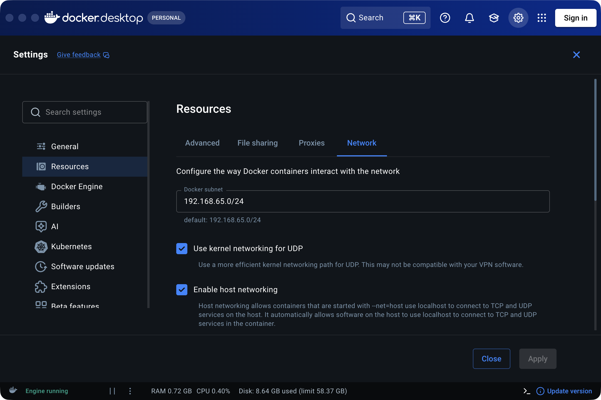

# Guides Docker

> Partie du **Guide Kafka Engineering** de `org-rd-fullstack-springboot-eda`. Voir le [LISEZ_MOI du projet](./LISEZ_MOI.md) et les [guides du sandbox](./guides_sandbox.md).

**Portée :** image Docker et instructions d'utilisation pour les trois composants « sandbox » intégrés — Kafka, Flink et Hazelcast. L'image Docker peut être utilisée de différentes façons selon les besoins.

## Table des matières

* [Image Docker](#image-docker)
* [Docker pour exécuter l'application](#docker-pour-exécuter-lapplication)
* [Docker comme outils de développement](#docker-comme-outils-de-développement)
* [Docker alternative](#docker-alternative)
* [Sources et documentation complémentaire](#sources-et-documentation-complémentaire)

## Image Docker

L'image Docker et sa documentation technique sont disponibles ici :

* [Docker Hub](https://hub.docker.com/repositories/rdemers)
* [Dockerfile](../../Dockerfile)

L'image Docker **intègre** trois moteurs d'infrastructure qui seraient normalement exécutés comme des services externes :

| Moteur        | Forme intégrée                                        | Rôle dans le projet                                                                       |
| ------------- | ----------------------------------------------------- | ----------------------------------------------------------------------------------------- |
| **Kafka**     | `EmbeddedKafkaKraftBroker` (KRaft, in-process)        | Bus d'événements : topics, DLT, producteurs/consommateurs et sémantique transactionnelle. |
| **Flink**     | `MiniCluster` (JobManager + TaskManagers, in-process) | Traitement des flux : jobs, slots et métriques.                                           |
| **Hazelcast** | Membre intégré (in-process)                           | État distribué : `IMap` pour le `PipelineContext` et sous-système CP pour les verrous.    |

### Docker pour exécuter l'application

Pour simplement exécuter l'image Docker :

```bash
docker run -it \
  -p 8080:8080 \
  -p 8081:8081 \
  org-rd-fullstack/springboot-eda:unspecified
```

L'application est alors accessible via les ports exposés pour l'application et la gestion.

### Docker comme outils de développement

La même image Docker peut également être utilisée comme environnement de développement et de test afin d'accéder aux composants Kafka, Flink et Hazelcast intégrés. Pour accéder directement à ces services depuis l'hôte, activez le **réseau de l'hôte (`host networking`)** dans Docker Desktop, comme illustré ci-dessous :



Exécutez ensuite l'image avec le réseau de l'hôte activé :

```bash
docker run --network host -it \
  org-rd-fullstack/springboot-eda:unspecified
```

Lorsque le réseau de l'hôte est activé, le conteneur partage l'espace de noms réseau de l'hôte. Les outils de développement exécutés sur l'hôte peuvent ainsi accéder aux services exposés par l'application.

## Docker alternative

Ce projet contient également un Dockerfile qui permet de construire une image docker avec les services externes seulement : Kafka, PostgreSQL et Hazelcast.

Le fichier de construction: [Dockerfile.eda-middleware](../Dockerfile.eda-middleware)

## Sources et documentation complémentaire

* [guides du sandbox](./guides_sandbox.md) — Documentation au niveau de l'application pour les sandboxes Kafka, Flink et Hazelcast.
