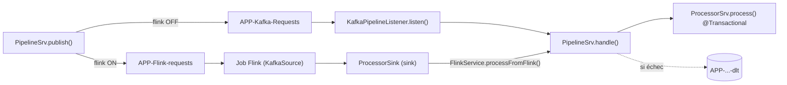
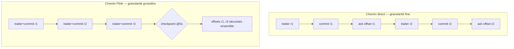

# Guide Flink — le chemin de traitement Flink optionnel

> Partie du **Guide Kafka Engineering** de `org-rd-fullstack-springboot-eda`. Voir le [LISEZ_MOI du projet](./LISEZ_MOI.md) et les [guides du sandbox](./guides_sandbox.md).

**Portée :** documente le chemin **Flink** optionnel du pipeline d'opérations — comment il s'active depuis l'interface, comment les demandes sont routées à travers le job Flink embarqué, comment le job invoque le processeur, et la machinerie de tolérance aux pannes qui l'entoure (checkpointing, gestion des Dead-Letters et pause/reprise par savepoint). Il aborde aussi deux préoccupations transversales qui comptent beaucoup en pratique : **pourquoi un checkpoint Flink n'est pas aussi fin que l'acquittement par enregistrement du chemin direct**, et **pourquoi le design in-JVM ne fonctionne que parce que le MiniCluster partage la JVM de l'application** (il ne survivrait pas sur un vrai cluster Flink).

## Table des matières

- [Vue d'ensemble : deux chemins de traitement](#vue-densemble--deux-chemins-de-traitement)
- [Activer l'option](#activer-loption)
- [Le job Flink](#le-job-flink)
- [Appeler le processeur depuis un opérateur Flink (le pont in-JVM)](#appeler-le-processeur-depuis-un-opérateur-flink-le-pont-in-jvm)
- [MiniCluster in-JVM vs cluster Flink réel](#minicluster-in-jvm-vs-cluster-flink-réel)
- [Tolérance aux pannes : checkpointing et redémarrage](#tolérance-aux-pannes--checkpointing-et-redémarrage)
- [Granularité du checkpoint ≠ acquittement par commit](#granularité-du-checkpoint--acquittement-par-commit)
- [Alternatives pour resserrer la synchronisation](#alternatives-pour-resserrer-la-synchronisation)
- [Gestion des Dead-Letters sur le chemin Flink](#gestion-des-dead-letters-sur-le-chemin-flink)
- [Pause / reprise via stop-with-savepoint](#pause--reprise-via-stop-with-savepoint)
- [Chemin direct vs chemin Flink — côte à côte](#chemin-direct-vs-chemin-flink--côte-à-côte)
- [Référence de configuration](#référence-de-configuration)
- [Pièges et bonnes pratiques](#pièges-et-bonnes-pratiques)
- [Développement et débuggage](#développement-et-débuggage)
- [Sources et lectures complémentaires](#sources-et-lectures-complémentaires)

## Vue d'ensemble : deux chemins de traitement

Le pipeline d'opérations peut exécuter les demandes via l'un de deux chemins, sélectionné par le toggle **Flink** du tableau de bord des opérations. Le toggle est lu au moment de la *publication* et stocké dans [`PipelineContext`](../../src/main/java/org/rd/fullstack/springbooteda/dto/PipelineContext.java) (`flink`, `false` par défaut).

| Mode | Flux |
|---|---|
| **Flink OFF** (direct) | `PipelineSrv.publish()` → `APP-Kafka-Requests` → `KafkaPipelineListener.listen()` (`@KafkaListener`) → `PipelineSrv.handle()` → `ProcessorSrv.process()` |
| **Flink ON** | `PipelineSrv.publish()` → `APP-Flink-requests` → **job Flink** → **`ProcessorSink`** → `FlinkService.processFromFlink()` → `PipelineSrv.handle()` → `ProcessorSrv.process()` |

Les deux chemins convergent vers le même handler par enregistrement, [`PipelineSrv.handle()`](../../src/main/java/org/rd/fullstack/springbooteda/srv/PipelineSrv.java) (verrou Hazelcast par client + `ProcessorSrv.process()` transactionnel + comptage des complétions), donc le traitement métier, le verrouillage et les statistiques se comportent de façon identique. Seul le *transport* diffère.

> **Décomposition.** Le pipeline est réparti sur trois beans : [`PipelineSrv`](../../src/main/java/org/rd/fullstack/springbooteda/srv/PipelineSrv.java) est le **cœur** agnostique du chemin (start/publish/handle/état/stats/pause) ; [`KafkaPipelineListener`](../../src/main/java/org/rd/fullstack/springbooteda/srv/KafkaPipelineListener.java) porte le chemin **Kafka** direct (`@KafkaListener` + observateur de reprise DLT) ; [`FlinkService`](../../src/main/java/org/rd/fullstack/springbooteda/srv/FlinkSrv.java) porte le chemin **Flink** (cycle de vie du job + `processFromFlink` + DLT Flink). Les deux beans de transport dépendent du cœur (pour `handle()`) ; le cœur ne dépend d'aucun des deux — la pause/reprise est signalée par événements.



> **Note.** Le `KafkaSource` du job Flink est un *consommateur distinct* du `@KafkaListener` — groupe de consommateurs différent, topic différent. Les deux ne se concurrencent jamais. En mode direct, le job Flink est inactif (rien n'est publié sur `APP-Flink-requests`) ; en mode Flink, le `@KafkaListener` est inactif (rien n'est publié sur `APP-Kafka-Requests`).

## Activer l'option

**Frontend** — [`frontend/app/pages/operations/index.vue`](../../src/frontend/app/pages/operations/index.vue) ajoute un interrupteur `flink` (icône `mdi-pipe`, libellés `operations.flink` / `operations.flink-desc` dans `en_CA.json` / `fr_CA.json`). Sa valeur est incluse dans le `PipelineContext` envoyé à `POST /pipeline/start` et est ré-hydratée au montage comme les autres options.

**Backend** — [`PipelineSrv.publish()`](../../src/main/java/org/rd/fullstack/springbooteda/srv/PipelineSrv.java) lit le flag une seule fois et route en conséquence :

```java
final boolean flink  = Boolean.TRUE.equals(context.getFlink());
final String  target = flink ? KafkaConstants.CST_TOPIC_FLINK_REQ
                             : KafkaConstants.CST_TOPIC_KAFKA_REQ;
```

Tout le reste de `publish()` (l'unique transaction Kafka, les en-têtes optionnels `key`/`replay`, le compteur `nbrPublished`) est inchangé ; seul le topic de destination change.

## Le job Flink

[`FlinkService`](../../src/main/java/org/rd/fullstack/springbooteda/srv/FlinkSrv.java) construit et soumet le job une seule fois, sur `ApplicationReadyEvent`, contre le `MiniCluster` embarqué (`createRemoteEnvironment(host, port)`) :

- **Source** — `KafkaSource` sur `APP-Flink-requests`, `value-only` (`SimpleStringSchema`), group id = l'UUID du sandbox Kafka, `OffsetsInitializer.earliest()`.
- **Transform** — aucun. Les enregistrements sont les requêtes JSON sérialisées ; ils passent **tels quels** afin que le processeur puisse les désérialiser.
- **Sink** — `ProcessorSink` (API sink2), qui appelle directement le processeur.

Comme les enregistrements ne portent aucune clé Kafka à travers la source/sink `value-only`, le partitionnement par clé et les en-têtes `replay-id`/`batch-id` ne **survivent pas** au saut Flink (s'ils ne sont pas inscrit dans le payload). La justesse par client reste garantie parce que le verrou Hazelcast se base sur `personId`, recalculé à partir de la charge utile dans `handle()`.

## Appeler le processeur depuis un opérateur Flink (le pont in-JVM)

Un opérateur Flink ne peut pas recevoir directement un bean Spring : Flink **sérialise** les opérateurs et les expédie aux TaskManagers, or un `@Service` adossé à JPA n'est pas sérialisable. Le sink ne détient donc *aucune* référence Spring et résout la cible à l'exécution via un **pont inter-classloaders**. `FlinkService` se publie **lui-même** (il possède `processFromFlink`, qui délègue à `PipelineSrv.handle()`) :

```java
// Résout le consommateur-pont depuis le pont global à la JVM. No-op une fois résolu ;
// tolérant à la fenêtre (transitoire, ne devrait pas arriver) où le pont n'est pas encore publié.
private void resolveBridge() throws IOException {
    if (bridge != null)
        return;
    Object bean = System.getProperties().get(CST_BRIDGE_KEY);
    if (bean == null)
        return;
    if (!(bean instanceof Consumer<?> consumer))
        throw new IOException("Flink sink bridge value is not a Consumer<String>.");
    @SuppressWarnings("unchecked")
    Consumer<String> stringConsumer = (Consumer<String>) consumer;
    this.bridge = stringConsumer;
}
```

L'approche naïve — un `private static volatile PipelineSrv pipelineSrvRef` défini dans `startJob()` et lu dans le sink — **échoue sous Spring Boot DevTools.** DevTools charge les beans de l'application dans un `RestartClassLoader` jetable, mais les threads de tâche du MiniCluster résolvent `FlinkService` via un classloader *différent* (celui de base). Le `static` positionné sur la copie côté Spring de la classe vaut `null` sur la copie que voient les threads de tâche, donc le sink journalise `...not wired...; dropping record` et abandonne silencieusement chaque message (le job reste RUNNING — aucune erreur).

Le pont ci-dessus évite cela de deux façons : (1) le porteur est `System.getProperties()`, détenu par le **classloader bootstrap**, il a donc une *identité unique à travers tous les classloaders* ; (2) l'invocation est **réflexive**, dispatchant sur la classe propre de l'objet, de sorte qu'aucune identité de type `FlinkService` partagée entre les deux classloaders n'est requise. La cible résolue reste le véritable `FlinkService` géré par Spring, dont le `processFromFlink` délègue au `PipelineSrv.handle()` proxifié par AOP, si bien que la sémantique `@Transactional` de `ProcessorSrv.process()` s'applique sur le thread de tâche Flink.

## MiniCluster in-JVM vs cluster Flink réel

> **C'est la mise en garde la plus importante du chemin Flink.** Le design est un raccourci pédagogique valable pour le sandbox embarqué et **ne fonctionnerait pas sur un cluster Flink distribué.**

Sur un vrai cluster, les opérateurs s'exécutent dans des **JVM de TaskManager séparées**, généralement sur des **machines différentes**. Conséquences :

- **Pas de pont in-JVM partagé.** Le porteur `System.getProperties()` est peuplé dans la JVM de l'*application* ; une JVM de TaskManager distante ne le voit jamais — la recherche renverrait `null`.
- **Pas de contexte Spring.** Il n'y a ni `ApplicationContext`, ni `EntityManager`, ni dépôts, ni membre Hazelcast, ni gestionnaire de transactions Spring dans la JVM du TaskManager. Le `@Transactional` de `ProcessorSrv.process()` repose sur le gestionnaire de transactions lié au thread de Spring, qui n'existe tout simplement pas là-bas.
- **Les classes ne sont pas toujours disponibles.** Les classes de l'application (`ProcessorSrv`, les dépôts, les DTO) doivent être sur le classpath du TaskManager — empaquetées dans le **jar de job** soumis — et elles se chargent sous le **classloader de code utilisateur** de Flink, distinct de celui de l'application. Tout ce qui est résolu par identité/état statique à travers les classloaders casse. Dans le MiniCluster, toutes les classes se trouvent sur l'unique classpath de l'application, ce qui est précisément pourquoi le raccourci compile *et* s'exécute ici.
- **Sérialisation.** Tout champ non-`transient` et non sérialisable capturé par un opérateur fait échouer la soumission du job. Le sink évite cela en ne capturant rien et en cherchant le bean paresseusement — mais c'est justement cette recherche qui n'a aucune réponse sur un TaskManager distant.

**Ce que ferait plutôt un design compatible cluster** (à choisir selon le cas d'usage) :

1. **Écrire dans Kafka et laisser un consommateur Spring faire le travail DB** — le découplage classique : `KafkaSink` → un topic → un `@KafkaListener` ordinaire (c'est le design à ack par enregistrement décrit plus bas sous *alternatives*). L'opérateur Flink ne touche aucun bean Spring.
2. **Utiliser un sink Flink natif** — p. ex. le connecteur **JDBC** de Flink pour écrire directement dans la base, sans Spring/JPA sur le TaskManager.
3. **Appeler un service distant** — l'opérateur invoque l'application via REST/gRPC, ce qui garde la logique DB dans l'app Spring et hors du TaskManager.
4. **Implémenter un pipeline Spring Boot & JPA** — p. ex. le **RichMapFunction** de Flink peut servir à charger un [`contexte Spring Boot`](./flink_springboot.md).

## Tolérance aux pannes : checkpointing et redémarrage

[`FlinkService.startJob()`](../../src/main/java/org/rd/fullstack/springbooteda/srv/FlinkSrv.java) active le checkpointing et une stratégie de redémarrage bornée :

```java
// Tous les paramètres sont injectés depuis application.yml — voir la Référence de configuration plus bas.
env.enableCheckpointing(checkpointIntervalMs, CheckpointingMode.AT_LEAST_ONCE); // 5 s par défaut

Configuration restartCfg = new Configuration();
restartCfg.set(RestartStrategyOptions.RESTART_STRATEGY, "fixed-delay");
restartCfg.set(RestartStrategyOptions.RESTART_STRATEGY_FIXED_DELAY_ATTEMPTS, restartAttempts);
restartCfg.set(RestartStrategyOptions.RESTART_STRATEGY_FIXED_DELAY_DELAY, Duration.ofMillis(restartDelayMs));
env.configure(restartCfg);
```

- **Comment Flink suit la progression.** Le `KafkaSource` conserve ses offsets de consommation dans l'**état checkpointé** de Flink, *et non* dans les offsets committés de Kafka (qu'il n'écrit qu'au checkpoint, pour le suivi du lag). À la reprise, Flink restaure depuis le dernier checkpoint complété — il ne s'appuie jamais sur les offsets committés de Kafka.
- **`AT_LEAST_ONCE` est le mode honnête.** Le sink effectue un effet de bord *externe* (écritures DB) et n'est pas transactionnel/2PC, donc l'exactly-once ne peut pas être revendiqué de bout en bout. Les rejeux sont rendus sûrs pour la base par l'**idempotence** de `ProcessorSrv.process()` (une demande qui n'est plus `PENDING`/`BACK_ORDER` est ignorée).
- **Stratégie de redémarrage.** Avec le checkpointing désactivé, le défaut de Flink était *no-restart* — une seule exception du sink tuait le job. Le `fixed-delay` borné (3 × 5 s) réessaie les défaillances transitoires avant que le job n'échoue en dernier recours. (La plupart des échecs de traitement sont interceptés plus tôt ; voir la section DLT.)
- **Pourquoi une config programmatique ?** L'API dépréciée `setRestartStrategy(RestartStrategies…)` est évitée au profit de `RestartStrategyOptions` + `env.configure(...)`, et l'on utilise la surcharge non dépréciée `enableCheckpointing(long, core.execution.CheckpointingMode)`.

## Granularité du checkpoint ≠ acquittement par commit

C'est la différence sémantique clé entre les deux chemins, et ce **n'est pas** une équivalence directe.

**Chemin direct — ack par enregistrement.** Le conteneur d'écoute utilise `MANUAL_IMMEDIATE`, et `listen()` appelle `ack.acknowledge()` *immédiatement après* le commit de la transaction DB de l'enregistrement. L'offset Kafka avance donc **un enregistrement à la fois, juste après chaque commit**. En cas de crash, la fenêtre de rejeu est au plus l'unique enregistrement en vol par thread consommateur.

**Chemin Flink — avance par checkpoint.** Les écritures DB se produisent en continu (un commit `@Transactional` par enregistrement, dans le sink), mais l'**offset de la source n'est sécurisé qu'à une frontière de checkpoint** — toutes les 5 s. Il n'existe pas dans Flink de hook « committer l'offset juste après le commit DB de cet enregistrement ». Donc :

- En cas de crash, Flink restaure depuis le dernier checkpoint complété et **rejoue tous les enregistrements traités depuis** (jusqu'à ~5 s de travail), *même si leurs transactions DB ont déjà été committées*. La fenêtre de rejeu est un intervalle de checkpoint entier, pas un seul enregistrement.
- La base reste correcte parce que `process()` est idempotent. Mais le **compteur de complétion ne l'est pas** : `recordProcessed()` serait rappelé pour les enregistrements rejoués, **surcomptant** `nbrProcessed` et pouvant manquer la limite exacte de complétion `nbrPublished == nbrProcessed + nbrProcessedWithError`.

En bref : un checkpoint Flink est une **frontière de lot pour la position de la source et l'état interne**, découplée du **commit DB externe** de tout enregistrement individuel. Il ne peut pas reproduire la garantie du chemin direct « avancer l'offset exactement quand le commit de cet enregistrement aboutit ». L'implémentation actuelle l'accepte (le chemin de reprise est exceptionnel) ; la section ci-dessous liste des façons de combler l'écart.



## Alternatives pour resserrer la synchronisation

Selon le niveau de rigueur requis, de la plus légère à la plus lourde :

1. **Traitement idempotent — déjà en place.** `process()` ignore les demandes déjà traitées, donc les rejeux ne réappliquent jamais deux fois les effets DB. C'est la protection la moins coûteuse et la plus importante ; conservez-la.
2. **Rendre la complétion sûre au rejeu.** Dérivez `nbrProcessed` de l'**état DB** (compter les demandes `EXECUTED` / `ERROR`) plutôt que d'un compteur incrémental, ou dédupliquez par `requestId` dans un ensemble distribué avant de compter. Cela supprime le seul défaut observable au rejeu (surcomptage des stats) sans changer le transport.
3. **Retrouver l'ack par enregistrement — router la sortie Flink de nouveau vers Kafka.** Remplacez `ProcessorSink` par un `KafkaSink` écrivant dans `APP-Kafka-Requests`, et laissez le `@KafkaListener` existant (`MANUAL_IMMEDIATE`) faire le travail DB. Cela restaure la sémantique d'ack fine du chemin direct (et c'est **compatible cluster**, puisque l'opérateur ne touche plus de bean Spring) — au prix d'un saut de topic supplémentaire et de la perte de la propriété « appeler le processeur directement ». C'était une itération de design antérieure et reste la façon la plus simple de retrouver la granularité par enregistrement.
4. **Sink exactly-once (2PC).** Implémentez un sink qui participe aux checkpoints : préparez le travail DB et committez-le sur `notifyCheckpointComplete`, en abandonnant en cas d'échec. Cela aligne l'effet externe sur le checkpoint, mais coordonner une transaction JPA/JDBC avec le commit en deux phases de Flink est complexe et souvent impraticable avec une pile Spring/JPA.
5. **Outbox transactionnel.** Faites en sorte que `process()` écrive son résultat dans une table *outbox* dans la même transaction DB ; un relais séparé publie/acquitte en aval. Cela découple entièrement l'effet externe de la cadence de checkpoint de Flink.
6. **Réglage, pas correctif.** Un intervalle de checkpoint plus court réduit la fenêtre de rejeu mais augmente le surcoût et n'élimine jamais l'écart de granularité. Les checkpoints non alignés (*unaligned*) aident pour le backpressure, pas pour ce problème.

## Gestion des Dead-Letters sur le chemin Flink

Le chemin Flink reproduit le comportement `DefaultErrorHandler` → DLT du chemin direct, implémenté à l'intérieur de [`FlinkService.processFromFlink()`](../../src/main/java/org/rd/fullstack/springbooteda/srv/FlinkSrv.java) :

1. **Retry borné** — `CST_RETRY_ATTEMPTS + 1` tentatives avec un back-off `CST_RETRY_INTERVAL` (250 ms), en réutilisant les constantes du chemin Kafka pour la parité.
2. **Succès** → complétion comptée via `PipelineSrv.handle()` (`recordProcessed(false)`).
3. **Tentatives épuisées** → `sendToFlinkDlt(value, cause)` puis `PipelineSrv.recordProcessed(true)`. Le job **survit** à l'enregistrement empoisonné et le pipeline peut tout de même atteindre la complétion (`EXCEPTION`, puisque erreurs > 0) — exactement comme le `RetryListener.recovered` du chemin Kafka.
4. **La publication DLT elle-même échoue** (véritable problème d'infrastructure) → l'exception se propage, la stratégie de redémarrage s'applique, et l'enregistrement est rejoué depuis le dernier checkpoint.

`sendToFlinkDlt()` publie **de façon transactionnelle** (comme le recoverer DLT du chemin direct, afin que l'enregistrement mis en Dead-Letter soit visible aux consommateurs `read_committed`) vers **`APP-Flink-requests-dlt`** (le DLT apparié au topic source Flink, créé dans `KafkaConfig`), en attachant la cause de l'échec dans un en-tête `flink-dlt-cause`.

| Aspect | Chemin direct (Kafka) | Chemin Flink |
|---|---|---|
| Retry | `DefaultErrorHandler` (1 retry, 250 ms) | boucle dans `FlinkService.processFromFlink` (mêmes valeurs) |
| Topic DLT | `APP-Kafka-Requests-dlt` | `APP-Flink-requests-dlt` |
| Comptage d'erreurs | `recordProcessed(true)` (RetryListener) | `recordProcessed(true)` |
| Publication DLT | transactionnelle | transactionnelle |

> Le back-off de retry exécute `Thread.sleep` sur le thread de tâche Flink (acceptable pour le sandbox — de même nature que la fonctionnalité de latence optionnelle).

## Pause / reprise via stop-with-savepoint

Le chemin direct met en pause en appelant `container.pause()/resume()` sur le `@KafkaListener` (fait dans `KafkaPipelineListener`). Flink n'a **aucun équivalent léger** pour mettre en pause une source en cours d'exécution, donc l'équivalent le plus proche est le **stop-with-savepoint** (une vraie pause : le job est arrêté avec un savepoint puis redémarré à partir de celui-ci).

**Déclenchement & découplage.** `PipelineSrv.setPause()` met à jour le flag de pause, puis publie un [`KafkaListenerPauseEvent`](../../src/main/java/org/rd/fullstack/springbooteda/srv/KafkaListenerPauseEvent.java) (toujours — un no-op inoffensif en mode Flink, où l'écouteur ne porte aucun enregistrement) et — **uniquement quand l'option Flink est active** — un [`FlinkPauseEvent`](../../src/main/java/org/rd/fullstack/springbooteda/srv/FlinkPauseEvent.java). `KafkaPipelineListener` et `FlinkService` écoutent leurs événements respectifs. Router les deux via des événements garde les dépendances unidirectionnelles : ces deux beans dépendent de `PipelineSrv` (pour `handle()`), donc le cœur ne doit **pas** dépendre d'eux en retour (ce serait un cycle de beans).

**Pause** — `FlinkService.pause()` vérifie que le job est `RUNNING`, puis :

```java
pausedSavepoint = client.stopWithSavepoint(false, dir, SavepointFormatType.CANONICAL)
                        .get(savepointTimeoutSec, TimeUnit.SECONDS);   // dir & timeout depuis la config
client = null;
```

**Reprise** — `FlinkService.resume()` reconstruit le job et le restaure depuis le chemin sauvegardé :

```java
StreamGraph sg = env.getStreamGraph();
sg.setSavepointRestoreSettings(SavepointRestoreSettings.forPath(pausedSavepoint));
client = env.executeAsync(sg);
```

> **Pourquoi le `StreamGraph` ?** `StreamExecutionEnvironment.configure()` ne lit que le **répertoire de sortie** du savepoint (`CheckpointingOptions.SAVEPOINT_DIRECTORY`), *pas* le chemin de restauration. La restauration doit être attachée via `SavepointRestoreSettings` sur le `StreamGraph` — vérifié contre l'API Flink 1.20.

**Notes de conception & limites :**

- Le cycle de vie (`startJob` / `onStop` / `pause` / `resume`) est sérialisé en se synchronisant sur l'instance du service, puisque tous mutent l'unique `client`.
- `setPause` **bloque** pendant la durée du savepoint (possiblement quelques secondes) — le compromis assumé face au `container.pause()` instantané.
- Les savepoints sont écrits sous le `flink.pipeline.savepoint-dir` configuré (vide → `${java.io.tmpdir}/springboot-eda-flink-savepoints` ; convenable pour le sandbox, pointez vers un stockage partagé/durable pour un vrai déploiement). Voir la [Référence de configuration](#référence-de-configuration).
- Le chemin du savepoint est conservé **en mémoire** : si l'application redémarre pendant la pause, le chemin est perdu (bien que les fichiers de savepoint demeurent sur disque).
- Prévu pour être utilisé par paires durant une exécution. Si le job n'est pas `RUNNING` (déjà échoué/terminé), la pause est journalisée et ignorée.
- Une pause par *blocking-backpressure* (bloquer le sink jusqu'à la reprise) a été envisagée puis rejetée : un opérateur bloqué ne peut pas traiter les barrières de checkpoint, donc une longue pause ferait expirer les checkpoints et pourrait faire échouer le job. Le stop-with-savepoint évite cela.

## Chemin direct vs chemin Flink — côte à côte

| Préoccupation | Chemin direct | Chemin Flink |
|---|---|---|
| Transport | `APP-Kafka-Requests` → `KafkaPipelineListener` (`@KafkaListener`) | `APP-Flink-requests` → job Flink → `ProcessorSink` |
| Traitement métier | `PipelineSrv.handle()` → `ProcessorSrv.process()` | identique (`FlinkService.processFromFlink` → `PipelineSrv.handle()`) |
| Offset / progression | `ack` par enregistrement après commit DB | par checkpoint (toutes les 5 s) |
| Fenêtre de rejeu au crash | ~1 enregistrement en vol | ~1 intervalle de checkpoint d'enregistrements |
| Retry + DLT | `DefaultErrorHandler` → `…-dlt` | retry dans `processFromFlink` → `APP-Flink-requests-dlt` |
| Pause/reprise | `container.pause()/resume()` | stop-with-savepoint / restauration |
| Clé & en-têtes | préservés | abandonnés (value-only) |
| Compatible cluster | oui | **non** (appel de bean in-JVM) |

## Référence de configuration

Le job Flink de l'application est réglé sous `org.rd.fullstack.springbooteda.flink.pipeline.*` dans [`application.yml`](../../src/main/resources/application.yml) (reflété dans [`src/test/resources/application.yml`](../../src/test/resources/application.yml)). Les clés sont liées dans [`FlinkService`](../../src/main/java/org/rd/fullstack/springbooteda/srv/FlinkSrv.java) via `@Value`, le même patron que les réglages du sandbox dans [`FlinkConfig`](../../src/main/java/org/rd/fullstack/springbooteda/config/FlinkConfig.java).

```yaml
org:
  rd:
    fullstack:
      springbooteda:
        flink:
          sandbox:        # le moteur MiniCluster embarqué — voir les guides du sandbox
            ...
          pipeline:       # le job de l'application — voir ci-dessous
            parallelism: 4
            checkpoint-interval-ms: 5000
            restart-attempts: 3
            restart-delay-ms: 5000
            savepoint-dir: ""
            savepoint-timeout-sec: 60
            status-timeout-sec: 10
```

| Clé | Défaut | Signification | Utilisée par |
|---|---|---|---|
| `parallelism` | `4` | Parallélisme du job (`env.setParallelism`). | build du job |
| `checkpoint-interval-ms` | `5000` | Période de checkpoint, en ms (`enableCheckpointing`, `AT_LEAST_ONCE`). | [checkpointing](#tolérance-aux-pannes--checkpointing-et-redémarrage) |
| `restart-attempts` | `3` | Tentatives de redémarrage `fixed-delay` bornées avant l'échec du job. | [stratégie de redémarrage](#tolérance-aux-pannes--checkpointing-et-redémarrage) |
| `restart-delay-ms` | `5000` | Délai entre les tentatives de redémarrage, en ms. | [stratégie de redémarrage](#tolérance-aux-pannes--checkpointing-et-redémarrage) |
| `savepoint-dir` | `""` | Répertoire de base des savepoints. **Vide → `${java.io.tmpdir}/springboot-eda-flink-savepoints`.** Pointez vers un stockage durable/partagé pour un vrai déploiement. | [pause/reprise](#pause--reprise-via-stop-with-savepoint) |
| `savepoint-timeout-sec` | `60` | Borne supérieure de l'attente du stop-with-savepoint (pause). | [pause/reprise](#pause--reprise-via-stop-with-savepoint) |
| `status-timeout-sec` | `10` | Borne supérieure de la requête de statut du job avant une pause. | [pause/reprise](#pause--reprise-via-stop-with-savepoint) |

**Lié mais volontairement *hors* de cette section :**

- **Dimensionnement du MiniCluster** (`flink.sandbox.num-task-managers`, `…num-slots-per-task-manager`, ports, `active-metrics`, `enabled`) vit sous `flink.sandbox.*` et est documenté dans les [guides du sandbox](./guides_sandbox.md). Gardez `parallelism` ≤ `num-task-managers × num-slots-per-task-manager`.
- **Le retry DLT du chemin Flink** réutilise la politique du chemin Kafka (`KafkaConstants.CST_RETRY_ATTEMPTS`, `CST_RETRY_INTERVAL`) pour que les deux chemins réessaient de façon identique ; c'est centralisé dans [`KafkaConstants`](../../src/main/java/org/rd/fullstack/springbooteda/util/kafka/KafkaConstants.java) plutôt que dupliqué ici.

## Pièges et bonnes pratiques

- **N'expédiez pas ce design tel quel vers un vrai cluster.** L'appel de bean par pont statique est in-JVM uniquement. Voir [MiniCluster in-JVM vs cluster Flink réel](#minicluster-in-jvm-vs-cluster-flink-réel).
- **Gardez `process()` idempotent.** C'est le filet de sécurité de chaque rejeu (reprise de checkpoint, redistribution DLT, restauration de savepoint).
- **Traitez le compteur de stats comme approximatif en reprise.** `recordProcessed()` n'est pas idempotent au rejeu ; si l'exactitude compte, dérivez la complétion de l'état DB (alternative n° 2).
- **Aucun transform dans le job Flink.** La charge utile doit atteindre le processeur en JSON valide ; tout map/transform doit être compatible JSON.
- **Le stockage des savepoints est par défaut en temp local.** Suffisant pour le sandbox ; réglez `flink.pipeline.savepoint-dir` vers un stockage durable/partagé pour tout usage réel.
- **La pause est une opération lourde** ici (un aller-retour de savepoint), volontairement limitée au mode Flink pour ne pas pénaliser les pauses en mode direct.

## Développement et débuggage

Le **débogage d’une application Apache Flink exécutée en cluster est plus complexe qu’en mode local**. Le code est distribué entre plusieurs processus et potentiellement plusieurs nœuds (*JobManager* et *TaskManagers*), ce qui rend difficile l’utilisation d’un débogueur traditionnel avec des points d’arrêt. L’exécution parallèle, la redistribution des tâches et les mécanismes de reprise de Flink peuvent également rendre les problèmes difficiles à reproduire.

Cette architecture distribuée impose aussi certaines contraintes sur la **réutilisation du code applicatif existant**. Par exemple, du code conçu pour une application **Spring Boot** peut dépendre du contexte Spring, de l’injection de dépendances ou d’annotations telles que `@Autowired`, `@Service` ou `@Component`. Or, le code exécuté par les *TaskManagers* de Flink ne s’exécute pas nécessairement dans ce même contexte Spring. Un composant qui fonctionne directement dans l’application Spring Boot peut donc devoir être **découplé, adapté ou explicitement initialisé** pour être exécuté correctement dans le cluster Flink.

En pratique, le diagnostic repose davantage sur une **journalisation structurée**, les **métriques**, l’interface Web de Flink et l’**observabilité distribuée**, complétés par des tests locaux et d’intégration permettant d’isoler les problèmes avant le déploiement en cluster.

## Sources et lectures complémentaires

- [guides du sandbox](./guides_sandbox.md) — les sandboxes Kafka / Flink / Hazelcast embarqués.
- [Fiabilité & sémantique de livraison](./semantiques_livraison_et_fiabilite.md), [Acquittement consommateur & idempotence](./reconnaissance_et_idempotence_consommateur.md) — le modèle at-least-once et d'ack du chemin direct.
- Docs Apache Flink : *Kafka Source — consumer offset committing*, *Checkpointing*, *Savepoints*, *Restart strategies*, *The new Sink API (sink2)*.
- Source : [`FlinkService`](../../src/main/java/org/rd/fullstack/springbooteda/srv/FlinkSrv.java), [`PipelineSrv`](../../src/main/java/org/rd/fullstack/springbooteda/srv/PipelineSrv.java), [`FlinkSandbox`](../../src/main/java/org/rd/fullstack/springbooteda/util/flink/FlinkSandbox.java), [`KafkaConfig`](../../src/main/java/org/rd/fullstack/springbooteda/config/KafkaConfig.java).
