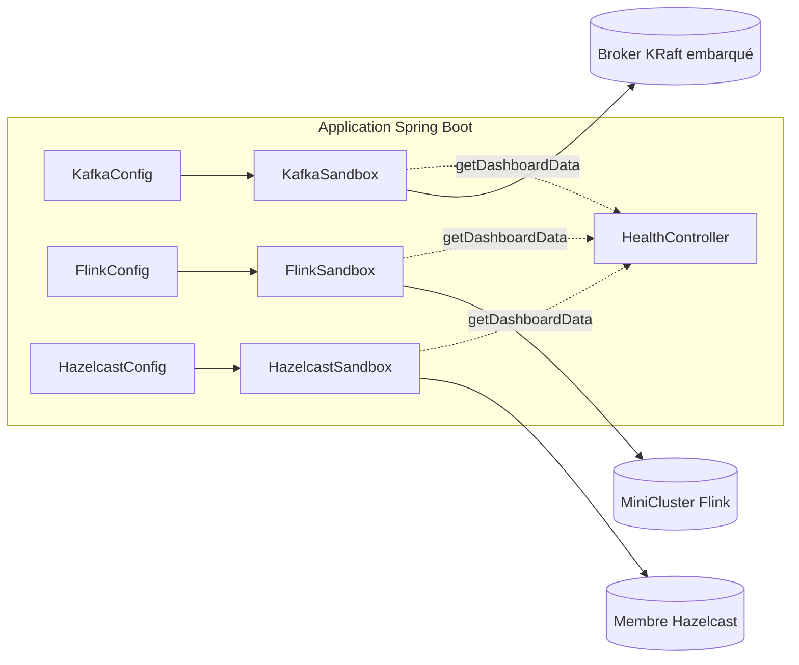
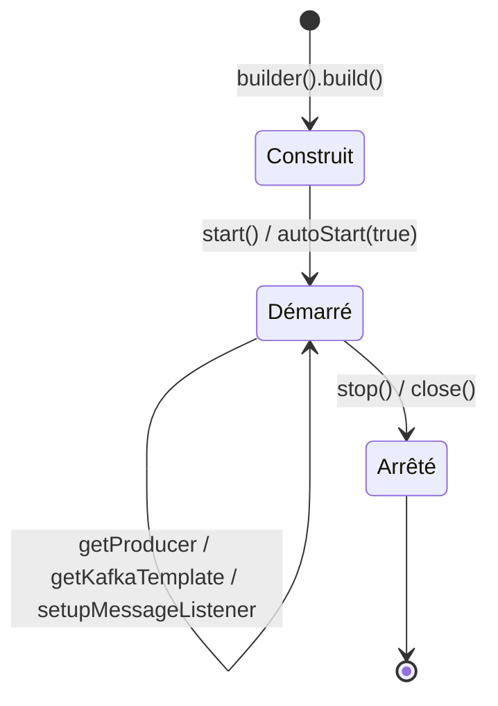

# Guides du Sandbox — Kafka, Flink et Hazelcast

> Partie du **Guide Kafka Engineering** de `org-rd-fullstack-springboot-eda`. Voir le [LISEZ_MOI du projet](./LISEZ_MOI.md).

**Portée :** documente les trois composants « sandbox » embarqués — Kafka, Flink et Hazelcast — que ce projet d'apprentissage exécute in-process : leur but, leurs drapeaux d'activation/désactivation, leur API builder, leur cycle de vie, leurs tableaux de bord, et la manière dont Spring les câble en tant que beans.

## Table des matières

- [Vue d'ensemble](#vue-densemble)
- [Sandbox Kafka](#sandbox-kafka)
- [Sandbox Flink](#sandbox-flink)
- [Sandbox Hazelcast](#sandbox-hazelcast)
- [Comment ce projet câble les sandboxes](#comment-ce-projet-câble-les-sandboxes)
- [Pièges & bonnes pratiques](#pièges--bonnes-pratiques)
- [Sources & lectures complémentaires](#sources--lectures-complémentaires)

## Vue d'ensemble

Ce projet est un sandbox d'apprentissage pour l'architecture événementielle (EDA). Pour rester autonome — cloner, exécuter, observer — il **embarque** trois moteurs d'infrastructure qui seraient normalement des services externes :

| Moteur | Forme embarquée | Rôle dans le projet |
|---|---|---|
| **Kafka** | `EmbeddedKafkaKraftBroker` (KRaft, in-process) | Épine dorsale événementielle : topics, DLT, producteurs/consommateurs, sémantiques transactionnelles. |
| **Flink** | `MiniCluster` (JobManager + TaskManagers in-process) | Traitement de flux : jobs, slots, métriques. |
| **Hazelcast** | Membre embarqué (in-process) | État distribué : `IMap` pour le `PipelineContext`, sous-système CP pour les verrous. |

Chaque moteur est encapsulé dans une petite classe **« sandbox » de style builder** (`KafkaSandbox`, `FlinkSandbox`, `HazelcastSandbox`). Chaque sandbox :

- expose un `builder()` fluide avec un drapeau `autoStart(boolean)` ;
- implémente `AutoCloseable` avec un cycle de vie explicite `start()` / `stop()` ;
- est créé comme un `@Bean` Spring à partir d'une classe `@Configuration` correspondante qui lit `application.yml` ;
- peut être activé ou désactivé via un drapeau `…sandbox.enabled` ;
- expose une méthode `getDashboardData()` exposée en REST par [`HealthController`](../../src/main/java/org/rd/fullstack/springbooteda/controller/HealthController.java).

> **Note de production.** Comme l'indique le [README du projet](../../README.md) : *« Dans ce projet, les services Kafka et Flink, ainsi qu'une base de données HSQLDB, sont embarqués. Dans une architecture de production, ces composants devraient de préférence être fournis comme des services externes. »* Les sandboxes servent au développement local, aux démos et aux tests d'intégration — pas aux charges de production. Le sandbox Kafka est le seul qui peut être pointé vers un cluster externe (via `bootstrapServers(...)`).



## Sandbox Kafka

### Présentation

[`KafkaSandbox`](../../src/main/java/org/rd/fullstack/springbooteda/util/kafka/KafkaSandbox.java) est un environnement Kafka autonome bâti sur l'`EmbeddedKafkaKraftBroker` de Spring Kafka. Il gère un broker, un registre de topics (chaque topic éventuellement associé à un Dead-Letter Topic), des producteurs et `KafkaTemplate` mis en cache, des listeners programmatiques avec un `DefaultErrorHandler` + recoverer DLT, l'administration des offsets des groupes de consommateurs et un tableau de bord. Il étend `AbstractTopicHandler` et implémente `AutoCloseable`, ce qui le rend adapté à un bloc `try (var sb = KafkaSandbox.builder()...build()) { ... }`.

### Pourquoi embarqué

Il supprime le besoin d'une infrastructure Kafka en cours d'exécution pendant le développement et les tests. Il est idéal pour les tests d'intégration, la validation du comportement transactionnel et la simulation de groupes de consommateurs. Il n'est explicitement **pas** destiné au benchmarking de performance ni à la production (les caches croissent sans limite et la synchronisation est à gros grain).

### Activer / désactiver

```yaml
org:
  rd:
    fullstack:
      springbooteda:
        kafka:
          sandbox:
            enabled: true          # → builder.autoStart(true)
            clusters: 1            # forcé à 1 (voir pièges)
            cluster-partitions: 100
            concurrency: 10
```

Le broker est sélectionné par une stratégie `BrokerLifecycle` au moment du `build()` :

- [`EmbeddedBrokerLifecycle`](../../src/main/java/org/rd/fullstack/springbooteda/util/kafka/EmbeddedBrokerLifecycle.java) — broker KRaft in-process (par défaut) ;
- [`ExternalBrokerLifecycle`](../../src/main/java/org/rd/fullstack/springbooteda/util/kafka/ExternalBrokerLifecycle.java) — utilisé lorsque `bootstrapServers(url)` est défini sur le builder, pour se connecter à un cluster Docker/Confluent/MSK.

### Principales options du builder

| Méthode du builder | Défaut | Rôle |
|---|---|---|
| `autoStart(boolean)` | `false` | Démarre le broker immédiatement lors du `build()`. |
| `autoCreateTopic(boolean)` | `false` | Crée automatiquement les topics sur le broker. |
| `bootstrapServers(String)` | `null` (embarqué) | Bascule vers un broker externe. |
| `clusterPartitions(int)` | constante | Partitions par défaut par topic du cluster. |
| `concurrency(int)` | constante | Concurrence par défaut des listeners. |
| `clusters(int)` | `1` | **No-op déprécié** — forcé à 1. |
| `addTopic(name, …)` | — | Enregistre un topic (+ DLT optionnel) dans le registre ; nombreuses surcharges sur `AbstractTopicHandler`. |

La surcharge la plus complète d'`addTopic` accepte `name`, `dltName`, `partitions`, `replicas`, `retryAttempts`, `retryInterval`, les sérialiseurs clé/valeur, les désérialiseurs clé/valeur et des maps de propriétés producteur/consommateur supplémentaires. Chaque topic est modélisé par le record immuable [`TopicConfig`](../../src/main/java/org/rd/fullstack/springbooteda/util/kafka/TopicConfig.java) ; les aspects transactionnels (p. ex. `transactional.id`) sont modélisés explicitement plutôt que cachés dans des maps de propriétés.

```java
KafkaSandbox sandbox = KafkaSandbox.builder()
    .autoStart(true)
    .addTopic("orders", "orders-dlt", 8, (short) 1)
    .build();

// Producteur / template non transactionnel.
KafkaTemplate<Object, Object> orders = sandbox.getKafkaTemplate("orders");
orders.send("orders", "order-1", "CREATED");

// Template transactionnel (mis en cache par topic + drapeau transactionnel).
KafkaTemplate<Object, Object> payments = sandbox.getKafkaTemplate("payments", true);
payments.executeInTransaction(kt -> { kt.send("payments", "p-1", "INIT"); return null; });

// Listener programmatique avec câblage DLT automatique.
sandbox.setupMessageListener("orders",
    (MessageListener<String, String>) rec -> System.out.println(rec.value()));
```

Les consommateurs sont configurés avec `isolation.level=read_committed`, `enable.auto.commit=false` et `auto.offset.reset=earliest`. Les producteurs transactionnels ne sont jamais partagés, sont mis en cache par `(topic, transactional)` et appellent `initTransactions()` exactement une fois. Le gestionnaire d'erreurs utilise un `FixedBackOff` (où `maxAttempts` compte les *nouvelles tentatives*, donc `retryAttempts=1` signifie 1 originale + 1 nouvelle tentative) et un `DeadLetterPublishingRecoverer`.

### Cycle de vie

`start()` est idempotent et démarre le broker ; `stop()` (aussi via `close()`) bascule atomiquement le drapeau de démarrage, puis arrête les moniteurs, arrête/détruit les listeners, vide/détruit les templates et producteurs, ferme l'`AdminClient` et démonte le broker. Un garde-fou, `requireStarted()`, lève une exception si des méthodes sont utilisées avant `start()`.



### Tableau de bord & observabilité

`getDashboardData()` renvoie un [`KafkaDashboard`](../../src/main/java/org/rd/fullstack/springbooteda/util/kafka/KafkaDashboard.java) : id/IP du cluster, nombre de brokers, controller, résumés par topic et lag par groupe (calculé à partir des offsets courants vs. offsets de fin de log). Il est exposé sur `GET /api/kafkaDashboardData`. `getConsumerGroupMonitor()`, `getTopics()` et `seekConsumerGroupOffsets(...)` offrent une introspection et un contrôle des offsets supplémentaires.

### Pièges

- **Un seul cluster.** `clusters(int)` est un no-op déprécié (un bug dans `EmbeddedKafkaKraftBroker`) ; toute valeur autre que 1 est ignorée avec un avertissement.
- **Caches sans limite & verrouillage grossier.** Les caches de producteurs/templates/listeners ne rétrécissent jamais et plusieurs opérations se synchronisent sur `this`. Acceptable en dev/test, pas pour une utilisation de longue durée.
- **`seekConsumerGroupOffsets` utilise `assign()` + `poll()`.** Il écrit les offsets directement sans rejoindre le groupe ; le `poll()` peut occasionnellement consommer un enregistrement selon le timing.
- **`getDefaultErrorHandler()` a un effet de bord** — il crée paresseusement le topic DLT par défaut.
- **`getBrokerMetrics()` est réservé au mode embarqué** et lève `UnsupportedOperationException` contre un broker externe.

## Sandbox Flink

### Présentation

[`FlinkSandbox`](../../src/main/java/org/rd/fullstack/springbooteda/util/flink/FlinkSandbox.java) encapsule un `MiniCluster` Apache Flink — un cluster in-process avec un JobManager et un nombre configurable de TaskManagers et de slots. Il implémente `AutoCloseable`, possède des `start()`/`stop()` thread-safe, et expose l'endpoint REST, la vue d'ensemble du cluster et la liste des jobs.

> Cette section couvre le **moteur** embarqué. Pour le **chemin de traitement Flink** au niveau applicatif du pipeline d'opérations — la route optionnelle qui envoie les requêtes à travers un job Flink appelant le processeur, plus son checkpointing, sa gestion Dead-Letter et sa pause/reprise via savepoint — voir le [Guide Flink](./guides_flink.md) dédié. Il explique aussi pourquoi cette conception in-JVM n'est **pas** portable vers un vrai cluster Flink.

### Pourquoi embarqué

Il permet d'exécuter des jobs Flink et d'observer les métriques sans aucune infrastructure externe, adapté à l'expérimentation locale et aux tests d'intégration. En production, Flink serait un cluster standalone/YARN/Kubernetes.

### Activer / désactiver

```yaml
flink:
  sandbox:
    enabled: true                 # → builder.autoStart(true)
    rest-port: 0                  # 0 = auto-sélection
    job-manager-port: 0           # 0 = auto-sélection
    task-manager-rpc-port: ""     # vide = auto-sélection ; peut être une plage
    num-task-managers: 1
    num-slots-per-task-manager: 4
    active-metrics: false
```

### Principales options du builder

| Méthode du builder | Défaut | Rôle |
|---|---|---|
| `autoStart(boolean)` | `false` | Démarre le MiniCluster lors du `build()`. |
| `restPort(int)` | `0` | Port REST/UI ; 0 = auto. |
| `jobManagerPort(int)` | `0` | Port RPC du JobManager ; 0 = auto. |
| `taskManagerRpcPort(String)` | `""` | Port RPC (ou plage) du TaskManager ; vide = auto. |
| `numTaskManagers(int)` | `1` | Nombre de TaskManagers (doit être > 0). |
| `numSlotsPerTaskManager(int)` | `4` | Slots de tâches par TaskManager (doit être > 0). |
| `activeMetrics(boolean)` | `false` | Enregistre le reporter Prometheus. |
| `prometheusPort(int)` | `9249` | Port du reporter Prometheus. |

```java
FlinkSandbox flink = FlinkSandbox.builder()
    .numTaskManagers(1)
    .numSlotsPerTaskManager(4)
    .autoStart(true)
    .build();

URI restApi = flink.getURI();              // soumettre des jobs / interroger les métriques ici
FlinkDashboard dash = flink.getDashboardData();
```

`build()` lève `Exception` (la méthode fabrique du bean la propage). Les ports sont validés (0 = auto, sinon 1–65535) ; un `taskManagerRpcPort` non numérique est toléré en tant que plage.

### Cycle de vie

`start()` construit et démarre un `MiniCluster` (idempotent via une référence `volatile`) ; `stop()`/`close()` le ferme et met la référence à null. `getURI()`, `getDashboardData()` et les autres accesseurs appellent `requireStartedCluster()` et lèvent une exception si le cluster n'est pas démarré.

### Tableau de bord & observabilité

`getDashboardData()` renvoie un [`FlinkDashboard`](../../src/main/java/org/rd/fullstack/springbooteda/util/flink/FlinkDashboard.java) construit à partir de `requestClusterOverview()` et `listJobs()` : TaskManagers connectés, slots totaux/disponibles, nombres de jobs running/finished/cancelled/failed, version/commit de Flink, et une liste par job (id, nom, état, heure de démarrage). Exposé sur `GET /api/flinkDashboardData`. Avec `activeMetrics`, le cluster sert aussi les propres endpoints REST de métriques de Flink (p. ex. `/jobmanager/metrics`, `/jobs/overview`).

### Pièges

- **Ports auto-sélectionnés** (les valeurs par défaut `0`/vide) signifient que le port de l'UI REST n'est pas fixe ; lisez-le via `getURI()`.
- Tous les appels dashboard/URI ont un timeout de 30 secondes et enveloppent les échecs d'interruption/exécution/timeout dans une `IllegalStateException`.

## Sandbox Hazelcast

### Présentation

[`HazelcastSandbox`](../../src/main/java/org/rd/fullstack/springbooteda/util/hazelcast/HazelcastSandbox.java) encapsule une instance Hazelcast embarquée. Elle peut s'exécuter comme membre `SERVER` ou comme `CLIENT` (voir [`Mode`](../../src/main/java/org/rd/fullstack/springbooteda/util/hazelcast/Mode.java)), configure le réseau/join, déclare des `IMap`, et active optionnellement le sous-système CP (Raft). Dans ce projet, elle stocke le `PipelineContext` distribué dans une `IMap`.

### Pourquoi embarqué

Elle fournit un état distribué (maps) et des primitives de coordination distribuée (sous-système CP / verrous) in-process, de sorte que le pipeline EDA peut conserver un contexte partagé entre composants sans cluster Hazelcast externe. En production, Hazelcast serait un vrai cluster multi-membres (et le sous-système CP exigerait 3 membres ou plus).

### Activer / désactiver

```yaml
hazelcast:
  sandbox:
    enabled: true                 # → builder.autoStart(true), démarré en mode SERVER
    instance-name: springboot-eda-instance
    cluster-name: springboot-eda-cluster
    port: ...
    port-count: ...
    port-auto-increment: ...
    join:
      multicast: { enabled: ... }
      tcp-ip: { enabled: ..., members: ... }
    cp-subsystem:
      cp-member-count: ...
      session-heartbeat-interval-seconds: ...
      session-time-to-live-seconds: ...
```

### Principales options du builder

| Méthode du builder | Rôle |
|---|---|
| `mode(Mode)` | `SERVER` (membre embarqué) ou `CLIENT`. |
| `instanceName` / `clusterName` | Identité de l'instance et du cluster. |
| `port` / `portCount` / `portAutoIncrement` | Plage de ports réseau. |
| `multicastEnabled(boolean)` | Découverte des membres par multicast. |
| `tcpIpEnabled(boolean)` / `tcpIpMembers(String)` | Découverte des membres par TCP/IP. |
| `addMap(String)` | Enregistre une `IMap` (`MapConfig`). |
| `cpMemberCount(int)` | Taille du sous-système CP — voir pièges. |
| `sessionHeartbeatIntervalSeconds` / `sessionTimeToLiveSeconds` | Réglage des sessions CP (appliqué uniquement quand `cpMemberCount > 0`). |
| `autoStart(boolean)` | Démarre lors du `build()` (dans le `mode` configuré). |

```java
HazelcastSandbox hz = HazelcastSandbox.builder()
    .mode(Mode.SERVER)
    .addMap("pipeline-context")
    .cpMemberCount(1)               // 1 = mode UNSAFE, tests locaux uniquement
    .autoStart(true)
    .build();

IMap<String, Object> ctx = hz.getMap("pipeline-context");
CPSubsystem cp = hz.getCPSubsystem();
```

### Cycle de vie

`start(Mode)` crée soit un membre serveur (`Hazelcast.getOrCreateHazelcastInstance`) soit un client (`HazelcastClient.newHazelcastClient`), protégé par une référence `volatile` et idempotent. `stop()`/`close()` appelle `shutdown()`. `getMap`, `getCPSubsystem`, `getHazelcastInstance` et `getDashboardData` appellent tous `requireStarted()`.

### Tableau de bord & observabilité

`getDashboardData()` renvoie un [`HazelcastDashboard`](../../src/main/java/org/rd/fullstack/springbooteda/util/hazelcast/HazelcastDashboard.java) : nom de l'instance/du cluster, état et heure du cluster, liste des membres, stats par map (entrées possédées/backup, hits, nombres d'opérations, entrées verrouillées, coût en heap, horodatages) et infos de partition (partitions totales/locales, cluster-safe / local-member-safe / migration en cours). Exposé sur `GET /api/hazelcastDashboardData`.

### Pièges

- **Sémantique du nombre de membres CP :** `0` désactive le CP (pas de `FencedLock`) ; `1` est le mode **UNSAFE** (tests locaux uniquement) ; `3+` est le mode Raft strict (obligatoire en production).
- **Chargement de classes DevTools.** Le builder épingle la (dé)sérialisation de Hazelcast au classloader de contexte courant. Sans cela, le `RestartClassLoader` de Spring Boot DevTools provoque des `ClassCastException` sur les valeurs d'`IMap` dont les types partagent un nom mais diffèrent de loader.
- **Le compteur de « miss » des maps** dans les stats est codé en dur à `0` (`LocalMapStats` ne l'expose pas sur un membre local).

## Comment ce projet câble les sandboxes

Chaque sandbox est créé comme un `@Bean` Spring à partir d'une classe `@Configuration` sous [`config/`](../../src/main/java/org/rd/fullstack/springbooteda/config/), qui lie les valeurs d'`application.yml` via `@Value` et passe le drapeau `…sandbox.enabled` à `autoStart(...)` :

| Moteur | Classe sandbox | Classe de config | Drapeau `enabled` |
|---|---|---|---|
| Kafka | [`KafkaSandbox`](../../src/main/java/org/rd/fullstack/springbooteda/util/kafka/KafkaSandbox.java) | [`KafkaConfig`](../../src/main/java/org/rd/fullstack/springbooteda/config/KafkaConfig.java) | `…kafka.sandbox.enabled` |
| Flink | [`FlinkSandbox`](../../src/main/java/org/rd/fullstack/springbooteda/util/flink/FlinkSandbox.java) | [`FlinkConfig`](../../src/main/java/org/rd/fullstack/springbooteda/config/FlinkConfig.java) | `…flink.sandbox.enabled` |
| Hazelcast | [`HazelcastSandbox`](../../src/main/java/org/rd/fullstack/springbooteda/util/hazelcast/HazelcastSandbox.java) | [`HazelcastConfig`](../../src/main/java/org/rd/fullstack/springbooteda/config/HazelcastConfig.java) | `…hazelcast.sandbox.enabled` |

Détails de câblage notables :

- **`KafkaConfig`** enregistre les topics du projet (`CST_TOPIC_KAFKA_REQ`, `CST_TOPIC_FLINK_REQ`, chacun avec un compagnon `-dlt`), et définit aussi un `KafkaTemplate` Spring, une `ProducerFactory`, une `ConsumerFactory`, une `ConcurrentKafkaListenerContainerFactory` (pour que `@KafkaListener` fonctionne) et un `DefaultErrorHandler` paresseux provenant de `kafkaSandbox.getDefaultErrorHandler()`. Les configs producteur/consommateur Spring sont délibérément alignées avec `KafkaSandbox` (idempotence, `acks=all`, `read_committed`, `max.poll.records` borné).
- **`FlinkConfig`** mappe les valeurs YAML ports/TM/slots/métriques sur le builder.
- **`HazelcastConfig`** construit toujours en `Mode.SERVER` et enregistre les trois maps du projet (`CST_MAPNAME_CTX` pour les paramètres du pipeline, `CST_MAPNAME_STATS` pour les stats/état d'exécution, et `CST_MAPNAME_CLIENT_LOCKS` pour les verrous par client servant à sérialiser les mises à jour de solde).
- **[`HealthController`](../../src/main/java/org/rd/fullstack/springbooteda/controller/HealthController.java)** injecte (autowire) les trois sandboxes et expose `GET /api/kafkaDashboardData`, `/api/flinkDashboardData`, `/api/hazelcastDashboardData`, plus des bascules liveness/readiness.

## Pièges & bonnes pratiques

- **Les sandboxes ne sont pas la production.** Conformément au README, traitez Kafka/Flink/Hazelcast comme des services externes en production. Seul `KafkaSandbox` prend en charge un broker externe (`bootstrapServers(...)`).
- **Libérez toujours les ressources.** Les trois implémentent `AutoCloseable` ; appuyez-vous sur la destruction des beans Spring (ou `try`-with-resources dans les tests) pour que brokers/clusters/membres s'arrêtent proprement.
- **Respectez le garde-fou de démarrage.** Appeler des méthodes du sandbox avant `start()` lève `IllegalStateException`.
- **Kafka :** préférez le mode d'ack `MANUAL_IMMEDIATE` pour l'at-least-once ; utilisez des templates transactionnels pour une publication de type exactly-once ; rappelez-vous que `clusters` est plafonné à 1 et que les caches sont sans limite.
- **Flink :** les ports s'auto-sélectionnent par défaut — découvrez l'endpoint REST via `getURI()` plutôt que de supposer `8081`.
- **Hazelcast :** utilisez `cpMemberCount >= 3` pour toute garantie CP réelle ; la configuration par défaut UNSAFE/`1` membre du projet est réservée à un usage local. Gardez à l'esprit l'épinglage du classloader de contexte lors de l'exécution sous DevTools.
- Pour des conseils opérationnels Kafka plus larges, voir les guides thématiques : [Cycle de vie et opérations](./cycle_vie_et_operations.md) (rééquilibrage, pause/arrêt, arrêt gracieux) et [Sémantiques de livraison et fiabilité](./semantiques_livraison_et_fiabilite.md) (garanties de livraison, acks, retries/DLT).

## Sources & lectures complémentaires

- [Guide Flink](./guides_flink.md) — le chemin de traitement Flink au niveau applicatif (option, checkpointing, DLT, pause/reprise, réserves in-JVM vs. cluster).
- [README du projet](../../README.md) — description générale du projet et la note de production embarqué-vs-externe.
