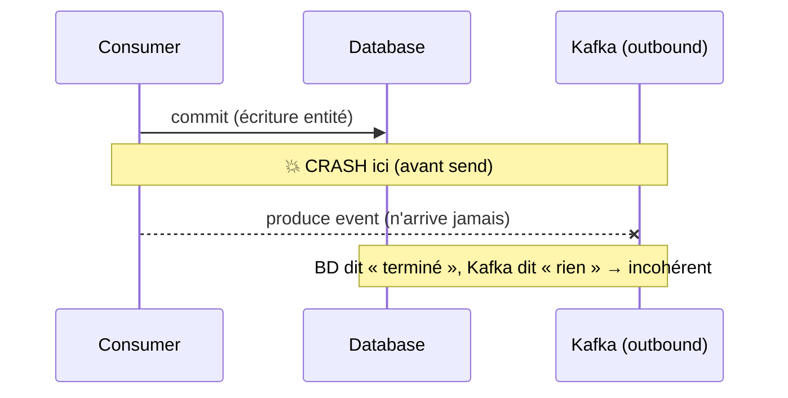
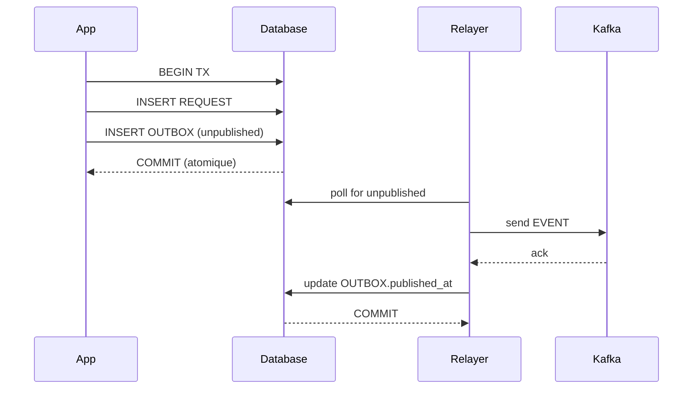
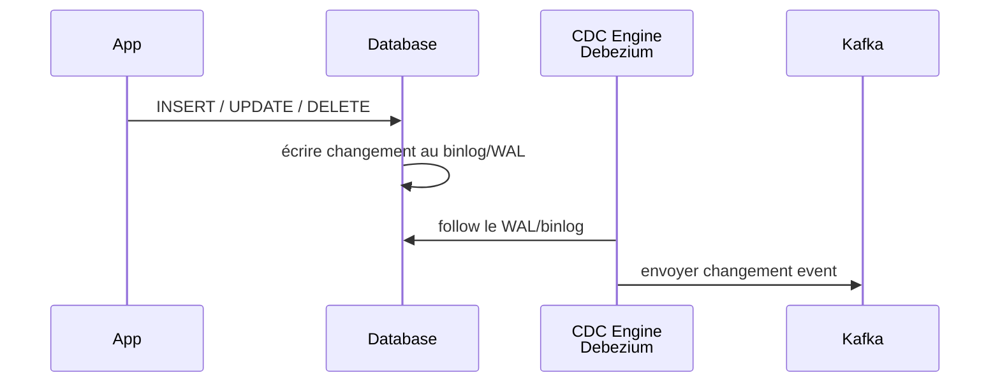

# Patrons de persistance et transaction

> Partie du **Guide Kafka Engineering** de `org-rd-fullstack-springboot-eda`. Voir le [LISEZ_MOI du projet](./LISEZ_MOI.md).

**Portée :** l'un des défis architecturaux les plus fondamentaux d'une architecture événementielle consiste à garantir qu'une **mise à jour de la base de données** et la **publication d'un événement** soient atomiques : c'est le **problème de la double écriture** (*dual write problem*). Ce guide couvre toute la chaîne qui garde les données correctes sous la sémantique *at-least-once* de Kafka : pourquoi le problème de la double écriture existe, les deux patrons qui le résolvent (**Transactional Outbox** et **Change Data Capture**), comment rendre les consommateurs idempotents, et comment l'isolation transactionnelle et le verrouillage préviennent les courses critiques de type *lost-update* / *write-skew*. Le pipeline de crédit/débit d'inventaire du projet sert d'exemple fil rouge.

## Table des matières

- [Vue d'ensemble](#vue-densemble)
- [Problème de double écriture](#problème-de-double-écriture)
- [Patron 1 — Transactional Outbox](#patron-1--transactional-outbox)
- [Patron 2 — Change Data Capture (CDC)](#patron-2--change-data-capture-cdc)
- [Comparaison : Outbox vs CDC](#comparaison--outbox-vs-cdc)
- [Patron du consommateur idempotent](#patron-du-consommateur-idempotent)
- [Stratégies de déduplication](#stratégies-de-déduplication)
- [Effectively-once : ce qui est réellement garanti](#effectively-once--ce-qui-est-réellement-garanti)
- [Verrouillage distribué et sérialisation](#verrouillage-distribué-et-sérialisation)
- [Verrouillage de la base de données et courses critiques](#verrouillage-de-la-base-de-données-et-courses-critiques)
- [Gestion des transactions Spring](#gestion-des-transactions-spring)
- [Aparté comptable : partie double, débit et crédit](#aparté-comptable--partie-double-débit-et-crédit)
- [Comment ce projet l'applique](#comment-ce-projet-lapplique)
- [Pièges et bonnes pratiques](#pièges-et-bonnes-pratiques)
- [Lectures associées](#lectures-associées)

## Vue d'ensemble

La messagerie distribuée avec Kafka est **at-least-once** par défaut. Un consommateur peut voir le même message plusieurs fois (*timeouts* de *poll*, rééquilibrages, un producteur non idempotent qui retente), et un producteur peut écrire un événement en double après une défaillance transitoire. Pour garder les données correctes dans ces conditions, trois préoccupations doivent être traitées ensemble :

- **Idempotence** — traiter deux fois le même message doit laisser le système dans le même état que le traiter une seule fois.
- **Changement d'état + publication atomiques** — un même message met souvent à jour la base de données *et* émet un nouvel événement ; les deux doivent committer ensemble ou pas du tout (le problème de la double écriture).
- **Contrôle de concurrence** — plusieurs messages (ou plusieurs threads consommateurs) touchant la même ligne ne doivent pas la corrompre par une course *check-then-act*.

Imaginons un service qui reçoit une commande, l'enregistre dans sa base de données, puis publie un événement `OrderCreated` dans Kafka. Ces deux opérations correspondent à deux commits indépendants :

```java
@Transactional
public void createOrder(Order order) {
    repository.save(order);                    // TX 1 : commit en base de données
    kafkaTemplate.send(topic, event);          // TX 2 : accusé de réception de Kafka
}
```

Ce guide traite chaque préoccupation, puis montre où le projet la satisfait déjà et où il laisse délibérément une course connue en place à des fins pédagogiques.

## Problème de double écriture

Un consommateur (ou producteur) qui écrit dans deux systèmes en une seule étape logique — par exemple `INSERT` d'une ligne en base de données **et** `produce` d'un événement dans Kafka — effectue une *double écriture*. Les deux écritures appartiennent à deux ressources transactionnelles distinctes (une transaction BD et une transaction Kafka) qui **ne peuvent pas être committées de manière atomique**.

Si le processus s'effondre **entre** ces deux commits, les ressources restent incohérentes :

- BD committée, événement non publié → les consommateurs en aval n'apprennent jamais le changement. La commande existe dans la base de données, mais personne ne le sait.
- Événement publié, BD annulée → l'aval agit sur un changement qui n'existe pas.

Une validation en deux phases (2PC) entre Kafka et la base de données — par exemple un gestionnaire de transactions chaîné — *ressemble* à une solution, mais les sources sont explicites : elle peut tout de même échouer dans certaines fenêtres, laisse les ressources incohérentes et ajoute de la latence à chaque transaction.



La solution robuste consiste à éviter entièrement la double écriture : écrire tout dans **une seule** ressource transactionnelle (la base de données) et laisser un mécanisme séparé relayer l'événement. Deux patrons réalisent cela — le **Transactional Outbox** et le **Change Data Capture (CDC)**.

## Patron 1 — Transactional Outbox

**Principe :** enregistrez l'événement dans une table `OUTBOX` au sein de la **même transaction métier** que la mise à jour des données. Une fois la transaction validée, un processus de fond (poller, déclencheur ou connecteur CDC) lit les événements non publiés et les relaie vers Kafka.

```sql
CREATE TABLE OUTBOX (
    ID BIGINT PRIMARY KEY GENERATED ALWAYS AS IDENTITY,
    AGGREGATE_TYPE VARCHAR(64),          -- type d'entité (Order, Product, etc.)
    AGGREGATE_ID BIGINT,                 -- identifiant de l'entité
    PAYLOAD TEXT,                        -- événement sérialisé (JSON)
    CREATED_AT TIMESTAMP DEFAULT CURRENT_TIMESTAMP,
    PUBLISHED_AT TIMESTAMP               -- NULL tant que l'événement n'est pas publié
);

CREATE TABLE REQUEST (
    ID BIGINT PRIMARY KEY,
    PRODUCT_ID BIGINT,
    QUANTITY INT,
    CREATED_AT TIMESTAMP,
    PUBLISHED_TO_KAFKA BOOLEAN           -- indicateur de publication (optionnel)
);
```

### Producteur

```java
@Transactional
public void publishRequest(Request req) {
    // Étape 1 : Enregistrer la demande
    requestRepository.save(req);

    // Étape 2 : Enregistrer l'événement dans OUTBOX (même transaction)
    OutboxEvent event = new OutboxEvent(
        "Request", req.getId(), serializeEvent(req)
    );
    outboxRepository.save(event);

    // Une seule transaction englobe REQUEST et OUTBOX.
    // Les deux écritures sont soit validées ensemble,
    // soit annulées ensemble.
}
```

### Relayeur de fond

```java
@Scheduled(fixedRate = 1000)
public void relayUnpublishedEvents() {
    List<OutboxEvent> unpublished = outboxRepository.findByPublishedAtIsNull();

    for (OutboxEvent event : unpublished) {
        try {
            // Publier l'événement dans Kafka
            kafkaTemplate.send(topic, event.getPayload());

            // Marquer l'événement comme publié
            event.setPublishedAt(Instant.now());
            outboxRepository.save(event);
        } catch (Exception e) {
            // Nouvelle tentative au prochain cycle
            // ou redirection vers une DLQ selon la stratégie retenue
            log.warn("Échec de la publication de l'événement {}", event.getId());
        }
    }
}
```

L'application garantit ainsi que la donnée métier et son événement sont enregistrés de manière atomique. Si la transaction est annulée, ni la ligne métier ni la ligne de la table `OUTBOX` ne sont conservées. Si la publication vers Kafka échoue, l'événement reste présent dans `OUTBOX` et sera de nouveau traité lors du prochain passage du relayeur.



**L'ordre des commits** est déterminant. La transaction BD doit committer *avant* que les offsets du consommateur ne soient écrits. Si les offsets étaient committés en premier et que le processus mourait avant le commit BD, le message ne serait pas relivré et l'écriture de l'entité comme l'événement sortant seraient perdus. À l'inverse, si le consommateur meurt après le commit BD mais avant l'écriture des offsets, le message est relivré et la vérification de l'identifiant traité le dédoublonne.

Le relais lui-même admet deux implémentations courantes :

- **CDC avec Kafka Connect / Debezium** (recommandé) : le connecteur lit le journal de commit de la base de données, transforme la ligne outbox et l'écrit dans le topic sortant. Il hérite de la résilience, de la tolérance aux pannes et de la scalabilité de Kafka. Voir le patron CDC ci-dessous.
- **Un simple poller** qui lit la table outbox et produit vers Kafka — viable, mais vous réimplémentez ce que Connect fournit déjà.

### Avantages — Transactional Outbox

- **Atomicité garantie** : REQUEST et OUTBOX committent ensemble.
- **Pas de coordinateur XA** : une seule transaction BD, SQL standard.
- **Résilient** : si le relayeur s'effondre, les événements non publiés sont relayés au redémarrage.

### Inconvénients — Transactional Outbox

- **Latence** : par défaut, il y a un délai entre le commit BD et la publication vers Kafka (le cycle du relayeur, habituellement < 5 s).
- **Table volumineuse** : OUTBOX croît jusqu'à ce que les événements soient relayés et purgés, nécessitant une politique de rétention.
- **Logique de relayeur** : vous devez implémenter le relayeur ou utiliser une bibliothèque (Debezium peut aussi relayer depuis OUTBOX).

## Patron 2 — Change Data Capture (CDC)

**Principe :** au lieu d'interroger périodiquement la table `OUTBOX`, le mécanisme de **Change Data Capture (CDC)** lit directement le **journal de transactions** de la base de données (par exemple le *binlog* de MySQL ou le *Write-Ahead Log (WAL)* de PostgreSQL). Chaque modification validée (*INSERT*, *UPDATE*, *DELETE*) est capturée, transformée en événement, puis relayée vers Kafka, sans qu'il soit nécessaire d'ajouter une table `OUTBOX` à l'application.

**Outils populaires :**

- [Debezium](https://debezium.io/) : la solution de référence pour le CDC. Elle s'intègre généralement à Kafka Connect et prend en charge de nombreux systèmes de gestion de bases de données.
- [Maxwell's Daemon](https://maxwells-daemon.io/) : outil léger spécialisé dans le streaming du *binlog* MySQL vers Kafka et d'autres destinations.
- [PostgreSQL Logical Decoding](https://www.postgresql.org/docs/current/logical-decoding.html) : mécanisme natif de PostgreSQL permettant d'extraire les changements à partir du WAL, utilisé notamment par Debezium.

### Flux



### Avantages — Change Data Capture (CDC)

- **Sans application** : le CDC fonctionne en dehors de votre app, aucun code métier n'a besoin de gérer les événements.
- **Capture tous les changements** : même les mises à jour directes en SQL (non via l'app) sont capturées.
- **Latence faible** : certains moteurs CDC (en particulier Postgres Logical Decoding) transmettent les changements en millisecondes.

### Inconvénients — Change Data Capture (CDC)

- **Infrastructure supplémentaire** : vous devez exécuter et opérer le moteur CDC (Debezium, cluster Kafka Connect).
- **Complexité de schéma** : les changements structuraux (ajout/suppression de colonne) peuvent interrompre le pipeline CDC.
- **Certification/conformité** : certaines réglementations exigent que l'application soit consciente des événements (pas de CDC caché).

## Comparaison : Outbox vs CDC

| Aspect | **Outbox** | **CDC** |
|---|---|---|
| **Complexité app** | Modérée (écrire OUTBOX) | Aucune (passif) |
| **Latence** | Plus lente (poll cycle, ~1-5 s) | Plus rapide (follow WAL, ~100 ms) |
| **Couverture** | Uniquement les changements via l'app | Tous les changements (y compris directs) |
| **Infrastructure supplémentaire** | Faible (juste un poller) | Élevée (Debezium + Kafka Connect) |
| **Rétention de table** | OUTBOX croît jusqu'à purge | Aucune table intermédiaire |
| **Opérabilité** | Simple | Complexe |
| **Adaptation aux micro-services** | Excellente (chaque service gère son outbox) | Bonne (CDC centralisé pour plusieurs BD) |

## Patron du consommateur idempotent

Un consommateur idempotent peut consommer le même message un nombre quelconque de fois mais ne le *traite* qu'une seule fois. L'implémentation recommandée suit les messages traités dans la base de données :

1. Chaque message porte un `messageId` unique (dans la charge utile ou un en-tête Kafka), attribué par le producteur.
2. À la consommation, le consommateur vérifie une table `processed_messages` pour cet identifiant.
3. S'il est présent → c'est un doublon ; mettre à jour les offsets pour le marquer consommé et ne rien faire d'autre.
4. S'il est absent → démarrer une transaction BD, insérer l'identifiant, exécuter la logique métier, committer.

L'insertion de l'identifiant et les écritures métier partagent **une seule** transaction ; elles sont donc atomiques : soit les deux aboutissent, soit les deux sont annulées.

### La stratégie de flush compte

La subtilité tient au *moment* où le conflit de contrainte d'unicité sur `messageId` est détecté. Avec le *write-behind* transactionnel par défaut d'Hibernate, le flush a lieu au moment du commit ; deux doublons traités en parallèle peuvent donc tous deux exécuter leur logique métier complète, et seul le perdant échoue au commit — après que des effets de bord (par exemple un appel REST externe) se sont déjà produits deux fois.

Flusher au moment de l'enregistrement (`saveAndFlush`) change cela : la seconde transaction bloque sur le verrou de ligne dès qu'elle tente d'insérer l'identifiant en double, et est avortée avant de faire un travail redondant.

```java
private void deduplicate(UUID eventId) throws DuplicateEventException {
    try {
        // flush immédiatement pour que le conflit de clé unique
        // remonte maintenant, et non au moment du commit
        processedEventRepository.saveAndFlush(new ProcessedEvent(eventId));
    } catch (DataIntegrityViolationException e) {
        throw new DuplicateEventException(eventId);
    }
}
```

C'est l'approche recommandée, car elle minimise les *actions* en double, et pas seulement les *commits* en double.

## Stratégies de déduplication

Les sources présentent trois patrons et ce que chacun laisse dupliqué selon les points de défaillance :

| Patron | Mécanisme | Risque de doublon résiduel |
|---|---|---|
| **Consommateur idempotent** | Table d'identifiants traités + flush verrouillant, dans la transaction métier | Un effet de bord non annulable (ex. POST externe) avant le point de défaillance |
| **Transactional outbox** | Événement sortant écrit dans une table outbox dans la même transaction BD ; relayé par CDC | Aucun pour l'événement sortant ; le POST en amont peut encore se dupliquer |
| **Transactions Kafka** | Exactly-once sur consommation → traitement → production via le journal de transactions | Les étapes consommation + traitement peuvent encore se répéter ; ne peut pas être combiné sûrement avec la table du consommateur idempotent |

Contraintes clés issues des sources :

- La transaction BD et la transaction Kafka **ne peuvent pas** être committées de manière atomique ; combiner le consommateur idempotent avec les transactions Kafka risque une perte de données dans certains ordonnancements.
- Le consommateur idempotent et le transactional outbox **peuvent** être combinés, et cette combinaison est le « gold standard » recommandé.
- Aucun patron ne peut rendre sûr un POST amont non idempotent — cet appel tiers doit être rendu idempotent de son côté (par exemple une clé d'idempotence honorée par l'appelé).

L'outil polyvalent est une **clé d'idempotence** : un identifiant déterministe, dérivé du message, qu'une opération en aval utilise pour reconnaître et fusionner les répétitions. La table des messages traités en est une réalisation.

## Effectively-once : ce qui est réellement garanti

Un véritable exactly-once de bout en bout entre une BD et Kafka n'est pas atteignable sans 2PC atomique, qui n'est pas disponible ici. Ce que les patrons offrent est un traitement **effectively-once** :

- Livraison at-least-once (Kafka relivre en cas d'échec) **+** traitement idempotent (déduplication) ⇒ l'effet observable est unique.
- Le transactional outbox garantit que l'**événement sortant** est publié exactement une fois par rapport à l'état committé.
- Une action at-least-once résiduelle (le POST en amont) subsiste ; elle est reportée sur l'appelé, qui doit la rendre idempotente.

Même avec l'outbox et le CDC, la duplication est possible : le relayeur envoie l'événement, Kafka en accuse réception, mais le relayeur s'effondre avant de marquer `published_at`. Au redémarrage, il relaie à nouveau. Le remède est une garde d'idempotence côté consommateur ; la combinaison outbox + consommateur idempotent donne une sémantique effectively-once.

Dans ce projet, la garantie « effectively-once » provient de l'idempotence dans le processeur plutôt que d'un outbox : [`PipelineSrv`](../../src/main/java/org/rd/fullstack/springbooteda/srv/PipelineSrv.java) ignore toute demande dont le `result` n'est plus `PENDING`/`BACK_ORDER`, de sorte qu'un message relivré est reconnu comme déjà traité.

## Verrouillage distribué et sérialisation

L'un des défis du patron outbox est de garantir que les enregistrements en cours de relais / mise à jour par le relayeur ne sont pas pris deux fois par deux relayeurs concurrents (en particulier sur EKS, où plusieurs pods peuvent exécuter le relayeur).

**Solution :** verrou distribué ou marqueur atomique :

```java
@Transactional
public void relayUnpublishedEvents() {
    // Acquérir un verrou distribué (Hazelcast, Redis, base de données)
    if (distributedLock.tryLock("outbox-relayer", Duration.ofSeconds(10))) {
        try {
            List<OutboxEvent> unpublished = outboxRepository
                .findByPublishedAtIsNullAndLockedIsFalse();

            for (OutboxEvent event : unpublished) {
                event.setLocked(true);
                outboxRepository.save(event);  // marquer comme verrouillé

                try {
                    kafkaTemplate.send(topic, event.getPayload());
                    event.setPublishedAt(Instant.now());
                } finally {
                    event.setLocked(false);
                }
                outboxRepository.save(event);
            }
        } finally {
            distributedLock.unlock("outbox-relayer");
        }
    }
}
```

Alternativement, utilisez un `UPDATE` pessimiste :

```sql
-- Postgres : sélectionner et verrouiller atomiquement
SELECT * FROM OUTBOX WHERE published_at IS NULL FOR UPDATE LIMIT 10;
```

Cela garantit qu'au plus une instance relaie chaque événement.

## Verrouillage de la base de données et courses critiques

L'idempotence empêche le *traitement* en double. Elle n'empêche **pas** une course de type *lost-update* (perte de mise à jour) entre deux messages *distincts* qui modifient tous deux la même ligne. La forme classique est le *check-then-act* (également TOCTOU — *time-of-check to time-of-use*) :

```text
1. lire qty
2. vérifier qty >= demandée
3. décrément relatif : qty = qty - demandée
```

Deux threads peuvent tous deux passer l'étape 2 sur la même lecture périmée, puis tous deux appliquer l'étape 3, produisant une valeur inférieure à zéro — une survente silencieuse.

### Les mécanismes de contrôle

- **Verrouillage pessimiste** — verrouiller la ligne à la lecture pour que les autres attendent. En SQL, `SELECT ... FOR UPDATE` ; en JPA, `@Lock(LockModeType.PESSIMISTIC_WRITE)`. Cohérence stricte, concurrence plus faible.

  ```sql
  SELECT * FROM inventory WHERE inventory_id = 10 FOR UPDATE;
  ```

- **Verrouillage optimiste** — une colonne `@Version` ; la mise à jour ne réussit que si la version est inchangée, sinon l'application retente. Idéal pour les charges à forte lecture et faible contention.

  ```sql
  UPDATE inventory SET qty = :new, version = version + 1
   WHERE inventory_id = 5 AND version = 3;
  -- 0 ligne mise à jour ⇒ quelqu'un d'autre l'a changée ⇒ retenter
  ```

- **Mise à jour conditionnelle atomique** — replier la vérification dans l'écriture pour que la base de données évalue la garde atomiquement sous son propre verrou de ligne. Aucune version visible par l'application, aucun verrou explicite :

  ```sql
  UPDATE inventory SET qty = qty - :qty
   WHERE inventory_id = :id AND qty >= :qty;
  -- renvoie le nombre de lignes affectées : 1 = succès, 0 = stock insuffisant (BACK_ORDER)
  ```

### Le niveau d'isolation change le symptôme

La *visibilité* de la course dépend de la famille de concurrence du moteur, pas seulement du code.

| Moteur / mode | Comportement sur deux mises à jour concurrentes de la même ligne | Symptôme |
|---|---|---|
| HSQLDB `LOCKS` (défaut, 2PL au niveau table) | L'écrivain verrouille toute la table ; l'autre lecteur bloque jusqu'au commit, puis lit à jour | Course **masquée** — la seconde vérification voit la nouvelle valeur, `BACK_ORDER` |
| **HSQLDB `MVLOCKS` (ce projet)** | Les lectures MVCC ne bloquent jamais, donc la vérification de stock s'exécute sur un instantané périmé ; le verrou d'écriture de ligne n'est tenu que le bref instant du `UPDATE` relatif et n'englobe jamais la fenêtre du check-then-act (et avec `lock_timeout=0`, les écritures n'attendent pas) | **Survente silencieuse** — `qty` passe en négatif |
| HSQLDB / H2 `MVCC` | Le second écrivain détecte un conflit d'écriture | Échec de sérialisation (`40001` / `90131`) → retenter, et **non** un négatif silencieux |
| PostgreSQL / MySQL InnoDB `READ_COMMITTED` | Le second `UPDATE` bloque, puis réapplique le décrément relatif sur la valeur à jour | **Survente silencieuse** — `qty` passe en négatif |

C'est le point clé : le projet **force délibérément `MVLOCKS`** (voir [`application.yml`](../../src/main/resources/application.yml) et `schema.sql`) précisément pour que la course ne soit *pas* masquée. Le mode `LOCKS` *par défaut* d'HSQLDB aurait caché le bug — le verrouillage au niveau table sérialise les écrivains et rend *accidentellement* le check-then-act atomique — mais sous `MVLOCKS` les lectures non bloquantes font apparaître la même **survente silencieuse** que sur PostgreSQL `READ_COMMITTED` : dans l'exécution sans clé, `Banana` se stabilise à `-10` (voir les [rapports d'exemple](./rapports.md)). La course est une perte de mise à jour qui committe proprement — il n'y a pas d'erreur de sérialisation, pas de retentative et pas de routage vers la DLT.

## Gestion des transactions Spring

Spring expose la même transaction BD selon plusieurs styles.

| Approche | Simplicité | Contrôle fin | Quand |
|---|---|---|---|
| `@Transactional` | élevée | faible | ~90 % des cas |
| `TransactionTemplate` | moyenne | moyen | blocs transactionnels précis |
| `PlatformTransactionManager` directement | faible | élevé | commits partiels, contrôle très fin |
| `EntityManager.getTransaction()` | la plus faible | moyen | JPA pur, sans conteneur Spring |

Deux attributs comptent le plus :

- **Propagation** — par exemple `REQUIRED` rejoint une transaction existante ou en démarre une. Attention au piège de l'*auto-invocation* : appeler une méthode `@Transactional` via `this.method(...)` contourne le proxy AOP de Spring et désactive silencieusement la transaction. Le projet contourne cela en plaçant la logique transactionnelle dans un bean dédié (`ProcessorSrv`) invoqué depuis le pipeline, et non comme un appel de méthode de la même classe.
- **Isolation** — `READ_COMMITTED` est le défaut courant ; il n'empêche **pas** les pertes de mise à jour, donc la concurrence doit être gérée par un verrou ou une mise à jour conditionnelle atomique (ci-dessus), et non par l'isolation seule (sauf `SERIALIZABLE`).

Les mises à jour JPQL `@Modifying` (relatif `SET qty = qty ± :qty`) s'exécutent comme des mises à jour en masse et doivent s'exécuter dans une transaction ; elles contournent le contexte de persistance, d'où l'appel à `flush()` par le processeur et l'usage de `clearAutomatically = true` sur le réapprovisionnement global.

## Aparté comptable : partie double, débit et crédit

Le nommage de l'inventaire reflète la comptabilité en partie double. L'inventaire est un compte d'**actif**, et pour les actifs la règle (mnémonique *DEAD CLIC* — **D**ébit augmente les **E**xpenses/**A**ssets/**D**ividends) est :

| Opération | Effet sur l'inventaire (un actif) | Méthode du projet |
|---|---|---|
| **Débit** | augmente le solde | `debitQTY` → `qty + :qty` |
| **Crédit** | diminue le solde | `creditQTY` → `qty - :qty` |

Ainsi, dans ce projet, `DEBIT` *ajoute* du stock et `CREDIT` *en retire* — cohérent avec la comptabilité, même si cela peut sembler contre-intuitif. La discipline de la partie double (chaque changement équilibré, jamais partiel) est l'analogue comptable d'une transaction atomique : l'objectif d'ingénierie est le même invariant — le solde ne doit jamais être corrompu par une écriture partielle ou concurrente.

## Comment ce projet l'applique

Ce sandbox est **didactique** et n'implémente pas l'outbox par défaut, mais le code est structuré pour le supporter. Fichiers pertinents :

- [`PipelineSrv`](../../src/main/java/org/rd/fullstack/springbooteda/srv/PipelineSrv.java)
- [`InventoryRepository`](../../src/main/java/org/rd/fullstack/springbooteda/dao/InventoryRepository.java)
- [`Inventory`](../../src/main/java/org/rd/fullstack/springbooteda/dto/Inventory.java)
- [`Request`](../../src/main/java/org/rd/fullstack/springbooteda/dto/Request.java)
- [`InventoryController`](../../src/main/java/org/rd/fullstack/springbooteda/controller/InventoryController.java)
- [`application.yml`](../../src/main/resources/application.yml), [`schema.sql`](../../src/main/resources/schema.sql)

### Structuré pour supporter l'outbox

- **Modèle d'entité** : la table `REQUEST` peut être étendue avec des colonnes `published_to_kafka` (marquer l'événement comme envoyé) et `published_at`.
- **Écritures transactionnelles** : `PipelineSrv.publish()` et `ProcessorSrv.process()` sont toutes deux `@Transactional`, garantissant que les mises à jour métier et les marqueurs d'événement committent ensemble.
- **Verrouillage distribué** : le code utilise déjà Hazelcast pour les verrous d'inventaire ; il pourrait être étendu à un verrou de relayeur.
- **Traçabilité d'événement** : les en-têtes Kafka (`replay-id`, topic, offset) sont enregistrés dans `REQUEST` pour la corrélation.

### Traitement idempotent

`ProcessorSrv.process(...)` est annotée `@Transactional(propagation = REQUIRED, isolation = READ_COMMITTED)` et commence par une garde d'idempotence :

```java
if ((request.getResult() != Result.PENDING) &&
    (request.getResult() != Result.BACK_ORDER))
    return; // déjà traité → ignorer
```

Parce que le `result` de la demande est basculé en `EXECUTED`/`BACK_ORDER`/`ERROR` et persisté dans la même transaction, une relivraison at-least-once (retentative ou rééquilibrage) relit une demande non-`PENDING` et est ignorée en toute sécurité. La ligne de demande elle-même agit comme le marqueur de message traité — une variante légère du consommateur idempotent sans table de déduplication séparée. Pour garder le proxy efficace, la logique vit dans son propre bean afin que `@Transactional` soit honorée.

### La course d'inventaire documentée

La branche `CREDIT` est un check-then-act d'école :

```java
Optional<Inventory> inv = inventoryRepository.findByProductId(request.getProductId()); // 1) lecture sans verrou
...
if (inventory.getQty() < request.getQty()) {  // 2) vérification applicative
    request.setResult(Result.BACK_ORDER); ... return;
}
inventoryRepository.creditQTY(request.getQty(), inventory.getInventoryId());           // 3) décrément relatif
```

`findByProductId` ne prend **aucun verrou**, [`Inventory`](../../src/main/java/org/rd/fullstack/springbooteda/dto/Inventory.java) n'a **pas de `@Version`**, et l'isolation est `READ_COMMITTED`. Les décréments relatifs vivent dans [`InventoryRepository`](../../src/main/java/org/rd/fullstack/springbooteda/dao/InventoryRepository.java) :

```java
@Modifying @Query("UPDATE Inventory inv SET inv.qty = (inv.qty - :qty) WHERE inv.inventoryId = :id")
int creditQTY(@Param("qty") Long qty, @Param("id") Long id);   // CREDIT : soustraire

@Modifying @Query("UPDATE Inventory inv SET inv.qty = (inv.qty + :qty) WHERE inv.inventoryId = :id")
int debitQTY(@Param("qty") Long qty, @Param("id") Long id);    // DEBIT : ajouter
```

Rien dans le code n'empêche deux `CREDIT` concurrents pour le même produit de passer tous deux la vérification et de survendre. Sous le `MVLOCKS` forcé du projet, la course n'est **pas** masquée : l'exécution sans clé survend silencieusement — `Banana` se stabilise à `-10` dans les [rapports d'exemple](./rapports.md). Seul le mode `LOCKS` *par défaut* d'HSQLDB l'aurait caché (la sérialisation d'écriture au niveau table rend le check-then-act accidentellement atomique), ce qui est exactement pourquoi le sandbox force `MVLOCKS` à la place ; sur PostgreSQL `READ_COMMITTED`, il survend silencieusement pour la même raison.

### Atténuations (par ordre de préférence)

1. **Clé Kafka = `productId`** — tous les messages d'un produit atterrissent sur une seule partition et sont traités séquentiellement par un seul thread, donc il n'y a aucune concurrence sur cette ligne d'inventaire, *quelle que soit la base de données*. C'est le correctif au niveau projet et il est directement lié aux recommandations de partitionnement du guide global.
2. **Mise à jour conditionnelle atomique** — replier la garde dans l'écriture ; aucun verrou, aucune version :

   ```java
   @Modifying
   @Query("UPDATE Inventory i SET i.qty = i.qty - :qty WHERE i.inventoryId = :id AND i.qty >= :qty")
   int tryCredit(@Param("qty") Long qty, @Param("id") Long id);
   // tryCredit(...) == 0  → stock insuffisant → BACK_ORDER
   ```
3. **Verrou pessimiste** — `@Lock(LockModeType.PESSIMISTIC_WRITE)` sur `findByProductId` (`SELECT ... FOR UPDATE`).
4. **Verrou optimiste** — ajouter `@Version` à `Inventory` et retenter sur `OptimisticLockException`.
5. **Filet de sécurité BD** — une contrainte `CHECK (qty >= 0)` pour que la mise à jour fautive échoue et que le message parte en DLT.

### Écritures multi-étapes des contrôleurs

Les contrôleurs qui mutent plusieurs lignes (mise à jour/suppression multi-étapes) et les opérations globales `@Modifying` `refillAll`/reset sont enveloppés dans `@Transactional` afin qu'un changement partiel ne puisse pas rester committé — le principe d'atomicité multi-écriture appliqué à la frontière de l'API. Voir [`InventoryController`](../../src/main/java/org/rd/fullstack/springbooteda/controller/InventoryController.java) et `refillAll` dans [`InventoryRepository`](../../src/main/java/org/rd/fullstack/springbooteda/dao/InventoryRepository.java).

### Extension vers l'outbox complet

Pour ajouter un véritable outbox :

1. Créer une table `OUTBOX` dans [`schema.sql`](../../src/main/resources/schema.sql) ;
2. Dans `PipelineSrv.publish()`, écrire à la fois REQUEST et OUTBOX ;
3. Implémenter un relayeur `@Scheduled` dans un nouveau service, `OutboxRelayerSrv`, qui sonde OUTBOX et envoie via Kafka ;
4. Tester les scénarios d'effondrement (arrêter le relayeur en plein vol, vérifier que les événements sont relayés au redémarrage).

## Pièges et bonnes pratiques

- ✅ **Utilisez l'outbox ou le CDC** — ne séparez jamais une écriture BD et une publication Kafka dans deux transactions non atomiques en espérant simplement que ça marche.
- ✅ **Rendez les consommateurs idempotents** — même avec l'outbox, les relayeurs peuvent défaillir et relivrer les événements.
- ✅ **Pour le CDC (Debezium)** — préférez Postgres Logical Decoding quand c'est possible (meilleures latences et moindre impact sur la production).
- ✅ **Pour l'outbox** — purgez régulièrement les enregistrements publiés pour garder la table à une taille raisonnable.
- **Ne comptez pas sur la base de données pour masquer les courses.** Le mode `LOCKS` *par défaut* d'HSQLDB rendrait ce code « accidentellement correct », mais le sandbox force `MVLOCKS` précisément pour exposer le bug — et sur PostgreSQL `READ_COMMITTED` il survend aussi. Rendez le code sûr indépendamment du moteur (la mise à jour conditionnelle atomique est la plus propre).
- **`READ_COMMITTED` n'empêche pas les pertes de mise à jour.** Utilisez un verrou, une version ou une mise à jour gardée atomique — et non un niveau d'isolation plus élevé par réflexe.
- **Évitez le 2PC entre Kafka et la BD.** Préférez le transactional outbox ; si vous devez chaîner, comprenez que cela ne donne pas l'atomicité.
- **Ordonnez correctement les commits.** Commit BD avant commit d'offset (outbox) ; commit de la transaction métier avant commit d'offset (consommateur idempotent). Mauvais ordre = perte de données.
- **Flushez tôt l'insertion de déduplication** (`saveAndFlush`) pour que la détection de doublon bloque le travail redondant au lieu d'échouer au commit.
- **Rendez idempotents les appels amont non idempotents** via une clé d'idempotence honorée par l'appelé ; aucun patron de consommateur ne peut totalement éliminer le risque de POST en double.
- **Méfiez-vous de l'auto-invocation Spring.** `@Transactional` ne s'applique qu'à travers le proxy — gardez la logique transactionnelle dans un bean séparé (comme le fait `ProcessorSrv`).
- **Utilisez une clé Kafka quand l'ordre par entité compte.** Cléer par `productId` sérialise le traitement par produit et supprime la course d'inventaire au niveau de la plateforme.
- **Ajoutez un invariant BD** (`CHECK (qty >= 0)`) comme dernière ligne de défense ; laissez les violations échouer bruyamment vers la DLT.
- ⚠️ **Ne sautez pas le relayeur** — ne publiez pas directement sans écrire l'outbox ; c'est un filet de sécurité que vous jetez.
- ⚠️ **Attendez-vous à la duplication** — même avec l'outbox, des doublons sont possibles ; l'idempotence est obligatoire.

## Lectures associées

- [Reconnaissance et idempotence consommateur](./reconnaissance_et_idempotence_consommateur.md)
- [Sémantiques de livraison et fiabilité](./semantiques_livraison_et_fiabilite.md)
- [Debezium](https://debezium.io/) — documentation officielle pour le CDC
- Microservices.io — [Transactional Outbox](https://microservices.io/patterns/data/transactional-outbox.html)
