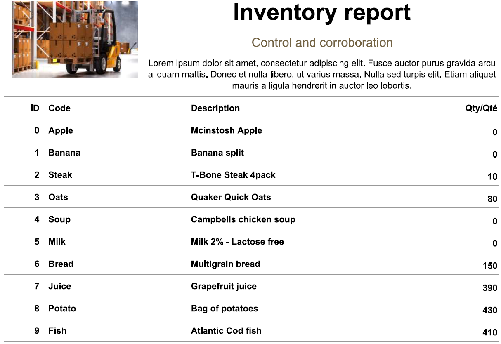
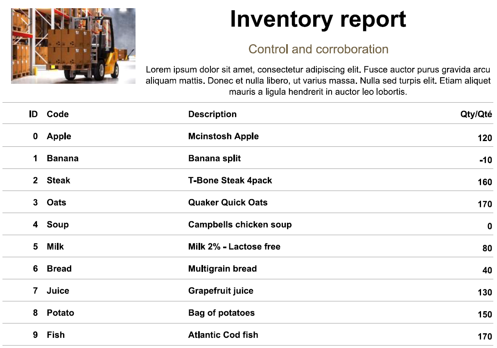

# Rapports d'inventaire exemple

> Partie du **Guide Kafka Engineering** de `org-rd-fullstack-springboot-eda`. Voir le [LISEZ_MOI du projet](./LISEZ_MOI.md).

Les deux rapports ci-dessous sont produits par le même pipeline d'inventaire, exécuté sur le même
stock initial et le même ensemble d'enregistrements `Request` de crédit/débit. La **seule**
différence est le drapeau `key` du pipeline (voir [`PipelineContext`](../../src/main/java/org/rd/fullstack/springbooteda/dto/PipelineContext.java)),
qui décide si chaque requête est publiée dans Kafka avec son `productId` comme clé. Comparer les
deux sorties rend directement visible l'effet du partitionnement sur un invariant métier —
*l'inventaire ne doit jamais devenir négatif*.

## Exemple de résultat de rapport avec une clé Kafka

Lorsque le drapeau `key` est **activé**, chaque `Request` d'inventaire est publiée avec son
`productId` comme clé Kafka. Les enregistrements partageant une clé hachent toujours vers la même
partition (`hash(key) % partitionCount`), de sorte que toutes les requêtes pour un produit donné
sont confinées à une seule partition et consommées **séquentiellement par un seul thread
consommateur**. Le traitement par produit est donc sérialisé de bout en bout : la séquence
check-then-act de la branche `CREDIT` (lire `qty` → vérifier `qty >= requested` → décrément
relatif) ne peut jamais s'entrelacer avec une autre requête pour le *même* produit ; la race de
type lost-update ne peut donc pas se produire — indépendamment du moteur de base de données.

Le résultat est un inventaire cohérent : chaque quantité du rapport est `>= 0`. Là où le stock
était insuffisant, la requête a correctement été résolue en `BACK_ORDER` au lieu d'une survente —
plusieurs produits se stabilisent proprement à `0` (Apple, Banana, Soup, Milk) et aucune ligne
n'est négative. C'est le correctif au niveau projet décrit dans
[Keying et affectation de partition](./architecture_et_conception_des_topics.md)
et listé en premier dans
[Mitigations](./patrons_persistance_et_transaction.md).

Source : [WithKey-Report.pdf](../asserts/WithKey-Report.pdf)

## Exemple de résultat de rapport sans clé Kafka

Avec le drapeau `key` **désactivé**, les requêtes sont publiées **sans clé** ; le producteur les
répartit donc en round-robin / sticky sur les 8 partitions du topic de traitement. Les requêtes
pour un même produit atterrissent maintenant sur des partitions différentes et sont consommées
**en parallèle** par les threads de travail du listener (`concurrency` du conteneur). Deux
requêtes `CREDIT` pour le même produit peuvent toutes deux lire la même quantité périmée (stale),
passer toutes deux la vérification `qty >= requested`, et appliquer toutes deux leur décrément
relatif — une **race lost-update / check-then-act** classique. Le code laisse délibérément cette
race en place à des fins pédagogiques : `findByProductId` ne prend aucun verrou,
[`Inventory`](../../src/main/java/org/rd/fullstack/springbooteda/dto/Inventory.java) n'a pas de
`@Version`, et l'isolation est `READ_COMMITTED` (voir
[La race d'inventaire documentée](./patrons_persistance_et_transaction.md)).

La corruption est clairement visible dans le rapport : **Banana (ID 1) affiche une quantité de
`-10`** — le stock a été survendu sous zéro, violant l'invariant *l'inventaire ne doit jamais être
négatif*. Rien d'autre n'a changé entre les deux exécutions ; c'est la suppression de la clé qui a
permis le traitement concurrent du même produit et réintroduit la race. C'est exactement le mode
de défaillance couvert dans
[Garanties d'ordre et sémantique métier](./architecture_et_conception_des_topics.md)
et dans [Verrouillage de base de données et race conditions](./patrons_persistance_et_transaction.md).

Source : [`NoKey-Report.pdf`](../asserts/NoKey-Report.pdf)
