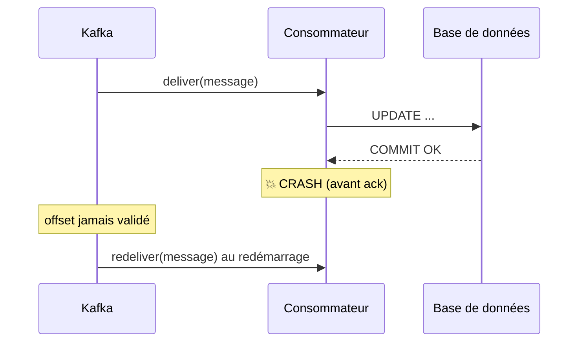
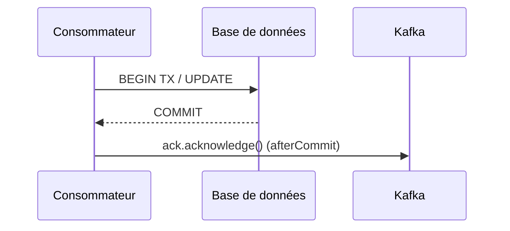
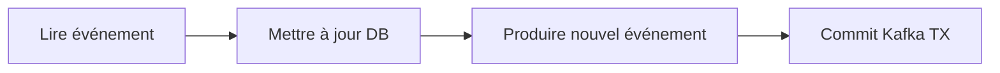
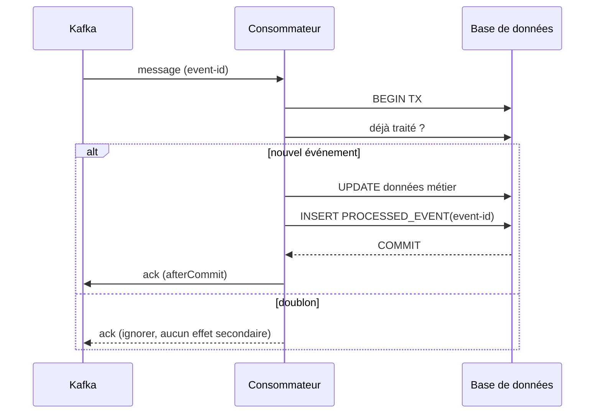
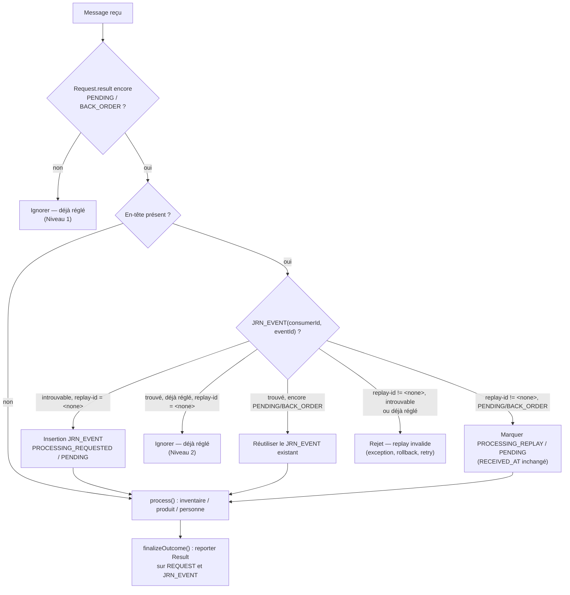

# Reconnaissance et idempotence du consommateur

> Partie du **Guide Kafka Engineering** de `org-rd-fullstack-springboot-eda`. Voir le [LISEZ_MOI du projet](./LISEZ_MOI.md).

**Portée :** l'un des aspects les plus délicats de la combinaison de Kafka avec une base de données relationnelle — l'ordre entre le **commit de la base de données** et l'**accusé de réception (ack) Kafka**. Ce guide parcourt la fenêtre de défaillance, les stratégies d'accusé de réception disponibles (ack manuel, synchronisation `afterCommit`, transactions chaînées, exactly-once), pourquoi aucune ne supprime le besoin d'un consommateur **idempotent**, et le pattern pragmatique *at-least-once + idempotence* employé dans les systèmes événementiels à fort volume.

## Table des matières

- [Vue d'ensemble](#vue-densemble)
- [Le problème central : commit vs acknowledge](#le-problème-central--commit-vs-acknowledge)
- [Pourquoi un consommateur Kafka doit être idempotent](#pourquoi-un-consommateur-kafka-doit-être-idempotent)
- [Option 1 — Acknowledge après le commit JPA](#option-1--acknowledge-après-le-commit-jpa)
- [Option 2 — Acknowledge dans une synchronisation afterCommit](#option-2--acknowledge-dans-une-synchronisation-aftercommit)
- [Option 3 — Transaction Kafka + JDBC chaînée (dépréciée)](#option-3--transaction-kafka--jdbc-chaînée-dépréciée)
- [Option 4 — Exactly-once semantics (EOS) et ses limites](#option-4--exactly-once-semantics-eos-et-ses-limites)
- [Le pattern production pragmatique : at-least-once + idempotence](#le-pattern-production-pragmatique--at-least-once--idempotence)
- [La table processed-event (inbox)](#la-table-processed-event-inbox)
- [Comment ce projet l'applique](#comment-ce-projet-lapplique)
- [Pièges et bonnes pratiques](#pièges-et-bonnes-pratiques)
- [Sources et lectures supplémentaires](#sources-et-lectures-supplémentaires)

## Vue d'ensemble

Un consommateur Kafka qui écrit aussi dans une base de données effectue **deux commits indépendants** : l'un dans la base, l'autre dans Kafka (l'offset). Ils ne peuvent former une seule opération atomique sans un coordinateur de transactions distribuées — et même dans ce cas, la plupart des déploiements réels évitent XA. Parce que ces deux commits sont séparés, il existe toujours une fenêtre où le processus peut planter **après** le commit de la base mais **avant** que l'offset ne soit accusé. Kafka relivrera alors le message au redémarrage.

La conclusion pratique, adoptée par la finance, l'e-commerce et le secteur bancaire, est simple :

> Considérez la livraison Kafka comme du **at-least-once**, et rendez le traitement **idempotent** afin qu'un message relivré soit sans effet (*no-op*).

Ce guide complète les chapitres [Sémantiques de livraison et fiabilité](./semantiques_livraison_et_fiabilite.md) (les garanties de transport elles-mêmes) et [Patterns de persistance et transaction](./patrons_persistance_et_transaction.md) (idempotence, *Transactional Outbox*, verrouillage).

## Le problème central : commit vs acknowledge

Un consommateur naïf fait trois choses dans l'ordre :

1. Reçoit le message de Kafka.
2. `UPDATE` la base de données.
3. Accuse réception auprès de Kafka (ack).

Que se passe-t-il si l'application plante **entre les étapes 2 et 3** ?



Le changement en base de données est durable, mais l'offset n'a jamais été validé : Kafka relivre donc le même message. **L'effet secondaire est appliqué deux fois, sauf si le traitement est idempotent.** Aucune stratégie d'accusé de réception n'élimine entièrement cette fenêtre — elles ne font que la rétrécir ou la déplacer. C'est pourquoi l'idempotence — et non un timing d'ack astucieux — est le véritable correctif.

## Pourquoi un consommateur Kafka doit être idempotent

**Idempotent** signifie : appliquer le même message une ou plusieurs fois donne le même état final. Puisque la livraison at-least-once est la garantie réaliste (les rebalances, retries et plantages causent tous une relivraison), l'idempotence est ce qui la transforme en *effectively-once* du point de vue métier :

```text
livraison at-least-once  +  traitement idempotent  ≈  effectively-once
```

Les sections suivantes présentent les options d'accusé de réception, puis le mécanisme d'idempotence qui rend chacune d'elles sûre.

## Option 1 — Acknowledge après le commit JPA

Désactivez l'auto-commit et accusez réception manuellement, après le travail métier :

```java
@KafkaListener(topics = "order-created", containerFactory = "manualAckContainerFactory")
@Transactional
public void consume(OrderCreatedEvent event, Acknowledgment ack) {
    service.updateDatabase(event);   // s'exécute dans la transaction JPA
    ack.acknowledge();               // valide l'offset ensuite
}
```

C'est la forme la plus courante, mais la fenêtre de défaillance est toujours là :

```text
COMMIT (DB)
   │
   └── 💥 CRASH ──► ack perdu ──► message relivré
```

Donc **l'idempotence reste obligatoire**. (Note : quand la méthode listener elle-même est `@Transactional`, le proxy valide la transaction DB *avant* que la méthode ne retourne ; appeler `ack.acknowledge()` en dernière instruction valide donc l'offset après le commit.)

## Option 2 — Acknowledge dans une synchronisation afterCommit

Enregistrez l'accusé de réception pour qu'il s'exécute **uniquement après** que la transaction Spring a été validée :

```java
@Transactional
@KafkaListener(...)
public void consume(OrderCreatedEvent event, Acknowledgment ack) {
    repository.save(...);

    TransactionSynchronizationManager.registerSynchronization(new TransactionSynchronization() {
        @Override
        public void afterCommit() {
            ack.acknowledge();
        }
    });
}
```



C'est plus propre et garantit que l'ack n'est jamais envoyé pour une transaction *non validée*. **Mais cela n'élimine pas la fenêtre de défaillance** : un plantage *après* le commit et *avant* que `afterCommit` ne s'exécute perd toujours l'ack et provoque une relivraison. L'idempotence est toujours requise — l'Option 2 rend simplement l'ordre explicite et robuste.

## Option 3 — Transaction Kafka + JDBC chaînée (dépréciée)

Spring offrait autrefois `ChainedKafkaTransactionManager` pour chaîner un `KafkaTransactionManager` et un `JpaTransactionManager` :

```java
@Bean
public ChainedKafkaTransactionManager<?, ?> transactionManager(
        KafkaTransactionManager kafkaTm, JpaTransactionManager jpaTm) {
    return new ChainedKafkaTransactionManager<>(kafkaTm, jpaTm);
}
```

⚠️ **À éviter dans les nouvelles architectures.** Le `ChainedKafkaTransactionManager` est **déprécié** (depuis Spring for Apache Kafka 2.7) et ne constitue *pas* un véritable mécanisme XA ni un commit en deux phases (2PC). Il se contente de valider les gestionnaires chaînés l'un après l'autre (approche 1PC « au meilleur effort ») : si le processus échoue entre les deux commits, les ressources peuvent tout de même diverger. Privilégiez les transactions gérées par le conteneur associées à l'idempotence, ou le pattern [Transactional Outbox](./patrons_persistance_et_transaction.md) pour une véritable atomicité.

## Option 4 — Exactly-once semantics (EOS) et ses limites

Kafka supporte les transactions, permettant une boucle transactionnelle **read-process-write** :



EOS est réel et puissant — **mais uniquement pour les flux Kafka-à-Kafka.** Le coordinateur de transactions Kafka n'a aucun contrôle sur votre base PostgreSQL/MySQL :

```text
Kafka TX  ≠  DB TX
```

Le problème de double écriture entre Kafka et une base de données externe **n'est donc pas** résolu par EOS seul. Pour rendre atomiques une écriture Kafka et une écriture DB, utilisez le pattern **transactional outbox** (écrivez l'événement dans une table outbox au sein de la même transaction DB, puis relayez-le vers Kafka via un poller ou du CDC comme Debezium). Voir [Patterns de persistance et transaction](./patrons_persistance_et_transaction.md).

## Le pattern production pragmatique : at-least-once + idempotence

Les systèmes à fort volume convergent vers un modèle délibérément simple :

| Préoccupation | Choix |
| --- | --- |
| Garantie de livraison | **at-least-once** (`enable.auto.commit=false`, ack manuel) |
| Atomicité du travail métier | une unique **transaction DB** (`@Transactional`) |
| Accusé de réception | après commit (Option 1) ou `afterCommit` (Option 2) |
| Protection contre les doublons | **traitement idempotent** (clé de dédup / table processed-event) |

C'est simple, robuste et largement déployé. La fenêtre de plantage cesse d'importer, car un message relivré est reconnu puis ignoré.

## La table processed-event (inbox)

Le moyen générique de rendre n'importe quel consommateur idempotent est d'enregistrer les identifiants d'événement traités et de les vérifier dans la même transaction :

```sql
CREATE TABLE PROCESSED_EVENT (
    EVENT_ID VARCHAR(128) PRIMARY KEY
);
```

```java
@Transactional
public void consume(Event event) {
    if (processedEventRepository.existsById(event.id())) {
        return;                                   // déjà traité — ignorer
    }
    updateBusinessData();
    processedEventRepository.save(new ProcessedEvent(event.id()));
}
```



Si le serveur plante après le commit mais avant l'ack, Kafka relivre ; l'`EVENT_ID` est déjà présent, donc le travail est ignoré proprement. L'`UPDATE` n'est jamais appliqué deux fois.

Ce projet implémente exactement ce patron — voir plus bas.

## Comment ce projet l'applique

Ce sandbox suit le modèle *at-least-once + idempotence*, et superpose en réalité **deux** vérifications d'idempotence indépendantes plutôt qu'une seule : un verrou au niveau de la ligne métier (le patron générique de la section précédente, appliqué à l'état `result`) *et* un journal d'événements dédié qui est une véritable table `PROCESSED_EVENT`/inbox. Les deux vérifications s'exécutent dans [`ProcessorSrv.sanityCheck(...)`](../../src/main/java/org/rd/fullstack/springbooteda/srv/ProcessorSrv.java), dans la même transaction que le traitement métier.

- **Pas d'auto-commit, ack manuel immédiat** — [`KafkaConfig`](../../src/main/java/org/rd/fullstack/springbooteda/config/KafkaConfig.java) définit `ENABLE_AUTO_COMMIT_CONFIG = false` et `AckMode.MANUAL_IMMEDIATE` ; répliqué dans [`application.yml`](../../src/main/resources/application.yml) (`enable-auto-commit: false`, `ack-mode: manual_immediate`).
- **Traitement transactionnel** — [`ProcessorSrv.process(...)`](../../src/main/java/org/rd/fullstack/springbooteda/srv/ProcessorSrv.java) est `@Transactional` : les vérifications de sanité/idempotence, la mise à jour d'inventaire, la mise à jour du solde client, le statut de la requête **et** la ligne du journal sont tous validés atomiquement dans une seule transaction DB.
- **Acknowledge après commit (Option 1, bien faite)** — [`KafkaPipelineListener.listen(...)`](../../src/main/java/org/rd/fullstack/springbooteda/srv/KafkaPipelineListener.java) appelle `ack.acknowledge()` *après* le retour de `PipelineSrv.handle(...)` (qui exécute la méthode transactionnelle `ProcessorSrv.process(...)`). Comme `process(...)` est la méthode transactionnelle proxifiée, le commit DB a déjà eu lieu au moment où l'offset est accusé.
- **Niveau 1 — idempotence via l'état métier (`REQUEST`)** — `sanityCheck()` ignore d'abord toute requête dont le `result` n'est plus `PENDING`/`BACK_ORDER` : un message relivré dont la requête était déjà `EXECUTED`/`ERROR` est reconnu et ignoré avant même le reste du traitement. La ligne `Request` joue le rôle du marqueur `PROCESSED_EVENT` générique décrit plus haut.
- **Niveau 2 — idempotence via le journal d'événements (`JRN_EVENT`)** — quand le message porte un en-tête, `sanityCheck()` recherche (ou crée) aussi une ligne [`JrnEvent`](../../src/main/java/org/rd/fullstack/springbooteda/dto/JrnEvent.java) indexée sur `(CONSUMER_ID, EVENT_ID)`. Un nouvel événement, sans rejeu (en-tête `replay-id` égal au sentinel `<none>`, `KafkaConstants.CST_NONE`), est inséré avec `EVENT_TYPE = PROCESSING_REQUESTED` et `RESULT = PENDING` ; une relivraison de ce même événement déjà réglé est ignorée sans effet, exactement comme le patron inbox générique ci-dessus. `sanityCheck()` retourne le `JrnEvent` déjà résolu accompagné d'un indicateur `proceed` (via un petit `record SanityResult`) afin que `process()` ne le requête jamais à nouveau, et un helper partagé `finalizeOutcome(...)` reporte l'issue finale de la requête (`EXECUTED`/`ERROR`/`BACK_ORDER`) sur cette même ligne, en n'horodatant `PROCESSED_AT` que lorsque la requête a réellement été exécutée.
- **Corrélation pour les rejeux** — l'en-tête optionnel `replay-id` (un UUID par publication, défini dans `PipelineSrv.publish()`) est l'identifiant d'événement qu'une table `PROCESSED_EVENT` utiliserait comme clé, et il est maintenant branché de bout en bout : un rejeu (tout `replay-id` différent de `CST_NONE`) doit trouver son `JrnEvent` déjà `PENDING`/`BACK_ORDER` — sinon il est rejeté comme rejeu inconnu ou déjà réglé — et est remarqué `PROCESSING_REPLAY`/`PENDING` sans toucher à `RECEIVED_AT`, qui continue de refléter la date de livraison *d'origine* plutôt que celle du rejeu.
- **At-least-once en cas de défaillance** — quand le traitement lève une exception (en-tête invalide ou rejeu non reconnu compris), l'offset n'est pas accusé ; l'enregistrement est réessayé avec un back-off borné, puis finalement acheminé vers un Dead Letter Topic par le gestionnaire d'erreurs configuré dans [`KafkaSandbox`](../../src/main/java/org/rd/fullstack/springbooteda/util/kafka/KafkaSandbox.java). En cas de plantage avant l'ack, le message est simplement rejoué après redémarrage.



## Pièges et bonnes pratiques

- ✅ **Rendez toujours le consommateur idempotent.** Aucune stratégie d'ack n'élimine la relivraison ; l'idempotence est le vrai correctif.
- ✅ Désactivez `enable.auto.commit` et accusez réception **après** le commit DB (Option 1 ou, plus explicitement, Option 2 `afterCommit`).
- ✅ Gardez l'écriture métier et le marqueur de dédup dans la **même** transaction, afin qu'ils soient validés ou annulés ensemble.
- ✅ Préférez un **transactional outbox / CDC** quand vous avez réellement besoin d'une atomicité « mettre à jour la DB *et* publier vers Kafka ».
- ⚠️ **Ne comptez pas** sur `ChainedKafkaTransactionManager` pour l'atomicité — il est déprécié et n'est pas XA.
- ⚠️ Rappelez-vous qu'EOS couvre **Kafka→Kafka** uniquement ; il n'intègre pas votre écriture DB externe dans la transaction Kafka.
- ⚠️ Faites de la clé de dédup l'**identifiant métier/événement**, pas l'offset Kafka (les offsets changent lors du re-partitionnement et des rejeux).

## Sources et lectures supplémentaires

- Guides compagnons : [Sémantiques de livraison et fiabilité](./semantiques_livraison_et_fiabilite.md), [Patterns de persistance et transaction](./patrons_persistance_et_transaction.md).
- Spring for Apache Kafka — *Transactions*, *modes d'accusé de réception du conteneur*, et la note de dépréciation de `ChainedKafkaTransactionManager`.
- Apache Kafka — *Exactly-Once Semantics* (transactions, `transactional.id`, `read_committed`).
- Références de patterns — *Idempotent Consumer*, *Transactional Outbox*, *Inbox / table processed-event* (microservices.io).
