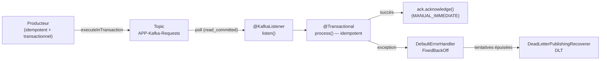

# Sémantiques de livraison et fiabilité

> Fait partie du **Guide Kafka Engineering** de `org-rd-fullstack-springboot-eda`. Voir le [LISEZ-MOI du projet](./LISEZ_MOI.md).

**Portée :** expliquer comment les sémantiques de livraison Kafka découlent de quelques choix concrets : accusés de réception, nouvelles tentatives et idempotence du producteur; stratégie de validation des offsets; transactions Kafka; niveau d'isolation du consommateur; politique de reprise et de file de lettres mortes; et dimensionnement des lectures. Ce chapitre montre aussi comment le projet combine une publication Kafka atomique avec une consommation *at-least-once* et un traitement idempotent en base de données.

## Table des matières

- [Vue d'ensemble](#vue-densemble)
- [Sémantiques de livraison : les trois garanties](#sémantiques-de-livraison--les-trois-garanties)
- [Gestion des offsets](#gestion-des-offsets)
- [Producteur idempotent](#producteur-idempotent)
- [Transactions Kafka et lecture-traitement-écriture](#transactions-kafka-et-lecture-traitement-écriture)
- [Sémantique exactly-once de Kafka Streams](#sémantique-exactly-once-de-kafka-streams)
- [Nouvelles tentatives, temporisation et files de lettres mortes](#nouvelles-tentatives-temporisation-et-files-de-lettres-mortes)
- [Dimensionnement des lectures et des lots](#dimensionnement-des-lectures-et-des-lots)
- [Application de ces concepts dans le projet](#application-de-ces-concepts-dans-le-projet)
- [Pièges et bonnes pratiques](#pièges-et-bonnes-pratiques)
- [Sources et lectures complémentaires](#sources-et-lectures-complémentaires)

## Vue d'ensemble

Une garantie de livraison Kafka n'est pas un simple interrupteur. Elle dépend de deux questions liées, mais distinctes :

1. **Le message a-t-il été publié durablement dans Kafka?** Les accusés de réception, les nouvelles tentatives, l'idempotence, la réplication du topic et la configuration des réplicas synchronisés entrent tous en jeu.
2. **Que se passe-t-il si le traitement et la validation de l'offset ne se terminent pas tous les deux?** La réponse dépend du moment où le consommateur valide son offset et de la participation, ou non, des écritures Kafka et des offsets à une même transaction.

Kafka offre généralement un comportement **at-least-once** lorsque le producteur effectue de nouvelles tentatives et que le consommateur valide les offsets après un traitement réussi. Une défaillance entre l'effet externe et la validation de l'offset peut alors entraîner une nouvelle livraison. Le modèle **at-most-once** place la validation avant le traitement et accepte une perte possible. La sémantique **exactly-once (EOS)** de Kafka rend atomiques les messages produits dans Kafka et les offsets consommés, mais elle n'inclut pas automatiquement les écritures en base de données, les appels REST ni les autres effets externes.

Ce projet utilise volontairement une publication atomique et idempotente, suivie d'une consommation *at-least-once* et d'un traitement idempotent en base de données :



## Sémantiques de livraison : les trois garanties

| Garantie | Signification | Mise en œuvre habituelle | Principal compromis |
| --- | --- | --- | --- |
| **At-most-once** (*au plus une fois*) | Un message peut être perdu, mais il n'est pas livré de nouveau après la validation de son offset. | Valider l'offset avant le traitement; les nouvelles tentatives du producteur peuvent aussi être désactivées si une perte à l'envoi est acceptable. | Perte de données possible. |
| **At-least-once** (*au moins une fois*) | Un message validé avec succès est traité une ou plusieurs fois. | Utiliser une configuration durable du producteur et valider l'offset seulement après un traitement réussi. | Le traitement doit tolérer les doublons. |
| **Exactly-once** (EOS Kafka, *exactement une fois*) | Pour un flux Kafka lecture-traitement-écriture, les messages produits et les offsets sources deviennent visibles atomiquement pour les consommateurs transactionnels. | Utiliser les transactions Kafka, la validation transactionnelle des offsets et des consommateurs `read_committed` en aval. | Coordination et latence accrues; les effets externes restent hors de la transaction Kafka. |

Deux distinctions sont essentielles :

- **At-least-once ne constitue pas une promesse inconditionnelle d'absence de perte.** La durabilité de la publication dépend encore de paramètres comme `acks=all`, la réplication et `min.insync.replicas`; l'application doit aussi gérer les échecs d'envoi permanents.
- **Exactly-once a une portée plus étroite que son nom le laisse croire.** La lecture et le code de traitement peuvent s'exécuter plus d'une fois après une annulation. Kafka garantit que les résultats Kafka validés sont visibles une seule fois. Les effets externes exigent toujours de l'idempotence, une boîte d'envoi transactionnelle (*transactional outbox*) ou une coordination prise en charge par le système cible.

## Gestion des offsets

L'offset validé du consommateur, conservé dans le topic interne `__consumer_offsets`, désigne le prochain message à partir duquel un groupe de consommateurs doit reprendre. La relation entre le traitement et la validation de cet offset est le principal levier des sémantiques côté consommateur.

### Validation automatique et validation gérée par le conteneur

Avec le client Kafka natif, `enable.auto.commit=true` valide périodiquement les offsets en arrière-plan. Ce paramètre ne suffit **pas** à établir une sémantique *at-most-once*, car le moment de la validation n'est pas volontairement lié au début ou à la fin du travail applicatif.

Depuis sa version 2.3, Spring Kafka fixe `enable.auto.commit=false` par défaut, sauf si l'application le remplace explicitement. Le conteneur du listener contrôle alors les validations au moyen d'un `AckMode` :

- `RECORD` : valider après le retour réussi du listener pour le message.
- `BATCH` : valider après le traitement de tous les messages retournés par `poll()`; il s'agit du mode par défaut.
- `TIME`, `COUNT`, `COUNT_TIME` : valider après une lecture terminée lorsque la condition de temps ou de nombre est satisfaite.
- `MANUAL` : `acknowledge()` met l'offset en attente, puis applique une sémantique équivalente à `BATCH`.
- `MANUAL_IMMEDIATE` : `acknowledge()` valide immédiatement lorsqu'il est appelé dans le thread du consommateur.

Ce projet utilise `MANUAL_IMMEDIATE` et appelle `acknowledge()` seulement après le traitement réussi du message :

```java
factory.getContainerProperties().setAckMode(AckMode.MANUAL_IMMEDIATE);
```

### Validations synchrones et asynchrones

- **Validation synchrone** (`commitSync`) : attend la réponse du broker et signale les échecs. Son comportement est plus facile à raisonner, au prix d'un blocage du thread du consommateur.
- **Validation asynchrone** (`commitAsync`) : ne bloque pas, mais l'application doit observer les échecs dans le rappel et tenir compte des validations simultanées. Une validation ultérieure réussie peut remplacer une validation antérieure.

Spring Kafka choisit entre les deux au moyen de la propriété `syncCommits` du conteneur, qui vaut `true` par défaut.

## Producteur idempotent

Avec `enable.idempotence=true`, le producteur attribue des numéros de séquence par partition. Si une erreur transitoire l'oblige à renvoyer un lot, le broker détecte la séquence en double et évite d'ajouter ce lot deux fois.

L'idempotence du producteur empêche les **doublons causés par ses nouvelles tentatives**. Elle ne déduplique pas :

- deux appels applicatifs qui envoient le même événement métier;
- un message produit de nouveau après une nouvelle livraison au consommateur;
- des effets répétés dans une base de données ou un service distant.

Les clients Kafka actuels activent l'idempotence par défaut lorsqu'aucune configuration incompatible n'est présente. Le projet l'active explicitement afin de rendre l'intention visible :

```java
props.put(ProducerConfig.ACKS_CONFIG,               "all");
props.put(ProducerConfig.ENABLE_IDEMPOTENCE_CONFIG, true);
props.put(ProducerConfig.RETRIES_CONFIG,            5);
props.put(ProducerConfig.RETRY_BACKOFF_MS_CONFIG,   100);
```

L'idempotence exige `acks=all`, `retries>0` et `max.in.flight.requests.per.connection<=5`. Il n'est donc pas nécessaire de fixer cette dernière propriété à `1` pour préserver l'ordre dans une partition lorsque l'idempotence est activée; cela peut réduire inutilement le débit.

Avec `acks=all`, le leader attend les réplicas actuellement synchronisés avant d'accuser réception de l'écriture. La durabilité réelle dépend encore du facteur de réplication du topic, de `min.insync.replicas` et de la politique d'élection du leader.

## Transactions Kafka et lecture-traitement-écriture

Une transaction Kafka peut publier atomiquement des messages dans un ou plusieurs topics Kafka et valider les offsets du consommateur source. Ce modèle lecture-traitement-écriture est à la base de la sémantique EOS de Kafka.

### Déroulement d'une transaction

Une transaction du producteur suit cette séquence :

1. `beginTransaction()`
2. produire les messages de sortie
3. `sendOffsetsToTransaction(offsets, groupMetadata)`
4. `commitTransaction()`, ou `abortTransaction()` en cas d'échec

```java
producer.initTransactions();
while (true) {
    var records = consumer.poll(Duration.ofMillis(100));
    producer.beginTransaction();
    try {
        for (var record : records) {
            producer.send(new ProducerRecord<>(
                "TopicB", record.key(), transform(record.value())));
        }
        producer.sendOffsetsToTransaction(
            computeOffsets(records), consumer.groupMetadata());
        producer.commitTransaction();
    } catch (Exception e) {
        producer.abortTransaction();
        // Réinitialiser la position du consommateur au besoin avant de reprendre.
    }
}
```

Les transactions exigent un `transactional.id`, qui active également l'idempotence du producteur. Des instances applicatives concurrentes ne doivent pas partager la même identité de producteur; avec Spring Kafka, le `transactionIdPrefix` doit être unique pour chaque instance de l'application. La réutilisation d'une identité entre des sessions de producteur permet à Kafka de terminer ou d'annuler les transactions précédentes et d'exclure un producteur obsolète. Une transaction expirée est annulée, et non reprise.

Par défaut, la configuration de production du topic de transactions suppose au moins trois brokers. Un environnement de développement peut réduire les paramètres de réplication de l'état transactionnel, mais cette réduction affaiblit la tolérance aux pannes.

Avec Spring Kafka, un conteneur de listener configuré avec un `KafkaAwareTransactionManager` démarre une transaction avant d'appeler le listener. En cas de succès, il ajoute les offsets consommés à cette transaction avant sa validation; en cas d'échec, il l'annule et rend les messages admissibles à une nouvelle livraison.

### Consommateurs transactionnels

Les consommateurs en aval doivent utiliser `isolation.level=read_committed` pour masquer les messages transactionnels annulés. Un tel consommateur retourne les messages transactionnels validés et les messages non transactionnels, mais retient les messages situés après une transaction ouverte jusqu'à la fin de celle-ci. La valeur par défaut du client Kafka est `read_uncommitted`.

```java
props.put(ConsumerConfig.ISOLATION_LEVEL_CONFIG, "read_committed");
props.put(ConsumerConfig.ENABLE_AUTO_COMMIT_CONFIG, false);
```

### Bases de données et autres systèmes externes

Les transactions Kafka ne transforment pas Kafka et une base de données en une seule ressource atomique. Spring peut synchroniser les gestionnaires de transactions Kafka et de base de données selon un ordre de validation défini, mais une défaillance entre les deux validations peut toujours laisser un côté validé et l'autre non. L'opération en base de données doit donc rester idempotente.

Pour assurer une forte cohérence entre Kafka et une base de données, les options courantes sont les suivantes :

- une **boîte d'envoi transactionnelle** (*transactional outbox*) pour une publication de la base de données vers Kafka;
- un consommateur idempotent utilisant une clé de déduplication ou une transition d'état;
- l'enregistrement de l'offset Kafka dans la même transaction externe que le résultat, lorsque le système cible permet ce modèle.

## Sémantique exactly-once de Kafka Streams

Kafka Streams peut regrouper les offsets consommés, les mises à jour des magasins d'état, les messages de journal des modifications et les messages de sortie dans des transactions Kafka. Pour activer EOS version 2 :

```yaml
processing.guarantee: exactly_once_v2   # valeur par défaut : at_least_once
```

`exactly_once_v2` exige des brokers en version 2.5 ou ultérieure. Une fois cette option activée, Kafka Streams configure des producteurs et des consommateurs transactionnels et utilise un intervalle de validation par défaut plus court. Le coût réel en latence et en débit dépend de la taille des transactions, de leur fréquence, de la topologie et de la charge; il doit donc être mesuré plutôt que présenté comme un pourcentage universel.

Ce projet utilise les API natives du consommateur et du producteur pour son pipeline d'inventaire, et non le DSL Kafka Streams. Le topic source de Flink (`APP-Flink-requests`) est traité par Flink, pas par Kafka Streams.

## Nouvelles tentatives, temporisation et files de lettres mortes

Lorsqu'un listener lance une exception, le `DefaultErrorHandler` de Spring Kafka peut livrer de nouveau le message selon une politique `BackOff`. Une fois les tentatives épuisées, un récupérateur comme `DeadLetterPublishingRecoverer` peut publier le message dans un topic de lettres mortes (*Dead Letter Topic*, DLT).

Ce projet construit le gestionnaire dans `KafkaSandbox` avec un `FixedBackOff` :

```java
DeadLetterPublishingRecoverer recoverer = new DeadLetterPublishingRecoverer(
    dltTemplate,
    (record, ex) -> new TopicPartition(
        template.getDefaultTopic(), KafkaConstants.CST_PARTITION_DLT));
recoverer.setAppendOriginalHeaders(true);
recoverer.setRetainExceptionHeader(true);

DefaultErrorHandler errorHandler =
    new DefaultErrorHandler(
        recoverer,
        new FixedBackOff(retryInterval, retryAttempts));
errorHandler.addNotRetryableExceptions(IllegalArgumentException.class);
```

Comportements importants :

- Le second argument de `FixedBackOff` compte les **nouvelles tentatives**, et non le nombre total de livraisons. Une valeur de `1` signifie la livraison initiale plus une nouvelle tentative.
- Les exceptions non réessayables sont transmises directement au récupérateur. Ce comportement convient aux messages invalides qui ne peuvent réussir sans correction.
- Une DLT constitue un mécanisme de récupération, et non une preuve de réussite du traitement métier. Il faut la surveiller et définir comment les messages seront examinés, corrigés et rejoués.
- Avec un accusé de réception manuel, il faut vérifier la façon dont l'offset source récupéré est validé. Par exemple, `DefaultErrorHandler` offre l'option `commitRecovered` pour `MANUAL_IMMEDIATE`; le choix précis doit correspondre au comportement de reprise souhaité pour la DLT.

## Dimensionnement des lectures et des lots

`poll()` retourne un ou plusieurs messages, mais la fenêtre de nouvelle livraison dépend du type de listener, du `AckMode` et de la configuration du gestionnaire d'erreurs. Avec `BATCH`, une défaillance avant la validation de l'offset du lot peut livrer de nouveau des messages dont les effets externes ont déjà réussi. `RECORD` ou un accusé `MANUAL_IMMEDIATE` correctement placé réduit cette fenêtre, sans toutefois rendre atomiques les effets externes et l'offset Kafka.

| Valeur élevée de `max.poll.records` | Valeur faible de `max.poll.records` |
| --- | --- |
| Meilleur débit et moins de validations | Moins de travail exposé à une nouvelle livraison |
| Plus de temps de traitement par lecture; risque accru de dépasser `max.poll.interval.ms` | Davantage de surcoût par message et par lecture |

`max.poll.records` limite le nombre de messages retournés par un appel à `poll()`; il ne modifie pas la taille de lecture sous-jacente du consommateur. Il faut le dimensionner afin que le pire temps de traitement demeure confortablement inférieur à `max.poll.interval.ms`.

Ce projet fixe `MAX_POLL_RECORDS = 10` (`CST_MAX_POLL_RECORDS`) afin de limiter le temps de traitement et la fenêtre de doublons malgré la latence simulée par message.

## Application de ces concepts dans le projet

Le pipeline d'inventaire utilise une **publication Kafka atomique suivie d'une consommation at-least-once et idempotente** :

- **Publication transactionnelle et idempotente** — [`PipelineSrv.publish()`](../../src/main/java/org/rd/fullstack/springbooteda/srv/PipelineSrv.java) obtient un template transactionnel (`getKafkaTemplate(topic, true)`) et envoie les requêtes admissibles dans `template.executeInTransaction(...)`. La sérialisation précède la transaction. `nbrPublished` est mis à jour seulement après une validation réussie. [`KafkaSandbox`](../../src/main/java/org/rd/fullstack/springbooteda/util/kafka/KafkaSandbox.java) attribue une identité de producteur unique à chaque template transactionnel.
- **Durabilité explicite du producteur** — [`KafkaConfig.producerConfigs()`](../../src/main/java/org/rd/fullstack/springbooteda/config/KafkaConfig.java) fixe `enable.idempotence=true`, `acks=all` et un nombre limité de nouvelles tentatives, de façon à harmoniser l'intention des différents producteurs.
- **Consommation at-least-once** — [`KafkaPipelineListener.listen()`](../../src/main/java/org/rd/fullstack/springbooteda/srv/KafkaPipelineListener.java) délègue à `PipelineSrv.handle()` et accuse réception seulement après un traitement réussi. Le conteneur utilise `AckMode.MANUAL_IMMEDIATE` avec `enable.auto.commit=false`; un arrêt avant l'accusé peut livrer le message de nouveau.
- **Traitement idempotent en base de données** — [`PipelineSrv.process()`](../../src/main/java/org/rd/fullstack/springbooteda/srv/PipelineSrv.java) s'exécute dans un bean `@Transactional` distinct et ignore les requêtes dont le `Result` n'est plus `PENDING` ou `BACK_ORDER`. Selon les règles de transition d'état et de concurrence en base de données du projet, une nouvelle livraison devient donc une opération sans effet. La transaction JPA est annulée en cas d'échec.
- **Isolation des lectures validées** — [`KafkaConfig.consumerConfigs()`](../../src/main/java/org/rd/fullstack/springbooteda/config/KafkaConfig.java) fixe `isolation.level=read_committed`; le listener ne voit donc pas les messages annulés par le producteur transactionnel.
- **Nouvelles tentatives et DLT** — le [`DefaultErrorHandler`](../../src/main/java/org/rd/fullstack/springbooteda/config/KafkaConfig.java) utilise `FixedBackOff` et dirige les messages épuisés vers `DeadLetterPublishingRecoverer`. Un `RetryListener` enregistre les événements de récupération.
- **Lectures limitées** — `max.poll.records=10`, défini dans [`KafkaConstants`](../../src/main/java/org/rd/fullstack/springbooteda/util/kafka/KafkaConstants.java), limite le temps de traitement et la fenêtre de nouvelle livraison d'une lecture.

Le résultat ne constitue pas une transaction distribuée *exactly-once* unique. La publication est atomique dans Kafka; le consommateur est volontairement *at-least-once*; et le traitement en base de données est conçu pour qu'une nouvelle livraison ne répète pas la transition métier.

## Pièges et bonnes pratiques

- **Accusez réception seulement après un traitement réussi.** Le faire avant le traitement crée une fenêtre *at-most-once* et peut perdre du travail en cas de panne.
- **Ne considérez pas l'auto-commit comme un interrupteur at-most-once.** Cette sémantique exige une conception volontaire de validation avant traitement.
- **Distinguez l'idempotence du producteur de celle du consommateur.** Elles corrigent des sources de doublons différentes.
- **Gardez les effets externes idempotents.** L'EOS de Kafka n'inclut pas automatiquement JPA, REST, le courriel ni les autres systèmes.
- **Utilisez `read_committed` pour les entrées transactionnelles.** Un consommateur `read_uncommitted` en aval peut voir des messages annulés.
- **Utilisez des identités transactionnelles uniques.** Le partage d'une identité entre des instances concurrentes provoque l'exclusion d'un producteur; l'abandon systématique des anciennes identités empêche l'exclusion propre des anciennes sessions.
- **Gardez les transactions courtes.** Effectuez autant que possible la validation et la préparation non Kafka susceptible d'échouer avant d'ouvrir une transaction Kafka.
- **Évitez l'auto-invocation avec `@Transactional`.** L'appel d'une méthode interceptée par l'intermédiaire de `this` contourne l'intercepteur transactionnel de Spring.
- **Dimensionnez les lectures selon le pire temps de traitement.** Des messages lents combinés à un grand lot peuvent dépasser `max.poll.interval.ms` et déclencher des rééquilibrages.
- **Exploitez réellement la DLT.** Déclenchez des alertes, conservez les en-têtes de diagnostic et définissez un processus de rejeu contrôlé.
- **Testez les fenêtres de défaillance.** Incluez la perte d'un broker, les délais réseau, l'arrêt du processus avant et après l'accusé de réception, l'annulation d'une transaction et l'échec de publication dans la DLT.

## Sources et lectures complémentaires

- [Apache Kafka — Sémantiques de livraison des messages](https://kafka.apache.org/43/design/design/#message-delivery-semantics)
- [Apache Kafka — Configuration du producteur](https://kafka.apache.org/43/configuration/producer-configs/)
- [Apache Kafka — Configuration du consommateur](https://kafka.apache.org/43/configuration/consumer-configs/)
- [Apache Kafka — Configuration de Kafka Streams](https://kafka.apache.org/43/streams/developer-guide/config-streams/)
- [Spring Kafka — Conteneurs de listeners et validation des offsets](https://docs.spring.io/spring-kafka/reference/kafka/receiving-messages/message-listener-container.html)
- [Spring Kafka — Transactions](https://docs.spring.io/spring-kafka/reference/kafka/transactions.html)
- [Spring Kafka — Sémantique exactly-once](https://docs.spring.io/spring-kafka/reference/kafka/exactly-once.html)
- [Spring Kafka — Gestion des exceptions](https://docs.spring.io/spring-kafka/reference/kafka/annotation-error-handling.html)
- Guide connexe : [Accusés de réception et idempotence du consommateur](./reconnaissance_et_idempotence_consommateur.md)
- Code du projet : [`PipelineSrv`](../../src/main/java/org/rd/fullstack/springbooteda/srv/PipelineSrv.java), [`ProcessorSrv`](../../src/main/java/org/rd/fullstack/springbooteda/srv/ProcessorSrv.java), [`KafkaConfig`](../../src/main/java/org/rd/fullstack/springbooteda/config/KafkaConfig.java), [`KafkaSandbox`](../../src/main/java/org/rd/fullstack/springbooteda/util/kafka/KafkaSandbox.java) et [`KafkaConstants`](../../src/main/java/org/rd/fullstack/springbooteda/util/kafka/KafkaConstants.java)