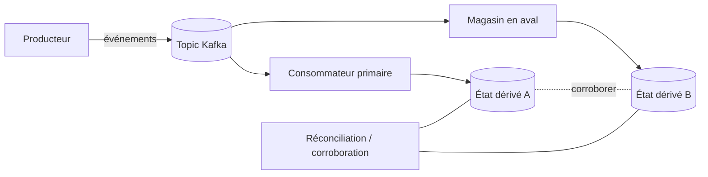
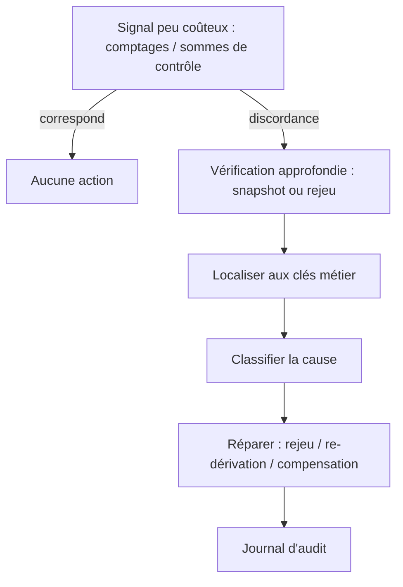

# Vérification des données (corroboration)

> Partie du **Guide Kafka Engineering** de `org-rd-fullstack-springboot-eda`. Voir le [LISEZ_MOI du projet](./LISEZ_MOI.md).

**Portée :** comment vérifier l'intégrité et la cohérence des données à travers un système événementiel — réconcilier une source de vérité avec des vues dérivées, recouper les sources, détecter les divergences et auditer — et comment ce sandbox applique ces idées à son pipeline de requêtes/inventaire.

## Table des matières

- [Vue d'ensemble](#vue-densemble)
- [Pourquoi la cohérence à terme rend la corroboration nécessaire](#pourquoi-la-cohérence-à-terme-rend-la-corroboration-nécessaire)
- [Patterns de réconciliation](#patterns-de-réconciliation)
  - [Source de vérité vs vues dérivées](#source-de-vérité-vs-vues-dérivées)
  - [Rejeu d'événements et jobs de réconciliation](#rejeu-dévénements-et-jobs-de-réconciliation)
  - [Snapshots périodiques](#snapshots-périodiques)
  - [Corroboration par comptages et sommes de contrôle](#corroboration-par-comptages-et-sommes-de-contrôle)
  - [Événements de contrôle et de checkpoint](#événements-de-contrôle-et-de-checkpoint)
  - [Consommateurs fantômes (shadow)](#consommateurs-fantômes-shadow)
  - [Invariants métier](#invariants-métier)
- [Détecter et gérer la divergence](#détecter-et-gérer-la-divergence)
- [Relation avec l'idempotence et l'exactly-once](#relation-avec-lidempotence-et-lexactly-once)
- [Comment ce projet l'applique](#comment-ce-projet-lapplique)
- [Pièges & bonnes pratiques](#pièges--bonnes-pratiques)

## Vue d'ensemble

Dans une architecture événementielle (EDA), aucun mécanisme unique ne garantit que chaque consommateur et chaque magasin en aval finissent avec la même vision de la réalité. Les sémantiques de livraison des messages, les crashs de consommateurs, les rééquilibrages de partitions et les pannes réseau transitoires peuvent tous produire une **divergence** entre des systèmes censés s'accorder.


La **corroboration des données** est la pratique délibérée qui consiste à confirmer que deux représentations (ou plus) des mêmes faits sont cohérentes : une source de vérité et une projection dérivée, deux consommateurs indépendants, ou un état recalculé et un état persisté. Elle complète — sans les remplacer — les garanties de livraison et l'idempotence. Là où l'idempotence empêche un message isolé de corrompre l'état, la corroboration *détecte* quand l'état a tout de même dérivé et vous fournit les preuves pour le réparer.

Le changement d'état d'esprit clé est le suivant :

> La livraison d'événements ne garantit pas la cohérence globale. La corroboration doit être conçue, implémentée et exploitée délibérément.

## Pourquoi la cohérence à terme rend la corroboration nécessaire

Kafka offre par défaut une livraison **at-least-once** : un message est livré au moins une fois, mais dans des conditions de défaillance (un crash après traitement mais avant le commit de l'offset, un rééquilibrage, une éviction de pod dans Kubernetes) il peut être livré à nouveau. Les fenêtres de défaillance classiques sont :

- Le consommateur reçoit un message et crashe avant de le traiter.
- Le consommateur traite le message et crashe avant de l'acquitter.
- Un pod est évincé ou redémarré en plein vol.
- Des problèmes réseau interrompent le commit.

Chacune peut laisser le système dans un état où les événements qui *ont été* émis ne correspondent plus à l'état qui *a été* persisté — des doublons appliqués deux fois, ou du travail retenté sur un état partiel. Comme les consommateurs mettent à jour leurs propres magasins de façon indépendante et asynchrone, le système dans son ensemble n'est que **cohérent à terme** (eventually consistent). La corroboration est ce qui transforme le « à terme » d'un espoir en une propriété vérifiable et auditable.



## Patterns de réconciliation

Dans une EDA de niveau production, la corroboration est rarement une technique unique. C'est un ensemble de mécanismes **en couches**, avec différents compromis coût/latence :

| Objectif | Technique |
| --- | --- |
| Détection rapide de divergence | Comptages, sommes de contrôle / hachages |
| Audit & conformité | Rejeu d'événements et snapshots |
| Confiance opérationnelle | Événements de contrôle / checkpoint |
| Migration & refactorisation | Consommateurs fantômes (shadow) |
| Sûreté fondamentale | Idempotence et séquencement |

### Source de vérité vs vues dérivées

La première décision de conception est de nommer la **source de vérité**. Dans une approche event-sourcing, c'est le journal d'événements lui-même (Kafka, un event store) ; tout le reste — index de recherche, modèles de lecture, compteurs d'agrégats — est une **vue dérivée** qui peut être recalculée à partir du journal. La corroboration se réduit alors à une seule question : *cette vue dérivée correspond-elle encore à ce qu'implique la source de vérité ?*

Dans un système plus centré sur la base de données (comme ce sandbox), les tables relationnelles constituent l'état de référence et le flux d'événements est le *déclencheur* de leur mutation. La question de corroboration s'inverse légèrement : *l'état persisté correspond-il à l'effet cumulé des événements que nous avons traités ?*

### Rejeu d'événements et jobs de réconciliation

Retraitez les événements historiques depuis la source de vérité pour recalculer l'état attendu, puis comparez-le à l'état persisté.

```text
Event Store (Kafka)
        |
Consommateur de réconciliation (groupe dédié, lit depuis offset 0)
        |
État attendu  <->  État réel
```

- Utilisez un **groupe de consommateurs dédié** pour que le rejeu ne perturbe pas les offsets en production.
- Lisez depuis le début (ou un checkpoint connu) et reconstruisez l'état attendu.
- Comparez attendu vs réel ; signalez les écarts.

**Avantages :** déterministe, forte auditabilité. **Inconvénients :** coûteux à haut volume, pas en temps réel.

### Snapshots périodiques

Matérialisez périodiquement un snapshot de l'état métier dérivé des événements et comparez-le aux systèmes en aval selon un calendrier (horaire, quotidien).

```json
{
  "productId": "P123",
  "availableStock": 42,
  "snapshotAt": "2026-10-01T00:00:00Z"
}
```

Implémentez-le avec un job batch ou stream (Spring Batch, Spark, Flink) écrivant vers un topic dédié tel que `inventory-snapshots`, clé sur la clé métier plus un timestamp ou une version. **Avantages :** faible coût opérationnel, facile à auditer. **Inconvénients :** détection différée, aucune garantie temps réel.

### Corroboration par comptages et sommes de contrôle

Les signaux les moins coûteux sont les **comptages agrégés** et les **sommes de contrôle**.

- **Comptages :** comparez le nombre d'enregistrements traités, groupés par résultat, au nombre d'effets qu'ils auraient dû produire. Un écart dans les totaux est un déclencheur d'alerte rapide et peu volumineux.
- **Sommes de contrôle :** chaque consommateur calcule un hachage (p. ex. SHA-256) sur son état dérivé — ou un sous-ensemble critique — et le publie périodiquement ; les hachages sont comparés entre systèmes.

```text
État dérivé --> SHA-256 --> state-checksum-topic
```

**Avantages :** très rapide, volume de données minime, détection précoce. **Inconvénients :** signale *qu'il y a* divergence, pas *où* ; les sommes de contrôle exigent une représentation d'état déterministe (ordre stable, encodage canonique).

### Événements de contrôle et de checkpoint

Émettez des événements techniques utilisés uniquement pour la validation et la supervision — `InventoryCheckpointReached`, `EndOfDayProcessed`, `SequenceGapDetected`. Les consommateurs les acquittent ou y réagissent, donnant aux opérateurs un battement de cœur (heartbeat) de la progression de bout en bout. **Avantages :** simple, efficace en supervision de production. **Inconvénients :** pas exhaustif ; complémentaire plutôt qu'autonome.

### Consommateurs fantômes (shadow)

Exécutez un consommateur « fantôme » (shadow) indépendant qui reconstruit l'état en parallèle et le compare en continu à la sortie du consommateur primaire. Idéal pour la **refactorisation de consommateurs**, les **changements de logique** et les **migrations de plateforme** : vous gagnez une validation quasi temps réel et une grande confiance, au prix d'une infrastructure supplémentaire et d'une complexité opérationnelle accrue.

### Invariants métier

Définissez des invariants qui doivent toujours tenir et validez-les automatiquement :

- Le niveau d'inventaire ne doit jamais être négatif.
- Les soldes de comptes restent cohérents.
- Les totaux quotidiens se réconcilient.

Validez via du traitement de flux, des jobs batch périodiques ou des alertes. Les violations d'invariants sont souvent le *premier* symptôme visible de l'extérieur d'une divergence silencieuse.

## Détecter et gérer la divergence

La détection est nécessaire mais pas suffisante — il vous faut aussi un plan d'action (playbook) de réponse :

1. **Détecter** avec un signal peu coûteux et fréquent (comptages/sommes de contrôle) et une vérification approfondie périodique (snapshots/rejeu).
2. **Localiser** en descendant du signal agrégé jusqu'aux clés métier fautives.
3. **Classifier** la cause : application en double, événement manqué, traitement hors-ordre, ou un vrai bug.
4. **Réparer** en rejouant depuis la source de vérité, en re-dérivant la vue, ou en émettant un événement compensatoire — jamais en éditant l'état dérivé à la main sans piste d'audit.
5. **Consigner** l'écart et la remédiation pour l'audit et l'analyse de tendances.



## Relation avec l'idempotence et l'exactly-once

L'idempotence et le séquencement ne sont **pas** des mécanismes de corroboration en eux-mêmes, mais sans eux toute stratégie de réconciliation est fragile :

- **L'idempotence** garantit que retraiter le même événement (lors d'un rejeu, d'une nouvelle tentative ou d'un rééquilibrage) n'applique pas les effets en double. C'est ce qui rend possible un rejeu sûr — et donc la corroboration basée sur le rejeu.
- **Le séquencement au niveau métier** (un numéro de séquence monotone par agrégat) permet de détecter doublons et lacunes :

```json
{
  "eventType": "StockDecreased",
  "productId": "P123",
  "sequence": 184
}
```

- **Les sémantiques exactly-once** (transactions Kafka, transactional outbox) réduisent la fenêtre dans laquelle une divergence peut se produire, mais elles sont bornées par la portée transactionnelle. Dès que des effets franchissent une frontière que la plateforme ne peut pas enrôler dans une seule transaction — par exemple un magasin externe ou une base de données distincte — l'at-least-once réapparaît et la corroboration redevient nécessaire.

En bref : idempotence + séquencement rendent l'état *sûr à recalculer* ; la corroboration *vérifie si vous en aviez besoin*.

## Comment ce projet l'applique

Ce sandbox est centré sur la base de données : les tables relationnelles `Request` et `Inventory` constituent l'état de référence, et les messages Kafka déclenchent leur mutation. Deux artefacts sont centraux pour la corroboration ici.

**Le processeur** — [`ProcessorSrv`](../../src/main/java/org/rd/fullstack/springbooteda/srv/ProcessorSrv.java) — traite chaque requête dans sa propre transaction JPA et est explicitement **idempotent** : une requête dont le résultat n'est plus `PENDING`/`BACK_ORDER` a déjà été traitée et est ignorée. C'est précisément la propriété qui rend sûre la relivraison at-least-once du gestionnaire d'erreurs Kafka, et qui rendrait sûr l'exécution d'un job de réconciliation basé sur le rejeu.

```java
// ProcessorSrv.process(...) — garde d'idempotence
if ((request.getResult() != Result.PENDING) &&
    (request.getResult() != Result.BACK_ORDER))
    return; // déjà traité -> ignorer
```

Chaque requête transite par les états de résultat **PENDING -> BACK_ORDER / EXECUTED / ERROR**, et chaque chemin qui change l'état mute aussi l'inventaire via [`InventoryRepository`](../../src/main/java/org/rd/fullstack/springbooteda/dao/InventoryRepository.java) (`creditQTY` / `debitQTY`). Ce couplage est la cible naturelle de corroboration : le nombre de requêtes `CREDIT`/`DEBIT` `EXECUTED` devrait se réconcilier avec le mouvement net d'inventaire qu'elles ont provoqué.

**L'agrégation de comptage** — [`RequestRepository.countRequest()`](../../src/main/java/org/rd/fullstack/springbooteda/dao/RequestRepository.java) — est une sonde de **corroboration par comptage** prête à l'emploi. Elle renvoie un `RequestCount` résumant combien de requêtes se trouvent dans chaque état de résultat :

```sql
SELECT new ...RequestCount(
    SUM(CASE WHEN req.result = 10 THEN 1 ELSE 0 END) AS nbrPending,
    SUM(CASE WHEN req.result = 20 THEN 1 ELSE 0 END) AS nbrBackOrder,
    SUM(CASE WHEN req.result = 30 THEN 1 ELSE 0 END) AS nbrExecuted,
    SUM(CASE WHEN req.result = 99 THEN 1 ELSE 0 END) AS nbrError,
    SUM(CASE WHEN req.result NOT IN (10,20,30,99) OR req.result IS NULL
        THEN 1 ELSE 0 END) AS nbrUnknown)
FROM Request req
```

Utilisations pratiques de cet agrégat pour la corroboration dans le sandbox :

- **Progression / heartbeat du pipeline :** un `nbrPending` stable et non nul dans le temps signifie que le pipeline est bloqué — un signal de type événement-de-contrôle calculé à faible coût, à la demande.
- **Vérification de complétude :** la somme de tous les compartiments doit égaler le nombre total de requêtes soumises. Le compartiment explicite `nbrUnknown` (tout ce qui est hors de `10/20/30/99` ou `NULL`) est un déclencheur d'invariant intégré pour les valeurs d'état corrompues ou inattendues.
- **Réconciliation inter-sources :** le comptage des requêtes `EXECUTED` réconcilié avec les mouvements d'inventaire est la vérification concrète « vue dérivée vs source de vérité » du projet.

## Pièges & bonnes pratiques

- **Traitez la corroboration comme une préoccupation de premier ordre**, pas comme un sous-produit de la consommation. Si elle n'est pas conçue dès le départ, elle n'aura pas lieu.
- **Empilez vos vérifications** : peu coûteuses et fréquentes (comptages/sommes de contrôle) pour l'alerte précoce, coûteuses et périodiques (snapshots/rejeu) pour la vérité de terrain.
- **Rendez l'état déterministe** avant d'en calculer la somme de contrôle — un ordre instable ou un encodage non canonique produit de fausses alarmes de divergence.
- **Ne réparez jamais l'état dérivé à la main** sans piste d'audit ; préférez le rejeu, la re-dérivation ou les événements compensatoires.
- **Protégez d'abord l'idempotence et le séquencement** — ce sont les fondations qui rendent sûrs le rejeu et la réconciliation.
- **Attention à la frontière transactionnelle** : l'exactly-once réduit la fenêtre de divergence mais ne supprime pas le besoin de corroboration à travers les magasins qu'il ne peut pas enrôler.
- **Alertez sur le signal peu coûteux, enquêtez avec le signal approfondi** — ne lancez pas de rejeu complet à chaque tick.
- **Tenez compte du travail en cours** : un `nbrPending` transitoire est normal ; seul un compte de pending qui ne décroît *durablement* pas indique un blocage.
