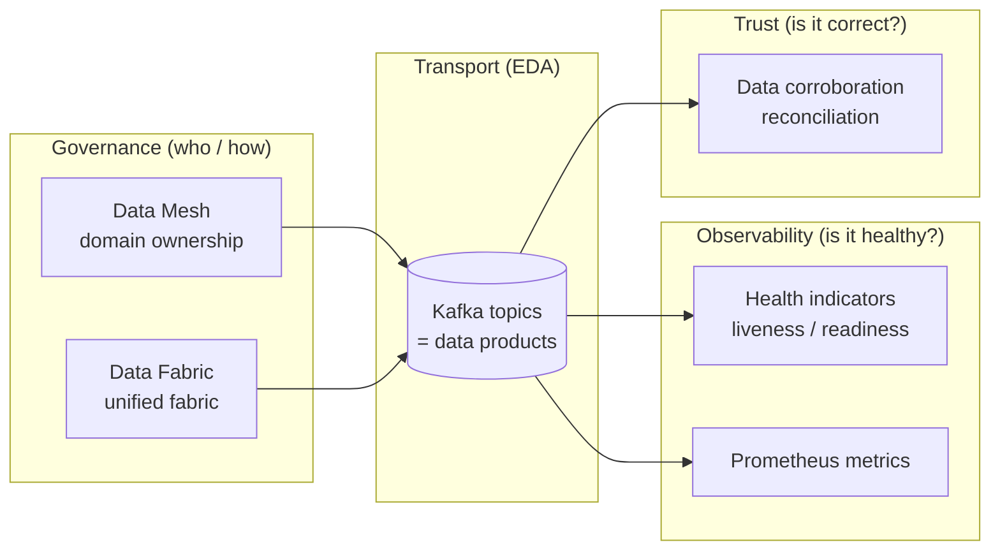
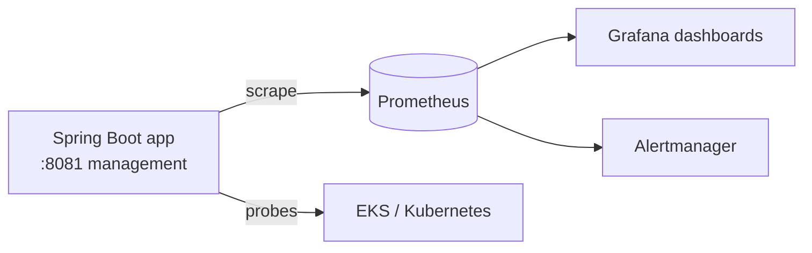

# Governance & Observability

> Part of the **Kafka Engineering Guide** of `org-rd-fullstack-springboot-eda`. See the [project README](../README.md).

**Scope:** Governance and observability for event-driven architecture (EDA): the four Data Mesh principles and how they contrast with Data Fabric, data governance in streaming systems, Spring Boot health indicators and liveness/readiness probes, Actuator and Prometheus observability, the common failure modes of Kafka projects, and a short overview of data corroboration.

## Table of contents

- [Overview](#overview)
- [Data Mesh: four principles](#data-mesh-four-principles)
- [Data Mesh vs Data Fabric](#data-mesh-vs-data-fabric)
- [Data governance in EDA](#data-governance-in-eda)
- [Spring Boot health indicators](#spring-boot-health-indicators)
  - [Built-in and custom indicators](#built-in-and-custom-indicators)
  - [Health status and HTTP mapping](#health-status-and-http-mapping)
  - [Liveness vs readiness probes](#liveness-vs-readiness-probes)
  - [Health groups](#health-groups)
- [Observability: Actuator and Prometheus](#observability-actuator-and-prometheus)
- [Why Kafka projects fail](#why-kafka-projects-fail)
- [Data corroboration (overview)](#data-corroboration-overview)
- [How this project applies it](#how-this-project-applies-it)
- [Pitfalls & best practices](#pitfalls--best-practices)
- [Sources & further reading](#sources--further-reading)

## Overview

In an event-driven enterprise, two questions decide whether data delivers value: *who owns and governs the data* and *how do we know the running system is healthy and its data is trustworthy*. The first is an organizational and architectural concern addressed by **Data Mesh** and **Data Fabric**; the second is an operational concern addressed by **health indicators**, **probes**, and **observability**.

This guide ties the two together. Data Mesh treats each domain's data as a product with explicit ownership and contracts; EDA (Kafka here) is the transport that makes those products available in real time. Health indicators and Prometheus metrics tell us whether the producers, consumers, and brokers behind those products are actually working. Data corroboration closes the loop by verifying that what was delivered matches the expected state.



## Data Mesh: four principles

Data Mesh is primarily a philosophy and operating model, not a product. It pushes responsibility for data quality, documentation, and delivery onto the business domains that produce the data, replacing the bottleneck of a central data team. It rests on four widely cited principles:

- **Domain ownership (decentralization).** Each business domain owns its data end to end: quality, documentation, lifecycle, and SLAs. Data is a strategic asset aligned with the business process that creates it, not a by-product of an application.
- **Data as a product.** Every dataset (or topic) is a first-class product with discoverability, versioning, defined schemas/contracts, SLAs, and a usable consumer experience. Consumers should be able to find, understand, and trust it without talking to the producing team.
- **Self-serve data platform.** Shared infrastructure, storage, and tooling are provided as a platform so domain teams can publish and consume data products independently, without central approvals or hand-offs becoming the bottleneck.
- **Federated computational governance.** Global rules (security, privacy, interoperability, schema standards) are defined centrally but enforced in an automated, federated way across autonomous domains, so the mesh stays consistent and interoperable while teams stay autonomous.

> The existing repo note frames the first three under *decentralization*, *data as a product*, *team autonomy*, and *self-service platform*. See the [Data Mesh / Data Fabric note](./datamesh_datafabric.md) for that organizational framing.

## Data Mesh vs Data Fabric

Data Mesh and Data Fabric attack the same business problem — maximizing the value of enterprise data — but at different layers and from almost opposite directions.

| Aspect | Data Mesh | Data Fabric |
| --- | --- | --- |
| Primary layer | Organizational / governance / cultural | Technical / infrastructure |
| Core question | *Who owns the data, and how is it governed?* | *How is data made accessible, governed, and interoperable?* |
| Ownership | Decentralized, per domain | Centralized services over distributed sources |
| Key mechanism | Domain teams, data products, federated governance | Integration, virtualization, AI/ML automation, lineage |
| Strength | Accountability, agility, domain alignment | Seamless access, consistency, automation |

Most organizations adopt a **hybrid**: Data Mesh sets the "rules of the road" (ownership and product thinking) while Data Fabric provides the "highway network" (integration, cataloging, lineage, security) that lets governed data flow safely. EDA underpins both, moving data as decoupled, real-time events. The repo note develops this analogy in full — see [`datamesh_datafabric.md`](./datamesh_datafabric.md).

## Data governance in EDA

In streaming systems, governance is not optional polish — its absence is a leading cause of failure (see [Why Kafka projects fail](#why-kafka-projects-fail)). Ungoverned topics make data hard to find, understand, and trust. Effective governance in an EDA covers:

- **Schemas and contracts.** Enforce message formats and schema evolution (e.g. a schema registry with compatibility rules). Kafka has no built-in validation, so this must be added deliberately.
- **Ownership and stewardship.** Every topic has a documented owner, data definitions, and use cases. Undocumented topics created ad hoc are technical debt the moment they exist.
- **Catalog and lineage.** A catalog tracks topic schemas and metadata; lineage records where data originates and how it was transformed. Kafka provides neither out of the box.
- **Quality and consistency.** Validation and cleansing applied consistently across the ecosystem, not per consumer.
- **Policies and standards.** Classification, access control, retention, and privacy rules applied uniformly — the federated governance principle of Data Mesh in practice.

## Spring Boot health indicators

Health information tells the platform (and operators) whether the application and its dependencies are working. In Spring Boot it is provided by the Actuator module via the `HealthContributor` / `HealthIndicator` APIs.

Add the dependency:

```xml
<dependency>
  <groupId>org.springframework.boot</groupId>
  <artifactId>spring-boot-starter-actuator</artifactId>
</dependency>
```

### Built-in and custom indicators

Spring Boot auto-registers many indicators. Some are almost always present (`DiskSpaceHealthIndicator`, `PingHealthIndicator`); others are conditional on the classpath (`DataSourceHealthIndicator` for relational databases, `CassandraHealthIndicator` for Cassandra, and so on). The aggregated result is exposed at `/actuator/health`; a single indicator at `/actuator/health/{name}`.

A custom indicator is just a Spring bean implementing `HealthIndicator`:

```java
@Component
public class RandomHealthIndicator implements HealthIndicator {

    @Override
    public Health health() {
        double chance = ThreadLocalRandom.current().nextDouble();
        Health.Builder status = Health.up();
        if (chance > 0.9) {
            status = Health.down();
        }
        return status
            .withDetail("chance", chance)
            .withDetail("strategy", "thread-local")
            .build();
    }
}
```

Notes from the API:

- **Identifier** — the indicator name is the bean name without the `HealthIndicator` suffix (so `RandomHealthIndicator` → `/actuator/health/random`). Naming the bean `@Component("rand")` changes the path to `/actuator/health/rand`.
- **Details** — attach key/value detail with `withDetail(...)` / `withDetails(map)`, and report failures with `Health.down(ex)` or `withException(ex)` (the stack trace appears under `error`).
- **Disabling** — set `management.health.<id>.enabled=false` (combine with `@ConditionalOnEnabledHealthIndicator("<id>")` on a custom indicator); the endpoint then returns `404`.
- **Reactive apps** — implement `ReactiveHealthIndicator`, whose `health()` returns `Mono<Health>`.
- **Detail exposure** — `management.endpoint.health.show-details` accepts `never`, `when_authorized` (authenticated user with the roles in `management.endpoint.health.roles`), or `always`.

### Health status and HTTP mapping

The four built-in statuses are `UP`, `DOWN`, `OUT_OF_SERVICE`, and `UNKNOWN`. They are `public static final` instances (not enum values), so custom states are allowed via `Health.status("WARNING")`.

Status drives the HTTP code: by default `DOWN` and `OUT_OF_SERVICE` map to `503`, while `UP` and unmapped statuses map to `200`. Override per status:

```yaml
management:
  endpoint:
    health:
      status:
        http-mapping:
          down: 500
          out_of_service: 503
          warning: 500
```

Or register an `HttpCodeStatusMapper` bean for programmatic mapping.

### Liveness vs readiness probes

For orchestrated deployments (Kubernetes/EKS) Spring Boot exposes two availability states. The distinction is critical because the orchestrator reacts to each differently:

| Probe | Meaning | Failure means | Orchestrator action |
| --- | --- | --- | --- |
| **Liveness** (`/actuator/health/liveness`) | Internal state is correct | State is broken and unrecoverable | **Restart** the pod |
| **Readiness** (`/actuator/health/readiness`) | Ready to accept traffic | Cannot serve requests (e.g. graceful shutdown, warming up) | **Stop routing** traffic (do not restart) |

States are changed in code by publishing an `AvailabilityChangeEvent` with `LivenessState` (`CORRECT` / `BROKEN`) or `ReadinessState` (`ACCEPTING_TRAFFIC` / `REFUSING_TRAFFIC`). This is exactly what this project does — see [How this project applies it](#how-this-project-applies-it).

### Health groups

Health indicators can be aggregated into named **groups** so a probe reflects only the indicators that matter for that decision:

```yaml
management:
  endpoint:
    health:
      probes:
        enabled: true
      group:
        readiness:
          include: readinessState, kafka, db
        liveness:
          include: livenessState
```

This keeps a slow downstream dependency from triggering a needless restart: it belongs in `readiness`, not `liveness`.

### Health information vs metrics

Use **health indicators** to answer *can the app talk to this component?* (Kafka, DB, Hazelcast reachable / up / down). Use **metrics** to *measure* values — CPU, heap, request-latency distributions, counts, durations. Do not implement counters or timers as health indicators; that is what metrics and Prometheus are for.

## Observability: Actuator and Prometheus

Actuator runs on the **management port `8081`** in this project (separate from the app port `8080`). Key endpoints, all listed in the [README](../README.md):

| Endpoint | Purpose |
| --- | --- |
| [`/actuator`](http://localhost:8081/actuator) | Index of available endpoints |
| [`/actuator/info`](http://localhost:8081/actuator/info) | Build/app info |
| [`/actuator/health`](http://localhost:8081/actuator/health) | Aggregated health |
| [`/actuator/health/liveness`](http://localhost:8081/actuator/health/liveness) | Liveness probe |
| [`/actuator/health/readiness`](http://localhost:8081/actuator/health/readiness) | Readiness probe |
| [`/actuator/prometheus`](http://localhost:8081/actuator/prometheus) | Prometheus scrape endpoint |

The `/actuator/prometheus` endpoint exposes Micrometer metrics in Prometheus text format for scraping, dashboards (Grafana), and alerting. This is the right place for JVM, HTTP, and Kafka client metrics (consumer lag, records consumed/produced, rebalance counts).



## Why Kafka projects fail

Governance and observability are not academic: ungoverned, unobserved Kafka deployments fail in predictable ways. The Confluent/Ferraro report identifies six recurring risks:

1. **Lack of expertise and resources** — Kafka is easy to start but hard to operate reliably; building a trustworthy service demands scarce skills.
2. **Difficulty moving from development to production** — what works on a laptop is not a hardened, highly available cluster.
3. **Unpredictable outages and downtime** — replication/data-integrity errors, infrastructure/network/software complexity, mis-tuned timeouts, and configuration errors (replication factor, partition allocation) cause data loss and downtime.
4. **Difficulty securing streaming data** — authentication, access control, encryption, key management, monitoring, and auditing require rare combined Kafka + security expertise.
5. **Lack of governance** — undocumented topics with unknown owners/definitions erode trust; gaps in data quality, consistency, lineage, stewardship, catalog, and policies multiply as topic counts grow into the thousands. (This is the [governance section](#data-governance-in-eda) above, stated as a failure mode.)
6. **Difficulty scaling** — scaling across regions and orchestrating competing workloads often needs manual intervention and outgrows human capacity.

The takeaways for this guide: invest in governance early, treat probes/metrics as first-class, and validate data with corroboration rather than assuming delivery equals correctness.

## Data corroboration (overview)

Event delivery does **not** guarantee global consistency. Delivery semantics, consumer failures, rebalances, and transient infrastructure issues can all cause divergence between systems, so corroboration and reconciliation must be designed as explicit architectural concerns. A production-grade EDA layers several techniques:

| Objective | Technique |
| --- | --- |
| Fast divergence detection | State checksums / hashes |
| Audit & compliance | Event replay and periodic snapshots |
| Operational confidence | Control / checkpoint events |
| Migration & refactoring | Shadow (parallel) consumers |

Underpinning all of them: **idempotency and business-level sequencing** (per-aggregate sequence numbers, gap detection) and **contractual business invariants** (e.g. stock never negative, balances consistent).

> This is a deliberately short overview. The full treatment — mechanisms, trade-offs, and a recommended layered strategy — is in the dedicated deep-dive: **[Data corroboration](./data_corrob.md)**.

## How this project applies it

This sandbox demonstrates the observability and probe concepts above directly:

- **Liveness / readiness control.** [`HealthController`](../src/main/java/org/rd/fullstack/springbooteda/controller/HealthController.java) exposes `POST` endpoints (`/api/liveness_state_down|up`, `/api/readiness_state_down|up`) that publish `AvailabilityChangeEvent`s with `LivenessState` and `ReadinessState`. This lets you flip the app's availability and watch the Actuator probes at [`/actuator/health/liveness`](http://localhost:8081/actuator/health/liveness) and [`/actuator/health/readiness`](http://localhost:8081/actuator/health/readiness) react.
- **Custom dashboards as component health.** The same controller serves component dashboards that combine data and health status for each subsystem:
  - [`KafkaDashboard`](../src/main/java/org/rd/fullstack/springbooteda/util/kafka/KafkaDashboard.java) via `GET /api/kafkaDashboardData` (cluster id, broker count, controller, per-topic and consumer-group lag summaries).
  - [`FlinkDashboard`](../src/main/java/org/rd/fullstack/springbooteda/util/flink/FlinkDashboard.java) via `GET /api/flinkDashboardData`.
  - [`HazelcastDashboard`](../src/main/java/org/rd/fullstack/springbooteda/util/hazelcast/HazelcastDashboard.java) via `GET /api/hazelcastDashboardData`.
- **Actuator on port 8081.** The management endpoints listed in the [README](../README.md) (`/actuator`, `/actuator/info`, `/actuator/health`, the two probes, and `/actuator/prometheus`) provide the standard observability surface alongside the custom dashboards.
- **Lag as a health signal.** Kafka consumer-group lag is surfaced through [`GroupLagSummary`](../src/main/java/org/rd/fullstack/springbooteda/util/kafka/GroupLagSummary.java) and [`ConsumerGroupMonitor`](../src/main/java/org/rd/fullstack/springbooteda/util/kafka/ConsumerGroupMonitor.java), with a [`LagAlertEvent`](../src/main/java/org/rd/fullstack/springbooteda/util/kafka/LagAlertEvent.java) — an example of turning a streaming metric into an operational alert.

For the governance framing behind these dashboards, cross-read the [Data Mesh / Data Fabric note](./datamesh_datafabric.md).

## Pitfalls & best practices

- **Do not conflate liveness and readiness.** Putting a slow/optional dependency in the liveness group causes restart loops. Dependencies that affect *serving* belong in readiness; only unrecoverable internal state belongs in liveness.
- **Do not measure with health indicators.** Counters, durations, and gauges are metrics (Prometheus), not health. Keep `health()` boolean-ish and fast.
- **Guard detail exposure.** Use `show-details: when_authorized` (or `never`) in production so stack traces and internal details are not leaked publicly.
- **Govern topics from day one.** Document owner, schema, and use case per topic; enforce schema compatibility. Ungoverned topics are the most common — and most expensive — failure mode.
- **Tune timeouts deliberately.** Too low causes premature termination and message loss; too high delays failure detection. Test configuration changes (replication factor, partitions) before production.
- **Treat delivery and correctness separately.** Add idempotency, sequencing, and a corroboration layer; do not assume an event consumed is a state that matches reality. See [Data corroboration](./data_corrob.md).
- **Scrape metrics on the management port.** Keep `8081` internal/secured; expose only what monitoring needs.

## Sources & further reading

- [Data Mesh / Data Fabric note](./datamesh_datafabric.md) — organizational vs technical framing and the hybrid approach.
- [Data corroboration](./data_corrob.md) — sibling deep dive into corroboration mechanisms.
- [Project README](../README.md) — run instructions and the full list of Actuator endpoints.
