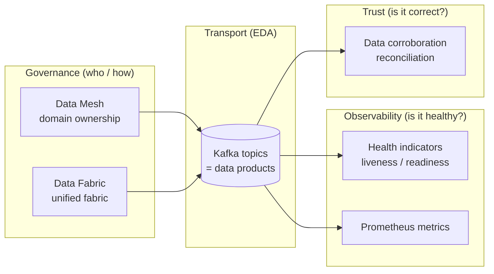
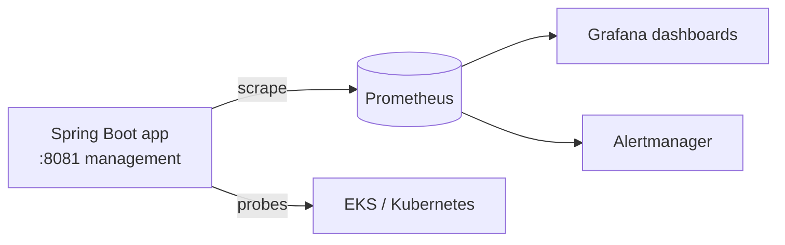

# Governance & Observability

> Part of the **Kafka Engineering Guide** of `org-rd-fullstack-springboot-eda`. See the [project README](../README.md).

**Scope:** Governance and observability for event-driven architecture (EDA). On the **governance** side: the four Data Mesh principles and how they contrast with Data Fabric, data governance in streaming systems, a topic catalog treated as data products, event contracts, and explicit SLAs with alerting. On the **observability** side: Spring Boot health indicators and liveness/readiness probes, Actuator and Prometheus, Kafka metrics, the common failure modes of Kafka projects (strategic and operational), distributed tracing, event correlation, and a short overview of data corroboration.

## Table of contents

- [Overview](#overview)
- [Data Mesh: four principles](#data-mesh-four-principles)
- [Data Mesh vs Data Fabric](#data-mesh-vs-data-fabric)
- [Data governance in EDA](#data-governance-in-eda)
- [Governance in practice: catalog & contracts](#governance-in-practice-catalog--contracts)
- [SLA & alerts](#sla--alerts)
- [Spring Boot health indicators](#spring-boot-health-indicators)
  - [Built-in and custom indicators](#built-in-and-custom-indicators)
  - [Health status and HTTP mapping](#health-status-and-http-mapping)
  - [Liveness vs readiness probes](#liveness-vs-readiness-probes)
  - [Health groups](#health-groups)
  - [Health information vs metrics](#health-information-vs-metrics)
- [Observability: Actuator and Prometheus](#observability-actuator-and-prometheus)
- [Kafka metrics](#kafka-metrics)
- [Failure modes](#failure-modes)
  - [Why Kafka projects fail (strategic)](#why-kafka-projects-fail-strategic)
  - [Common runtime failure modes (operational)](#common-runtime-failure-modes-operational)
- [Distributed tracing](#distributed-tracing)
- [Event correlation](#event-correlation)
- [Data corroboration (overview)](#data-corroboration-overview)
- [How this project applies it](#how-this-project-applies-it)
- [Pitfalls & best practices](#pitfalls--best-practices)
- [Sources & further reading](#sources--further-reading)

## Overview

In an event-driven enterprise, two questions decide whether data delivers value: *who owns and governs the data* and *how do we know the running system is healthy and its data is trustworthy*. The first is an organizational and architectural concern addressed by **Data Mesh** and **Data Fabric**; the second is an operational concern addressed by **health indicators**, **probes**, and **observability**.

An event-driven architecture is **not** simpler to operate than a synchronous one — it is often more complex. Dependencies between services are **implicit** (who publishes and who consumes each event?) and failures are **distributed** (a producer can stop while consumers only notice much later). Governance and observability exist precisely to make the implicit explicit: to know who owns each event flow, to understand the system state in real time, and to detect anomalies before they propagate.

This guide ties the two together. Data Mesh treats each domain's data as a product with explicit ownership and contracts; EDA (Kafka here) is the transport that makes those products available in real time. Health indicators and Prometheus metrics tell us whether the producers, consumers, and brokers behind those products are actually working. Data corroboration closes the loop by verifying that what was delivered matches the expected state.


```mermaid
flowchart LR
    subgraph Governance["Governance (who / how)"]
        DM[Data Mesh<br/>domain ownership]
        DF[Data Fabric<br/>unified fabric]
    end
    subgraph Transport["Transport (EDA)"]
        K[(Kafka topics<br/>= data products)]
    end
    subgraph Observability["Observability (is it healthy?)"]
        H[Health indicators<br/>liveness / readiness]
        P[Prometheus metrics]
    end
    subgraph Trust["Trust (is it correct?)"]
        C[Data corroboration<br/>reconciliation]
    end
    DM --> K
    DF --> K
    K --> H
    K --> P
    K --> C
```

## Data Mesh: four principles

Data Mesh is primarily a philosophy and operating model, not a product. It pushes responsibility for data quality, documentation, and delivery onto the business domains that produce the data, replacing the bottleneck of a central data team. It rests on four widely cited principles:

- **Domain ownership (decentralization).** Each business domain owns its data end to end: quality, documentation, lifecycle, and SLAs. Data is a strategic asset aligned with the business process that creates it, not a by-product of an application.
- **Data as a product.** Every dataset (or topic) is a first-class product with discoverability, versioning, defined schemas/contracts, SLAs, and a usable consumer experience. Consumers should be able to find, understand, and trust it without talking to the producing team.
- **Self-serve data platform.** Shared infrastructure, storage, and tooling are provided as a platform so domain teams can publish and consume data products independently, without central approvals or hand-offs becoming the bottleneck.
- **Federated computational governance.** Global rules (security, privacy, interoperability, schema standards) are defined centrally but enforced in an automated, federated way across autonomous domains, so the mesh stays consistent and interoperable while teams stay autonomous.

> The existing repo note frames the first three under *decentralization*, *data as a product*, *team autonomy*, and *self-service platform*. See the [Data Mesh / Data Fabric note](./datamesh_datafabric.md) for that organizational framing.

## Data Mesh vs Data Fabric

Data Mesh and Data Fabric attack the same business problem — maximizing the value of enterprise data — but at different layers and from almost opposite directions.

| Aspect | Data Mesh | Data Fabric |
| --- | --- | --- |
| Primary layer | Organizational / governance / cultural | Technical / infrastructure |
| Core question | *Who owns the data, and how is it governed?* | *How is data made accessible, governed, and interoperable?* |
| Ownership | Decentralized, per domain | Centralized services over distributed sources |
| Key mechanism | Domain teams, data products, federated governance | Integration, virtualization, AI/ML automation, lineage |
| Strength | Accountability, agility, domain alignment | Seamless access, consistency, automation |

Most organizations adopt a **hybrid**: Data Mesh sets the "rules of the road" (ownership and product thinking) while Data Fabric provides the "highway network" (integration, cataloging, lineage, security) that lets governed data flow safely. EDA underpins both, moving data as decoupled, real-time events. The repo note develops this analogy in full — see [`datamesh_datafabric.md`](./datamesh_datafabric.md).

## Data governance in EDA

In streaming systems, governance is not optional polish — its absence is a leading cause of failure (see [Why Kafka projects fail](#why-kafka-projects-fail-strategic)). Ungoverned topics make data hard to find, understand, and trust. Effective governance in an EDA covers:

- **Schemas and contracts.** Enforce message formats and schema evolution (e.g. a schema registry with compatibility rules). Kafka has no built-in validation, so this must be added deliberately.
- **Ownership and stewardship.** Every topic has a documented owner, data definitions, and use cases. Undocumented topics created ad hoc are technical debt the moment they exist.
- **Catalog and lineage.** A catalog tracks topic schemas and metadata; lineage records where data originates and how it was transformed. Kafka provides neither out of the box.
- **Quality and consistency.** Validation and cleansing applied consistently across the ecosystem, not per consumer.
- **Policies and standards.** Classification, access control, retention, and privacy rules applied uniformly — the federated governance principle of Data Mesh in practice.

## Governance in practice: catalog & contracts

The principles above become concrete through two artifacts: a **topic catalog** and per-event **contracts**.

### Topic catalog

Document every Kafka topic as a **data product**:

| Topic | Owner | Schema | Producers | Consumers | Retention SLA |
| --- | --- | --- | --- | --- | --- |
| `APP-Kafka-Requests` | Inventory team | `RequestSchema v1` | `PipelineSrv` | `ProcessorSrv` | 7 days / 1 GB |
| `APP-Flink-Requests` | Stream team | `FlinkRequestSchema v1` | (external) | Flink cluster | 3 days |
| `APP-Requests-dlt` | Platform team | `ErrorSchema v1` | DLQ handler | `ErrorHandlerSrv` | 30 days |

### Event contract

Document each event with a stable contract:

**Event:** `RequestCreated`
**Version:** 1.0
**Topic:** `APP-Kafka-Requests`
**Producer:** `PipelineSrv`
**Consumers:** `ProcessorSrv` (in-JVM), Flink (optional)

Schema:

```json
{
  "eventType": "RequestCreated",
  "eventId": "uuid",
  "productId": 123,
  "personId": 456,
  "quantity": 10,
  "timestamp": 1234567890000
}
```

SLA:

- **P50 latency:** < 100 ms (from producer to first consumer delivery).
- **Delivery:** at-least-once.
- **Removals:** none without a business reason (possible, but must be announced).

## SLA & alerts

Every topic / data product should have explicit **SLAs** with matching **alerts**.

### Typical SLAs

| SLA | Metric | Threshold | Action |
| --- | --- | --- | --- |
| Availability | broker uptime | > 99.5% | alert when < 99% |
| Latency | end-to-end producer→consumer latency | < 1 s P99 | alert when > 5 s |
| Throughput | events per second | > 1000 eps | alert when < 100 eps |
| Lag | consumer offset lag | < 100 messages | alert when > 10k |
| Errors | consumer error rate | < 0.1% | alert when > 1% |

### Alert implementation

Use Prometheus + Grafana + Alertmanager:

```yaml
# prometheus-rules.yml
groups:
  - name: kafka_consumer_lag
    rules:
      - alert: HighConsumerLag
        expr: kafka_consumer_lag > 10000
        for: 5m
        annotations:
          summary: "Consumer lag for {{ $labels.topic }} is {{ $value }}"

      - alert: ProducerFailureRate
        expr: rate(kafka_producer_errors_total[5m]) > 0.01
        for: 5m
        annotations:
          summary: "Producer error rate > 1%"
```

## Spring Boot health indicators

Health information tells the platform (and operators) whether the application and its dependencies are working. In Spring Boot it is provided by the Actuator module via the `HealthContributor` / `HealthIndicator` APIs.

Add the dependency:

```xml
<dependency>
  <groupId>org.springframework.boot</groupId>
  <artifactId>spring-boot-starter-actuator</artifactId>
</dependency>
```

### Built-in and custom indicators

Spring Boot auto-registers many indicators. Some are almost always present (`DiskSpaceHealthIndicator`, `PingHealthIndicator`); others are conditional on the classpath (`DataSourceHealthIndicator` for relational databases, `CassandraHealthIndicator` for Cassandra, and so on). The aggregated result is exposed at `/actuator/health`; a single indicator at `/actuator/health/{name}`.

A custom indicator is just a Spring bean implementing `HealthIndicator`:

```java
@Component
public class RandomHealthIndicator implements HealthIndicator {

    @Override
    public Health health() {
        double chance = ThreadLocalRandom.current().nextDouble();
        Health.Builder status = Health.up();
        if (chance > 0.9) {
            status = Health.down();
        }
        return status
            .withDetail("chance", chance)
            .withDetail("strategy", "thread-local")
            .build();
    }
}
```

Notes from the API:

- **Identifier** — the indicator name is the bean name without the `HealthIndicator` suffix (so `RandomHealthIndicator` → `/actuator/health/random`). Naming the bean `@Component("rand")` changes the path to `/actuator/health/rand`.
- **Details** — attach key/value detail with `withDetail(...)` / `withDetails(map)`, and report failures with `Health.down(ex)` or `withException(ex)` (the stack trace appears under `error`).
- **Disabling** — set `management.health.<id>.enabled=false` (combine with `@ConditionalOnEnabledHealthIndicator("<id>")` on a custom indicator); the endpoint then returns `404`.
- **Reactive apps** — implement `ReactiveHealthIndicator`, whose `health()` returns `Mono<Health>`.
- **Detail exposure** — `management.endpoint.health.show-details` accepts `never`, `when_authorized` (authenticated user with the roles in `management.endpoint.health.roles`), or `always`.

A concrete example: a Kafka indicator that verifies broker connectivity and the presence of the key topics. Illustrative sketch of what `KafkaHealthIndicator` would look like (not present in this project's source):

```java
@Component
public class KafkaHealthIndicator extends AbstractHealthIndicator {
    @Override
    protected void doHealthCheck(Health.Builder builder) {
        try {
            // Check broker connectivity
            adminClient.describeCluster().get();

            // Check that the key topics exist
            if (topicExists(MAIN_TOPIC) && topicExists(DLT_TOPIC)) {
                builder.up()
                    .withDetail("broker_version", getBrokerVersion())
                    .withDetail("partition_count", getPartitionCount());
            } else {
                builder.down().withDetail("reason", "topics not found");
            }
        } catch (Exception e) {
            builder.down().withDetail("error", e.getMessage());
        }
    }
}
```

Response:

```json
{
  "status": "UP",
  "components": {
    "kafka": {
      "status": "UP",
      "details": {
        "broker_version": "3.5.0",
        "partition_count": 24
      }
    }
  }
}
```

### Health status and HTTP mapping

The four built-in statuses are `UP`, `DOWN`, `OUT_OF_SERVICE`, and `UNKNOWN`. They are `public static final` instances (not enum values), so custom states are allowed via `Health.status("WARNING")`.

Status drives the HTTP code: by default `DOWN` and `OUT_OF_SERVICE` map to `503`, while `UP` and unmapped statuses map to `200`. Override per status:

```yaml
management:
  endpoint:
    health:
      status:
        http-mapping:
          down: 500
          out_of_service: 503
          warning: 500
```

Or register an `HttpCodeStatusMapper` bean for programmatic mapping.

### Liveness vs readiness probes

For orchestrated deployments (Kubernetes/EKS) Spring Boot exposes two availability states. The distinction is critical because the orchestrator reacts to each differently:

| Probe | Meaning | Failure means | Orchestrator action |
| --- | --- | --- | --- |
| **Liveness** (`/actuator/health/liveness`) | Internal state is correct | State is broken and unrecoverable | **Restart** the pod |
| **Readiness** (`/actuator/health/readiness`) | Ready to accept traffic | Cannot serve requests (e.g. graceful shutdown, warming up) | **Stop routing** traffic (do not restart) |

States are changed in code by publishing an `AvailabilityChangeEvent` with `LivenessState` (`CORRECT` / `BROKEN`) or `ReadinessState` (`ACCEPTING_TRAFFIC` / `REFUSING_TRAFFIC`). This is exactly what this project does — see [How this project applies it](#how-this-project-applies-it).

### Health groups

Health indicators can be aggregated into named **groups** so a probe reflects only the indicators that matter for that decision:

```yaml
management:
  endpoint:
    health:
      probes:
        enabled: true
      group:
        readiness:
          include: readinessState, kafka, db
        liveness:
          include: livenessState
```

This keeps a slow downstream dependency from triggering a needless restart: it belongs in `readiness`, not `liveness`.

### Health information vs metrics

Use **health indicators** to answer *can the app talk to this component?* (Kafka, DB, Hazelcast reachable / up / down). Use **metrics** to *measure* values — CPU, heap, request-latency distributions, counts, durations. Do not implement counters or timers as health indicators; that is what metrics and Prometheus are for.

## Observability: Actuator and Prometheus

Actuator runs on the **management port `8081`** in this project (separate from the app port `8080`). Key endpoints, all listed in the [README](../README.md):

| Endpoint | Purpose |
| --- | --- |
| [`/actuator`](http://localhost:8081/actuator) | Index of available endpoints |
| [`/actuator/info`](http://localhost:8081/actuator/info) | Build/app info |
| [`/actuator/health`](http://localhost:8081/actuator/health) | Aggregated health |
| [`/actuator/health/liveness`](http://localhost:8081/actuator/health/liveness) | Liveness probe |
| [`/actuator/health/readiness`](http://localhost:8081/actuator/health/readiness) | Readiness probe |
| [`/actuator/prometheus`](http://localhost:8081/actuator/prometheus) | Prometheus scrape endpoint |

The `/actuator/prometheus` endpoint exposes Micrometer metrics in Prometheus text format for scraping, dashboards (Grafana), and alerting. This is the right place for JVM, HTTP, and Kafka client metrics (consumer lag, records consumed/produced, rebalance counts).


```mermaid
flowchart LR
    App[Spring Boot app<br/>:8081 management] -->|scrape| Prom[(Prometheus)]
    Prom --> Graf[Grafana dashboards]
    Prom --> Alert[Alertmanager]
    App -->|probes| K8s[EKS / Kubernetes]
```

## Kafka metrics

### Key metrics

**Producer:**

- `kafka.producer.record.send.total` — records sent
- `kafka.producer.record.error.rate` — error rate
- `kafka.producer.record.send.latency.avg` — average send latency

**Consumer:**

- `kafka.consumer.lag` — lag (number of unconsumed messages)
- `kafka.consumer.records.lag.max` — max lag across all partitions
- `kafka.consumer.poll.records.rate` — records consumed per second
- `kafka.consumer.fetch.latency.avg` — average fetch latency

**Broker:**

- `kafka.server.replica.fetcher.max.bytes.rate` — replicated bytes rate
- `kafka.network.request.latency.avg` — average network request latency

### Visualization with Prometheus/Grafana

```text
# Grafana query
sum(rate(kafka_consumer_lag[5m])) by (topic)
```

This shows the average consumer lag per topic.

## Failure modes

Governance and observability are not academic. Ungoverned, unobserved Kafka deployments fail in predictable ways — both **strategically** (why the whole initiative struggles) and **operationally** (what breaks at runtime).

### Why Kafka projects fail (strategic)

The Confluent/Ferraro report identifies six recurring risks:

1. **Lack of expertise and resources** — Kafka is easy to start but hard to operate reliably; building a trustworthy service demands scarce skills.
2. **Difficulty moving from development to production** — what works on a laptop is not a hardened, highly available cluster.
3. **Unpredictable outages and downtime** — replication/data-integrity errors, infrastructure/network/software complexity, mis-tuned timeouts, and configuration errors (replication factor, partition allocation) cause data loss and downtime.
4. **Difficulty securing streaming data** — authentication, access control, encryption, key management, monitoring, and auditing require rare combined Kafka + security expertise.
5. **Lack of governance** — undocumented topics with unknown owners/definitions erode trust; gaps in data quality, consistency, lineage, stewardship, catalog, and policies multiply as topic counts grow into the thousands. (This is the [governance section](#data-governance-in-eda) above, stated as a failure mode.)
6. **Difficulty scaling** — scaling across regions and orchestrating competing workloads often needs manual intervention and outgrows human capacity.

The takeaways for this guide: invest in governance early, treat probes/metrics as first-class, and validate data with corroboration rather than assuming delivery equals correctness.

### Common runtime failure modes (operational)

**1. Broker crash**
- *Symptom:* consumer lag rises sharply; producers see timeouts.
- *Cause:* one or more brokers (or the partition leader) are unreachable.
- *Detection:* `kafka_broker_up == 0` or `kafka_producer_request_latency_ms > threshold`.
- *Recovery:* Kafka automatically fails the leader over to a replica when `min.insync.replicas` is satisfied. If all replicas are down, the topic is unavailable until the broker restarts.

**2. Growing consumer lag**
- *Symptom:* messages pile up on the broker; consumers fall behind.
- *Cause:* the consumer is slower than the producer (bug, CPU overload, GC) or crashed and is restarting.
- *Detection:* `kafka_consumer_lag > threshold` for > N minutes.
- *Recovery:* scale out (add consumer threads, up to the number of partitions); debug (check consumer logs for exceptions, GC pauses); as a last resort, reset the offset (risky!).

**3. Poison pill**
- *Symptom:* the consumer crashes on a specific message in a crash/retry/crash loop.
- *Cause:* the message is corrupt, the schema is incompatible, or the consumer logic cannot handle it.
- *Detection:* repeated `ERROR processing message at offset X` logs, no lag progress.
- *Recovery:* route the message to the dead-letter topic (`APP-Requests-dlt`) with error details; fix the consumer or wait for a compatible schema update; manually reprocess via replay after the fix.

**4. Prolonged rebalance**
- *Symptom:* consumer lag jumps briefly when pods restart; consumers are briefly "idle".
- *Cause:* when the number of consumers in a group changes (scaling, restart, failure), Kafka reassigns partitions. No consumption happens during that window.
- *Detection:* flat lag for longer than `session.timeout.ms`.
- *Recovery:* see [Distribution, scaling & shutdown on EKS](./dist_scale_and_shutdown.md).

## Distributed tracing

To trace an event across several services, use a **correlation ID**:

```java
@Component
public class CorrelationIdFilter extends OncePerRequestFilter {
    @Override
    protected void doFilterInternal(HttpServletRequest req, HttpServletResponse res, FilterChain chain) {
        String correlationId = req.getHeader("X-Correlation-Id");
        if (correlationId == null) {
            correlationId = UUID.randomUUID().toString();
        }
        MDC.put("correlationId", correlationId);
        res.setHeader("X-Correlation-Id", correlationId);
        chain.doFilter(req, res);
    }
}
```

**In Kafka:**

```java
ProducerRecord<String, String> record = new ProducerRecord<>(topic, value);
record.headers().add("X-Correlation-Id", correlationId.getBytes(StandardCharsets.UTF_8));
kafkaTemplate.send(record);
```

Consumer:

```java
@KafkaListener(...)
public void consume(ConsumerRecord<String, String> record) {
    String correlationId = new String(record.headers().lastHeader("X-Correlation-Id").value());
    MDC.put("correlationId", correlationId);
    // all logs now include the correlationId
}
```

With Jaeger/Zipkin, this produces a distributed trace visible across services.

## Event correlation

Record the **event ID** and its **source** on every data row:

```sql
CREATE TABLE REQUEST (
    ...
    EVENT_ID VARCHAR(128),                -- unique ID of the source event
    KAFKA_TOPIC VARCHAR(64),              -- where the event came from
    KAFKA_PARTITION INT,
    KAFKA_OFFSET BIGINT,
    CORRELATION_ID VARCHAR(128),          -- links to other requests
    ...
);
```

This enables retrospective audit queries:

```sql
SELECT * FROM REQUEST WHERE correlation_id = '...'
  ORDER BY created_at;
```

## Data corroboration (overview)

Event delivery does **not** guarantee global consistency. Delivery semantics, consumer failures, rebalances, and transient infrastructure issues can all cause divergence between systems, so corroboration and reconciliation must be designed as explicit architectural concerns. A production-grade EDA layers several techniques:

| Objective | Technique |
| --- | --- |
| Fast divergence detection | State checksums / hashes |
| Audit & compliance | Event replay and periodic snapshots |
| Operational confidence | Control / checkpoint events |
| Migration & refactoring | Shadow (parallel) consumers |

Underpinning all of them: **idempotency and business-level sequencing** (per-aggregate sequence numbers, gap detection) and **contractual business invariants** (e.g. stock never negative, balances consistent).

> This is a deliberately short overview. The full treatment — mechanisms, trade-offs, and a recommended layered strategy — is in the dedicated deep-dive: **[Data corroboration](./data_corroboration.md)**.

## How this project applies it

This sandbox demonstrates the governance, observability, and probe concepts above directly:

- **Liveness / readiness control.** [`HealthController`](../src/main/java/org/rd/fullstack/springbooteda/controller/HealthController.java) exposes `POST` endpoints (`/api/liveness_state_down|up`, `/api/readiness_state_down|up`) that publish `AvailabilityChangeEvent`s with `LivenessState` and `ReadinessState`. This lets you flip the app's availability and watch the Actuator probes at [`/actuator/health/liveness`](http://localhost:8081/actuator/health/liveness) and [`/actuator/health/readiness`](http://localhost:8081/actuator/health/readiness) react.
- **Kafka health indicator.** The sketch above (`KafkaHealthIndicator`) illustrates how broker and topic health could be reported at `/actuator/health`; this project does not currently ship that indicator.
- **Custom dashboards as component health.** [`HealthController`](../src/main/java/org/rd/fullstack/springbooteda/controller/HealthController.java) also serves component dashboards that combine data and health status per subsystem:
  - [`KafkaDashboard`](../src/main/java/org/rd/fullstack/springbooteda/util/kafka/KafkaDashboard.java) via `GET /api/kafkaDashboardData` (cluster id, broker count, controller, per-topic and consumer-group lag summaries).
  - [`FlinkDashboard`](../src/main/java/org/rd/fullstack/springbooteda/util/flink/FlinkDashboard.java) via `GET /api/flinkDashboardData`.
  - [`HazelcastDashboard`](../src/main/java/org/rd/fullstack/springbooteda/util/hazelcast/HazelcastDashboard.java) via `GET /api/hazelcastDashboardData`.
- **Actuator on port 8081.** The management endpoints listed in the [README](../README.md) (`/actuator`, `/actuator/info`, `/actuator/health`, the two probes, and `/actuator/prometheus`) provide the standard observability surface alongside the custom dashboards.
- **Lag as a health signal.** Kafka consumer-group lag is surfaced through [`GroupLagSummary`](../src/main/java/org/rd/fullstack/springbooteda/util/kafka/GroupLagSummary.java) and [`ConsumerGroupMonitor`](../src/main/java/org/rd/fullstack/springbooteda/util/kafka/ConsumerGroupMonitor.java), with a [`LagAlertEvent`](../src/main/java/org/rd/fullstack/springbooteda/util/kafka/LagAlertEvent.java) — an example of turning a streaming metric into an operational alert.
- **Correlation IDs.** Kafka headers carry a `replay-id` (analogous to `X-Correlation-Id`), and [`KafkaPipelineListener`](../src/main/java/org/rd/fullstack/springbooteda/srv/KafkaPipelineListener.java) logs the topic, partition, and offset for each record, so events can be traced end to end.
- **Web UI overview.** The web interface shows the latest requests, their statuses, and errors.

For the governance framing behind these dashboards, cross-read the [Data Mesh / Data Fabric note](./datamesh_datafabric.md).

## Pitfalls & best practices

- **Do not conflate liveness and readiness.** Putting a slow/optional dependency in the liveness group causes restart loops. Dependencies that affect *serving* belong in readiness; only unrecoverable internal state belongs in liveness.
- **Do not measure with health indicators.** Counters, durations, and gauges are metrics (Prometheus), not health. Keep `health()` boolean-ish and fast.
- **Guard detail exposure.** Use `show-details: when_authorized` (or `never`) in production so stack traces and internal details are not leaked publicly.
- **Catalog every topic.** Document owner, schema, consumers, and SLA per topic; enforce schema compatibility. Ungoverned topics are the most common — and most expensive — failure mode.
- **Alert on lag.** If consumer lag exceeds 10k messages for 5 minutes, something is wrong.
- **Log correlations.** Put a correlation ID in every log and event for auditability.
- **Monitor broker health.** Uptime, out-of-sync replicas, unclean leader elections.
- **Test failure scenarios.** Broker crash, rebalance, poison pill, memory overflow.
- **Tune timeouts deliberately.** Too low causes premature termination and message loss; too high delays failure detection. Test configuration changes (replication factor, partitions) before production.
- **Do not reset offsets without reason.** It is a dangerous move that can replay thousands of messages.
- **Treat delivery and correctness separately.** Add idempotency, sequencing, and a corroboration layer; do not assume an event consumed is a state that matches reality. See [Data corroboration](./data_corroboration.md).
- **Scrape metrics on the management port.** Keep `8081` internal/secured; expose only what monitoring needs.

## Sources & further reading

- [Data Mesh / Data Fabric note](./datamesh_datafabric.md) — organizational vs technical framing and the hybrid approach.
- [Data corroboration](./data_corroboration.md) — sibling deep dive into corroboration mechanisms.
- [Distribution, scaling & shutdown on EKS](./dist_scale_and_shutdown.md) — rebalance behavior and graceful shutdown.
- [Horizontal elasticity on EKS](./horizontal_elasticity_keda_karpenter.md) — autoscaling of consumers.
- [Project README](../README.md) — run instructions and the full list of Actuator endpoints.
