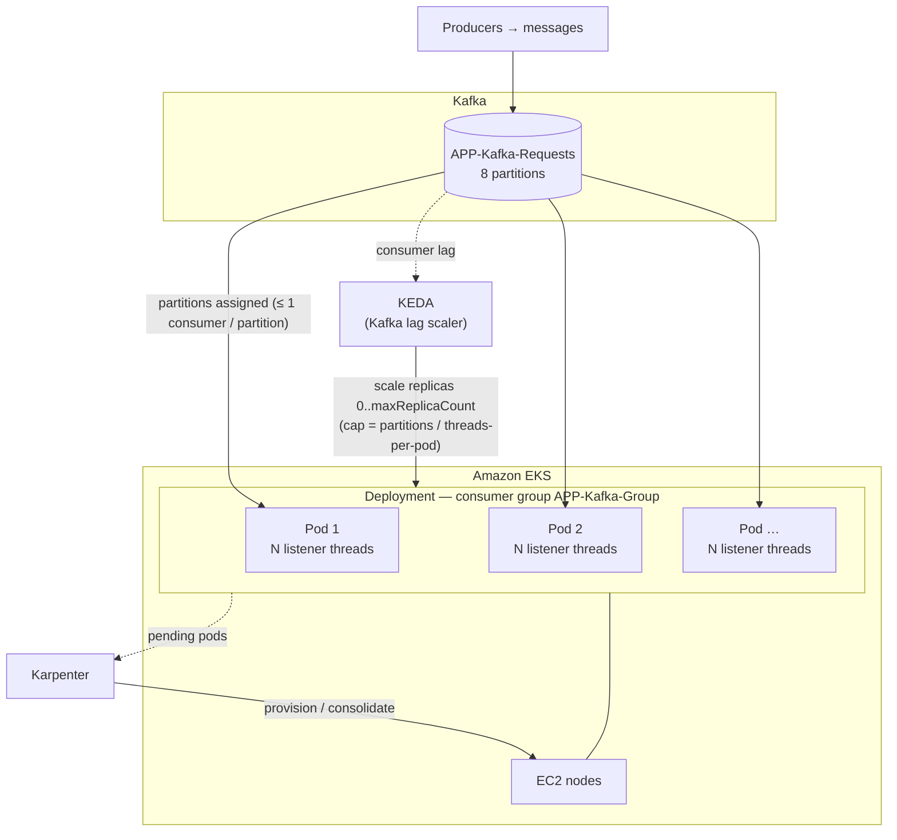
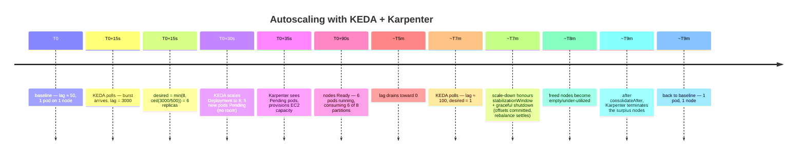

# Horizontal elasticity on EKS: why classic autoscaling fails, and how KEDA + Karpenter fix it

> Part of the **Kafka Engineering Guide** of `org-rd-fullstack-springboot-eda`. See the [project README](../README.md).

**Scope:** how to scale the Kafka-consuming pods of this application on **Amazon EKS**. It explains why the *classic* Kubernetes autoscaler (HPA on CPU/memory) is the **wrong tool** for a Kafka consumer, how **KEDA** (lag-driven pod autoscaling) and **Karpenter** (just-in-time node provisioning) form the correct two-layer model, and the project-specific caveats (partition ceiling, per-pod thread count, Hazelcast cluster state, and the non-scalable Flink path).

This builds directly on the pods/threads/partitions parallelism model and the graceful-shutdown requirements described in [Scale and shutdown in distributed environments](./dist_scale_and_shutdown.md) — read that first.

## Why "classic" elasticity does not work well here

The default Kubernetes **HorizontalPodAutoscaler (HPA)** scales replicas on **CPU and memory**. For a Kafka consumer this is the wrong signal, for four independent reasons:

1. **The real backlog signal is consumer lag, not CPU.** A consumer can fall far behind (high lag) while its CPU stays low — it spends its time waiting on the broker poll, the Hazelcast lock, or the JPA/DB commit (all I/O, not CPU). HPA sees an idle-looking pod and **does not scale up** precisely when the backlog is growing. Conversely, a CPU spike unrelated to lag can scale the group out for no throughput benefit.

2. **The partition count is a hard ceiling.** Kafka allows **at most one active consumer per partition within a consumer group**. With 8 partitions, the 9th consumer is **idle** — it owns nothing. HPA has no knowledge of this ceiling, so it will happily create replicas that consume zero records (wasting nodes and triggering rebalances). See the parallelism rule in [dist_scale_and_shutdown](./dist_scale_and_shutdown.md#processes-threads-and-partitions-on-eks).

3. **Flapping causes rebalance storms.** Every scale event changes group membership and triggers a **consumer-group rebalance**, during which consumption pauses. A CPU-driven HPA that flaps up and down keeps rebalancing the group, *reducing* throughput — the opposite of the intent.

4. **No scale-to-zero.** Plain HPA cannot scale a `Deployment` to zero, so an idle pipeline keeps paying for at least one running replica even when there is nothing to consume.

> **In short:** CPU/memory is a *resource* signal; a Kafka consumer needs a *work-backlog* signal. That signal is **consumer lag**.

## The correct model: two elasticity layers

| Layer | Tool | Signal | Acts on |
|---|---|---|---|
| **Pods** (consumers) | **KEDA** | Kafka **consumer lag** | replica count of the `Deployment` (capped at the partition count) |
| **Nodes** (capacity) | **Karpenter** | **pending (unschedulable) pods** | EC2 node provisioning / consolidation |

KEDA decides *how many consumer pods* the backlog warrants; Karpenter decides *whether the cluster has room* to run them and provisions/consolidates EC2 capacity accordingly. They are complementary: KEDA never looks at nodes, Karpenter never looks at lag.



## KEDA — scaling pods on lag

[KEDA](https://keda.sh) adds event-driven autoscalers to Kubernetes. Its **Kafka scaler** reads the consumer-group lag and computes the desired replica count as roughly `ceil(totalLag / lagThreshold)`, bounded by `minReplicaCount`/`maxReplicaCount`. Under the hood KEDA still creates an HPA, but driven by the **external lag metric** instead of CPU.

```yaml
apiVersion: keda.sh/v1alpha1
kind: ScaledObject
metadata:
  name: kafka-requests-consumer
spec:
  scaleTargetRef:
    name: springboot-eda                 # the consumer Deployment
  pollingInterval: 15                     # seconds between lag checks
  cooldownPeriod: 120                     # wait before scaling down (limits flapping)
  minReplicaCount: 1                      # see "scale-to-zero" caveat below
  maxReplicaCount: 8                      # NEVER exceed partitions / threads-per-pod
  advanced:
    horizontalPodAutoscalerConfig:
      behavior:                           # tame rebalance storms on the way down
        scaleDown:
          stabilizationWindowSeconds: 300
  triggers:
    - type: kafka
      metadata:
        bootstrapServers: kafka-bootstrap:9092
        consumerGroup: APP-Kafka-Group    # KafkaConstants.CST_TOPIC_GROUP
        topic: APP-Kafka-Requests         # KafkaConstants.CST_TOPIC_KAFKA_REQ
        lagThreshold: "500"               # target lag carried per replica
        activationLagThreshold: "1"       # wake the scaler as soon as any lag appears
        offsetResetPolicy: latest
```

> **Precision — KEDA already knows about partitions (partly).** By default the Kafka scaler will **not** scale above the topic's partition count, because extra consumers would sit idle (`allowIdleConsumers: false`, the default). What KEDA does **not** know is your **per-pod thread count**: it counts *pods*, not *threads*. So if each pod runs several listener threads, the useful ceiling is lower than the partition count, and you must still set `maxReplicaCount` yourself (see sizing below).

### Sizing: pods × threads vs. partitions (the critical coupling)

Effective consumer parallelism is:

```
effective_parallelism = min( partitions , replicas × threads_per_pod )
```

where `threads_per_pod` is the Spring Kafka container **concurrency** (`org.rd.fullstack.springbooteda.kafka.sandbox.concurrency`, set on the factory in [`KafkaConfig`](../src/main/java/org/rd/fullstack/springbooteda/config/KafkaConfig.java)).

**This project's defaults are a trap for horizontal scaling:** the topic has **8 partitions** (`CST_NBR_TOPICS_PARTITIONS`) and each pod runs **concurrency = 8** threads. A *single* pod therefore already saturates all 8 partitions — adding a second pod gives **8 more threads but 0 more partitions**, so the extra pod sits idle and only adds rebalances.

To make KEDA pod-scaling meaningful, **lower the per-pod concurrency** so that replicas map onto partitions, and cap `maxReplicaCount` accordingly:

| threads per pod | useful replicas (= 8 / threads) | `maxReplicaCount` |
|---|---|---|
| 8 (current default) | 1 | 1 — *horizontal scaling is pointless* |
| 4 | 2 | 2 |
| 2 | 4 | 4 |
| 1 | 8 | 8 — *one consumer thread per pod, fully elastic* |

> **Rule of thumb for elasticity:** `maxReplicaCount = floor(partitions / threads_per_pod)`. To scale *beyond* that, you must **add partitions** to the topic (partitions are the true unit of Kafka parallelism). One consumer thread per pod (`concurrency = 1`) gives KEDA the finest-grained, most predictable control.

### KEDA operational caveats

- **Lag is not a perfect metric.** The scaler assumes each replica drains roughly `lagThreshold` records, but partitions are rarely balanced. A **hot (skewed) partition** can carry far more lag than the others; adding replicas will not help it, because that single partition is still handled by a single consumer. Fix the key distribution, not the replica count.
- **Detection is delayed.** KEDA polls the lag every `pollingInterval` (15 s here), so a sudden spike takes ~15–30 s to register. A very short burst may be gone before KEDA reacts — don't tune `pollingInterval` so low that you chase noise.
- **Every scale event costs a rebalance.** Each change in replica count re-triggers a consumer-group rebalance (typically tens of seconds) during which consumption pauses. Frequent flapping *reduces* throughput; this is why `cooldownPeriod` and `stabilizationWindowSeconds` above are set generously.

## Karpenter — scaling nodes on demand

When KEDA adds replicas and the cluster lacks capacity, the new pods become **Pending**. [Karpenter](https://karpenter.sh) watches for unschedulable pods and provisions right-sized EC2 nodes in seconds; when load drops and KEDA removes replicas, Karpenter **consolidates** and terminates the now-empty/under-utilized nodes.

```yaml
apiVersion: karpenter.sh/v1
kind: NodePool
metadata:
  name: kafka-consumers
spec:
  template:
    spec:
      requirements:
        - key: karpenter.sh/capacity-type
          operator: In
          values: ["spot", "on-demand"]
        - key: node.kubernetes.io/instance-type
          operator: In
          values: ["c5.large", "c5.xlarge", "m5.large", "m5.xlarge"]
      expireAfter: 720h                    # rotate nodes every 30 days (drift/patching)
      nodeClassRef:
        group: karpenter.k8s.aws
        kind: EC2NodeClass
        name: default
  disruption:
    consolidationPolicy: WhenEmptyOrUnderutilized
    consolidateAfter: 1m
  limits:
    cpu: "200"                             # hard ceiling on what this pool may provision
---
apiVersion: karpenter.k8s.aws/v1
kind: EC2NodeClass
metadata:
  name: default
spec:
  amiFamily: AL2023
  role: KarpenterNodeRole-eks              # instance profile / IAM role for the nodes
  subnetSelectorTerms:
    - tags:
        karpenter.sh/discovery: "true"
  securityGroupSelectorTerms:
    - tags:
        karpenter.sh/discovery: "true"
```

> Karpenter does **not** know about Kafka lag or partitions — it only reacts to pod scheduling pressure created by KEDA. Keep the responsibilities separated: **KEDA caps replicas at the partition budget**, Karpenter just finds room for whatever KEDA asked for.
>
> **API note:** this is the stable **`karpenter.sh/v1`** API (GA since Karpenter 1.0). The old `Provisioner` / `AWSNodeTemplate` types (`v1alpha5`) and the `ttlSecondsAfterEmpty` / `ttlSecondsUntilExpired` fields are removed — use `NodePool` + `EC2NodeClass` with the `disruption` block (`consolidationPolicy`, `consolidateAfter`) and `expireAfter` instead.

## End-to-end example (one burst, start to finish)

Assume the elastic configuration above: `concurrency = 1`, `maxReplicaCount: 8`, `lagThreshold: 500`, 8 partitions, group `APP-Kafka-Group`.



The two layers act in sequence but stay independent: KEDA decided **6** (bounded by the partition budget), and Karpenter simply found room for whatever KEDA asked for — then reclaimed it when KEDA scaled back down.

## Project-specific caveats

These matter for *this* application specifically and are easy to get wrong:

- **Graceful shutdown is mandatory, not optional.** Every KEDA scale-down terminates pods and triggers a rebalance. The app already acknowledges offsets only *after* a committed DB transaction and stops cleanly on `SIGTERM` (see [`SmartLifecycleSrv`](../src/main/java/org/rd/fullstack/springbooteda/srv/SmartLifecycleSrv.java) and [dist_scale_and_shutdown](./dist_scale_and_shutdown.md#graceful-shutdown-on-eks)). Set `terminationGracePeriodSeconds` and a `preStop` delay so in-flight records finish and the rebalance settles.

- **Protect scale-down with a PodDisruptionBudget.** Karpenter consolidation can also evict consumer pods when it repacks nodes — not just KEDA. A `PodDisruptionBudget` (e.g. `maxUnavailable: 1`) keeps consolidation from draining several consumers at once and stacking rebalances on top of each other.

- **Hazelcast must form a real cluster across pods.** The per-client lock (`CST_MAPNAME_CLIENT_LOCKS`) that prevents balance overdraw is **cluster-wide** — but only if the pods actually join one Hazelcast cluster. The sandbox config uses **multicast discovery**, which does **not** work on EKS: switch to the **Hazelcast Kubernetes discovery** plugin. If discovery fails, each pod becomes an isolated single-member cluster, the per-client lock no longer serializes across pods, and concurrent requests for the same client can overdraw. Scaling events also churn Hazelcast membership (partition migration), so size for that.

- **Be careful with scale-to-zero.** The pipeline **parameters and run stats live in Hazelcast IMaps** (`CST_MAPNAME_CTX`, `CST_MAPNAME_STATS`). Scaling the consumer `Deployment` to zero tears down the Hazelcast members and **loses that in-memory cluster state**. Prefer `minReplicaCount: 1` here, or externalize the pipeline state before enabling scale-to-zero.

- **The Flink path does NOT scale horizontally as built.** `FlinkService` runs an **embedded MiniCluster per pod**, and its `KafkaSource` uses a **per-instance random consumer group** (`kafkaSandbox.getCfg().uuidID()`). With multiple pods, each pod's Flink job is its *own* group and therefore consumes **every** record from `APP-Flink-requests` — i.e. the records are processed once **per pod** (duplicates). KEDA autoscaling must therefore target **only the direct Kafka-listener `Deployment`** (fixed group `APP-Kafka-Group`, which correctly distributes partitions across pods). To scale the Flink leg, run a **real, externally-managed Flink cluster** with a single job and a stable group id — not N embedded MiniClusters. See [Flink Guide](./flink_guides.md#in-jvm-minicluster-vs-a-real-flink-cluster).

- **Transactions are unaffected.** The transactional producer + `read_committed` consumers behave identically regardless of replica count; scaling changes *who* consumes a partition, not the delivery semantics.

## Key Takeaways

* **CPU/memory HPA is the wrong autoscaler for Kafka consumers** — it ignores lag, the partition ceiling, rebalance cost, and cannot scale to zero.
* **KEDA scales pods on consumer lag**, capped at the partition budget; **Karpenter scales nodes** on pending pods. Two layers, two signals, cleanly separated.
* **Partitions are the unit of parallelism.** `maxReplicaCount = floor(partitions / threads_per_pod)`; with this project's `concurrency = 8` and 8 partitions, lower the per-pod concurrency (ideally to 1) before expecting any benefit from horizontal pod scaling.
* **Scale only the direct Kafka-listener Deployment**; the embedded Flink path is single-instance by design.
* **Keep Hazelcast clustered (K8s discovery) and avoid scale-to-zero** while pipeline state lives in IMaps; always pair scaling with graceful shutdown and a PodDisruptionBudget.

## Sources & further reading

* [KEDA — Kafka scaler](https://keda.sh/docs/latest/scalers/apache-kafka/)
* [KEDA — ScaledObject specification](https://keda.sh/docs/latest/reference/scaledobject-spec/)
* [Karpenter — concepts & NodePools](https://karpenter.sh/docs/concepts/nodepools/)
* [Karpenter — disruption & consolidation](https://karpenter.sh/docs/concepts/disruption/)
* [Apache Kafka — consumer groups & partition assignment](https://kafka.apache.org/documentation/#intro_consumers)
* [Scale and shutdown in distributed environments](./dist_scale_and_shutdown.md) · [Flink Guide](./flink_guides.md)
