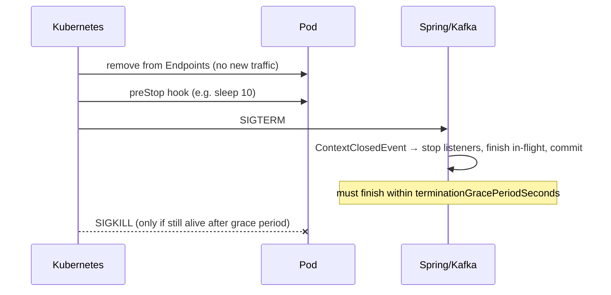
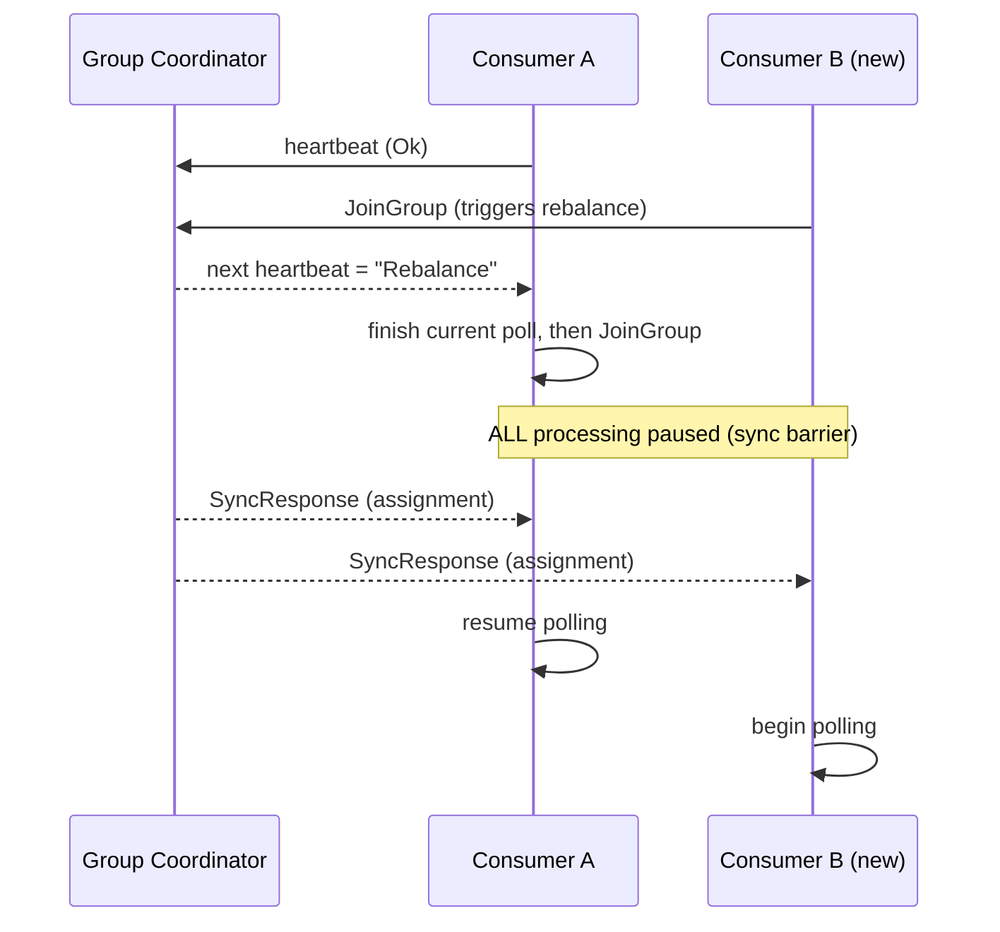

# Lifecycle & Operations

> Part of the **Kafka Engineering Guide** of `org-rd-fullstack-springboot-eda`. See the [project README](../README.md).

**Scope:** how a Spring Boot + Kafka service stops cleanly, how it survives consumer-group rebalances, and how listeners are paused, resumed and controlled at runtime — with the operational context for running it on Kubernetes/EKS or ECS.

## Table of contents

- [Overview](#overview)
- [JVM and Spring graceful shutdown](#jvm-and-spring-graceful-shutdown)
- [Signals, SIGTERM/SIGKILL and the Kubernetes pod lifecycle](#signals-sigtermsigkill-and-the-kubernetes-pod-lifecycle)
- [Stopping a Kafka consumer cleanly](#stopping-a-kafka-consumer-cleanly)
- [Consumer-group rebalances](#consumer-group-rebalances)
- [Mitigating rebalances](#mitigating-rebalances)
- [Pausing, resuming and controlling listeners at runtime](#pausing-resuming-and-controlling-listeners-at-runtime)
- [Scaling consumers vs partitions](#scaling-consumers-vs-partitions)
- [Health probes, readiness and traffic draining](#health-probes-readiness-and-traffic-draining)
- [EKS vs ECS/Pods operational considerations](#eks-vs-ecspods-operational-considerations)
- [How this project applies it](#how-this-project-applies-it)
- [Pitfalls & best practices](#pitfalls--best-practices)

## Overview

In an event-driven service the hardest moment is not when it starts — it is when it stops. A consumer that is killed mid-poll abandons in-flight work, may leave offsets uncommitted, and triggers a consumer-group rebalance that pauses processing for *every* member of the group. In an elastic environment (rolling updates, autoscaling, node drains, OOM kills) stops are frequent and expected, so graceful shutdown is a correctness requirement, not an optimization.

This guide ties together four concerns that must be designed as one:

1. **JVM/Spring shutdown** — stop accepting work, let in-flight work finish, release resources in the right order.
2. **Signal handling** — react to the platform's `SIGTERM` within the grace window before `SIGKILL`.
3. **Rebalance management** — minimise the number and impact of consumer-group rebalances.
4. **Runtime listener control** — pause/resume/stop consumption deliberately, independent of process shutdown.

The recurring design choice across all four is **disable auto-commit + acknowledge only after successful processing**: a stop at any point then simply replays the unacknowledged record (at-least-once), so no message is lost.

## JVM and Spring graceful shutdown

Spring Boot orchestrates an ordered shutdown when the `ApplicationContext` closes:

- `server.shutdown: graceful` lets the web server stop accepting new requests and finish in-flight ones.
- `spring.lifecycle.timeout-per-shutdown-phase` bounds how long each `SmartLifecycle` phase may take before Spring forces the next.
- Beans are torn down in reverse dependency order; `@PreDestroy` and `DisposableBean.destroy()` run; `SmartLifecycle.stop()` runs grouped by `getPhase()`.

A `ContextClosedEvent` is published as the context begins closing — the most convenient hook to flip a "shutting down" flag the rest of the application can observe.

```java
@Component
public class ShutdownFlag {
    private final AtomicBoolean shuttingDown = new AtomicBoolean(false);

    @EventListener
    public void onShutdown(ContextClosedEvent e) {
        shuttingDown.set(true);
    }

    public boolean isShuttingDown() {
        return shuttingDown.get();
    }
}
```

`SmartLifecycle` is the cleanest way to bind a resource's lifecycle to the context, and `getPhase()` controls ordering. Components that must stop **after** the Kafka listener containers (which sit at phase 0) should return a higher phase so they are stopped later:

```java
@Component
public class KafkaShutdownWatcher implements SmartLifecycle {
    private volatile boolean running = false;

    @Override public void start() { running = true; }
    @Override public void stop()  { running = false; /* clean up after listeners */ }
    @Override public boolean isRunning() { return running; }

    @Override public int getPhase() { return 1000; } // stopped after phase-0 containers
}
```

> Recommendation for a standard Spring Boot service: a global flag fed by `ContextClosedEvent`, plus a check inside the listener. It is readable, reliable and Spring-friendly. Reach for `consumer.wakeup()` / raw `KafkaConsumer` lifecycle management only when you own the poll loop yourself.

## Signals, SIGTERM/SIGKILL and the Kubernetes pod lifecycle

When the platform wants a pod gone (a `kubectl delete`, a scale-down, a rolling update, a node drain) the sequence is:

1. The pod is removed from the Service **Endpoints** (its readiness is treated as gone) so new traffic stops flowing to it.
2. The `preStop` hook runs (if configured).
3. The container's main process receives **`SIGTERM`**.
4. The platform waits up to `terminationGracePeriodSeconds` (default 30s).
5. If the process has not exited, it receives **`SIGKILL`** (uncatchable, immediate).

Spring Boot installs a JVM shutdown hook that closes the context on `SIGTERM`, which is what makes the graceful path above run. The grace period must be long enough for the longest realistic in-flight unit of work plus resource teardown.



The `preStop` `sleep` is deliberate: on a rolling update or scale-down there is a brief window between a pod being dropped from the Endpoints and the iptables/IPVS rules being updated on every node. A short sleep lets that network propagation finish before `SIGTERM`, avoiding requests routed to a draining pod.

> Note: `Signal.md` in the source set, despite its name, is about JavaScript/TypeScript async cancellation (`AbortController`, reentrancy guards) on the Nuxt side — it is not OS-signal handling and is out of scope for this guide.

## Stopping a Kafka consumer cleanly

A consumer poll loop will not respond to a thread `interrupt()` — `poll()` ignores it. Kafka's intended mechanism for breaking out of a blocking `poll()` is `consumer.wakeup()`, which raises a `WakeupException` on the polling thread (and is thread-safe, so it can be called from another thread such as a shutdown event). Spring Kafka's listener containers manage this for you: when the context closes, containers stop, wake their consumers, finish the current batch, and close.

The guarantees you actually want on shutdown are about offsets, not threads:

| Acknowledgment mode | What Spring Kafka does | Redelivered after a stop? |
| --- | --- | --- |
| Auto-commit (`enable.auto.commit=true`) | Commits periodically/automatically | No — risk of message **loss** |
| `BATCH` / `TIME` / `COUNT` ack | Periodic commit | No — possible loss |
| `MANUAL` / `MANUAL_IMMEDIATE`, ack called | Commit on `ack.acknowledge()` | No (already processed) |
| `MANUAL` / `MANUAL_IMMEDIATE`, **ack not called** | No commit | **Yes** — replayed on next start |

The rule that follows: **never auto-commit, and never acknowledge on shutdown.** If a stop arrives, just return without acking; Kafka redelivers the record to whichever consumer next owns the partition.

```java
@KafkaListener(id = "consumerA", topics = "demo", containerFactory = "kafkaListenerContainerFactory")
public void listen(String message, Acknowledgment ack) {
    if (shutdownFlag.isShuttingDown()) {
        // No ack → not committed → Kafka replays this record later. No loss.
        log.warn("Shutdown imminent — record NOT acked, will be replayed.");
        return;
    }
    process(message);
    ack.acknowledge(); // MANUAL_IMMEDIATE: committed immediately
}
```

`MANUAL_IMMEDIATE` commits as soon as `acknowledge()` is called, which is the most predictable behaviour under frequent restarts. Producers must flush before exit; Spring closes the `KafkaTemplate` on context shutdown, which triggers a `flush()`, but an explicit `@PreDestroy { kafkaTemplate.flush(); }` makes it deliberate.

Useful Spring Kafka events around the consumer lifecycle:

- `org.springframework.context.event.ContextClosedEvent` — shutdown beginning (just after `SIGTERM`).
- `org.springframework.kafka.listener.ListenerContainerIdleEvent` — fires when a container is idle for `idleEventInterval`; lets you react (e.g. stop a container) even with no messages flowing.
- `org.springframework.kafka.event.ConsumerStoppedEvent` (Spring Kafka 2.8+/2.9+) — a consumer has stopped.
- `ConsumerAwareRebalanceListener.onPartitionsRevokedBeforeCommit(...)` — last chance to commit/clean up before partitions are revoked, which is exactly what precedes a rebalance or a pod shutdown.

## Consumer-group rebalances

A **consumer group** shares a `group.id`; the group's partitions are distributed across its members. Group membership is tracked broker-side by the **Group Coordinator**; the actual partition→consumer assignment is computed client-side by an elected group **leader**. Key invariant: **within a group, a partition is consumed by exactly one member at a time.** More members than partitions means the surplus members are idle.

A **rebalance** reassigns partitions across the group. It is triggered when:

- a new consumer joins (`JoinGroup`),
- a consumer leaves (`LeaveGroup`),
- the coordinator believes a consumer failed (missed heartbeat or missed `poll()`),
- resources otherwise change (e.g. a pattern subscription matches a newly created topic).

Two timeouts decide whether a consumer is considered healthy:

| Config | Meaning | Default (Kafka ≥ 3.0) |
| --- | --- | --- |
| `session.timeout.ms` | A heartbeat must reach the coordinator within this window, else the consumer is evicted. | 45 s |
| `heartbeat.interval.ms` | How often the consumer heartbeats (on a **separate** thread). Keep ≤ 1/3 of session timeout. | 3 s |
| `max.poll.interval.ms` | Max time between `poll()` calls on the **processing** thread before the consumer is considered failed. | 5 min |

Heartbeats run on a background thread; processing runs on the main thread which must call `poll()` within `max.poll.interval.ms`. So a **hard failure** (whole app dies → no heartbeat) is detected by `session.timeout.ms`, while a **stuck processing thread** (heartbeats still flowing but no poll) is detected by `max.poll.interval.ms`. `max.poll.interval.ms` is effectively the health check on your business processing.

A subtle trap: if several consumers with **mutually exclusive topics share one `group.id`**, a rebalance triggered by *any* one of them revokes and reassigns *all* assignments in the group, including the unrelated ones. Prefer distinct groups per logical consumer, e.g. `[service]-[topic]-consumer-group`.

### Rebalance strategies

**Eager rebalance (default).** All consumers stop processing while partitions are reassigned. The group stabilises at a "synchronisation barrier", a leader computes assignments, and processing resumes. Simple, but the pause grows with group size.



**Incremental / cooperative rebalance.** Configured with the `CooperativeStickyAssignor` (`partition.assignment.strategy`). Existing consumers keep processing during the rebalance; only the *specific* partitions that must move are revoked, over two protocol rounds. Higher total latency (two rounds) but far smaller impact — partitions that don't move are never interrupted.

### Rebalance risks

- **Duplicate messages.** A consumer evicted for exceeding a timeout may still finish processing its batch, but its offset commit is rejected (the rebalance bumps the generation id). A new owner then reprocesses the same records. Consumers must be idempotent.
- **Rebalance storms.** If a slow downstream makes consumers repeatedly exceed `max.poll.interval.ms`, each one is evicted, rejoins, and triggers yet another rebalance — rebalance after rebalance. Static membership and cooperative rebalancing help, but the configurations must still be tuned.

## Mitigating rebalances

- **Cooperative sticky assignor** — keep unaffected partitions live during a rebalance.
- **Static group membership** — set a stable `group.instance.id` per consumer. The coordinator maps it to the internal `member.id`; a static member that disappears is **not** removed until `session.timeout.ms` elapses, and a restart with the same id is recognised as the *same* member, so **no rebalance** is triggered and its partitions are handed back. Tie `group.instance.id` to the pod identity (e.g. the StatefulSet ordinal) so a pod restart avoids a costly rebalance. This is especially valuable when the consumer holds in-memory state (e.g. stateful retry counts) that a rebalance would otherwise lose.
  - Trade-off: with a static member down, its partitions sit unconsumed until `session.timeout.ms` expires. Too long → failed consumers strand partitions; too short → restarts can't rejoin in time and a rebalance fires anyway.
- **Right-size `max.poll.interval.ms` and `max.poll.records`** — bound the batch so processing always finishes within the interval. Too low → premature eviction and duplicates; too high → slow detection of genuinely dead consumers.
- **Tune heartbeat/session** — frequent heartbeats with `heartbeat.interval.ms ≤ session.timeout.ms / 3` survive transient network blips.
- **Separate consumer groups** for consumers on unrelated topics.

```yaml
# Illustrative consumer tuning for a restart-heavy environment
spring:
  kafka:
    consumer:
      enable-auto-commit: false
      properties:
        partition.assignment.strategy: org.apache.kafka.clients.consumer.CooperativeStickyAssignor
        group.instance.id: ${POD_NAME}        # static membership
        max.poll.records: 50
        max.poll.interval.ms: 300000          # 5 min — ≥ worst-case batch processing
        heartbeat.interval.ms: 1000
        session.timeout.ms: 10000
    listener:
      ack-mode: MANUAL_IMMEDIATE
```

## Pausing, resuming and controlling listeners at runtime

You cannot turn a `@KafkaListener` annotation off at runtime, but you can drive the underlying **MessageListenerContainer** through the `KafkaListenerEndpointRegistry`. Give the listener a stable `id`, then look the container up by id:

```java
@KafkaListener(id = "myConsumerId", topics = "my-topic")
public void listen(String message) { /* ... */ }

@Service
public class KafkaControlService {
    private final KafkaListenerEndpointRegistry registry;
    KafkaControlService(KafkaListenerEndpointRegistry registry) { this.registry = registry; }

    public void pause()  { registry.getListenerContainer("myConsumerId").pause();  }
    public void resume() { registry.getListenerContainer("myConsumerId").resume(); }
    public void stop()   { registry.getListenerContainer("myConsumerId").stop();   }
}
```

`pause()` vs `stop()` is the critical distinction:

| Method | Effect on the consumer | Effect on Kafka |
| --- | --- | --- |
| `pause()` | Stops requesting records in `poll()`, but the consumer stays alive and keeps heartbeating. | Member stays in the group — **no rebalance**. |
| `stop()` | Stops the container entirely. | Member leaves the group — **triggers a rebalance**. |

So for "stop consuming for a while without disturbing the group", use `pause()`/`resume()`. Because heartbeats continue, the broker treats it as a member taking a nap; the session timeout is not at risk.

## Scaling consumers vs partitions

Kafka parallelism for a consumer group is capped by **partition count**, not by pod or thread count:

- A topic with *N* partitions supports at most *N* actively-consuming members in one group.
- Adding pods (or container `concurrency`) beyond *N* leaves the extra consumers idle.
- Threads inside one process add Kafka-level parallelism only if mapped to independent partitions — which is exactly what Spring's `ConcurrentMessageListenerContainer` concurrency does (one consumer per thread, up to the partition count).

So to scale throughput you increase partitions **and** consumers together. Autoscaling consumers should be driven by **consumer lag**, not CPU/memory — CPU-based HPA does not reflect a backlog. The Kubernetes HPA only knows CPU/memory out of the box, so lag-based scaling needs either a Prometheus-adapter chain (Prometheus scrapes lag → adapter → External Metrics → HPA) or, more directly, **KEDA**, whose Kafka scaler reads consumer-group lag and computes `desiredReplicas = totalLag / lagThreshold`, and can even scale to zero when idle:

```yaml
apiVersion: keda.sh/v1alpha1
kind: ScaledObject
metadata:
  name: demo-kafka-scaledobject
spec:
  scaleTargetRef:
    name: demo
  pollingInterval: 60
  cooldownPeriod: 300
  minReplicaCount: 0
  maxReplicaCount: 10        # keep ≤ partition count to avoid idle consumers
  triggers:
    - type: kafka
      metadata:
        consumerGroup: demo.consumer-group.id
        bootstrapServersFromEnv: KAFKA_BOOTSTRAP_SERVERS
        lagThreshold: "1000"           # desiredReplicas = totalLag / lagThreshold
        activationLagThreshold: "3000" # lag must exceed this to scale up from 0
```

Each scale event is itself a rebalance, so combine lag-based autoscaling with cooperative/static membership and a sane `cooldownPeriod` to avoid thrash.

## Health probes, readiness and traffic draining

Spring Boot Actuator exposes Kubernetes-aligned probe endpoints; the application also models availability explicitly via `AvailabilityChangeEvent`/`LivenessState`/`ReadinessState`.

| Probe | Question | On failure |
| --- | --- | --- |
| **startup** | Has the app finished booting? | Liveness/readiness are *suppressed* until it passes — prevents killing a slow-to-start JVM. |
| **liveness** | Is the process healthy (not deadlocked)? | Pod is **restarted**. |
| **readiness** | Can it accept traffic? | Pod is **removed from Endpoints** (no restart). |

```yaml
management:
  endpoint:
    health:
      probes:
        enabled: true
  health:
    livenessstate:  { enabled: true }
    readinessstate: { enabled: true }
```

```yaml
startupProbe:
  httpGet: { path: /actuator/health/liveness, port: 8080 }
  failureThreshold: 30
  periodSeconds: 2
livenessProbe:
  httpGet: { path: /actuator/health/liveness, port: 8080 }
  periodSeconds: 10
  failureThreshold: 3
  timeoutSeconds: 5
readinessProbe:
  httpGet: { path: /actuator/health/readiness, port: 8080 }
  periodSeconds: 5
  failureThreshold: 3
  timeoutSeconds: 5
```

Operationally: a fast readiness probe means that as soon as a shutdown begins, readiness flips to `REFUSING_TRAFFIC`, the pod leaves the Endpoints, and (for HTTP) traffic stops immediately. For Kafka the consumer still needs to finish its poll and not ack on the way out. The number-one cause of `CrashLoopBackOff` with Spring Boot is omitting the startup probe, so liveness kills the JVM before it finishes booting. The number-two trap is coupling readiness too tightly to a shared dependency (e.g. the DB) — a transient DB blip then yanks every pod out of rotation at once.

## EKS vs ECS/Pods operational considerations

Both run the same container image; the lifecycle model and controls differ.

| Concern | EKS (Kubernetes) | ECS (Fargate/EC2) |
| --- | --- | --- |
| Deploy unit | Deployment → Pod | Service → Task |
| Config format | YAML manifests / Helm (portable) | `task-definition.json` (AWS-specific) |
| Network entry | Service + Ingress/ALB | ALB target group |
| Graceful stop | `terminationGracePeriodSeconds` + `preStop` hook | `stopTimeout` (no preStop hook) |
| Health model | startup + liveness + readiness probes | container `healthCheck` (liveness-like) + ALB health check (readiness-like) |
| Lifecycle philosophy | Pods are **ephemeral** by design; many self-healing mechanisms reschedule/restart them | Task runs until it crashes or is told to stop — Docker-like, more predictable |

Kubernetes is not inherently less stable than ECS; it simply has more automated mechanisms that can stop/restart a pod — aggressive liveness probes, `OOMKill` from tight `limits.memory`, node-pressure eviction, cluster-autoscaler node draining, preemption, and more aggressive rolling-update defaults. A pod that "restarts a lot" is almost always a calibration problem (probe thresholds, resource requests/limits), not an EKS defect. Counter-measures: generous probe thresholds and a startup probe, resource requests/limits based on real metrics, Pod Disruption Budgets to cap simultaneous evictions, and a properly sized `terminationGracePeriodSeconds`. Because pods are ephemeral, design the consumer to tolerate being stopped at any instant — which is exactly the at-least-once + no-ack-on-shutdown design above.

ECS maps `terminationGracePeriodSeconds` to `stopTimeout`, splits "liveness" (container `healthCheck`) from "readiness" (ALB health check), and has no preStop hook or fine-grained probes. It is closer to `docker run --restart=always`, so the Docker→ECS transition is gentle; EKS demands the Kubernetes mental model but gives portability and a far larger ecosystem (Helm, ArgoCD, KEDA, Prometheus). For a single AWS-centric workload ECS is the faster start; for multi-cloud portability, lag-based event autoscaling, and fine lifecycle control, EKS is the stronger fit.

Useful operational metrics (Actuator/Prometheus): `kafka_consumer_records_lag_max` (the single most important one), `kafka_consumer_rebalance_total`, `kafka_listener_seconds_max`, `kafka_consumer_poll_time_max`, `kafka_listener_failures_total`.

## How this project applies it

- **Graceful JVM/Spring shutdown** is configured in [`application.yml`](../src/main/resources/application.yml): `server.shutdown: graceful`, `spring.lifecycle.timeout-per-shutdown-phase: 45s`, and `spring.main.cloud-platform: kubernetes` (which makes Spring activate the liveness/readiness availability states). Actuator exposes `info,health,prometheus`.
- **At-least-once, no-loss consumption** lives in [`PipelineSrv`](../src/main/java/org/rd/fullstack/springbooteda/srv/PipelineSrv.java): the `@KafkaListener(... groupId = KafkaConstants.CST_TOPIC_GROUP)` `listen(...)` method processes the record via a transactional processor and calls `ack.acknowledge()` **only after** success. A stop or crash before that point replays the record. The `@PostConstruct registerDltRetryListener()` hook attaches a `RetryListener` to the shared `DefaultErrorHandler`, so a record that exhausts its bounded retries is routed to the DLT and counted exactly once.
- **Manual-immediate acknowledgment and bounded polling** are set in [`KafkaConfig`](../src/main/java/org/rd/fullstack/springbooteda/config/KafkaConfig.java): the `kafkaListenerContainerFactory` uses `AckMode.MANUAL_IMMEDIATE`, `enable.auto.commit=false`, `isolation.level=read_committed`, and `max.poll.records=10` (`KafkaConstants.CST_MAX_POLL_RECORDS`) so that even with the optional 500 ms per-record latency a batch cannot blow past `max.poll.interval.ms` and force a rebalance. Container concurrency defaults to 3 (`CST_NBR_CONCURRENCY`).
- **Ordered, drain-aware resource teardown** is implemented in [`KafkaSandbox.stop()`](../src/main/java/org/rd/fullstack/springbooteda/util/kafka/KafkaSandbox.java): monitors are stopped, then listener containers are `stop()`-ped and given time to drain in-flight error handlers (`Thread.sleep(CST_POLL_DURATION)`) before being `destroy()`-ed, then templates and producers are `flush()`-ed and closed, then the AdminClient and broker are torn down. `KafkaSandbox` implements `AutoCloseable`, and creation paths guard against leaking a producer/container if the sandbox is stopped concurrently. Its `seekConsumerGroupOffsets(...)` deliberately uses `assign()` (not `subscribe()`) for admin offset management so it does **not** join the group or trigger a rebalance.
- **A generic lifecycle bean**, [`SmartLifecycleSrv`](../src/main/java/org/rd/fullstack/springbooteda/srv/SmartLifecycleSrv.java), implements `SmartLifecycle` with an `AtomicBoolean` running flag — the hook point for binding additional start/stop ordering to the context lifecycle.
- **Readiness/liveness control** is exposed by [`HealthController`](../src/main/java/org/rd/fullstack/springbooteda/controller/HealthController.java): `POST /api/liveness_state_{up,down}` and `POST /api/readiness_state_{up,down}` publish `AvailabilityChangeEvent`s (`LivenessState.BROKEN/CORRECT`, `ReadinessState.REFUSING_TRAFFIC/ACCEPTING_TRAFFIC`). Flipping readiness down is how a node signals "draining" so EKS stops routing to it. The same controller serves `/api/kafkaDashboardData`, which surfaces consumer-group **lag** computed in `KafkaSandbox.getDashboardData()` (via `GroupLagSummary`) — the input an operator or a KEDA scaler would watch.
- **Runtime listener control surface.** The REST entry point [`PipelineController`](../src/main/java/org/rd/fullstack/springbooteda/controller/PipelineController.java) currently exposes `start`/`reset`/`getState`/`setState` for the pipeline; there is no `pause`/`resume` endpoint yet. To add runtime pause/resume, inject a `KafkaListenerEndpointRegistry` and drive the container behind the listener `id` as shown in [Pausing, resuming and controlling listeners](#pausing-resuming-and-controlling-listeners-at-runtime).

## Pitfalls & best practices

- **Never auto-commit; never ack on shutdown.** Auto-commit (or `BATCH`/`TIME`/`COUNT` ack) can commit a record you have not finished, losing it on a stop. Acknowledge only after committed processing.
- **Always make processing idempotent.** Rebalances and timeouts can deliver duplicates; the application must tolerate them.
- **Bound the batch.** Keep `max.poll.records` × per-record time well under `max.poll.interval.ms`, or slow processing will trigger eviction and a rebalance.
- **Don't share one `group.id` across unrelated topics** — one slow consumer rebalances the whole group. Use `[service]-[topic]-consumer-group`.
- **Set the grace window to the real worst case.** `terminationGracePeriodSeconds` (EKS) / `stopTimeout` (ECS) must exceed the longest in-flight unit plus teardown; in this project align it with `timeout-per-shutdown-phase: 45s`.
- **Use a `preStop` sleep on EKS** to absorb Endpoints/iptables propagation delay before `SIGTERM`.
- **Add a startup probe** for Spring Boot, and keep liveness/readiness thresholds generous — the top cause of `CrashLoopBackOff`.
- **Don't over-couple readiness to shared dependencies**, or one DB blip drops every replica from rotation simultaneously.
- **`pause()` to investigate, `stop()` to leave the group.** `pause()` keeps heartbeating (no rebalance); `stop()` triggers one.
- **Scale on lag, not CPU**, and keep replicas ≤ partitions; pair autoscaling with cooperative/static membership and a cooldown to avoid rebalance storms.
- **Prefer cooperative sticky + static membership** for restart-heavy deployments to cut rebalance count and impact.
