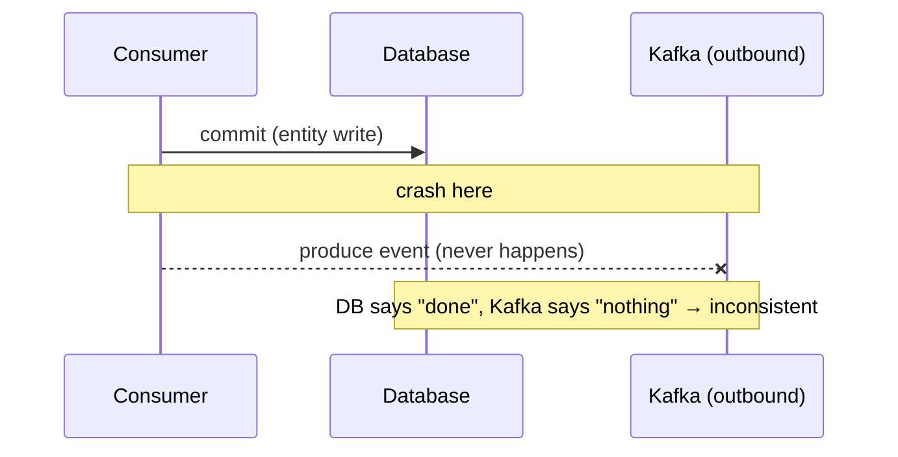
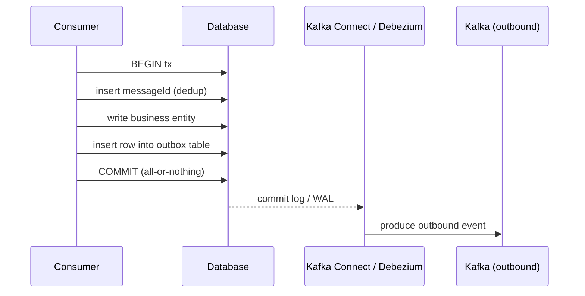

# Persistence & Transaction Patterns

> Part of the **Kafka Engineering Guide** of `org-rd-fullstack-springboot-eda`. See the [project README](../README.md).

**Scope:** how to process Kafka messages safely against a database — making consumers idempotent, avoiding the dual-write problem with the transactional outbox pattern, and using transaction isolation and locking to prevent lost-update / write-skew race conditions. The project's inventory credit/debit pipeline is the running example.

## Table of contents

- [Overview](#overview)
- [The dual-write / double-commit problem](#the-dual-write--double-commit-problem)
- [The idempotent consumer pattern](#the-idempotent-consumer-pattern)
- [Deduplication strategies](#deduplication-strategies)
- [The transactional outbox pattern](#the-transactional-outbox-pattern)
- [Exactly-once-ish: what is actually guaranteed](#exactly-once-ish-what-is-actually-guaranteed)
- [Database locking and race conditions](#database-locking-and-race-conditions)
- [Spring transaction management](#spring-transaction-management)
- [An accounting aside: double-entry, debit and credit](#an-accounting-aside-double-entry-debit-and-credit)
- [How this project applies it](#how-this-project-applies-it)
- [Pitfalls & best practices](#pitfalls--best-practices)
- [Sources & further reading](#sources--further-reading)

## Overview

Distributed messaging with Kafka is **at-least-once** by default. A consumer can see the same message more than once (poll timeouts, rebalances, a non-idempotent producer retrying), and a producer can write a duplicate event after a transient failure. To keep data correct under these conditions, three concerns must be addressed together:

- **Idempotency** — processing the same message twice must leave the system in the same state as processing it once.
- **Atomic state change + publish** — a single message often updates the database *and* emits a new event; both must commit together or not at all (the dual-write problem).
- **Concurrency control** — several messages (or several consumer threads) touching the same row must not corrupt it through a check-then-act race.

This guide covers each concern, then shows where the project already satisfies it and where it deliberately leaves a known race in place for teaching purposes.

## The dual-write / double-commit problem

A consumer that writes to two systems in one logical step — for example, `INSERT` a row in the database **and** `produce` an event to Kafka — performs a *dual write*. The two writes belong to two different transactional resources (a DB transaction and a Kafka transaction) that **cannot be committed atomically**.

If the process dies between the two commits, the resources are left inconsistent:

- DB committed, event not published → downstream never learns about the change.
- Event published, DB rolled back → downstream acts on a change that does not exist.

A two-phase commit (2PC) across Kafka and the database — e.g. a chained transaction manager — *looks* like a fix, but the sources are explicit that it can still fail in certain windows, leaves resources inconsistent, and adds latency to every transaction. The `ChainedKafkaTransactionManager` sketch in [DoubleCommit.txt](./source/DoubleCommit.txt) illustrates the chaining approach; it narrows the window but does not make the two commits atomic.



The robust solution is to avoid the dual write entirely: write everything to **one** transactional resource (the database) and let a separate mechanism relay the event. That is the transactional outbox pattern.

## The idempotent consumer pattern

An idempotent consumer can consume the same message any number of times but only *processes* it once. The recommended implementation tracks processed messages in the database:

1. Each message carries a unique `messageId` (in the payload or a Kafka header), assigned by the producer.
2. On consume, the consumer checks a `processed_messages` table for that id.
3. If present → it is a duplicate; update offsets to mark it consumed and do nothing else.
4. If absent → begin a DB transaction, insert the id, run the business logic, commit.

The id insert and the business writes share **one** transaction, so they are atomic: either both land or both roll back.

### Flush strategy matters

The subtlety is *when* the unique-constraint conflict on `messageId` is detected. With Hibernate's default transactional write-behind, the flush happens at commit time, so two duplicates processing in parallel can both run their full business logic and only the loser fails at commit — after side effects (e.g. an external REST call) have already happened twice.

Flushing at the point of save (`saveAndFlush`) changes this: the second transaction blocks on the row lock as soon as it tries to insert the duplicate id, and is aborted before doing redundant work.

```java
private void deduplicate(UUID eventId) throws DuplicateEventException {
    try {
        // flush immediately so the unique-key conflict surfaces now,
        // not at commit time
        processedEventRepository.saveAndFlush(new ProcessedEvent(eventId));
    } catch (DataIntegrityViolationException e) {
        throw new DuplicateEventException(eventId);
    }
}
```

This is the recommended approach because it minimises duplicate *actions*, not just duplicate *commits*.

## Deduplication strategies

The sources lay out three patterns and what each leaves duplicated across failure points:

| Pattern | Mechanism | Residual duplicate risk |
|---|---|---|
| **Idempotent consumer** | Processed-id table + locking flush, in the business transaction | A non-rollbackable side effect (e.g. external POST) before the failure point |
| **Transactional outbox** | Outbound event written to an outbox table in the same DB transaction; relayed by CDC | None for the outbound event; the upstream POST can still duplicate |
| **Kafka transactions** | Exactly-once across consume → process → produce via the transaction log | The consume + process steps can still repeat; cannot be safely combined with the idempotent-consumer table |

Key constraints from the sources:

- The DB transaction and the Kafka transaction **cannot** be committed atomically; combining the idempotent consumer with Kafka transactions risks data loss in some orderings.
- The idempotent consumer and the transactional outbox **can** be combined, and that combination is the recommended "gold standard".
- No pattern can make an upstream non-idempotent POST safe — that third-party call must be made idempotent on its own (e.g. an idempotency key honoured by the callee).

The general-purpose tool is an **idempotency key**: a deterministic, message-derived identifier that a downstream operation uses to recognise and collapse repeats. The processed-message table is one realisation of it.

## The transactional outbox pattern

Instead of publishing to Kafka directly, the consumer writes the outbound event as a row in an **outbox table**, inside the same database transaction as the business writes (and, when combined, the processed-id insert). A separate relay then publishes those rows to Kafka.



Because the outbox write is part of the DB transaction, the consume, the business writes, and the intent-to-publish are atomic. The relay options:

- **CDC with Kafka Connect / Debezium** (recommended): the connector reads the database commit log, transforms the outbox row, and writes it to the outbound topic. It inherits Kafka's resilience, fault tolerance and scalability.
- **A simple poller** reading the outbox table and producing to Kafka — workable, but you reimplement what Connect already provides.

**Ordering of commits** is load-bearing. The DB transaction must commit *before* the consumer offsets are written. If offsets were committed first and the process died before the DB commit, the message would not be redelivered and both the entity write and the outbound event would be lost. Conversely, if the consumer dies after the DB commit but before offsets are written, the message is redelivered and the processed-id check deduplicates it.

## Exactly-once-ish: what is actually guaranteed

True end-to-end exactly-once across a DB and Kafka is not achievable without atomic 2PC, which is not available here. What the patterns deliver is **effectively-once** processing:

- At-least-once delivery (Kafka redelivers on failure) **+** idempotent processing (dedup) ⇒ the observable effect is once.
- The transactional outbox guarantees the **outbound event** is published exactly once relative to the committed state.
- A residual at-least-once action (the upstream POST) remains; it is pushed onto the callee to make idempotent.

In this project the "effectively-once" guarantee comes from idempotency in the processor rather than an outbox: [`PipelineProcessorSrv`](../src/main/java/org/rd/fullstack/springbooteda/srv/PipelineProcessorSrv.java) skips any request whose `result` is no longer `PENDING`/`BACK_ORDER`, so a redelivered message is recognised as already handled.

## Database locking and race conditions

Idempotency stops *duplicate* processing. It does **not** stop a **lost-update** race between two *distinct* messages that both modify the same row. The classic shape is **check-then-act** (also TOCTOU — time-of-check to time-of-use):

```text
1. read qty
2. check qty >= requested
3. relative decrement: qty = qty - requested
```

Two threads can both pass step 2 on the same stale read, then both apply step 3, producing a value below zero — a silent oversell.

### The control mechanisms

The RDBMS offers complementary tools (see [rdbms-locking.md](./source/rdbms-locking.md)):

- **Pessimistic locking** — lock the row on read so others wait. In SQL, `SELECT ... FOR UPDATE`; in JPA, `@Lock(LockModeType.PESSIMISTIC_WRITE)`. Strict consistency, lower concurrency.

  ```sql
  SELECT * FROM inventory WHERE inventory_id = 10 FOR UPDATE;
  ```

- **Optimistic locking** — a `@Version` column; the update only succeeds if the version is unchanged, otherwise the application retries. Great for read-heavy, low-contention workloads.

  ```sql
  UPDATE inventory SET qty = :new, version = version + 1
   WHERE inventory_id = 5 AND version = 3;
  -- 0 rows updated ⇒ someone else changed it ⇒ retry
  ```

- **Atomic conditional update** — fold the check into the write so the database evaluates the guard atomically under its own row lock. No application-visible version, no explicit lock:

  ```sql
  UPDATE inventory SET qty = qty - :qty
   WHERE inventory_id = :id AND qty >= :qty;
  -- returns affected-row count: 1 = success, 0 = insufficient stock (BACK_ORDER)
  ```

### Isolation level changes the symptom

The race's *visibility* depends on the engine's concurrency family, not just on the code. As analysed in [RaceCondition.md](./source/RaceCondition.md):

| Engine / mode | Behaviour on two concurrent same-row updates | Symptom |
|---|---|---|
| HSQLDB default (`LOCKS`, table-level 2PL) | Writer locks the whole table; the other reader blocks until commit, then reads fresh | Race **masked** — second check sees the new value, `BACK_ORDER` |
| HSQLDB / H2 `MVCC` | Second writer detects a write conflict | Serialization failure (`40001` / `90131`) → retry, **not** a silent negative |
| PostgreSQL / MySQL InnoDB `READ_COMMITTED` | Second `UPDATE` blocks, then re-applies the relative decrement on the fresh value | **Silent oversell** — `qty` goes negative |

This is why the project runs correctly on HSQLDB despite the bug: HSQLDB's default table locking serialises writers and *accidentally* makes the check-then-act atomic. The same code on PostgreSQL `READ_COMMITTED` would silently oversell.

## Spring transaction management

Spring exposes the same DB transaction in several styles (see [TransactionManagement.md](./source/TransactionManagement.md)):

| Approach | Simplicity | Fine control | When |
|---|---|---|---|
| `@Transactional` | high | low | ~90% of cases |
| `TransactionTemplate` | medium | medium | precise transactional blocks |
| `PlatformTransactionManager` directly | low | high | partial commits, very fine control |
| `EntityManager.getTransaction()` | lowest | medium | pure JPA, no Spring container |

Two attributes matter most:

- **Propagation** — e.g. `REQUIRED` joins an existing transaction or starts one. Note the *self-invocation* trap: calling a `@Transactional` method via `this.method(...)` bypasses the Spring AOP proxy and silently disables the transaction. The project sidesteps this by putting the transactional logic in a dedicated bean (`PipelineProcessorSrv`) invoked from the pipeline, not as a same-class method call.
- **Isolation** — `READ_COMMITTED` is the common default; it does **not** prevent lost updates, so concurrency must be handled by locking or an atomic conditional update (above), not by isolation alone (short of `SERIALIZABLE`).

`@Modifying` JPQL updates (relative `SET qty = qty ± :qty`) run as bulk updates and must execute inside a transaction; they bypass the persistence context, which is why the processor calls `flush()` and why a `clearAutomatically = true` is used on the blanket refill.

## An accounting aside: double-entry, debit and credit

The inventory naming mirrors double-entry bookkeeping (see [comptable.md](./source/comptable.md)). Inventory is an **asset** account, and for assets the rule (mnemonic *DEAD CLIC* — **D**ebit increases **E**xpenses/**A**ssets/**D**ividends) is:

| Operation | Effect on inventory (an asset) | Project method |
|---|---|---|
| **Debit** | increases the balance | `debitQTY` → `qty + :qty` |
| **Credit** | decreases the balance | `creditQTY` → `qty - :qty` |

So in this project `DEBIT` *adds* stock and `CREDIT` *removes* it — consistent with accounting, even though it can read as counter-intuitive. The double-entry discipline (every change balanced, never partial) is the bookkeeping analogue of an atomic transaction: the engineering goal is the same invariant — the balance must never be corrupted by a partial or concurrent write.

## How this project applies it

Relevant files (all verified to exist):

- [`PipelineProcessorSrv`](../src/main/java/org/rd/fullstack/springbooteda/srv/PipelineProcessorSrv.java)
- [`InventoryRepository`](../src/main/java/org/rd/fullstack/springbooteda/dao/InventoryRepository.java)
- [`Inventory`](../src/main/java/org/rd/fullstack/springbooteda/dto/Inventory.java)
- [`Request`](../src/main/java/org/rd/fullstack/springbooteda/dto/Request.java)
- [`InventoryController`](../src/main/java/org/rd/fullstack/springbooteda/controller/InventoryController.java)
- [`application.yml`](../src/main/resources/application.yml), [`schema.sql`](../src/main/resources/schema.sql)

### Idempotent processing

`PipelineProcessorSrv.process(...)` is annotated `@Transactional(propagation = REQUIRED, isolation = READ_COMMITTED)` and begins with an idempotency guard:

```java
if ((request.getResult() != Result.PENDING) &&
    (request.getResult() != Result.BACK_ORDER))
    return; // already handled → skip
```

Because the request's `result` is flipped to `EXECUTED`/`BACK_ORDER`/`ERROR` and persisted in the same transaction, an at-least-once redelivery (retry or rebalance) re-reads a non-`PENDING` request and is safely skipped. The request row itself acts as the processed-message marker — a lightweight idempotent-consumer variant without a separate dedup table. To keep the proxy effective, the logic lives in its own bean so `@Transactional` is honoured.

### The documented inventory race

The `CREDIT` branch is a textbook check-then-act:

```java
Optional<Inventory> inv = inventoryRepository.findByProductId(request.getProductId()); // 1) unlocked read
...
if (inventory.getQty() < request.getQty()) {  // 2) application check
    request.setResult(Result.BACK_ORDER); ... return;
}
inventoryRepository.creditQTY(request.getQty(), inventory.getInventoryId());           // 3) relative decrement
```

`findByProductId` takes **no lock**, [`Inventory`](../src/main/java/org/rd/fullstack/springbooteda/dto/Inventory.java) has **no `@Version`**, and the isolation is `READ_COMMITTED`. The relative decrements live in [`InventoryRepository`](../src/main/java/org/rd/fullstack/springbooteda/dao/InventoryRepository.java):

```java
@Modifying @Query("UPDATE Inventory inv SET inv.qty = (inv.qty - :qty) WHERE inv.inventoryId = :id")
int creditQTY(@Param("qty") Long qty, @Param("id") Long id);   // CREDIT: subtract

@Modifying @Query("UPDATE Inventory inv SET inv.qty = (inv.qty + :qty) WHERE inv.inventoryId = :id")
int debitQTY(@Param("qty") Long qty, @Param("id") Long id);    // DEBIT: add
```

Nothing in the code prevents two concurrent `CREDIT`s for the same product from both passing the check and overselling. It is masked today only by HSQLDB's table-level locking; on PostgreSQL `READ_COMMITTED` it would oversell silently.

### Mitigations (in order of preference)

1. **Kafka key = `productId`** — all messages for a product land on one partition and are processed sequentially by a single thread, so there is no concurrency on that inventory row, *regardless of the database*. This is the project-level fix and ties directly to the partitioning guidance in the broader guide.
2. **Atomic conditional update** — fold the guard into the write; no lock, no version:

   ```java
   @Modifying
   @Query("UPDATE Inventory i SET i.qty = i.qty - :qty WHERE i.inventoryId = :id AND i.qty >= :qty")
   int tryCredit(@Param("qty") Long qty, @Param("id") Long id);
   // tryCredit(...) == 0  → insufficient stock → BACK_ORDER
   ```
3. **Pessimistic lock** — `@Lock(LockModeType.PESSIMISTIC_WRITE)` on `findByProductId` (`SELECT ... FOR UPDATE`).
4. **Optimistic lock** — add `@Version` to `Inventory` and retry on `OptimisticLockException`.
5. **DB safety net** — a `CHECK (qty >= 0)` constraint so the faulty update fails and the message goes to the DLT.

### Multi-step controller writes

Controllers that mutate several rows (multi-step update/delete) and the blanket `@Modifying` `refillAll`/reset operations are wrapped in `@Transactional` so a partial change cannot be left committed — the multi-write atomicity principle applied at the API edge. See [`InventoryController`](../src/main/java/org/rd/fullstack/springbooteda/controller/InventoryController.java) and `refillAll` in [`InventoryRepository`](../src/main/java/org/rd/fullstack/springbooteda/dao/InventoryRepository.java).

## Pitfalls & best practices

- **Don't rely on the database to mask races.** "Accidentally correct" on HSQLDB is not correct on PostgreSQL. Make the code safe independently of the engine (atomic conditional update is the cleanest).
- **`READ_COMMITTED` does not prevent lost updates.** Use a lock, a version, or an atomic guarded update — not a higher isolation level as a reflex.
- **Avoid 2PC across Kafka and the DB.** Prefer the transactional outbox; if you must chain, understand it does not give atomicity.
- **Order commits correctly.** DB commit before offset commit (outbox); business-transaction commit before offset commit (idempotent consumer). Wrong order = data loss.
- **Flush the dedup insert early** (`saveAndFlush`) so duplicate detection blocks redundant work instead of failing at commit.
- **Make upstream non-idempotent calls idempotent** via an idempotency key the callee honours; no consumer pattern can fully remove the duplicate-POST risk.
- **Beware Spring self-invocation.** `@Transactional` only applies through the proxy — keep transactional logic in a separate bean (as `PipelineProcessorSrv` does).
- **Use a Kafka key when per-entity ordering matters.** Keying by `productId` serialises per-product processing and removes the inventory race at the platform level.
- **Add a DB invariant** (`CHECK (qty >= 0)`) as a last line of defence; let violations fail loudly to the DLT.

## Sources & further reading

- [DoubleCommit.txt](./source/DoubleCommit.txt) — chained transaction manager, manual ack/nak, commit modes.
- [TransactionManagement.md](./source/TransactionManagement.md) — Spring transaction styles, propagation/isolation, consumer idempotency for horizontal scaling.
- [rdbms-locking.md](./source/rdbms-locking.md) — ACID, pessimistic vs optimistic locking, relative `@Modifying` updates.
- [RaceCondition.md](./source/RaceCondition.md) — the inventory check-then-act race, engine-by-engine symptoms, and the four mitigations.
- [comptable.md](./source/comptable.md) — double-entry bookkeeping; why DEBIT adds and CREDIT subtracts for an asset.
- [kafka-idempotent-consumer-transactional-outbox.pdf](./source/kafka-idempotent-consumer-transactional-outbox.pdf) — idempotent consumer, flush strategy, transactional outbox, CDC/Debezium.
- [kafka-deduplication-patterns.pdf](./source/kafka-deduplication-patterns.pdf) — duplicate scenarios, deduplication pattern comparison, failure-point analysis, avoiding data loss.
