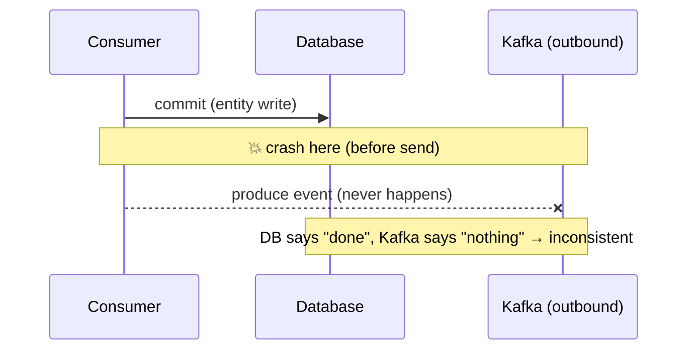
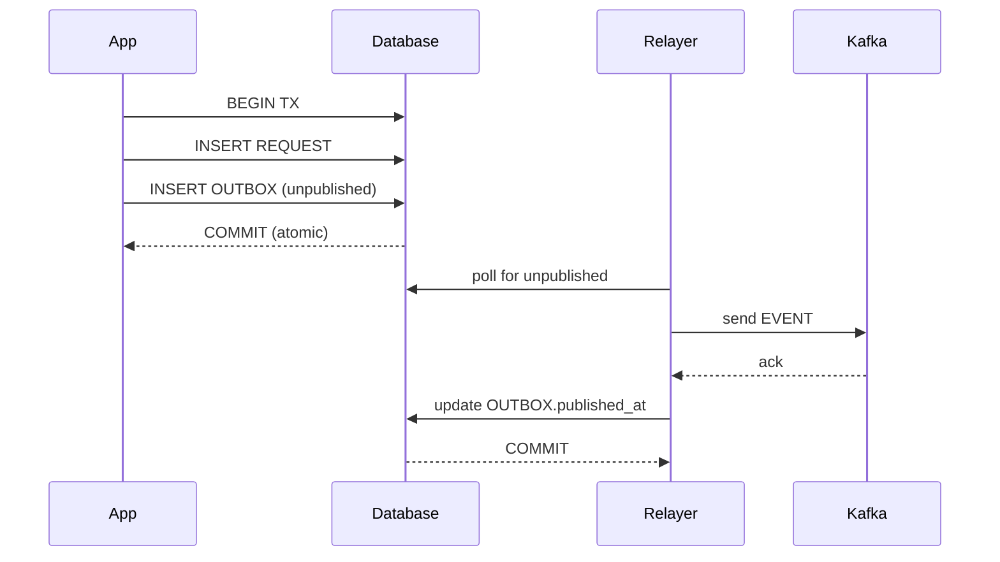
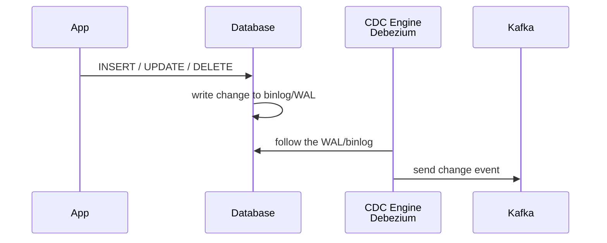

# Persistence & Transaction Patterns

> Part of the **Kafka Engineering Guide** of `org-rd-fullstack-springboot-eda`. See the [project README](../README.md).

**Scope:** one of the most fundamental architectural challenges in an event-driven architecture is guaranteeing that a **database update** and the **publication of an event** are atomic — the **dual-write problem**. This guide covers the whole chain that keeps data correct under Kafka's at-least-once semantics: why the dual-write problem exists, the two patterns that solve it (**Transactional Outbox** and **Change Data Capture**), how to make consumers idempotent, and how transaction isolation and locking prevent lost-update / write-skew race conditions. The project's inventory credit/debit pipeline is the running example.

## Table of contents

- [Overview](#overview)
- [The dual-write / double-commit problem](#the-dual-write--double-commit-problem)
- [Pattern 1 — Transactional Outbox](#pattern-1--transactional-outbox)
- [Pattern 2 — Change Data Capture (CDC)](#pattern-2--change-data-capture-cdc)
- [Comparison: Outbox vs CDC](#comparison-outbox-vs-cdc)
- [The idempotent consumer pattern](#the-idempotent-consumer-pattern)
- [Deduplication strategies](#deduplication-strategies)
- [Exactly-once-ish: what is actually guaranteed](#exactly-once-ish-what-is-actually-guaranteed)
- [Distributed locking and relay serialization](#distributed-locking-and-relay-serialization)
- [Database locking and race conditions](#database-locking-and-race-conditions)
- [Spring transaction management](#spring-transaction-management)
- [An accounting aside: double-entry, debit and credit](#an-accounting-aside-double-entry-debit-and-credit)
- [How this project applies it](#how-this-project-applies-it)
- [Pitfalls & best practices](#pitfalls--best-practices)
- [Related reading](#related-reading)

## Overview

Distributed messaging with Kafka is **at-least-once** by default. A consumer can see the same message more than once (poll timeouts, rebalances, a non-idempotent producer retrying), and a producer can write a duplicate event after a transient failure. To keep data correct under these conditions, three concerns must be addressed together:

- **Idempotency** — processing the same message twice must leave the system in the same state as processing it once.
- **Atomic state change + publish** — a single message often updates the database *and* emits a new event; both must commit together or not at all (the dual-write problem).
- **Concurrency control** — several messages (or several consumer threads) touching the same row must not corrupt it through a check-then-act race.

Consider a service that receives an order, persists it, and then publishes an `OrderCreated` event to Kafka. These are two independent commits:

```java
@Transactional
public void createOrder(Order order) {
    repository.save(order);                    // TX 1: database commit
    kafkaTemplate.send(topic, event);          // TX 2: Kafka acknowledgement
}
```

This guide covers each concern, then shows where the project already satisfies it and where it deliberately leaves a known race in place for teaching purposes.

## The dual-write / double-commit problem

A consumer (or producer) that writes to two systems in one logical step — for example, `INSERT` a row in the database **and** `produce` an event to Kafka — performs a *dual write*. The two writes belong to two different transactional resources (a DB transaction and a Kafka transaction) that **cannot be committed atomically**.

If the process dies between the two commits, the resources are left inconsistent:

- DB committed, event not published → downstream never learns about the change. The order exists in the database, but no one knows.
- Event published, DB rolled back → downstream acts on a change that does not exist.

A two-phase commit (2PC) across Kafka and the database — e.g. a chained transaction manager — *looks* like a fix, but the sources are explicit that it can still fail in certain windows, leaves resources inconsistent, and adds latency to every transaction.


```mermaid
sequenceDiagram
    participant C as Consumer
    participant DB as Database
    participant K as Kafka (outbound)
    C->>DB: commit (entity write)
    Note over C,K: 💥 crash here (before send)
    C--xK: produce event (never happens)
    Note over DB,K: DB says "done", Kafka says "nothing" → inconsistent
```

The robust solution is to avoid the dual write entirely: write everything to **one** transactional resource (the database) and let a separate mechanism relay the event. Two patterns realise this — the **Transactional Outbox** and **Change Data Capture (CDC)**.

## Pattern 1 — Transactional Outbox

**Principle:** record the event in an `OUTBOX` table within the **same business transaction** as the data change. Once the transaction commits, a background process (a poller, a trigger, or a CDC connector) reads the unpublished events and relays them to Kafka.

```sql
CREATE TABLE OUTBOX (
    ID BIGINT PRIMARY KEY GENERATED ALWAYS AS IDENTITY,
    AGGREGATE_TYPE VARCHAR(64),          -- entity type (Order, Product, etc.)
    AGGREGATE_ID BIGINT,                 -- entity identifier
    PAYLOAD TEXT,                        -- serialized event (JSON)
    CREATED_AT TIMESTAMP DEFAULT CURRENT_TIMESTAMP,
    PUBLISHED_AT TIMESTAMP               -- NULL until the event is published
);

CREATE TABLE REQUEST (
    ID BIGINT PRIMARY KEY,
    PRODUCT_ID BIGINT,
    QUANTITY INT,
    CREATED_AT TIMESTAMP,
    PUBLISHED_TO_KAFKA BOOLEAN           -- publication flag (optional)
);
```

### Producer

```java
@Transactional
public void publishRequest(Request req) {
    // Step 1: persist the business request
    requestRepository.save(req);

    // Step 2: record the event in OUTBOX (same transaction)
    OutboxEvent event = new OutboxEvent(
        "Request", req.getId(), serializeEvent(req)
    );
    outboxRepository.save(event);

    // A single transaction spans REQUEST and OUTBOX.
    // Both writes are either committed together
    // or rolled back together.
}
```

### Background relay

```java
@Scheduled(fixedRate = 1000)
public void relayUnpublishedEvents() {
    List<OutboxEvent> unpublished = outboxRepository.findByPublishedAtIsNull();

    for (OutboxEvent event : unpublished) {
        try {
            // Publish the event to Kafka
            kafkaTemplate.send(topic, event.getPayload());

            // Mark the event as published
            event.setPublishedAt(Instant.now()); // UTC.
            outboxRepository.save(event);
        } catch (Exception e) {
            // Retry on the next cycle,
            // or route to a DLQ depending on the chosen strategy
            log.warn("Failed to publish event {}", event.getId());
        }
    }
}
```

The application thereby guarantees that the business data and its event are recorded atomically. If the transaction rolls back, neither the business row nor the `OUTBOX` row survives. If publishing to Kafka fails, the event remains in `OUTBOX` and is processed again on the next pass of the relay.


```mermaid
sequenceDiagram
    participant App
    participant DB as Database
    participant Relayer
    participant Kafka

    App->>DB: BEGIN TX
    App->>DB: INSERT REQUEST
    App->>DB: INSERT OUTBOX (unpublished)
    DB-->>App: COMMIT (atomic)

    Relayer->>DB: poll for unpublished
    Relayer->>Kafka: send EVENT
    Kafka-->>Relayer: ack
    Relayer->>DB: update OUTBOX.published_at
    DB-->>Relayer: COMMIT
```

**Ordering of commits** is load-bearing. The DB transaction must commit *before* the consumer offsets are written. If offsets were committed first and the process died before the DB commit, the message would not be redelivered and both the entity write and the outbound event would be lost. Conversely, if the consumer dies after the DB commit but before offsets are written, the message is redelivered and the processed-id check deduplicates it.

The relay itself has two common implementations:

- **CDC with Kafka Connect / Debezium** (recommended): the connector reads the database commit log, transforms the outbox row, and writes it to the outbound topic. It inherits Kafka's resilience, fault tolerance and scalability. See the CDC pattern below.
- **A simple poller** reading the outbox table and producing to Kafka — workable, but you reimplement what Connect already provides.

### Advantages — Transactional Outbox

- **Guaranteed atomicity**: REQUEST and OUTBOX commit together.
- **No XA coordinator**: a single DB transaction, standard SQL.
- **Resilient**: if the relay crashes, unpublished events are relayed on restart.

### Drawbacks — Transactional Outbox

- **Latency**: by default there is a delay between the DB commit and the publication to Kafka (the relay cycle, usually < 5 s).
- **Table growth**: OUTBOX grows until events are relayed and purged, requiring a retention policy.
- **Relay logic**: you must implement the relay or use a library (Debezium can also relay from OUTBOX).

## Pattern 2 — Change Data Capture (CDC)

**Principle:** instead of periodically polling the `OUTBOX` table, **Change Data Capture (CDC)** reads the database's **transaction log** directly (for example MySQL's *binlog* or PostgreSQL's *Write-Ahead Log (WAL)*). Each committed change (*INSERT*, *UPDATE*, *DELETE*) is captured, turned into an event, and relayed to Kafka — without adding an `OUTBOX` table to the application.

**Popular tools:**

- [Debezium](https://debezium.io/): the reference CDC solution. It typically integrates with Kafka Connect and supports many database management systems.
- [Maxwell's Daemon](https://maxwells-daemon.io/): a lightweight tool specialised in streaming the MySQL *binlog* to Kafka and other destinations.
- [PostgreSQL Logical Decoding](https://www.postgresql.org/docs/current/logical-decoding.html): PostgreSQL's native mechanism for extracting changes from the WAL, used notably by Debezium.

### Flow


```mermaid
sequenceDiagram
    participant App
    participant DB as Database
    participant CDC as CDC Engine<br/>Debezium
    participant Kafka

    App->>DB: INSERT / UPDATE / DELETE
    DB->>DB: write change to binlog/WAL
    CDC->>DB: follow the WAL/binlog
    CDC->>Kafka: send change event
```

### Advantages — Change Data Capture (CDC)

- **Application-free**: CDC runs outside your app; no business code needs to manage the events.
- **Captures every change**: even direct SQL updates (not via the app) are captured.
- **Low latency**: some CDC engines (notably Postgres Logical Decoding) stream changes in milliseconds.

### Drawbacks — Change Data Capture (CDC)

- **Additional infrastructure**: you must run and operate the CDC engine (Debezium, a Kafka Connect cluster).
- **Schema complexity**: structural changes (add/drop column) can break the CDC pipeline.
- **Certification/compliance**: some regulations require the application to be aware of the events (no hidden CDC).

## Comparison: Outbox vs CDC

| Aspect | **Outbox** | **CDC** |
|---|---|---|
| **App complexity** | Moderate (write OUTBOX) | None (passive) |
| **Latency** | Slower (poll cycle, ~1–5 s) | Faster (follow WAL, ~100 ms) |
| **Coverage** | Only changes made via the app | All changes (including direct ones) |
| **Additional infrastructure** | Low (just a poller) | High (Debezium + Kafka Connect) |
| **Table retention** | OUTBOX grows until purged | No intermediate table |
| **Operability** | Simple | Complex |
| **Fit for microservices** | Excellent (each service owns its outbox) | Good (centralised CDC across several DBs) |

## The idempotent consumer pattern

An idempotent consumer can consume the same message any number of times but only *processes* it once. The recommended implementation tracks processed messages in the database:

1. Each message carries a unique `messageId` (in the payload or a Kafka header), assigned by the producer.
2. On consume, the consumer checks a `processed_messages` table for that id.
3. If present → it is a duplicate; update offsets to mark it consumed and do nothing else.
4. If absent → begin a DB transaction, insert the id, run the business logic, commit.

The id insert and the business writes share **one** transaction, so they are atomic: either both land or both roll back.

### Flush strategy matters

The subtlety is *when* the unique-constraint conflict on `messageId` is detected. With Hibernate's default transactional write-behind, the flush happens at commit time, so two duplicates processing in parallel can both run their full business logic and only the loser fails at commit — after side effects (e.g. an external REST call) have already happened twice.

Flushing at the point of save (`saveAndFlush`) changes this: the second transaction blocks on the row lock as soon as it tries to insert the duplicate id, and is aborted before doing redundant work.

```java
private void deduplicate(UUID eventId) throws DuplicateEventException {
    try {
        // flush immediately so the unique-key conflict surfaces now,
        // not at commit time
        processedEventRepository.saveAndFlush(new ProcessedEvent(eventId));
    } catch (DataIntegrityViolationException e) {
        throw new DuplicateEventException(eventId);
    }
}
```

This is the recommended approach because it minimises duplicate *actions*, not just duplicate *commits*.

## Deduplication strategies

The sources lay out three patterns and what each leaves duplicated across failure points:

| Pattern | Mechanism | Residual duplicate risk |
|---|---|---|
| **Idempotent consumer** | Processed-id table + locking flush, in the business transaction | A non-rollbackable side effect (e.g. external POST) before the failure point |
| **Transactional outbox** | Outbound event written to an outbox table in the same DB transaction; relayed by CDC | None for the outbound event; the upstream POST can still duplicate |
| **Kafka transactions** | Exactly-once across consume → process → produce via the transaction log | The consume + process steps can still repeat; cannot be safely combined with the idempotent-consumer table |

Key constraints from the sources:

- The DB transaction and the Kafka transaction **cannot** be committed atomically; combining the idempotent consumer with Kafka transactions risks data loss in some orderings.
- The idempotent consumer and the transactional outbox **can** be combined, and that combination is the recommended "gold standard".
- No pattern can make an upstream non-idempotent POST safe — that third-party call must be made idempotent on its own (e.g. an idempotency key honoured by the callee).

The general-purpose tool is an **idempotency key**: a deterministic, message-derived identifier that a downstream operation uses to recognise and collapse repeats. The processed-message table is one realisation of it.

## Exactly-once-ish: what is actually guaranteed

True end-to-end exactly-once across a DB and Kafka is not achievable without atomic 2PC, which is not available here. What the patterns deliver is **effectively-once** processing:

- At-least-once delivery (Kafka redelivers on failure) **+** idempotent processing (dedup) ⇒ the observable effect is once.
- The transactional outbox guarantees the **outbound event** is published exactly once relative to the committed state.
- A residual at-least-once action (the upstream POST) remains; it is pushed onto the callee to make idempotent.

Even with outbox and CDC, duplication is possible: the relay sends the event, Kafka acknowledges it, but the relay crashes before marking `published_at`. On restart, it relays again. The remedy is a consumer-side idempotency guard; the combination of outbox + idempotent consumer delivers effectively-once semantics.

In this project the "effectively-once" guarantee comes from idempotency in the processor rather than an outbox: [`PipelineSrv`](../src/main/java/org/rd/fullstack/springbooteda/srv/PipelineSrv.java) skips any request whose `result` is no longer `PENDING`/`BACK_ORDER`, so a redelivered message is recognised as already handled.

## Distributed locking and relay serialization

One challenge of the outbox pattern is guaranteeing that records being relayed / updated by the relay are not picked up twice by two concurrent relayers (especially on EKS, where several pods may run the relay).

**Solution:** a distributed lock or an atomic marker:

```java
@Transactional
public void relayUnpublishedEvents() {
    // Acquire a distributed lock (Hazelcast, Redis, database)
    if (distributedLock.tryLock("outbox-relayer", Duration.ofSeconds(10))) {
        try {
            List<OutboxEvent> unpublished = outboxRepository
                .findByPublishedAtIsNullAndLockedIsFalse();

            for (OutboxEvent event : unpublished) {
                event.setLocked(true);
                outboxRepository.save(event);  // mark as locked

                try {
                    kafkaTemplate.send(topic, event.getPayload());
                    event.setPublishedAt(Instant.now()); // UTC.
                } finally {
                    event.setLocked(false);
                }
                outboxRepository.save(event);
            }
        } finally {
            distributedLock.unlock("outbox-relayer");
        }
    }
}
```

Alternatively, use a pessimistic `UPDATE`:

```sql
-- Postgres: atomically select and lock
SELECT * FROM OUTBOX WHERE published_at IS NULL FOR UPDATE LIMIT 10;
```

This ensures that at most one instance relays each event.

## Database locking and race conditions

Idempotency stops *duplicate* processing. It does **not** stop a **lost-update** race between two *distinct* messages that both modify the same row. The classic shape is **check-then-act** (also TOCTOU — time-of-check to time-of-use):

```text
1. read qty
2. check qty >= requested
3. relative decrement: qty = qty - requested
```

Two threads can both pass step 2 on the same stale read, then both apply step 3, producing a value below zero — a silent oversell.

### The control mechanisms

- **Pessimistic locking** — lock the row on read so others wait. In SQL, `SELECT ... FOR UPDATE`; in JPA, `@Lock(LockModeType.PESSIMISTIC_WRITE)`. Strict consistency, lower concurrency.

  ```sql
  SELECT * FROM inventory WHERE inventory_id = 10 FOR UPDATE;
  ```

- **Optimistic locking** — a `@Version` column; the update only succeeds if the version is unchanged, otherwise the application retries. Great for read-heavy, low-contention workloads.

  ```sql
  UPDATE inventory SET qty = :new, version = version + 1
   WHERE inventory_id = 5 AND version = 3;
  -- 0 rows updated ⇒ someone else changed it ⇒ retry
  ```

- **Atomic conditional update** — fold the check into the write so the database evaluates the guard atomically under its own row lock. No application-visible version, no explicit lock:

  ```sql
  UPDATE inventory SET qty = qty - :qty
   WHERE inventory_id = :id AND qty >= :qty;
  -- returns affected-row count: 1 = success, 0 = insufficient stock (BACK_ORDER)
  ```

### Isolation level changes the symptom

The race's *visibility* depends on the engine's concurrency family, not just on the code.

| Engine / mode | Behaviour on two concurrent same-row updates | Symptom |
|---|---|---|
| HSQLDB `LOCKS` (default, table-level 2PL) | Writer locks the whole table; the other reader blocks until commit, then reads fresh | Race **masked** — second check sees the new value, `BACK_ORDER` |
| **HSQLDB `MVLOCKS` (this project)** | MVCC reads never block, so the stock check runs on a stale snapshot; the row write-lock is held only for the brief instant of the relative `UPDATE` and never spans the check-then-act window (and with `lock_timeout=0` writes do not wait) | **Silent oversell** — `qty` goes negative |
| HSQLDB / H2 `MVCC` | Second writer detects a write conflict | Serialization failure (`40001` / `90131`) → retry, **not** a silent negative |
| PostgreSQL / MySQL InnoDB `READ_COMMITTED` | Second `UPDATE` blocks, then re-applies the relative decrement on the fresh value | **Silent oversell** — `qty` goes negative |

This is the key point: the project **deliberately forces `MVLOCKS`** (see [`application.yml`](../src/main/resources/application.yml) and `schema.sql`) precisely so the race is *not* masked. HSQLDB's *default* `LOCKS` mode would have hidden the bug — table-level locking serialises writers and *accidentally* makes the check-then-act atomic — but under `MVLOCKS` the non-blocking reads surface the same **silent oversell** you would see on PostgreSQL `READ_COMMITTED`: in the un-keyed run, `Banana` settles at `-10` (see the [example reports](./reports.md)). The race is a lost update that commits cleanly — there is no serialization error, no retry, and no DLT routing.

## Spring transaction management

Spring exposes the same DB transaction in several styles.

| Approach | Simplicity | Fine control | When |
|---|---|---|---|
| `@Transactional` | high | low | ~90% of cases |
| `TransactionTemplate` | medium | medium | precise transactional blocks |
| `PlatformTransactionManager` directly | low | high | partial commits, very fine control |
| `EntityManager.getTransaction()` | lowest | medium | pure JPA, no Spring container |

Two attributes matter most:

- **Propagation** — e.g. `REQUIRED` joins an existing transaction or starts one. Note the *self-invocation* trap: calling a `@Transactional` method via `this.method(...)` bypasses the Spring AOP proxy and silently disables the transaction. The project sidesteps this by putting the transactional logic in a dedicated bean (`ProcessorSrv`) invoked from the pipeline, not as a same-class method call.
- **Isolation** — `READ_COMMITTED` is the common default; it does **not** prevent lost updates, so concurrency must be handled by locking or an atomic conditional update (above), not by isolation alone (short of `SERIALIZABLE`).

`@Modifying` JPQL updates (relative `SET qty = qty ± :qty`) run as bulk updates and must execute inside a transaction; they bypass the persistence context, which is why the processor calls `flush()` and why a `clearAutomatically = true` is used on the blanket refill.

## An accounting aside: double-entry, debit and credit

The inventory naming mirrors double-entry bookkeeping. Inventory is an **asset** account, and for assets the rule (mnemonic *DEAD CLIC* — **D**ebit increases **E**xpenses/**A**ssets/**D**ividends) is:

| Operation | Effect on inventory (an asset) | Project method |
|---|---|---|
| **Debit** | increases the balance | `debitQTY` → `qty + :qty` |
| **Credit** | decreases the balance | `creditQTY` → `qty - :qty` |

So in this project `DEBIT` *adds* stock and `CREDIT` *removes* it — consistent with accounting, even though it can read as counter-intuitive. The double-entry discipline (every change balanced, never partial) is the bookkeeping analogue of an atomic transaction: the engineering goal is the same invariant — the balance must never be corrupted by a partial or concurrent write.

## How this project applies it

This sandbox is **didactic** and does not implement the outbox by default, but the code is structured to support it. Relevant files:

- [`PipelineSrv`](../src/main/java/org/rd/fullstack/springbooteda/srv/PipelineSrv.java)
- [`InventoryRepository`](../src/main/java/org/rd/fullstack/springbooteda/dao/InventoryRepository.java)
- [`Inventory`](../src/main/java/org/rd/fullstack/springbooteda/dto/Inventory.java)
- [`Request`](../src/main/java/org/rd/fullstack/springbooteda/dto/Request.java)
- [`InventoryController`](../src/main/java/org/rd/fullstack/springbooteda/controller/InventoryController.java)
- [`application.yml`](../src/main/resources/application.yml), [`schema.sql`](../src/main/resources/schema.sql)

### Structured to support the outbox

- **Entity model**: the `REQUEST` table can be extended with `published_to_kafka` (mark the event as sent) and `published_at` columns.
- **Transactional writes**: `PipelineSrv.publish()` and `ProcessorSrv.process()` are both `@Transactional`, guaranteeing that business updates and event markers commit together.
- **Distributed locking**: the code already uses Hazelcast for inventory locks; it could be extended to a relay lock.
- **Event traceability**: Kafka headers (`replay-id`, topic, offset) are recorded in `REQUEST` for correlation.

### Idempotent processing

`ProcessorSrv.process(...)` is annotated `@Transactional(propagation = REQUIRED, isolation = READ_COMMITTED)` and begins with an idempotency guard:

```java
if ((request.getResult() != Result.PENDING) &&
    (request.getResult() != Result.BACK_ORDER))
    return; // already handled → skip
```

Because the request's `result` is flipped to `EXECUTED`/`BACK_ORDER`/`ERROR` and persisted in the same transaction, an at-least-once redelivery (retry or rebalance) re-reads a non-`PENDING` request and is safely skipped. The request row itself acts as the processed-message marker — a lightweight idempotent-consumer variant without a separate dedup table. To keep the proxy effective, the logic lives in its own bean so `@Transactional` is honoured.

### The documented inventory race

The `CREDIT` branch is a textbook check-then-act:

```java
Optional<Inventory> inv = inventoryRepository.findByProductId(request.getProductId()); // 1) unlocked read
...
if (inventory.getQty() < request.getQty()) {  // 2) application check
    request.setResult(Result.BACK_ORDER); ... return;
}
inventoryRepository.creditQTY(request.getQty(), inventory.getInventoryId());           // 3) relative decrement
```

`findByProductId` takes **no lock**, [`Inventory`](../src/main/java/org/rd/fullstack/springbooteda/dto/Inventory.java) has **no `@Version`**, and the isolation is `READ_COMMITTED`. The relative decrements live in [`InventoryRepository`](../src/main/java/org/rd/fullstack/springbooteda/dao/InventoryRepository.java):

```java
@Modifying @Query("UPDATE Inventory inv SET inv.qty = (inv.qty - :qty) WHERE inv.inventoryId = :id")
int creditQTY(@Param("qty") Long qty, @Param("id") Long id);   // CREDIT: subtract

@Modifying @Query("UPDATE Inventory inv SET inv.qty = (inv.qty + :qty) WHERE inv.inventoryId = :id")
int debitQTY(@Param("qty") Long qty, @Param("id") Long id);    // DEBIT: add
```

Nothing in the code prevents two concurrent `CREDIT`s for the same product from both passing the check and overselling. Under the project's forced `MVLOCKS` the race is **not** masked: the un-keyed run oversells silently — `Banana` settles at `-10` in the [example reports](./reports.md). Only HSQLDB's *default* `LOCKS` mode would have hidden it (table-level write serialization makes the check-then-act accidentally atomic), which is exactly why the sandbox forces `MVLOCKS` instead; on PostgreSQL `READ_COMMITTED` it oversells silently for the same reason.

### Mitigations (in order of preference)

1. **Kafka key = `productId`** — all messages for a product land on one partition and are processed sequentially by a single thread, so there is no concurrency on that inventory row, *regardless of the database*. This is the project-level fix and ties directly to the partitioning guidance in the broader guide.
2. **Atomic conditional update** — fold the guard into the write; no lock, no version:

   ```java
   @Modifying
   @Query("UPDATE Inventory i SET i.qty = i.qty - :qty WHERE i.inventoryId = :id AND i.qty >= :qty")
   int tryCredit(@Param("qty") Long qty, @Param("id") Long id);
   // tryCredit(...) == 0  → insufficient stock → BACK_ORDER
   ```
3. **Pessimistic lock** — `@Lock(LockModeType.PESSIMISTIC_WRITE)` on `findByProductId` (`SELECT ... FOR UPDATE`).
4. **Optimistic lock** — add `@Version` to `Inventory` and retry on `OptimisticLockException`.
5. **DB safety net** — a `CHECK (qty >= 0)` constraint so the faulty update fails and the message goes to the DLT.

### Multi-step controller writes

Controllers that mutate several rows (multi-step update/delete) and the blanket `@Modifying` `refillAll`/reset operations are wrapped in `@Transactional` so a partial change cannot be left committed — the multi-write atomicity principle applied at the API edge. See [`InventoryController`](../src/main/java/org/rd/fullstack/springbooteda/controller/InventoryController.java) and `refillAll` in [`InventoryRepository`](../src/main/java/org/rd/fullstack/springbooteda/dao/InventoryRepository.java).

### Extending to a full outbox

To add a true outbox:

1. Create an `OUTBOX` table in [`schema.sql`](../src/main/resources/schema.sql);
2. In `PipelineSrv.publish()`, write both REQUEST and OUTBOX;
3. Implement a `@Scheduled` relay in a new service, `OutboxRelayerSrv`, that polls OUTBOX and sends to Kafka;
4. Test the crash scenarios (stop the relay mid-flight, check that events are relayed on restart).

## Pitfalls & best practices

- ✅ **Use the outbox or CDC** — never split a DB write and a Kafka publish across two non-atomic transactions and just hope.
- ✅ **Make consumers idempotent** — even with the outbox, relays can fail and redeliver events.
- ✅ **For CDC (Debezium)** — prefer Postgres Logical Decoding when possible (better latency and less production impact).
- ✅ **For the outbox** — regularly purge published records to keep the table a reasonable size.
- **Don't rely on the database to mask races.** HSQLDB's *default* `LOCKS` mode would make this code "accidentally correct", but the sandbox forces `MVLOCKS` precisely to expose the bug — and on PostgreSQL `READ_COMMITTED` it oversells too. Make the code safe independently of the engine (atomic conditional update is the cleanest).
- **`READ_COMMITTED` does not prevent lost updates.** Use a lock, a version, or an atomic guarded update — not a higher isolation level as a reflex.
- **Avoid 2PC across Kafka and the DB.** Prefer the transactional outbox; if you must chain, understand it does not give atomicity.
- **Order commits correctly.** DB commit before offset commit (outbox); business-transaction commit before offset commit (idempotent consumer). Wrong order = data loss.
- **Flush the dedup insert early** (`saveAndFlush`) so duplicate detection blocks redundant work instead of failing at commit.
- **Make upstream non-idempotent calls idempotent** via an idempotency key the callee honours; no consumer pattern can fully remove the duplicate-POST risk.
- **Beware Spring self-invocation.** `@Transactional` only applies through the proxy — keep transactional logic in a separate bean (as `ProcessorSrv` does).
- **Use a Kafka key when per-entity ordering matters.** Keying by `productId` serialises per-product processing and removes the inventory race at the platform level.
- **Add a DB invariant** (`CHECK (qty >= 0)`) as a last line of defence; let violations fail loudly to the DLT.
- ⚠️ **Don't skip the relay** — don't publish directly without writing the outbox; that is a safety net you throw away.
- ⚠️ **Expect duplication** — even with the outbox, dupes are possible; idempotency is mandatory.

## Related reading

- [Acknowledgement and consumer idempotency](./consumer_acknowledgement_and_idempotency.md)
- [Delivery semantics and reliability](./reliability_and_delivery_semantics.md)
- [Debezium](https://debezium.io/) — official documentation for CDC
- Microservices.io — [Transactional Outbox](https://microservices.io/patterns/data/transactional-outbox.html)
