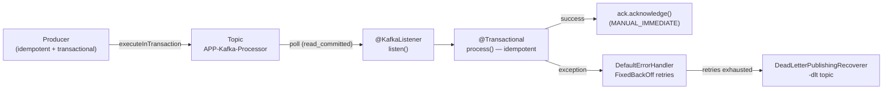

# Reliability & Delivery Semantics

> Part of the **Kafka Engineering Guide** of `org-rd-fullstack-springboot-eda`. See the [project README](../README.md).

**Scope:** how Kafka delivery guarantees (at-most-once, at-least-once, exactly-once) are produced from a small number of concrete choices — offset commit strategy, producer idempotence and transactions, consumer isolation level, retry/DLT policy and batch sizing — and how this project combines them into a transactional publish followed by an idempotent, manually acknowledged consume.

## Table of contents

- [Overview](#overview)
- [Delivery semantics: the three guarantees](#delivery-semantics-the-three-guarantees)
- [Offset management](#offset-management)
- [The idempotent producer](#the-idempotent-producer)
- [Kafka transactions and read-process-write](#kafka-transactions-and-read-process-write)
- [Kafka Streams exactly-once (EOS)](#kafka-streams-exactly-once-eos)
- [Consumer retries, back-off and dead letter topics](#consumer-retries-back-off-and-dead-letter-topics)
- [Batch consumption trade-offs](#batch-consumption-trade-offs)
- [How this project applies it](#how-this-project-applies-it)
- [Pitfalls & best practices](#pitfalls--best-practices)
- [Sources & further reading](#sources--further-reading)

## Overview

A "delivery guarantee" in Kafka is not a single switch. It is the emergent result of *when* the consumer marks a message as consumed (the offset commit) relative to *when* the work is actually done, combined with whether the producer is idempotent and whether reads and writes are wrapped in a transaction.

Out of the box, Kafka gives **at-least-once** delivery: a message is guaranteed to be processed, but failure and timeout scenarios mean it can be processed more than once. Tightening this to **exactly-once** requires the transactional API; relaxing it to **at-most-once** requires committing offsets *before* processing. This guide walks each guarantee, then maps it to the project's pipeline, which deliberately chooses at-least-once consume plus idempotent processing, fronted by a transactional, idempotent producer and a `read_committed` consumer.



## Delivery semantics: the three guarantees

| Guarantee | What it means | How it is achieved | Cost |
|-----------|---------------|--------------------|------|
| **At-most-once** | A message may be lost, but never processed twice. | Commit the offset *before* processing (`enable.auto.commit=false` and write offsets first). | Possible data loss on failure. |
| **At-least-once** | A message is never lost, but may be processed more than once. | Commit the offset *after* processing succeeds (the Kafka default). | Duplicate processing must be tolerated or deduplicated. |
| **Exactly-once** | The combined consume-process-produce happens once for downstream transaction-aware consumers. | Kafka transactions (idempotent producer + transactional offsets) and `read_committed` consumers. | Lower throughput/higher latency, no atomicity with external DBs. |

Two points are easy to miss:

- **At-least-once is the default** because, until the consumer offset is updated, the broker cannot tell whether a message was processed, is still processing, or failed. To avoid loss it must redeliver. Duplicate delivery therefore happens specifically when work completes (outbound writes, DB writes, REST calls) but the offset commit does not — for example a crash or a `max.poll.interval.ms` timeout in the small window after producing but before committing.
- **Exactly-once is narrower than it sounds.** Kafka's guarantee is that the *resulting events* are seen once by a downstream `read_committed` consumer. The original message may still be consumed and processed multiple times, so any non-Kafka side effects inside processing (database writes, REST calls) can still happen more than once. Atomicity with a database would require a distributed transaction (e.g. a `ChainedTransactionManager`), which is generally best avoided.

## Offset management

The consumer offset (the position written to the internal `__consumer_offsets` topic) is what makes a message "consumed". Where and how it is committed is the single biggest lever on the delivery guarantee.

### Auto vs manual commit

- **Auto commit** (`enable.auto.commit=true`): the client library commits the offset of the last record in the batch periodically (every `auto.commit.interval.ms`), automatically, at the end of batch processing. Simple, but the commit point is decoupled from the work — a crash mid-batch replays the whole batch.
- **Manual commit** (`enable.auto.commit=false`): the application decides exactly when to commit, so the commit can be tied precisely to "processing succeeded".

### Sync vs async commit (manual)

- **Synchronous** (`commitSync`): blocks until the broker acknowledges, retries on retriable errors, surfaces failures. Safer, slower.
- **Asynchronous** (`commitAsync`): fires and continues; higher throughput but a failed commit is not retried (a later commit supersedes it). A common pattern is `commitAsync` in the loop and a final `commitSync` on shutdown/rebalance.

### Spring Kafka ack modes

With Spring's listener container, manual commit is expressed via an `Acknowledgment` and an `AckMode`:

- `BATCH` / `RECORD` / `TIME` / `COUNT` — container-driven commits.
- `MANUAL` — the offset is queued when you call `acknowledge()` and committed at the next poll boundary.
- `MANUAL_IMMEDIATE` — the offset is committed **immediately** on the consumer thread when `acknowledge()` is called.

This project uses `MANUAL_IMMEDIATE` so that the offset is committed only after a record has been fully and successfully processed, giving precise at-least-once behaviour with no reliance on poll timing.

```java
factory.getContainerProperties().setAckMode(AckMode.MANUAL_IMMEDIATE);
```

## The idempotent producer

Setting `enable.idempotence=true` makes the producer attach a producer ID and per-partition sequence numbers to each batch. If a transient error causes the producer to retry a send, the broker recognises the duplicate sequence and writes the record only once. This removes duplicate *writes* caused by producer retries (it does **not** deduplicate application-level duplicates).

The project's producers set this explicitly, alongside `acks=all` and bounded retries, so both producer paths (the Spring `KafkaConfig` template and the `KafkaSandbox` templates) share the same durability profile:

```java
props.put(ProducerConfig.ACKS_CONFIG,               "all");      // CST_ACKS_CONFIG
props.put(ProducerConfig.ENABLE_IDEMPOTENCE_CONFIG, true);
props.put(ProducerConfig.RETRIES_CONFIG,            5);          // CST_RETRIES_CONFIG
props.put(ProducerConfig.RETRY_BACKOFF_MS_CONFIG,   100);        // CST_RETRY_BACKOFF_MS_CONFIG
```

`acks=all` waits for the in-sync replicas to persist the write; combined with idempotence it is the prerequisite for transactions, which enable it implicitly.

## Kafka transactions and read-process-write

A Kafka transaction lets a producer write to one or more topics **and** commit the source consumer offsets as a single atomic unit. This is the read-process-write (consume-process-produce) pattern that underpins exactly-once messaging.

### Enabling and flow

Transactions require a **`transactional.id`** on the producer (which also implicitly enables idempotence). The transactional flow is:

1. `beginTransaction()`
2. produce outbound messages
3. `sendOffsetsToTransaction(offsets, groupMetadata)` — include the consumer offsets in the transaction
4. `commitTransaction()` (or `abortTransaction()` on failure)

```java
producer.initTransactions();
while (true) {
    var records = consumer.poll(Duration.ofMillis(100));
    producer.beginTransaction();
    try {
        for (var record : records)
            producer.send(new ProducerRecord<>("TopicB", record.key(), transform(record.value())));
        producer.sendOffsetsToTransaction(computeOffsets(records), consumer.groupMetadata());
        producer.commitTransaction();
    } catch (Exception e) {
        producer.abortTransaction();
    }
}
```

A **Transaction Coordinator** on the broker tracks progress in an internal transaction log (which needs at least three brokers for its replication factor of 3). On service failure mid-transaction the message is re-consumed; the coordinator matches the producer ID / transactional ID, finds the dangling transaction, and resumes or aborts it so the outcome is applied exactly once. A transaction that never completes is aborted after `transaction.max.timeout.ms`.

With Spring Kafka, this boilerplate is hidden behind `@Transactional` on the producing method plus a `KafkaTransactionManager` bean, or behind `KafkaTemplate.executeInTransaction(...)` for a self-contained atomic publish.

### The transaction-aware consumer: `read_committed`

A transaction only delivers exactly-once *if the downstream consumer reads committed records only*. With `isolation.level=read_committed`, a consumer does not surface transactional records until their commit marker is written; aborted records are skipped entirely. The default, `read_uncommitted`, sees records as soon as they are written — including ones that are later aborted — which breaks the guarantee.

> Consequence: a `read_committed` consumer may block on a partition until the producer writes the commit (or abort) marker, which is part of the latency cost of transactions.

## Kafka Streams exactly-once (EOS)

Kafka Streams is built on the consume & produce APIs, so enabling transactions gives it the same end-to-end guarantee — plus protection for **state stores**. A stateful Streams flow wraps consume, state-store write, changelog-topic write, outbound produce and offset commit in one transaction, so all of them succeed or all abort. The changelog topic acts as a write-ahead log for the state store; on a crash (detected via the RocksDB checkpoint file) the store is rebuilt from it and processing resumes from the last committed offset — with no duplicate state-store writes.

Configuration is a single property:

```yaml
# Kafka Streams 3.x — improved scalability over the original exactly_once
processing.guarantee: exactly_once_v2   # default: at_least_once
```

EOS requires a cluster of at least three brokers and costs roughly a few percent throughput (often cited around ~3%, though highly workload-dependent). Latency rises because downstream `read_committed` consumers wait for commit markers; it can be traded back via a shorter `commit.interval.ms` (more, smaller transactions). Fewer, larger transactions favour throughput; more, smaller ones favour latency.

> This project uses the plain consume & produce APIs (not the Streams DSL) for its inventory pipeline, so `exactly_once_v2` is documented here as the Streams equivalent rather than something configured in code. The Flink topics (`APP-Flink-Input` / `APP-Flink-Output`) are processed by Flink, not Kafka Streams.

## Consumer retries, back-off and dead letter topics

When a listener throws and the exception is allowed to propagate to the Kafka client, the record is treated as *not consumed* so it can be retried. Spring's `DefaultErrorHandler` drives this: it retries the failing record according to a `BackOff` policy and, once retries are exhausted, hands the record to a recoverer — typically a `DeadLetterPublishingRecoverer` that publishes it to a **Dead Letter Topic (DLT)**.

This project builds the handler in `KafkaSandbox` with a `FixedBackOff`:

```java
DeadLetterPublishingRecoverer recoverer = new DeadLetterPublishingRecoverer(
    dltTemplate,
    (record, ex) -> new TopicPartition(template.getDefaultTopic(), KafkaConstants.CST_PARTITION_DLT));
recoverer.setAppendOriginalHeaders(true);
recoverer.setRetainExceptionHeader(true);

// FixedBackOff(interval, maxAttempts): maxAttempts counts RETRIES, not total attempts.
DefaultErrorHandler errorHandler =
    new DefaultErrorHandler(recoverer, new FixedBackOff(retryInterval, retryAttempts));
errorHandler.addNotRetryableExceptions(IllegalArgumentException.class);
```

Key behaviours:

- `FixedBackOff(interval, maxAttempts)` — `maxAttempts` is the number of *retries*; the project's `CST_RETRY_ATTEMPTS = 1` means 1 original delivery + 1 retry before the DLT. `CST_RETRY_INTERVAL = 250` ms spaces them out. (`DefaultErrorHandler` also supports `ExponentialBackOff` for backed-off retry.)
- **Non-retryable exceptions** (here `IllegalArgumentException`) skip retries and go straight to the DLT — appropriate for poison messages that can never succeed.
- Because the project configures the handler manually (not `@RetryableTopic`), the DLT routing is observed via a `RetryListener` registered on the handler, whose `recovered(...)` callback fires exactly once when a record is sent to the DLT.

## Batch consumption trade-offs

Every poll returns a *batch* of records (possibly spanning multiple topics/partitions), and the delivery guarantee is evaluated per batch. With auto-commit, the offset of the last record is committed only at the end of the batch — so the failure window covers the whole batch:

- **Consumer dies mid-batch:** no offset is committed, so on rebalance/restart the *entire* batch is redelivered. Already-processed records at the front of the batch are processed again (duplicates).
- **Exception mid-batch (auto-commit):** the client commits up to the last *successful* record, then re-polls from the failing one. Partial work done before the exception still re-runs on redelivery.

Trade-offs:

| Larger batches (`max.poll.records` high) | Smaller batches (`max.poll.records` low) |
|------------------------------------------|------------------------------------------|
| Higher throughput, fewer commits | Smaller redelivery/duplicate window on failure |
| Risk of exceeding `max.poll.interval.ms` → rebalance | Lower per-record overhead amortisation |

This project bounds the batch with `MAX_POLL_RECORDS = 10` (`CST_MAX_POLL_RECORDS`). The comment in `consumerConfigs()` is explicit: with the optional 500 ms per-record latency, a large batch could exceed `max.poll.interval.ms` and trigger a rebalance, so the batch is deliberately kept small.

## How this project applies it

The inventory pipeline is a textbook **transactional publish, then at-least-once idempotent consume**:

- **Transactional, idempotent publish** — [`PipelineSrv.publish()`](../src/main/java/org/rd/fullstack/springbooteda/srv/PipelineSrv.java) obtains a transactional template (`getKafkaTemplate(topic, true)`) and sends every eligible request inside `template.executeInTransaction(...)`. Serialization is done *outside* the transaction so a JSON error can never abort the producer transaction. `nbrPublished` is set only after a successful commit. The transactional template is created in [`KafkaSandbox`](../src/main/java/org/rd/fullstack/springbooteda/util/kafka/KafkaSandbox.java) with a unique `transactional.id` (`ks-trx-<uuid>`), which implicitly enables idempotence.
- **Idempotence configuration** — [`KafkaConfig.producerConfigs()`](../src/main/java/org/rd/fullstack/springbooteda/config/KafkaConfig.java) sets `enable.idempotence=true`, `acks=all` (`CST_ACKS_CONFIG`) and bounded retries so the two producer paths are aligned.
- **At-least-once consume with manual ack** — [`PipelineSrv.listen()`](../src/main/java/org/rd/fullstack/springbooteda/srv/PipelineSrv.java) delegates to the processor and calls `ack.acknowledge()` *only after* processing succeeds. The container uses `AckMode.MANUAL_IMMEDIATE` and `enable.auto.commit=false`, so a crash before the ack replays the message (at-least-once by design — see the inline comment "a crash before this point replays the message").
- **Idempotent processing** — [`PipelineSrv.process()`](../src/main/java/org/rd/fullstack/springbooteda/srv/PipelineSrv.java) is a separate `@Transactional` bean (so the AOP proxy actually applies) that **skips** any request whose `Result` is no longer `PENDING`/`BACK_ORDER`. This makes at-least-once redelivery safe: a duplicate is a no-op. The JPA transaction rolls back on failure so no partial DB state is committed.
- **`read_committed` isolation** — [`KafkaConfig.consumerConfigs()`](../src/main/java/org/rd/fullstack/springbooteda/config/KafkaConfig.java) sets `isolation.level=read_committed` (`CST_ISOLATION_LEVEL_CONFIG`) so the listener never sees uncommitted or aborted records from the transactional producer.
- **Retry + DLT** — the [`DefaultErrorHandler`](../src/main/java/org/rd/fullstack/springbooteda/config/KafkaConfig.java) wired into the container factory retries with `FixedBackOff` and routes exhausted records to a `-dlt` topic via `DeadLetterPublishingRecoverer`; the `RetryListener.recovered(...)` in `PipelineSrv` counts each DLT routing exactly once.
- **Bounded batch** — `max.poll.records=10` (`CST_MAX_POLL_RECORDS` in [`KafkaConstants`](../src/main/java/org/rd/fullstack/springbooteda/util/kafka/KafkaConstants.java)) keeps the redelivery window small and avoids `max.poll.interval.ms` rebalances under the simulated latency.

Net effect: the producer side is exactly-once *to the topic* (idempotent + transactional), while the consumer side is at-least-once *made effectively once* by idempotent processing — rather than paying for full read-process-write Kafka transactions, which would not have been atomic with the JPA writes anyway.

## Pitfalls & best practices

- **Acknowledge after success, never before.** Calling `ack.acknowledge()` (or committing) before processing turns at-least-once into at-most-once and silently loses messages on failure.
- **Idempotent producer ≠ idempotent processing.** `enable.idempotence` only dedups producer-retry writes. Application-level duplicates from redelivery still need an idempotent consumer (here, the `PENDING`/`BACK_ORDER` skip) or a deduplication table.
- **Exactly-once is not transactional with your database.** Kafka transactions do not cover JPA writes or REST calls; those can still run more than once on redelivery. Don't reach for a distributed/`ChainedTransactionManager` unless you have measured the cost.
- **Transactions need `read_committed` consumers everywhere.** A single downstream `read_uncommitted` consumer (often an external system) defeats the exactly-once guarantee.
- **Keep transactional work out of long side effects.** As in `publish()`, do serialization and other fallible non-Kafka work *before* `beginTransaction`/`executeInTransaction` so it cannot abort the transaction.
- **Avoid self-invocation for `@Transactional`.** The processor is a separate bean precisely so the proxy applies; `this.process(...)` would bypass it and silently drop the transaction.
- **Size batches against `max.poll.interval.ms`.** Slow per-record processing plus a large batch is a classic cause of rebalance storms; bound `max.poll.records` (here 10).
- **Tune transaction size for the EOS latency/throughput trade-off.** Fewer, larger transactions favour throughput; a shorter `commit.interval.ms` favours latency.
- **Make non-retryable failures explicit.** Register poison-message exception types (here `IllegalArgumentException`) as non-retryable so they go straight to the DLT instead of looping.

## Sources & further reading

- Related guide: [Consumer Acknowledgement & Idempotency](./consumer_acknowledgement_and_idempotency.md) — the DB-commit-vs-Kafka-ack window and the at-least-once + idempotency pattern.
- Project code: [`PipelineSrv`](../src/main/java/org/rd/fullstack/springbooteda/srv/PipelineSrv.java), [`PipelineSrv`](../src/main/java/org/rd/fullstack/springbooteda/srv/ProcessorSrv.java), [`KafkaConfig`](../src/main/java/org/rd/fullstack/springbooteda/config/KafkaConfig.java), [`KafkaSandbox`](../src/main/java/org/rd/fullstack/springbooteda/util/kafka/KafkaSandbox.java), [`KafkaConstants`](../src/main/java/org/rd/fullstack/springbooteda/util/kafka/KafkaConstants.java).
