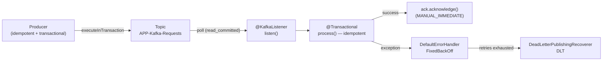

# Reliability and Delivery Semantics

> Part of the **Kafka Engineering Guide** for `org-rd-fullstack-springboot-eda`. See the [project README](../README.md).

**Scope:** explain how Kafka delivery semantics emerge from a small set of concrete choices: producer acknowledgements, retries and idempotence; offset commit strategy; Kafka transactions; consumer isolation; retry and dead-letter policy; and poll sizing. This chapter also shows how the project combines an atomic Kafka publish with at-least-once consumption and idempotent database processing.

## Table of contents

- [Overview](#overview)
- [Delivery semantics: the three guarantees](#delivery-semantics-the-three-guarantees)
- [Offset management](#offset-management)
- [The idempotent producer](#the-idempotent-producer)
- [Kafka transactions and read-process-write](#kafka-transactions-and-read-process-write)
- [Kafka Streams exactly-once semantics](#kafka-streams-exactly-once-semantics)
- [Consumer retries, back-off and dead-letter topics](#consumer-retries-back-off-and-dead-letter-topics)
- [Poll and batch sizing](#poll-and-batch-sizing)
- [How this project applies these concepts](#how-this-project-applies-these-concepts)
- [Pitfalls and best practices](#pitfalls-and-best-practices)
- [Sources and further reading](#sources-and-further-reading)

## Overview

A Kafka delivery guarantee is not a single switch. It depends on two related but distinct questions:

1. **Was the record durably published to Kafka?** Producer acknowledgements, retries, idempotence, topic replication and in-sync replica settings all matter.
2. **What happens if processing and offset commit do not both complete?** The answer depends on when the consumer commits its offset and whether Kafka writes and offsets participate in the same transaction.

Kafka commonly provides **at-least-once** behaviour when the producer retries and the consumer commits offsets after successful processing. A failure between the external side effect and the offset commit can then cause redelivery. **At-most-once** moves the commit before processing and accepts possible loss. Kafka **exactly-once semantics (EOS)** use transactions to make Kafka output records and consumed offsets atomic, but do not automatically include database writes, REST calls or other external effects.

This project deliberately uses an atomic, idempotent publish followed by at-least-once consumption and idempotent database processing:


```mermaid
flowchart LR
    A["Producer<br/>(idempotent + transactional)"] -->|executeInTransaction| T["Topic<br/>APP-Kafka-Requests"]
    T -->|"poll (read_committed)"| C["@KafkaListener<br/>listen()"]
    C --> P["@Transactional<br/>process() — idempotent"]
    P -->|success| ACK["ack.acknowledge()<br/>(MANUAL_IMMEDIATE)"]
    P -->|exception| EH["DefaultErrorHandler<br/>FixedBackOff"]
    EH -->|retries exhausted| DLT["DeadLetterPublishingRecoverer<br/>DLT"]
```

## Delivery semantics: the three guarantees

| Guarantee | Meaning | Typical implementation | Main trade-off |
| --- | --- | --- | --- |
| **At-most-once** | A record may be lost, but it is not redelivered after its offset has been committed. | Commit the offset before processing; producer retries may also be disabled when send loss is acceptable. | Possible data loss. |
| **At-least-once** | A successfully committed record is processed one or more times. | Use durable producer settings and commit the offset only after processing succeeds. | Processing must tolerate duplicates. |
| **Exactly-once (Kafka EOS)** | For a Kafka read-process-write flow, output records and source offsets become visible atomically to transaction-aware consumers. | Use Kafka transactions, transactional offset commits and downstream `read_committed` consumers. | More coordination and latency; external effects remain outside the Kafka transaction. |

Two distinctions are essential:

- **At-least-once is not an unconditional “no data loss” promise.** Producer durability still depends on settings such as `acks=all`, replication and `min.insync.replicas`, and an application must handle permanent send failures.
- **Exactly-once is narrower than its name suggests.** The read and processing code can execute more than once after a rollback. Kafka guarantees that committed Kafka results are visible once. Non-Kafka side effects still require idempotency, an outbox or coordination supported by the destination system.

## Offset management

The committed consumer offset, stored in Kafka's `__consumer_offsets` topic, identifies the next record a consumer group should resume from. The relationship between processing and committing this offset is the main consumer-side lever on delivery semantics.

### Automatic and container-managed commits

With the plain Kafka client, `enable.auto.commit=true` periodically commits offsets in the background. This setting alone does **not** establish at-most-once semantics because the commit timing is not intentionally tied to the start or completion of application work.

Spring Kafka has set `enable.auto.commit=false` by default since version 2.3 unless the application explicitly overrides it. Its listener container then controls commits through an `AckMode`:

- `RECORD`: commit after the record listener returns successfully.
- `BATCH`: commit after every record returned by the poll has been processed; this is the default mode.
- `TIME`, `COUNT`, `COUNT_TIME`: commit after a completed poll when the configured time or count condition is met.
- `MANUAL`: `acknowledge()` queues the offset, with commit semantics equivalent to `BATCH`.
- `MANUAL_IMMEDIATE`: `acknowledge()` commits immediately when called on the consumer thread.

This project uses `MANUAL_IMMEDIATE`, and calls `acknowledge()` only after the record has been processed successfully:

```java
factory.getContainerProperties().setAckMode(AckMode.MANUAL_IMMEDIATE);
```

### Synchronous and asynchronous commits

- **Synchronous commit** (`commitSync`) waits for the broker response and surfaces failures. It is easier to reason about, at the cost of blocking the consumer thread.
- **Asynchronous commit** (`commitAsync`) does not block, but the application must observe callback failures and reason about overlapping commits. A later successful commit can supersede an earlier one.

Spring Kafka selects between them with the container's `syncCommits` property, which is `true` by default.

## The idempotent producer

With `enable.idempotence=true`, the producer assigns sequence numbers per partition. If a transient error makes the producer retry a batch, the broker detects the duplicate sequence and avoids appending that batch twice.

Producer idempotence prevents **duplicates caused by producer retries**. It does not deduplicate:

- two application calls that send the same business event;
- a record produced again after consumer redelivery;
- repeated effects in a database or remote service.

Current Kafka clients enable idempotence by default when no conflicting configuration is present. The project sets it explicitly so the intended behaviour remains visible:

```java
props.put(ProducerConfig.ACKS_CONFIG,               "all");
props.put(ProducerConfig.ENABLE_IDEMPOTENCE_CONFIG, true);
props.put(ProducerConfig.RETRIES_CONFIG,            5);
props.put(ProducerConfig.RETRY_BACKOFF_MS_CONFIG,   100);
```

Idempotence requires `acks=all`, `retries>0` and `max.in.flight.requests.per.connection<=5`. Setting the last property to `1` is therefore not required to preserve per-partition order when idempotence is enabled, and can unnecessarily reduce throughput.

`acks=all` means that the leader waits for the current in-sync replicas before acknowledging the write. The effective durability still depends on the topic's replication factor, `min.insync.replicas` and leader-election policy.

## Kafka transactions and read-process-write

A Kafka transaction can atomically publish records to one or more Kafka topics and commit source consumer offsets. This read-process-write pattern underpins Kafka EOS.

### Transactional flow

A producer transaction follows this sequence:

1. `beginTransaction()`
2. produce the output records
3. `sendOffsetsToTransaction(offsets, groupMetadata)`
4. `commitTransaction()`, or `abortTransaction()` on failure

```java
producer.initTransactions();
while (true) {
    var records = consumer.poll(Duration.ofMillis(100));
    producer.beginTransaction();
    try {
        for (var record : records) {
            producer.send(new ProducerRecord<>(
                "TopicB", record.key(), transform(record.value())));
        }
        producer.sendOffsetsToTransaction(
            computeOffsets(records), consumer.groupMetadata());
        producer.commitTransaction();
    } catch (Exception e) {
        producer.abortTransaction();
        // Reset the consumer position as required before retrying.
    }
}
```

Transactions require a `transactional.id`, which also enables producer idempotence. Concurrent application instances must not share the same producer identity; with Spring Kafka, the `transactionIdPrefix` must be unique per application instance. Reusing an identity across producer sessions lets Kafka complete or abort earlier transactions and fence a stale producer. Timed-out transactions are aborted rather than resumed.

By default, Kafka's production-oriented transaction-topic settings assume at least three brokers. Development clusters can lower the transaction-state replication settings, but doing so weakens fault tolerance.

With Spring Kafka, a listener container configured with a `KafkaAwareTransactionManager` starts a transaction before invoking the listener. On success, it sends the consumed offsets to that transaction before commit; on failure, it rolls back and makes the records eligible for redelivery.

### Transaction-aware consumers

Downstream consumers must use `isolation.level=read_committed` to hide aborted transactional records. Such a consumer returns committed transactional records and non-transactional records, but withholds records after an open transaction until the transaction completes. The Kafka client default is `read_uncommitted`.

```java
props.put(ConsumerConfig.ISOLATION_LEVEL_CONFIG, "read_committed");
props.put(ConsumerConfig.ENABLE_AUTO_COMMIT_CONFIG, false);
```

### Databases and other external systems

Kafka transactions do not make Kafka and a database one atomic resource. Spring can synchronize Kafka and database transaction managers in a defined commit order, but a failure between the two commits can still leave one side committed and the other side uncommitted. The database operation must therefore remain idempotent.

For strong Kafka-to-database or database-to-Kafka consistency, common options are:

- a **transactional outbox** for database-to-Kafka publication;
- an idempotent consumer with a deduplication key or state transition;
- storing the Kafka offset in the same external transaction as the result, when the destination supports that design.

## Kafka Streams exactly-once semantics

Kafka Streams can wrap consumed offsets, state-store updates, changelog records and output records in Kafka transactions. Enable EOS version 2 with:

```yaml
processing.guarantee: exactly_once_v2   # default: at_least_once
```

`exactly_once_v2` requires brokers version 2.5 or later. When enabled, Kafka Streams configures transaction-aware producers and consumers and uses a shorter default commit interval. The actual latency and throughput cost depends on transaction size, commit frequency, topology and workload, so it should be measured rather than represented by a universal percentage.

This project uses the plain consumer and producer APIs for its inventory pipeline, not the Kafka Streams DSL. The Flink source topic (`APP-Flink-requests`) is processed by Flink, not Kafka Streams.

## Consumer retries, back-off and dead-letter topics

When a listener throws an exception, Spring Kafka's `DefaultErrorHandler` can redeliver the failed record according to a `BackOff` policy. When retries are exhausted, a recoverer such as `DeadLetterPublishingRecoverer` can publish the record to a dead-letter topic (DLT).

This project builds the handler in `KafkaSandbox` with a `FixedBackOff`:

```java
DeadLetterPublishingRecoverer recoverer = new DeadLetterPublishingRecoverer(
    dltTemplate,
    (record, ex) -> new TopicPartition(
        template.getDefaultTopic(), KafkaConstants.CST_PARTITION_DLT));
recoverer.setAppendOriginalHeaders(true);
recoverer.setRetainExceptionHeader(true);

DefaultErrorHandler errorHandler =
    new DefaultErrorHandler(
        recoverer,
        new FixedBackOff(retryInterval, retryAttempts));
errorHandler.addNotRetryableExceptions(IllegalArgumentException.class);
```

Important behaviours:

- The second `FixedBackOff` argument counts **retries**, not total delivery attempts. A value of `1` means the initial delivery plus one retry.
- Non-retryable exceptions go directly to the recoverer. This is appropriate for poison records that cannot succeed without correction.
- A DLT is a recovery workflow, not proof of successful business processing. Monitor it and define how records are inspected, corrected and replayed.
- With manual acknowledgement, verify how the recovered source offset is committed. For example, `DefaultErrorHandler` has a `commitRecovered` option for `MANUAL_IMMEDIATE`; the exact choice must match the desired DLT replay behaviour.

## Poll and batch sizing

`poll()` returns one or more records, but the redelivery window depends on the listener type, `AckMode` and error-handler configuration. With `BATCH`, a failure before the batch offset is committed can redeliver records whose external effects already completed. `RECORD` or a correctly placed `MANUAL_IMMEDIATE` acknowledgement narrows that window, but cannot make external effects and the Kafka offset atomic.

| Larger `max.poll.records` | Smaller `max.poll.records` |
| --- | --- |
| Better throughput and fewer commit operations | Smaller amount of work exposed to redelivery |
| More processing time per poll; greater risk of exceeding `max.poll.interval.ms` | More per-record and per-poll overhead |

`max.poll.records` limits the records returned by one `poll()`; it does not change the consumer's underlying fetch size. Size it so that worst-case processing remains comfortably below `max.poll.interval.ms`.

This project sets `MAX_POLL_RECORDS = 10` (`CST_MAX_POLL_RECORDS`) to bound processing time and the duplicate window under its simulated per-record latency.

## How this project applies these concepts

The inventory pipeline uses an **atomic Kafka publish followed by at-least-once, idempotent consumption**:

- **Transactional, idempotent publish** — [`PipelineSrv.publish()`](../src/main/java/org/rd/fullstack/springbooteda/srv/PipelineSrv.java) obtains a transactional template (`getKafkaTemplate(topic, true)`) and sends eligible requests inside `template.executeInTransaction(...)`. Serialization is performed before the transaction. `nbrPublished` is updated only after a successful commit. [`KafkaSandbox`](../src/main/java/org/rd/fullstack/springbooteda/util/kafka/KafkaSandbox.java) gives each transactional template a unique producer identity.
- **Explicit producer durability** — [`KafkaConfig.producerConfigs()`](../src/main/java/org/rd/fullstack/springbooteda/config/KafkaConfig.java) sets `enable.idempotence=true`, `acks=all` and bounded retries so the producer paths share the same intent.
- **At-least-once consumption** — [`KafkaPipelineListener.listen()`](../src/main/java/org/rd/fullstack/springbooteda/srv/KafkaPipelineListener.java) delegates to `PipelineSrv.handle()` and acknowledges only after successful processing. The container uses `AckMode.MANUAL_IMMEDIATE` with `enable.auto.commit=false`; a crash before the acknowledgement can replay the record.
- **Idempotent database processing** — [`PipelineSrv.process()`](../src/main/java/org/rd/fullstack/springbooteda/srv/PipelineSrv.java) runs in a separate `@Transactional` bean and skips requests whose `Result` is no longer `PENDING` or `BACK_ORDER`. Under the project's state-transition and database-concurrency rules, a redelivery therefore becomes a no-op. The JPA transaction rolls back on failure.
- **Committed-read isolation** — [`KafkaConfig.consumerConfigs()`](../src/main/java/org/rd/fullstack/springbooteda/config/KafkaConfig.java) sets `isolation.level=read_committed`, so the listener does not see aborted records from the transactional producer.
- **Retry and DLT** — the [`DefaultErrorHandler`](../src/main/java/org/rd/fullstack/springbooteda/config/KafkaConfig.java) retries with `FixedBackOff` and routes exhausted records through `DeadLetterPublishingRecoverer`. A `RetryListener` records recovery events.
- **Bounded polls** — `max.poll.records=10`, defined in [`KafkaConstants`](../src/main/java/org/rd/fullstack/springbooteda/util/kafka/KafkaConstants.java), limits the processing time and redelivery window for one poll.

The result is not a single distributed exactly-once transaction. The publish is atomic inside Kafka; the consumer is intentionally at-least-once; and the database processing is designed so that redeliveries do not repeat the business transition.

## Pitfalls and best practices

- **Acknowledge only after successful processing.** Acknowledging first creates an at-most-once window and can lose work on failure.
- **Do not treat auto-commit as an at-most-once switch.** At-most-once requires an intentional commit-before-processing design.
- **Separate producer idempotence from consumer idempotency.** They solve different duplicate paths.
- **Keep external effects idempotent.** Kafka EOS does not automatically include JPA, REST, email or other systems.
- **Use `read_committed` for transactional input.** A `read_uncommitted` downstream consumer can observe aborted records.
- **Use unique transactional identities.** Sharing one identity across concurrent instances causes producer fencing; abandoning identities prevents clean fencing of older sessions.
- **Keep transactions short.** Perform validation and fallible non-Kafka preparation before opening a Kafka transaction when possible.
- **Avoid self-invocation for `@Transactional`.** Calling a proxied method through `this` bypasses Spring's transaction interceptor.
- **Size polls for worst-case processing.** Slow records plus a large poll can exceed `max.poll.interval.ms` and trigger rebalances.
- **Operate the DLT.** Alert on it, retain diagnostic headers and define a controlled replay process.
- **Test failure windows.** Include broker loss, network delay, process termination before and after acknowledgement, transaction aborts and DLT publication failures.

## Sources and further reading

- [Apache Kafka — Message delivery semantics](https://kafka.apache.org/43/design/design/#message-delivery-semantics)
- [Apache Kafka — Producer configuration](https://kafka.apache.org/43/configuration/producer-configs/)
- [Apache Kafka — Consumer configuration](https://kafka.apache.org/43/configuration/consumer-configs/)
- [Apache Kafka — Kafka Streams configuration](https://kafka.apache.org/43/streams/developer-guide/config-streams/)
- [Spring Kafka — Message listener containers and offset commits](https://docs.spring.io/spring-kafka/reference/kafka/receiving-messages/message-listener-container.html)
- [Spring Kafka — Transactions](https://docs.spring.io/spring-kafka/reference/kafka/transactions.html)
- [Spring Kafka — Exactly-once semantics](https://docs.spring.io/spring-kafka/reference/kafka/exactly-once.html)
- [Spring Kafka — Exception handling](https://docs.spring.io/spring-kafka/reference/kafka/annotation-error-handling.html)
- Related guide: [Consumer Acknowledgement and Idempotency](./consumer_acknowledgement_and_idempotency.md)
- Project code: [`PipelineSrv`](../src/main/java/org/rd/fullstack/springbooteda/srv/PipelineSrv.java), [`ProcessorSrv`](../src/main/java/org/rd/fullstack/springbooteda/srv/ProcessorSrv.java), [`KafkaConfig`](../src/main/java/org/rd/fullstack/springbooteda/config/KafkaConfig.java), [`KafkaSandbox`](../src/main/java/org/rd/fullstack/springbooteda/util/kafka/KafkaSandbox.java) and [`KafkaConstants`](../src/main/java/org/rd/fullstack/springbooteda/util/kafka/KafkaConstants.java)