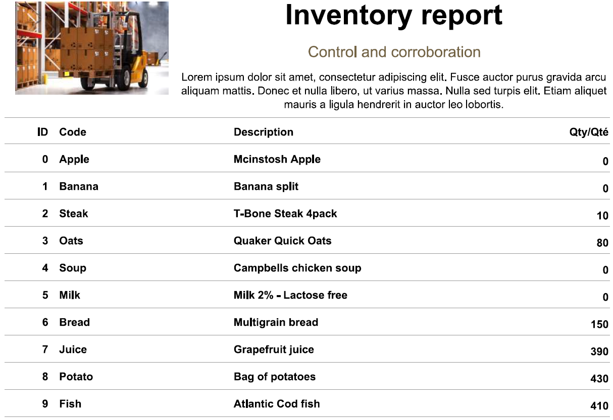
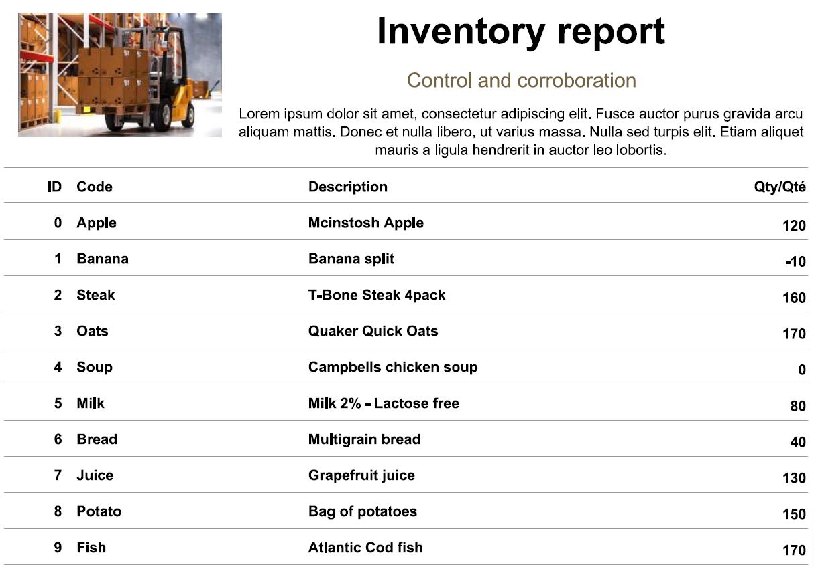

# Example inventory reports

> Part of the **Kafka Engineering Guide** of `org-rd-fullstack-springboot-eda`. See the [project README](../README.md).

Both reports below are produced by the same inventory pipeline run against the same initial
stock and the same set of credit/debit `Request` records. The **only** difference is the
pipeline's `key` flag (see [`PipelineContext`](../src/main/java/org/rd/fullstack/springbooteda/dto/PipelineContext.java)),
which decides whether each request is published to Kafka keyed by its `productId`. Comparing
the two outputs makes the effect of partitioning on a business invariant — *inventory must
never go negative* — directly visible.

## Example of a report result using a Kafka key

When the `key` flag is **enabled**, every inventory `Request` is published with its
`productId` as the Kafka key. Records sharing a key always hash to the same partition
(`hash(key) % partitionCount`), so all requests for a given product are confined to a single
partition and consumed **sequentially by one consumer thread**. Per-product processing is
therefore serialized end to end: the `CREDIT` branch's check-then-act sequence (read `qty` →
verify `qty >= requested` → relative decrement) can never interleave with another request for
the *same* product, so the lost-update race cannot occur — independently of the database
engine.

The result is a consistent inventory: every quantity in the report is `>= 0`. Where stock was
insufficient, the request was correctly resolved to `BACK_ORDER` instead of overselling —
several products settle cleanly at `0` (Apple, Banana, Soup, Milk) and no row is negative.
This is the project-level fix described in
[Keying and partition assignment](./architecture_and_topic_design.md#keying-and-partition-assignment)
and listed first in
[Mitigations](./persistence_and_transaction_patterns.md#mitigations-in-order-of-preference).

Source: [`WithKey-Report.pdf`](./asserts/WithKey-Report.pdf)

## Example of a report result without a Kafka key

With the `key` flag **disabled**, requests are published **without a key**, so the producer
spreads them round-robin / sticky across the processing topic's 8 partitions. Requests for the
same product now land on different partitions and are consumed **concurrently** by the
listener's worker threads (container `concurrency`). Two `CREDIT` requests for the same product
can both read the same stale quantity, both pass the `qty >= requested` check, and both apply
their relative decrement — a classic **lost-update / check-then-act race**. The code leaves
this race in place deliberately for teaching: `findByProductId` takes no lock,
[`Inventory`](../src/main/java/org/rd/fullstack/springbooteda/dto/Inventory.java) has no
`@Version`, and the isolation is `READ_COMMITTED` (see
[The documented inventory race](./persistence_and_transaction_patterns.md#the-documented-inventory-race)).

The corruption is plainly visible in the report: **Banana (ID 1) shows a quantity of `-10`** —
stock was oversold below zero, violating the *inventory must never be negative* invariant.
Nothing else changed between the two runs; removing the key is what allowed concurrent
processing of the same product and reintroduced the race. This is exactly the failure mode
covered in
[Ordering guarantees and business semantics](./architecture_and_topic_design.md#ordering-guarantees-and-business-semantics)
and in [Database locking and race conditions](./persistence_and_transaction_patterns.md#database-locking-and-race-conditions).

Source: [`NoKey-Report.pdf`](./asserts/NoKey-Report.pdf)
