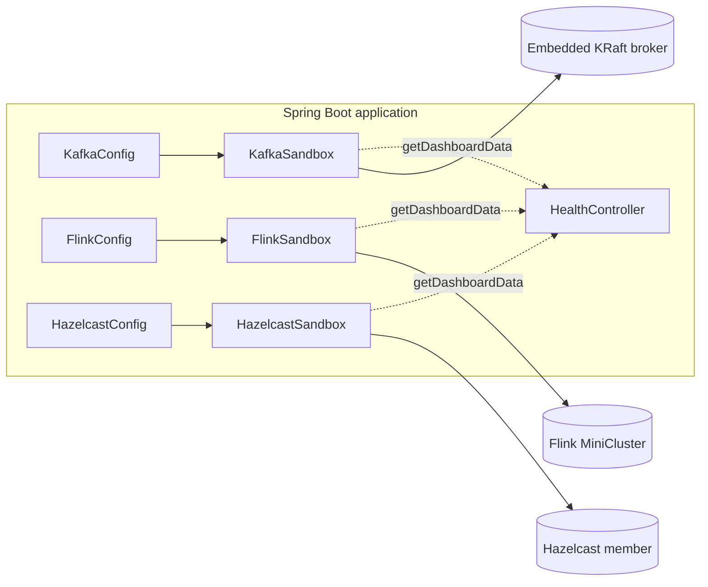
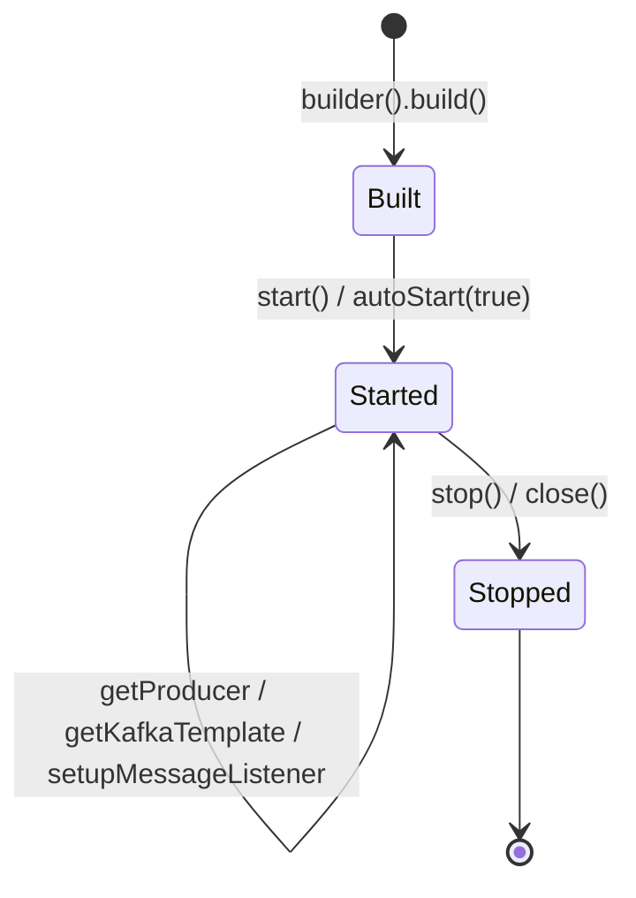

# Sandbox guides — Kafka, Flink and Hazelcast

> Part of the **Kafka Engineering Guide** of `org-rd-fullstack-springboot-eda`. See the [project README](../../README.md).

**Scope:** documents the three embedded "sandbox" components — Kafka, Flink and Hazelcast — that this learning project runs in-process: their purpose, enable/disable flags, builder API, lifecycle, dashboards, and how Spring wires them as beans.

## Table of contents

- [Overview](#overview)
- [Kafka sandbox](#kafka-sandbox)
- [Flink sandbox](#flink-sandbox)
- [Hazelcast sandbox](#hazelcast-sandbox)
- [How this project wires the sandboxes](#how-this-project-wires-the-sandboxes)
- [Pitfalls & best practices](#pitfalls--best-practices)
- [Sources & further reading](#sources--further-reading)

## Overview

This project is a learning sandbox for event-driven architecture (EDA). To keep it self-contained — clone, run, observe — it **embeds** three infrastructure engines that would normally be external services:

| Engine | Embedded form | Role in the project |
|---|---|---|
| **Kafka** | `EmbeddedKafkaKraftBroker` (KRaft, in-process) | Event backbone: topics, DLTs, producers/consumers, transactional semantics. |
| **Flink** | `MiniCluster` (in-process JobManager + TaskManagers) | Stream processing: jobs, slots, metrics. |
| **Hazelcast** | Embedded member (in-process) | Distributed state: `IMap` for the `PipelineContext`, CP subsystem for locks. |

Each engine is wrapped in a small **builder-style "sandbox"** class (`KafkaSandbox`, `FlinkSandbox`, `HazelcastSandbox`). Each sandbox:

- exposes a fluent `builder()` with an `autoStart(boolean)` flag;
- implements `AutoCloseable` with explicit `start()` / `stop()` lifecycle;
- is created as a Spring `@Bean` from a matching `@Configuration` class that reads `application.yml`;
- can be toggled on or off through a `…sandbox.enabled` flag;
- exposes a `getDashboardData()` method surfaced over REST by [`HealthController`](../../src/main/java/org/rd/fullstack/springbooteda/controller/HealthController.java).

> **Production note.** As the [project README](../../README.md) states: *"In this project, Kafka and Flink services, as well as an HSQLDB database, are embedded. In a production-grade architecture, these components should preferably be provided as external services."* The sandboxes are for local development, demos and integration tests — not for production workloads. The Kafka sandbox is the only one that can be pointed at an external cluster (via `bootstrapServers(...)`).



## Kafka sandbox

### What it is

[`KafkaSandbox`](../../src/main/java/org/rd/fullstack/springbooteda/util/kafka/KafkaSandbox.java) is a self-contained Kafka environment built on Spring Kafka's `EmbeddedKafkaKraftBroker`. It manages a broker, a topic registry (each topic optionally paired with a Dead-Letter Topic), cached producers and `KafkaTemplate`s, programmatic listeners with a `DefaultErrorHandler` + DLT recoverer, consumer-group offset administration and a dashboard. It extends `AbstractTopicHandler` and implements `AutoCloseable`, so it works well in a `try (var sb = KafkaSandbox.builder()...build()) { ... }` block.

### Why embedded

It removes the need for any running Kafka infrastructure during development and tests. It is ideal for integration tests, transactional-behaviour validation and consumer-group simulation. It is explicitly **not** intended for performance benchmarking or production (caches grow unbounded and synchronization is coarse-grained).

### Enable / disable

```yaml
org:
  rd:
    fullstack:
      springbooteda:
        kafka:
          sandbox:
            enabled: true          # → builder.autoStart(true)
            clusters: 1            # forced to 1 (see gotchas)
            cluster-partitions: 100
            concurrency: 10
```

The broker is selected by a `BrokerLifecycle` strategy at `build()` time:

- [`EmbeddedBrokerLifecycle`](../../src/main/java/org/rd/fullstack/springbooteda/util/kafka/EmbeddedBrokerLifecycle.java) — in-process KRaft broker (default);
- [`ExternalBrokerLifecycle`](../../src/main/java/org/rd/fullstack/springbooteda/util/kafka/ExternalBrokerLifecycle.java) — used when `bootstrapServers(url)` is set on the builder, to connect to a Docker/Confluent/MSK cluster.

### Key builder options

| Builder method | Default | Purpose |
|---|---|---|
| `autoStart(boolean)` | `false` | Start the broker immediately on `build()`. |
| `autoCreateTopic(boolean)` | `false` | Auto-create topics on the broker. |
| `bootstrapServers(String)` | `null` (embedded) | Switch to an external broker. |
| `clusterPartitions(int)` | constant | Default partitions per cluster topic. |
| `concurrency(int)` | constant | Default listener concurrency. |
| `clusters(int)` | `1` | **Deprecated no-op** — forced to 1. |
| `addTopic(name, …)` | — | Register a topic (+ optional DLT) in the registry; many overloads on `AbstractTopicHandler`. |

The richest `addTopic` overload accepts `name`, `dltName`, `partitions`, `replicas`, `retryAttempts`, `retryInterval`, key/value serializers, key/value deserializers and extra producer/consumer property maps. Each topic is modelled by the immutable [`TopicConfig`](../../src/main/java/org/rd/fullstack/springbooteda/util/kafka/TopicConfig.java) record; transactional concerns (e.g. `transactional.id`) are modelled explicitly rather than hidden in property maps.

```java
KafkaSandbox sandbox = KafkaSandbox.builder()
    .autoStart(true)
    .addTopic("orders", "orders-dlt", 8, (short) 1)
    .build();

// Non-transactional producer / template.
KafkaTemplate<Object, Object> orders = sandbox.getKafkaTemplate("orders");
orders.send("orders", "order-1", "CREATED");

// Transactional template (cached by topic + transactional flag).
KafkaTemplate<Object, Object> payments = sandbox.getKafkaTemplate("payments", true);
payments.executeInTransaction(kt -> { kt.send("payments", "p-1", "INIT"); return null; });

// Programmatic listener with automatic DLT wiring.
sandbox.setupMessageListener("orders",
    (MessageListener<String, String>) rec -> System.out.println(rec.value()));
```

Consumers are configured with `isolation.level=read_committed`, `enable.auto.commit=false` and `auto.offset.reset=earliest`. Transactional producers are never shared, are cached by `(topic, transactional)` and call `initTransactions()` exactly once. The error handler uses a `FixedBackOff` (where `maxAttempts` counts *retries*, so `retryAttempts=1` means 1 original + 1 retry) and a `DeadLetterPublishingRecoverer`.

### Lifecycle

`start()` is idempotent and starts the broker; `stop()` (also via `close()`) atomically flips the started flag, then stops monitors, stops/destroys listeners, flushes/destroys templates and producers, closes the `AdminClient` and tears down the broker. A guard, `requireStarted()`, throws if methods are used before `start()`.



### Dashboard & observability

`getDashboardData()` returns a [`KafkaDashboard`](../../src/main/java/org/rd/fullstack/springbooteda/util/kafka/KafkaDashboard.java): cluster id/IP, broker count, controller, per-topic summaries and per-group lag (computed from current offsets vs. log-end offsets). It is exposed at `GET /api/kafkaDashboardData`. `getConsumerGroupMonitor()`, `getTopics()` and `seekConsumerGroupOffsets(...)` provide further introspection and offset control.

### Gotchas

- **Single cluster only.** `clusters(int)` is a deprecated no-op (a bug in `EmbeddedKafkaKraftBroker`); any value other than 1 is ignored with a warning.
- **Unbounded caches & coarse locking.** Producer/template/listener caches never shrink and several operations synchronize on `this`. Fine for dev/test, not for long-running use. See the review notes in [KafkaSandbox-Review.txt](../source/KafkaSandbox-Review.txt) (the "God class" critique and the suggested split into registries/services, which the [`kafka-sandbox-refactor.zip`](../source/kafka-sandbox-refactor.zip) prototypes).
- **`seekConsumerGroupOffsets` uses `assign()` + `poll()`.** It writes offsets directly without joining the group; the `poll()` can occasionally consume a record depending on timing.
- **`getDefaultErrorHandler()` has a side effect** — it lazily creates the default DLT topic.
- **`getBrokerMetrics()` is embedded-only** and throws `UnsupportedOperationException` against an external broker.

## Flink sandbox

### What it is

[`FlinkSandbox`](../../src/main/java/org/rd/fullstack/springbooteda/util/flink/FlinkSandbox.java) wraps an Apache Flink `MiniCluster` — an in-process cluster with a JobManager and a configurable number of TaskManagers and slots. It implements `AutoCloseable`, has thread-safe `start()`/`stop()`, and exposes the REST endpoint, cluster overview and job listing.

### Why embedded

It lets you run Flink jobs and observe metrics with zero external infrastructure, suitable for local experimentation and integration tests. In production, Flink would be a standalone/YARN/Kubernetes cluster.

### Enable / disable

```yaml
flink:
  sandbox:
    enabled: true                 # → builder.autoStart(true)
    rest-port: 0                  # 0 = auto-select
    job-manager-port: 0           # 0 = auto-select
    task-manager-rpc-port: ""     # empty = auto-select; may be a range
    num-task-managers: 1
    num-slots-per-task-manager: 4
    active-metrics: false
```

### Key builder options

| Builder method | Default | Purpose |
|---|---|---|
| `autoStart(boolean)` | `false` | Start the MiniCluster on `build()`. |
| `restPort(int)` | `0` | REST/UI port; 0 = auto. |
| `jobManagerPort(int)` | `0` | JobManager RPC port; 0 = auto. |
| `taskManagerRpcPort(String)` | `""` | TaskManager RPC port or range; empty = auto. |
| `numTaskManagers(int)` | `1` | Number of TaskManagers (must be > 0). |
| `numSlotsPerTaskManager(int)` | `4` | Task slots per TaskManager (must be > 0). |
| `activeMetrics(boolean)` | `false` | Register the Prometheus reporter. |
| `prometheusPort(int)` | `9249` | Port for the Prometheus reporter. |

```java
FlinkSandbox flink = FlinkSandbox.builder()
    .numTaskManagers(1)
    .numSlotsPerTaskManager(4)
    .autoStart(true)
    .build();

URI restApi = flink.getURI();              // submit jobs / query metrics here
FlinkDashboard dash = flink.getDashboardData();
```

`build()` throws `Exception` (the bean factory method propagates it). Ports are validated (0 = auto, otherwise 1–65535); a non-numeric `taskManagerRpcPort` is tolerated as a range.

### Lifecycle

`start()` constructs and starts a `MiniCluster` (idempotent via a `volatile` reference); `stop()`/`close()` closes it and nulls the reference. `getURI()`, `getDashboardData()` and other accessors call `requireStartedCluster()` and throw if not started.

### Dashboard & observability

`getDashboardData()` returns a [`FlinkDashboard`](../../src/main/java/org/rd/fullstack/springbooteda/util/flink/FlinkDashboard.java) built from `requestClusterOverview()` and `listJobs()`: connected TaskManagers, total/available slots, running/finished/cancelled/failed job counts, Flink version/commit, and a per-job list (id, name, state, start time). Exposed at `GET /api/flinkDashboardData`. With `activeMetrics`, the cluster also serves Flink's own REST metrics endpoints (e.g. `/jobmanager/metrics`, `/jobs/overview`) — see [Flink.txt](../source/Flink.txt) for example queries.

### Gotchas

- **Auto-selected ports** (the `0`/empty defaults) mean the REST UI port is not fixed; read it via `getURI()`.
- All dashboard/URI calls have a 30-second timeout and wrap interruption/execution/timeout failures in `IllegalStateException`.

## Hazelcast sandbox

### What it is

[`HazelcastSandbox`](../../src/main/java/org/rd/fullstack/springbooteda/util/hazelcast/HazelcastSandbox.java) wraps an embedded Hazelcast instance. It can run as a `SERVER` member or as a `CLIENT` (see [`Mode`](../../src/main/java/org/rd/fullstack/springbooteda/util/hazelcast/Mode.java)), configures the network/join, declares `IMap`s, and optionally enables the CP (Raft) subsystem. In this project it stores the distributed `PipelineContext` in an `IMap`.

### Why embedded

It provides distributed state (maps) and distributed coordination primitives (CP subsystem / locks) in-process, so the EDA pipeline can keep shared context across components without an external Hazelcast cluster. In production, Hazelcast would be a real multi-member cluster (and the CP subsystem would require 3+ members).

### Enable / disable

```yaml
hazelcast:
  sandbox:
    enabled: true                 # → builder.autoStart(true), started in SERVER mode
    instance-name: springboot-eda-instance
    cluster-name: springboot-eda-cluster
    port: ...
    port-count: ...
    port-auto-increment: ...
    join:
      multicast: { enabled: ... }
      tcp-ip: { enabled: ..., members: ... }
    cp-subsystem:
      cp-member-count: ...
      session-heartbeat-interval-seconds: ...
      session-time-to-live-seconds: ...
```

### Key builder options

| Builder method | Purpose |
|---|---|
| `mode(Mode)` | `SERVER` (embedded member) or `CLIENT`. |
| `instanceName` / `clusterName` | Instance and cluster identity. |
| `port` / `portCount` / `portAutoIncrement` | Network port range. |
| `multicastEnabled(boolean)` | Multicast member discovery. |
| `tcpIpEnabled(boolean)` / `tcpIpMembers(String)` | TCP/IP member discovery. |
| `addMap(String)` | Register an `IMap` (`MapConfig`). |
| `cpMemberCount(int)` | CP subsystem size — see gotchas. |
| `sessionHeartbeatIntervalSeconds` / `sessionTimeToLiveSeconds` | CP session tuning (only applied when `cpMemberCount > 0`). |
| `autoStart(boolean)` | Start on `build()` (in the configured `mode`). |

```java
HazelcastSandbox hz = HazelcastSandbox.builder()
    .mode(Mode.SERVER)
    .addMap("pipeline-context")
    .cpMemberCount(1)               // 1 = UNSAFE mode, local testing only
    .autoStart(true)
    .build();

IMap<String, Object> ctx = hz.getMap("pipeline-context");
CPSubsystem cp = hz.getCPSubsystem();
```

### Lifecycle

`start(Mode)` creates either a server member (`Hazelcast.getOrCreateHazelcastInstance`) or a client (`HazelcastClient.newHazelcastClient`), guarded by a `volatile` reference and idempotent. `stop()`/`close()` calls `shutdown()`. `getMap`, `getCPSubsystem`, `getHazelcastInstance` and `getDashboardData` all call `requireStarted()`.

### Dashboard & observability

`getDashboardData()` returns a [`HazelcastDashboard`](../../src/main/java/org/rd/fullstack/springbooteda/util/hazelcast/HazelcastDashboard.java): instance/cluster name, cluster state and time, member list, per-map stats (owned/backup entries, hits, operation counts, locked entries, heap cost, timestamps) and partition info (total/local partitions, cluster-safe / local-member-safe / migration-in-progress). Exposed at `GET /api/hazelcastDashboardData`.

### Gotchas

- **CP member count semantics:** `0` disables CP (no `FencedLock`); `1` is **UNSAFE** mode (local testing only); `3+` is strict Raft mode (mandatory for production).
- **DevTools class-loading.** The builder pins Hazelcast's (de)serialization to the current context classloader. Without this, Spring Boot DevTools' `RestartClassLoader` causes `ClassCastException` on `IMap` values whose types share a name but differ in loader.
- **Map miss-count** in stats is hard-coded to `0` (`LocalMapStats` does not expose it on a local member).

## How this project wires the sandboxes

Each sandbox is created as a Spring `@Bean` from a `@Configuration` class under [`config/`](../../src/main/java/org/rd/fullstack/springbooteda/config/), which binds `application.yml` values via `@Value` and passes the `…sandbox.enabled` flag to `autoStart(...)`:

| Engine | Sandbox class | Config class | `enabled` flag |
|---|---|---|---|
| Kafka | [`KafkaSandbox`](../../src/main/java/org/rd/fullstack/springbooteda/util/kafka/KafkaSandbox.java) | [`KafkaConfig`](../../src/main/java/org/rd/fullstack/springbooteda/config/KafkaConfig.java) | `…kafka.sandbox.enabled` |
| Flink | [`FlinkSandbox`](../../src/main/java/org/rd/fullstack/springbooteda/util/flink/FlinkSandbox.java) | [`FlinkConfig`](../../src/main/java/org/rd/fullstack/springbooteda/config/FlinkConfig.java) | `…flink.sandbox.enabled` |
| Hazelcast | [`HazelcastSandbox`](../../src/main/java/org/rd/fullstack/springbooteda/util/hazelcast/HazelcastSandbox.java) | [`HazelcastConfig`](../../src/main/java/org/rd/fullstack/springbooteda/config/HazelcastConfig.java) | `…hazelcast.sandbox.enabled` |

Notable wiring details:

- **`KafkaConfig`** registers the project topics (`CST_TOPIC_PROCESSOR`, `CST_TOPIC_FLINK_IN`, `CST_TOPIC_FLINK_OUT`, each with a `-dlt` companion), and also defines a Spring `KafkaTemplate`, `ProducerFactory`, `ConsumerFactory`, a `ConcurrentKafkaListenerContainerFactory` (so `@KafkaListener` works) and a lazy `DefaultErrorHandler` sourced from `kafkaSandbox.getDefaultErrorHandler()`. The Spring producer/consumer configs are deliberately aligned with `KafkaSandbox` (idempotence, `acks=all`, `read_committed`, bounded `max.poll.records`).
- **`FlinkConfig`** maps the YAML ports/TM/slot/metrics values onto the builder.
- **`HazelcastConfig`** always builds in `Mode.SERVER` and registers the two project maps (`CST_MAPNAME_CTX`, `CST_MAPNAME_STATE`).
- **[`HealthController`](../../src/main/java/org/rd/fullstack/springbooteda/controller/HealthController.java)** autowires all three sandboxes and exposes `GET /api/kafkaDashboardData`, `/api/flinkDashboardData`, `/api/hazelcastDashboardData`, plus liveness/readiness toggles.

## Pitfalls & best practices

- **Sandboxes are not production.** Per the README, treat Kafka/Flink/Hazelcast as external services in production. Only `KafkaSandbox` supports an external broker (`bootstrapServers(...)`).
- **Always release resources.** All three implement `AutoCloseable`; rely on Spring bean destruction (or `try`-with-resources in tests) so brokers/clusters/members shut down cleanly.
- **Respect the started guard.** Calling sandbox methods before `start()` throws `IllegalStateException`.
- **Kafka:** prefer `MANUAL_IMMEDIATE` ack mode for at-least-once; use transactional templates for exactly-once-style publishing; remember `clusters` is capped at 1 and caches are unbounded.
- **Flink:** ports auto-select by default — discover the REST endpoint via `getURI()` rather than assuming `8081`.
- **Hazelcast:** use `cpMemberCount >= 3` for any real CP guarantee; the project's default UNSAFE/`1`-member setup is for local use only. Keep the context-classloader pinning in mind when running under DevTools.
- For broader Kafka operational guidance (rebalance, pause/stop, delivery semantics, graceful shutdown), see the [Synthese.md](../source/Synthese.md) engineering guide.

## Sources & further reading

- [Project README](../../README.md) — overall project description and the embedded-vs-external production note.
